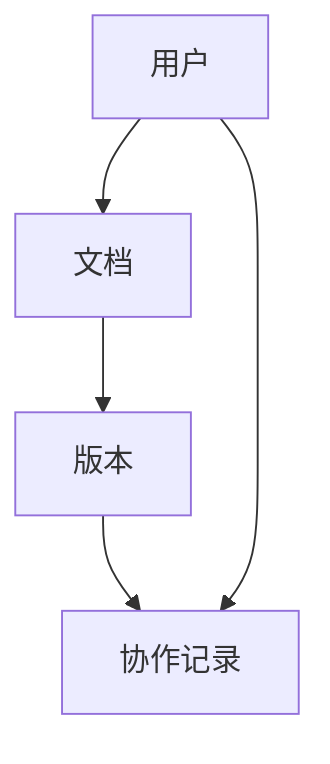
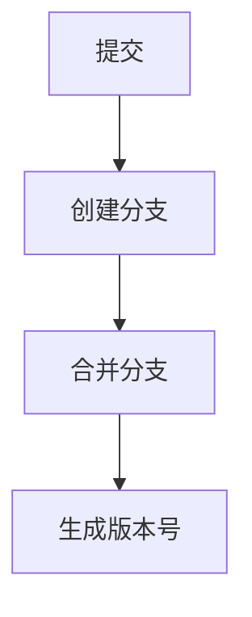
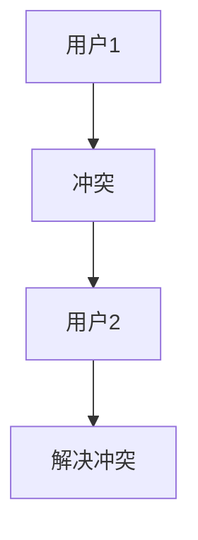
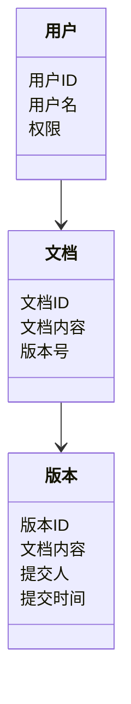
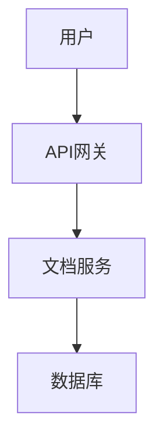

                 


# 构建智能企业文档管理系统：版本控制与协作优化

---

## 关键词：
- 智能文档管理系统
- 版本控制
- 协作优化
- 企业文档管理
- 智能化协作
- 系统架构设计

---

## 摘要：
随着企业数字化转型的深入，文档管理系统的智能化需求日益增长。传统文档管理系统在版本控制和协作优化方面存在诸多痛点，如版本混乱、协作效率低、检索效率低下等。本文旨在探讨如何通过智能化技术构建一个高效、可靠的文档管理系统，重点分析版本控制与协作优化的核心原理、算法实现、系统架构设计以及项目实战。通过结合Git版本控制原理、AI辅助协作优化技术，提出一种基于智能化算法的企业文档管理解决方案，并通过实际案例展示系统的实现与应用。

---

# 第一部分: 背景介绍与核心概念

# 第1章: 企业文档管理系统的背景与挑战

## 1.1 问题背景
### 1.1.1 传统文档管理的痛点
- **版本混乱**：传统文档管理系统难以有效管理多个版本，容易出现版本冲突和丢失。
- **协作效率低**：多人协作时，权限管理复杂，协作流程繁琐，效率低下。
- **检索效率低下**：文档数量庞大时，检索效率降低，难以快速找到所需文档。
- **缺乏智能化**：传统系统缺乏智能推荐、自动分类等高级功能，难以满足现代企业的智能化需求。

### 1.1.2 智能化文档管理的需求
- **智能化版本控制**：通过AI技术实现智能版本控制，自动识别版本冲突并提供解决方案。
- **实时协作优化**：支持多人实时协作，智能分配权限，优化协作流程。
- **高效检索与分类**：利用自然语言处理技术实现智能分类和快速检索。
- **数据安全与权限管理**：确保文档的安全性，支持细粒度的权限管理。

### 1.1.3 企业文档管理的边界与外延
- **边界**：文档的创建、存储、版本控制、协作、检索和安全。
- **外延**：与企业知识管理、协同办公、数据安全等领域的深度融合。

## 1.2 核心概念与问题描述
### 1.2.1 文档管理系统的核心要素
- 文档存储与管理
- 版本控制与历史记录
- 协作权限与实时协作
- 文档分类与智能检索

### 1.2.2 版本控制与协作优化的关系
- 版本控制是协作优化的基础，协作优化是版本控制的延伸。
- 版本控制确保文档的唯一性和可追溯性，协作优化提升多人协作的效率和体验。

### 1.2.3 问题解决的路径与目标
- **路径**：引入Git的版本控制原理，结合AI技术优化协作流程。
- **目标**：构建一个高效、智能、安全的企业文档管理系统。

---

# 第2章: 智能文档管理系统的概念与原理

## 2.1 核心概念原理
### 2.1.1 版本控制的核心原理
- 基于Git的分支与合并机制，确保文档的版本唯一性和可追溯性。
- 使用哈希函数生成版本号，确保文档内容的完整性。

### 2.1.2 协作优化的关键机制
- AI驱动的权限管理：基于用户角色和文档敏感度自动分配权限。
- 智能冲突检测：通过自然语言处理技术识别潜在冲突，提供解决方案。
- 实时协作与同步：支持多人实时编辑，自动同步最新版本。

### 2.1.3 智能化的核心算法
- **版本控制算法**：基于Git的分支与合并，结合哈希函数生成唯一版本号。
- **协作优化算法**：基于角色的权限管理，结合自然语言处理实现智能冲突检测。

## 2.2 核心概念属性对比
| **核心概念** | **版本控制** | **协作优化** |
|--------------|--------------|--------------|
| **核心功能** | 管理文档版本 | 优化协作流程 |
| **技术基础** | Git、哈希函数 | AI、权限管理 |
| **目标** | 确保文档唯一性 | 提升协作效率 |

## 2.3 实体关系架构


---

# 第3章: 版本控制算法与协作优化算法

## 3.1 版本控制算法原理
### 3.1.1 基于Git的版本控制流程


## 3.2 协作优化算法原理
### 3.2.1 基于冲突检测的协作优化


## 3.3 算法实现代码
```python
def version_control(user, document):
    if user in document.contributors:
        return document.checkout(user)
    else:
        return document.request_access(user)

# 示例文档版本树
class DocumentVersion:
    def __init__(self, content, version_number):
        self.content = content
        self.version_number = version_number
```

## 3.4 本章小结

---

# 第四部分: 数学模型与公式

# 第4章: 文档管理系统中的数学模型

## 4.1 版本控制的数学模型
- **版本树结构**：使用树状结构表示文档的版本关系，每个节点代表一个版本。
- **哈希函数**：用于生成唯一版本号，确保文档内容的完整性。
  $$ \text{版本号} = \text{哈希}(\text{文档内容}) $$

## 4.2 协作优化的数学模型
- **冲突检测**：通过比较文档内容的变化，识别潜在冲突。
  $$ \text{冲突} = \text{存在}( \text{变化}( \text{文档内容}_1, \text{文档内容}_2 )) $$

---

# 第五章: 系统分析与架构设计

## 5.1 问题场景介绍
- 企业文档协作场景：多人实时协作，版本管理复杂，权限控制严格。

## 5.2 项目介绍
- **项目名称**：智能企业文档管理系统
- **项目目标**：构建一个高效、智能的文档管理系统，解决版本控制与协作优化的核心问题。

## 5.3 系统功能设计
### 5.3.1 领域模型


### 5.3.2 系统架构设计


## 5.4 本章小结

---

# 第六章: 项目实战

## 6.1 环境安装
- 安装Python、Git、Django框架等开发环境。

## 6.2 系统核心实现
### 6.2.1 核心代码
```python
class DocumentManager:
    def __init__(self, db):
        self.db = db

    def checkout(self, document_id, user):
        # 获取最新版本
        latest_version = self.db.get_latest_version(document_id)
        return latest_version.content

    def commit(self, document_id, content, user):
        # 提交新版本
        new_version = Version(content, user)
        self.db.save(new_version)
        return new_version.version_number
```

### 6.2.2 代码解读
- `checkout`方法：获取文档的最新版本内容。
- `commit`方法：提交新版本，生成新的版本号。

## 6.3 案例分析
- **案例1**：多人协作修改同一文档，系统自动检测冲突并提供解决方案。
- **案例2**：智能检索功能快速找到所需文档，提升工作效率。

## 6.4 本章小结

---

# 第七章: 最佳实践与总结

## 7.1 最佳实践
- **权限管理**：根据用户角色和文档敏感度设置权限。
- **版本控制**：定期清理旧版本，避免占用过多存储空间。
- **协作优化**：使用AI技术优化协作流程，提升效率。

## 7.2 小结
本文详细探讨了构建智能企业文档管理系统的各个方面，从版本控制到协作优化，从系统架构设计到项目实战，为读者提供了一个全面的解决方案。

## 7.3 注意事项
- 确保系统的安全性和稳定性。
- 定期维护和更新系统，提升用户体验。

## 7.4 拓展阅读
- Git官方文档
- 企业文档管理相关技术书籍

---

# 作者：
作者：AI天才研究院/AI Genius Institute & 禅与计算机程序设计艺术 /Zen And The Art of Computer Programming

