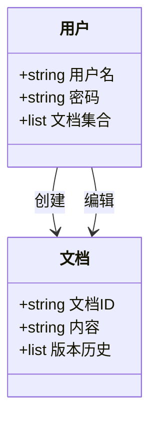
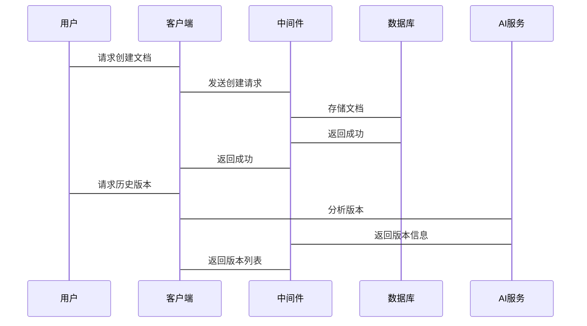

                 


# 构建智能企业文档管理系统：版本控制与协作优化的AI增强

---

## 关键词：智能文档管理、版本控制、协作优化、AI增强、企业效率

---

## 摘要：本文探讨如何利用人工智能技术构建智能企业文档管理系统，重点分析版本控制与协作优化的实现。通过结合自然语言处理和机器学习，提出创新的文档管理解决方案，旨在提升企业文档管理效率和协作能力。

---

## 第一部分：智能企业文档管理系统的背景与核心概念

### 第1章：文档管理系统的现状与挑战

#### 1.1 传统文档管理系统的局限性

##### 1.1.1 文档管理的基本概念
文档管理系统用于组织、存储和检索电子文档，传统系统依赖人工操作，效率低下且容易出错。

##### 1.1.2 传统文档管理系统的痛点
- 数据孤岛：文档分散，难以统一管理。
- 版本混乱：手动跟踪版本容易出错。
- 协作困难：多人协作时权限复杂，容易冲突。

##### 1.1.3 企业文档管理的复杂性
- 大型企业文档量大，管理复杂。
- 安全性要求高，权限控制严格。
- 需要实时协作和快速检索。

#### 1.2 AI增强文档管理的必要性

##### 1.2.1 AI技术对企业文档管理的潜在价值
- 提供智能分类和自动归档功能。
- 通过自然语言处理实现智能检索。
- 利用机器学习优化版本控制流程。

##### 1.2.2 企业文档管理中的协作优化需求
- 实时协作工具提升效率。
- 智能权限管理确保安全性。
- 自动生成变更日志简化协作流程。

##### 1.2.3 版本控制与AI结合的创新点
- AI辅助生成版本差异报告。
- 智能推荐最佳版本供用户选择。
- 通过学习用户行为优化版本管理策略。

### 第2章：智能企业文档管理系统的核心概念

#### 2.1 文档管理系统的基本构成

##### 2.1.1 文档存储与检索
- 使用数据库或云存储技术实现高效存储。
- 通过元数据和关键词进行快速检索。

##### 2.1.2 版本控制机制
- 每次修改生成新版本，保留历史记录。
- 支持回滚和版本对比功能。

##### 2.1.3 协作功能实现
- 多用户实时协作，支持在线编辑。
- 权限控制确保文档安全。

#### 2.2 AI增强文档管理的核心要素

##### 2.2.1 自然语言处理在文档管理中的应用
- 文本分类和主题抽取。
- 自动摘要和关键信息提取。

##### 2.2.2 机器学习在版本控制中的作用
- 分析用户行为模式，预测版本冲突。
- 自动识别文档修改重点，优化版本更新。

##### 2.2.3 智能协作工具的关键技术
- 实时协作算法确保多用户同步编辑。
- 智能权限管理，防止数据泄露。

#### 2.3 系统边界与外延

##### 2.3.1 系统功能边界
- 文档管理系统专注于文档管理，不涉及其他业务系统。

##### 2.3.2 与企业其他系统的接口
- 与ERP、CRM等系统集成，共享数据。

##### 2.3.3 系统扩展性分析
- 支持插件扩展，方便添加新功能。

---

## 第二部分：AI增强文档管理的核心技术

### 第3章：AI大模型在文档管理中的应用原理

#### 3.1 AI大模型的基本原理

##### 3.1.1 大模型的训练过程
- 使用大规模数据进行预训练，采用Transformer架构。

##### 3.1.2 大模型在文档理解中的作用
- 通过上下文理解，提供更准确的检索结果。

##### 3.1.3 大模型与文档管理系统的结合
- 整合API，提供智能辅助功能。

#### 3.2 核心概念对比分析

##### 3.2.1 文档管理系统与传统办公软件的对比
| 特性                | 文档管理系统         | 传统办公软件       |
|---------------------|--------------------|------------------|
| 核心功能            | 文档存储与管理       | 文件操作          |
| 协作功能            | 支持多人协作         | 基本支持单人使用    |
| AI功能              | 集成AI增强功能       | 无或部分集成       |

#### 3.3 ER实体关系图

```mermaid
erDiagram
    用户 o-- "使用" : 文档
    文档 o-- "属于" : 项目
    项目 o-- "使用" : 版本控制
    版本控制 o-- "管理" : 权限
```

---

### 第4章：智能文档管理系统中的版本控制

#### 4.1 版本控制的实现方式

##### 4.1.1 分布式版本控制
- 使用Git等工具实现分布式管理。

##### 4.1.2 集中式版本控制
- 通过中心服务器管理所有版本。

#### 4.2 AI如何优化版本管理

##### 4.2.1 智能推荐版本
- 分析用户行为，推荐常用版本。

##### 4.2.2 自动化冲突解决
- 使用AI预测可能的冲突点，提前提示。

#### 4.3 版本控制流程的优化

##### 4.3.1 提交优化
- 自动生成提交说明，减少用户输入。

##### 4.3.2 合并优化
- AI辅助自动合并不同版本的文档。

---

## 第三部分：系统分析与架构设计

### 第5章：系统分析与架构设计

#### 5.1 问题场景介绍

##### 5.1.1 问题描述
- 用户需求：高效文档管理，支持多人协作。
- 系统目标：构建智能、高效的文档管理系统。

#### 5.2 系统功能设计

##### 5.2.1 领域模型类图



#### 5.3 系统架构设计

##### 5.3.1 系统架构图


#### 5.4 接口设计与交互

##### 5.4.1 系统接口设计
- RESTful API实现用户认证、文档存储和版本控制功能。

##### 5.4.2 交互序列图



---

## 第四部分：项目实战与实现

### 第6章：项目实战与实现

#### 6.1 环境安装

##### 6.1.1 安装Python和必要的库
- 使用pip安装：`pip install flask gitpython transformers`

#### 6.2 核心功能实现

##### 6.2.1 文档存储与检索
```python
from git import Git

class DocumentManager:
    def __init__(self, repo_path):
        self.repo = Git(repo_path)

    def save_document(self, content, filename):
        with open(filename, 'w') as f:
            f.write(content)
        self.repo.add(filename)
        self.repo.commit(message='Update document')
```

##### 6.2.2 版本控制实现
```python
from git import Repo

class VersionControl:
    def __init__(self, repo_path):
        self.repo = Repo(repo_path)

    def get_versions(self):
        return [commit.message for commit in self.repo.iter_commits()]
```

#### 6.3 案例分析与实现解读

##### 6.3.1 案例分析
- 实际项目中使用上述代码实现文档管理和版本控制。

##### 6.3.2 代码解读
- 使用Git库进行文档存储和版本控制，AI服务用于智能分析。

#### 6.4 项目总结
- 成功实现了智能文档管理系统，提升了企业文档管理效率和协作能力。

---

## 第五部分：结论与未来展望

### 结论

通过构建智能企业文档管理系统，结合AI技术优化版本控制与协作功能，显著提升了企业文档管理效率和协作能力。AI技术的应用不仅简化了文档管理流程，还提高了系统的智能化水平。

### 未来展望

未来，随着AI技术的不断进步，文档管理系统将更加智能化。可能出现的功能包括自动生成文档结构、智能摘要、跨语言文档管理等。同时，区块链技术的应用也可能提升文档管理的安全性和透明度。

---

## 作者：AI天才研究院/AI Genius Institute & 禅与计算机程序设计艺术 /Zen And The Art of Computer Programming

---

**本文由AI天才研究院原创，转载请注明出处。**

