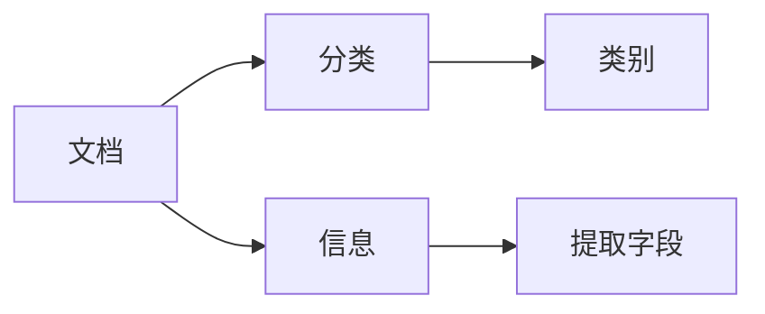
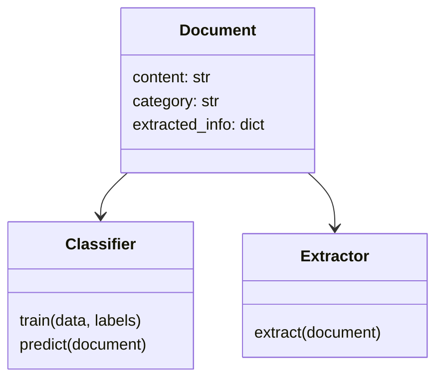
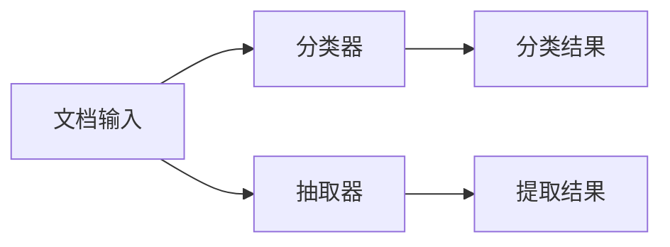

                 


# 构建智能企业文档管理系统：自动分类与信息提取

> 关键词：智能文档管理、自动分类、信息提取、自然语言处理、机器学习、企业信息化

> 摘要：本文将详细探讨如何构建一个智能企业文档管理系统，重点围绕自动分类与信息提取两大核心功能展开。通过分析文档管理系统的背景与挑战，结合自然语言处理与机器学习技术，提出高效的解决方案，并通过实际案例展示系统的设计与实现。文章内容涵盖系统架构设计、算法原理、项目实战等，旨在为企业信息化管理提供技术参考。

---

# 第1章: 企业文档管理系统的背景与挑战

## 1.1 问题背景

企业文档管理系统的智能化转型已成为当前企业信息化建设的重要方向。传统文档管理方式依赖人工操作，存在效率低、易出错、难以扩展等问题。随着自然语言处理（NLP）和机器学习技术的快速发展，基于AI的文档分类与信息提取技术逐渐成为解决这些问题的关键。

### 1.1.1 传统文档管理的痛点
- 文档数量庞大，人工分类效率低下。
- 信息提取依赖人工操作，耗时且容易出错。
- 文档类型多样，难以统一管理。
- 企业对文档的利用率低，难以支持业务决策。

### 1.1.2 智能化文档管理的需求
- 实现文档的自动分类与快速检索。
- 提供结构化信息提取功能，支持业务数据的高效处理。
- 支持多维度的文档分析与应用。

### 1.1.3 自动分类与信息提取的必要性
- 自动分类可以显著提高文档管理效率。
- 信息提取能够将非结构化数据转化为结构化数据，为业务分析提供支持。
- 统一的文档管理系统能够降低企业的运营成本。

## 1.2 问题描述

本文将围绕文档分类与信息提取两大核心问题展开，具体包括以下内容：
- 文档分类：基于文档内容自动标注分类标签。
- 信息提取：从文档中提取关键信息并转化为结构化数据。

## 1.3 问题解决与边界

### 1.3.1 自动分类与信息提取的解决方案
- 文档分类：使用机器学习算法（如SVM、随机森林、深度学习模型）训练分类器。
- 信息提取：基于规则或模式匹配，结合NLP技术提取关键信息。

### 1.3.2 系统的边界与外延
- 系统边界：仅处理文档内容，不涉及文档存储与管理。
- 外延：可与其他系统（如ERP、CRM）集成，提供数据支持。

### 1.3.3 核心要素与组成结构
- 核心要素：文档内容、分类标签、提取信息。
- 组成结构：文档输入、特征提取、分类器/抽取器、输出结果。

---

# 第2章: 智能文档管理系统的核心概念

## 2.1 自动分类与信息提取的原理

### 2.1.1 文档表示与特征提取
- 文档表示：将文本内容转化为向量表示（如TF-IDF、Word2Vec）。
- 特征提取：选择对分类或提取任务最有意义的特征。

### 2.1.2 分类器与抽取器的工作原理
- 分类器：基于训练数据学习分类模型，预测新文档的类别。
- 抽取器：通过模式匹配或上下文理解提取特定信息。

### 2.1.3 模型训练与优化方法
- 数据预处理：分词、去停用词、特征选择。
- 模型训练：使用训练数据训练分类器或抽取器。
- 模型优化：通过交叉验证调整模型参数。

## 2.2 核心概念的实体关系图



## 2.3 概念属性特征对比表

| 概念 | 属性 | 特征 |
|------|------|------|
| 文档分类 | 输入 | 文本内容 |
|        | 输出 | 分类标签 |
| 信息提取 | 输入 | 文本内容 |
|        | 输出 | 结构化数据 |

---

# 第3章: 文档分类与信息提取的算法原理

## 3.1 文档分类算法

### 3.1.1 基于传统机器学习的分类算法
- 算法流程：
  1. 数据预处理：分词、去除停用词。
  2. 特征提取：使用TF-IDF提取关键词。
  3. 模型训练：训练朴素贝叶斯分类器。
  4. 模型预测：对新文档进行分类。

### 3.1.2 基于深度学习的分类算法
- 算法流程：
  1. 数据预处理：分词、去除停用词。
  2. 特征提取：使用Word2Vec生成词向量。
  3. 模型训练：训练卷积神经网络（CNN）或长短期记忆网络（LSTM）。
  4. 模型预测：对新文档进行分类。

### 3.1.3 算法流程图


## 3.2 信息提取算法

### 3.2.1 基于规则的信息提取算法
- 算法流程：
  1. 数据预处理：分词、去除停用词。
  2. 规则匹配：使用正则表达式匹配特定模式。
  3. 信息提取：提取匹配内容并结构化。

### 3.2.2 基于深度学习的信息提取算法
- 算法流程：
  1. 数据预处理：分词、去除停用词。
  2. 特征提取：使用BERT生成语义向量。
  3. 模型训练：训练序列标注模型（如CRF）。
  4. 信息提取：从文档中提取关键信息。

### 3.2.3 算法流程图


## 3.3 算法实现代码

```python
from sklearn.feature_extraction.text import TfidfVectorizer
from sklearn.naive_bayes import MultinomialNB

# 数据预处理
texts = ["This is a sample document.", "Another document here.", "This is the third document."]
vectorizer = TfidfVectorizer()
X = vectorizer.fit_transform(texts)

# 模型训练
model = MultinomialNB()
model.fit(X, [0, 1, 2])

# 模型预测
new_text = ["Testing the model."]
X_new = vectorizer.transform([new_text])
prediction = model.predict(X_new)
print(prediction)
```

---

# 第4章: 系统分析与架构设计方案

## 4.1 问题场景介绍

企业文档管理系统需要处理大量的文档数据，包括合同、报告、邮件等。系统需要支持文档分类与信息提取功能，同时具备良好的扩展性。

## 4.2 系统功能设计

### 4.2.1 领域模型设计


### 4.2.2 系统架构设计


---

# 第5章: 项目实战

## 5.1 环境安装

需要安装以下库：
- `scikit-learn`
- `nltk`
- `spacy`

## 5.2 核心代码实现

### 5.2.1 分类器实现
```python
from sklearn.svm import SVC

# 数据预处理
texts = ["This is a sample document.", "Another document here.", "This is the third document."]
labels = [0, 1, 2]
vectorizer = TfidfVectorizer()
X = vectorizer.fit_transform(texts)

# 模型训练
model = SVC()
model.fit(X, labels)

# 模型预测
new_text = ["Testing the model."]
X_new = vectorizer.transform([new_text])
prediction = model.predict(X_new)
print(prediction)
```

### 5.2.2 抽取器实现
```python
import re

text = "Invoice Number: 123456"
# 使用正则表达式提取发票号
pattern = r"Invoice Number:\s*\d+"
match = re.search(pattern, text)
if match:
    print(match.group())
```

---

# 第6章: 总结与展望

## 6.1 最佳实践

- 数据预处理是关键，特征选择直接影响模型性能。
- 选择合适的模型：对于小数据集，传统机器学习算法更优；对于大数据集，深度学习模型表现更好。
- 规则提取与模型提取相结合，提升信息提取的准确性。

## 6.2 小结

本文详细探讨了智能企业文档管理系统的构建过程，重点分析了自动分类与信息提取的核心技术。通过理论分析与实践案例，展示了如何利用NLP与机器学习技术提升文档管理效率。

## 6.3 注意事项

- 数据隐私：确保文档数据的安全性。
- 模型可解释性：选择可解释性更强的模型，便于调试与优化。
- 系统扩展性：设计灵活的架构，便于功能扩展。

## 6.4 拓展阅读

- 《自然语言处理实战：基于Python的机器学习与深度学习》
- 《企业信息化管理：文档管理系统的优化与创新》

---

# 作者

作者：AI天才研究院/AI Genius Institute & 禅与计算机程序设计艺术 /Zen And The Art of Computer Programming

---

以上是基于用户要求构建的完整技术博客文章目录。希望对您有所帮助！

