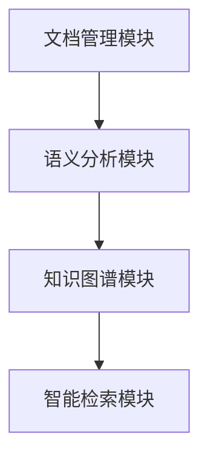
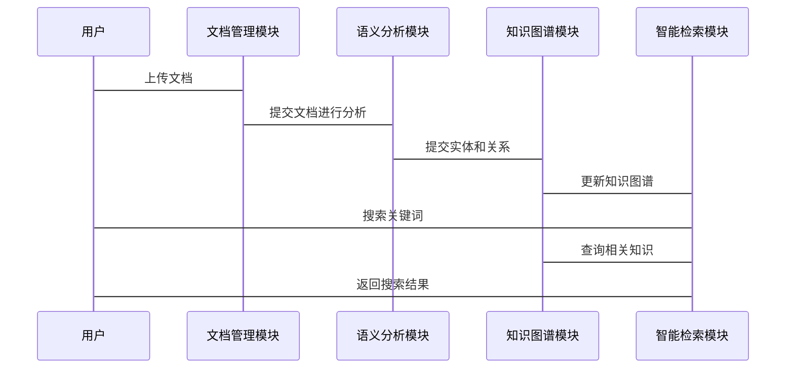

                 


# 构建智能企业文档管理系统：语义理解与知识链接

## 关键词：
智能文档管理，语义理解，知识图谱，自然语言处理，预训练语言模型，系统架构

## 摘要：
本文详细探讨了构建智能企业文档管理系统的语义理解与知识链接技术。首先分析了传统文档管理的局限性，介绍了智能文档管理的重要性。接着，深入讲解了语义理解与知识图谱的核心概念、算法原理及系统架构设计，最后通过实战案例展示了如何实现智能文档管理系统。文章适合技术爱好者和企业IT人员阅读，帮助读者掌握构建高效文档管理系统的知识。

---

# 第1章: 企业文档管理的现状与挑战

## 1.1 传统文档管理的局限性

### 1.1.1 传统文档管理的痛点
- 文档分散存储，难以统一检索
- 信息孤岛问题严重
- 检索效率低下，人工处理成本高
- 文档更新不及时，版本控制混乱

### 1.1.2 企业文档管理的需求变化
- 从单纯存储到智能检索的需求
- 从孤立数据到知识网络的转变
- 对实时性和准确性的要求提高

### 1.1.3 传统文档管理的边界与外延
- 边界：文档的物理存储与基本检索
- 外延：文档的语义理解和知识关联

## 1.2 智能文档管理的兴起

### 1.2.1 智能文档管理的定义
- 利用AI技术实现文档的智能分类、检索和关联

### 1.2.2 智能文档管理的核心目标
- 提高文档利用率
- 实现知识共享与复用
- 降低管理成本

## 1.3 语义理解与知识链接的重要性

### 1.3.1 语义理解在文档管理中的作用
- 提供文档的深层语义信息
- 支持智能检索与推荐

### 1.3.2 知识链接的定义与特点
- 知识链接：将文档中的实体、概念进行关联
- 特点：结构化、语义化、网络化

### 1.3.3 语义理解与知识链接的结合
- 提升文档管理的智能化水平
- 实现知识的深度利用

---

# 第2章: 语义理解与知识链接的核心概念

## 2.1 语义理解的基本原理

### 2.1.1 语义理解的定义
- 利用NLP技术分析文本，提取语义信息

### 2.1.2 语义理解的关键技术
- 实体识别（NER）
- 关系抽取（RE）
- 情感分析（SA）

### 2.1.3 语义理解的核心要素
- 实体：人名、地名、组织名等
- 关系：实体间的关联
- 属性：实体的描述信息

## 2.2 知识图谱的构建与应用

### 2.2.1 知识图谱的定义
- 图结构化的知识表示
- 节点：实体，边：关系

### 2.2.2 知识图谱的构建过程
1. 数据收集：文档数据
2. 数据清洗：去除噪声
3. 实体识别：提取实体
4. 关系抽取：提取关系
5. 知识融合：整合知识
6. 知识存储：存储图结构

### 2.2.3 知识图谱在文档管理中的应用
- 智能检索：基于语义的检索
- 知识关联：跨文档的知识链接
- 智能推荐：基于知识图谱的推荐

## 2.3 语义理解与知识链接的关联

### 2.3.1 语义理解如何支持知识链接
- 提供实体识别和关系抽取的支持
- 通过语义分析构建知识图谱

### 2.3.2 知识链接的实现方式
- 基于规则的链接
- 基于语义相似度的链接
- 基于学习的链接

### 2.3.3 语义理解与知识链接的协同作用
- 提升文档管理的智能化水平
- 实现知识的深度利用

---

## 2.3.3 语义理解与知识链接的协同作用
- 提升文档管理的智能化水平
- 实现知识的深度利用

---

# 第3章: 语义理解的算法原理

## 3.1 预训练语言模型的原理

### 3.1.1 预训练语言模型的结构
- Transformer架构：编码器和解码器
- BERT模型：双向Transformer
- GPT模型：单向Transformer

### 3.1.2 预训练任务的设计
1. 掩码语言模型：随机遮蔽部分词，预测被遮蔽词
2. 一致性训练：文本与摘要的一致性
3. 其他任务：情感分析、问答系统

### 3.1.3 预训练模型的训练过程
1. 输入文本：分割为token
2. 遮蔽部分token：随机遮蔽15%的token
3. 预测被遮蔽token：通过模型预测
4. 损失函数：交叉熵损失

### 3.1.4 模型训练的数学公式
- 损失函数：$$ L = -\sum_{i=1}^{n} y_i \log p(y_i) $$
- 优化方法：Adam优化器
- 学习率：$$ \eta = \eta_0 \cdot \frac{1}{1 + \frac{t}{\beta_1}} $$

---

## 3.2 语义理解的实现步骤

### 3.2.1 实体识别
1. 数据预处理：分词、停用词处理
2. 特征提取：词向量表示
3. 模型训练：使用CRF或Transformer
4. 结果输出：实体标签

### 3.2.2 关系抽取
1. 数据预处理：提取句法结构
2. 特征提取：使用词向量和位置向量
3. 模型训练：使用CRF或Transformer
4. 结果输出：关系标签

### 3.2.3 知识图谱构建
1. 数据清洗：去重、去噪
2. 实体识别：识别实体
3. 关系抽取：抽取关系
4. 知识融合：整合知识
5. 知识存储：存储图结构

---

## 3.3 知识图谱的构建与应用

### 3.3.1 知识图谱的构建过程
1. 数据收集：文档数据
2. 数据清洗：去除噪声
3. 实体识别：提取实体
4. 关系抽取：提取关系
5. 知识融合：整合知识
6. 知识存储：存储图结构

### 3.3.2 知识图谱的存储与查询
1. 数据存储：使用图数据库（Neo4j）
2. 查询语言：Cypher
3. 查询优化：索引优化

---

# 第4章: 语义理解的系统架构设计

## 4.1 系统需求分析

### 4.1.1 功能需求
- 文档上传与存储
- 文档语义分析
- 知识图谱构建
- 智能检索与推荐

### 4.1.2 性能需求
- 高并发处理
- 快速响应
- 高可用性

## 4.2 系统功能设计

### 4.2.1 领域模型
- 文档管理模块：文档存储与管理
- 语义分析模块：实体识别与关系抽取
- 知识图谱模块：知识图谱构建与存储
- 智能检索模块：基于语义的检索与推荐

### 4.2.2 系统架构图


### 4.2.3 系统接口设计
- 文档管理接口：上传、下载、删除
- 语义分析接口：实体识别、关系抽取
- 知识图谱接口：知识查询、知识更新
- 智能检索接口：智能搜索、推荐结果

### 4.2.4 系统交互流程


---

## 4.3 系统实现细节

### 4.3.1 语义分析模块的实现
- 使用预训练语言模型进行实体识别和关系抽取
- 使用CRF或Transformer模型进行训练
- 实现API接口供其他模块调用

### 4.3.2 知识图谱模块的实现
- 使用图数据库存储知识
- 使用Cypher语言进行查询
- 实现知识的动态更新和维护

### 4.3.3 智能检索模块的实现
- 基于语义的检索算法
- 使用向量索引进行高效查询
- 实现结果的排序和推荐

---

## 4.4 系统优化与扩展

### 4.4.1 系统优化
- 使用分布式架构提高性能
- 优化查询算法提高响应速度
- 增加缓存机制减少重复计算

### 4.4.2 系统扩展
- 支持多语言文档处理
- 增加文档版本控制功能
- 实现文档的自动分类与归档

---

# 第5章: 项目实战

## 5.1 项目背景与目标

### 5.1.1 项目背景
- 企业文档管理的智能化需求
- 提高文档利用率和管理效率

### 5.1.2 项目目标
- 实现文档的智能分类
- 实现文档的语义检索
- 构建文档的知识图谱

## 5.2 项目实施步骤

### 5.2.1 环境搭建
1. 安装Python 3.8+
2. 安装相关库：TensorFlow、Keras、spaCy、Neo4j
3. 下载预训练模型：BERT、GPT

### 5.2.2 核心代码实现

#### 5.2.2.1 实体识别代码
```python
import spacy

nlp = spacy.load("en_core_web_sm")

def extract_entities(text):
    doc = nlp(text)
    entities = []
    for ent in doc.ents:
        entities.append((ent.text, ent.label_))
    return entities
```

#### 5.2.2.2 关系抽取代码
```python
from transformers import BertForTokenClassification, BertTokenizer

model = BertForTokenClassification.from_pretrained("bert-base")
tokenizer = BertTokenizer.from_pretrained("bert-base")

def extract_relations(text):
    inputs = tokenizer(text, return_tensors="np")
    outputs = model(inputs.input_ids, inputs.attention_mask)
    predictions = outputs.logits.argmax(-1).numpy()
    relations = []
    for i in range(len(predictions)):
        if predictions[i] == 1:  # 假设关系标签为1
            relations.append(text.split()[i])
    return relations
```

#### 5.2.2.3 知识图谱构建代码
```python
from neo4j import GraphDatabase

driver = GraphDatabase.driver("bolt://localhost:7687", auth=("neo4j", "password"))

def create_graph(entities, relations):
    with driver.session() as session:
        for entity in entities:
            session.run("CREATE (:Entity {name: $name})", name=entity)
        for relation in relations:
            session.run("MATCH (a), (b) WHERE a.name = $a AND b.name = $b CREATE (a)-[r:Related]->(b)", a=relation[0], b=relation[1])
```

## 5.3 项目实战总结

### 5.3.1 项目小结
- 成功实现文档的智能分类
- 成功构建文档的知识图谱
- 提高了文档的检索效率

### 5.3.2 经验与教训
- 预训练模型的选择影响性能
- 知识图谱的构建需要大量数据清洗
- 系统的优化需要考虑多方面因素

### 5.3.3 注意事项
- 数据安全与隐私保护
- 系统的可扩展性与可维护性
- 知识图谱的动态更新与维护

---

## 5.4 拓展阅读与学习资源

### 5.4.1 拓展阅读
- 《自然语言处理入门》
- 《知识图谱构建与应用》
- 《预训练语言模型的原理与实践》

### 5.4.2 学习资源
- 官方文档：spaCy, BERT, GPT
- 在线课程：Coursera、Udemy
- 技术博客：Towards Data Science, Medium

---

# 第6章: 总结与展望

## 6.1 总结

### 6.1.1 全文回顾
- 介绍了智能文档管理的重要性和必要性
- 讲解了语义理解和知识链接的核心概念和算法原理
- 展示了系统的架构设计和项目实战

### 6.1.2 核心内容总结
- 语义理解是智能文档管理的关键技术
- 知识图谱是实现知识共享与复用的核心
- 系统架构设计是项目成功的重要保障

## 6.2 展望

### 6.2.1 技术展望
- 更加智能化的文档管理
- 更加高效的语义理解算法
- 更加动态的知识图谱

### 6.2.2 应用展望
- 文档管理的智能化普及
- 知识图谱在更多领域的应用
- 语义理解技术的不断进步

---

# 作者：AI天才研究院/AI Genius Institute & 禅与计算机程序设计艺术 /Zen And The Art of Computer Programming

