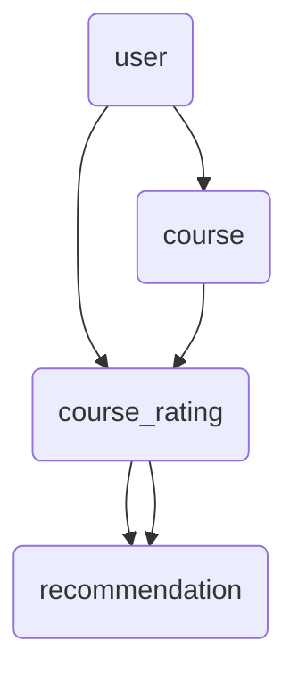
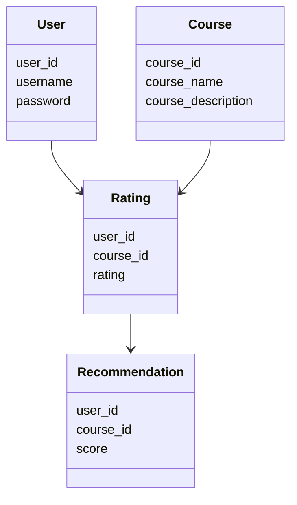
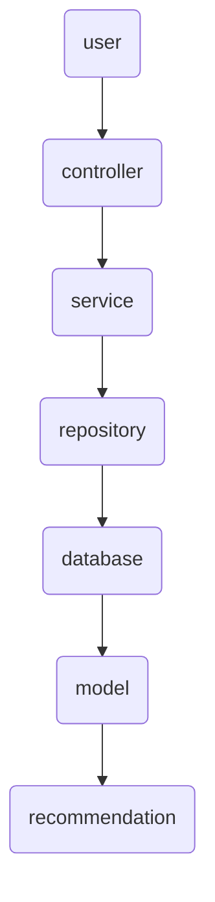
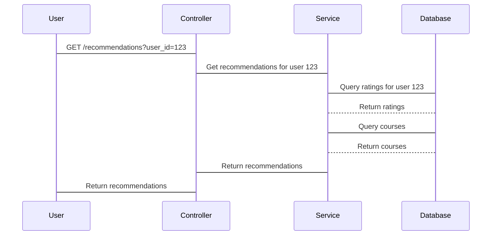

                 


# 构建智能企业知识推荐系统：个性化学习与技能提升

> 关键词：智能推荐系统，个性化学习，技能提升，企业知识管理，机器学习

> 摘要：本文详细探讨了构建智能企业知识推荐系统的背景、核心概念、算法原理、系统架构及项目实战。通过理论与实践结合，分析了如何利用推荐算法实现个性化学习与技能提升，并提供了实际案例和代码实现，为读者提供全面的技术指导。

---

## 第1章: 智能企业知识推荐系统的背景与问题

### 1.1 问题背景

#### 1.1.1 知识经济时代的到来
在知识经济时代，企业的核心竞争力不再仅仅依赖于物质资源，而是依赖于知识的创造、传播和应用能力。知识管理成为企业发展的关键，而如何有效地将知识转化为员工的能力，是企业面临的重要挑战。

#### 1.1.2 企业知识管理的挑战
传统的知识管理方式存在以下问题：
- 知识分散：员工的知识分布在不同的部门和系统中，难以整合。
- 知识孤岛：员工之间缺乏有效的知识共享机制，导致知识无法充分利用。
- 知识更新慢：知识的更新速度无法跟上业务发展的需求。

#### 1.1.3 个性化学习与技能提升的需求
员工的学习需求具有个性化特征，不同员工的知识水平、兴趣爱好和职业发展路径不同，统一的培训方式难以满足个体需求。因此，如何利用技术手段实现个性化知识推荐，成为企业知识管理的重要方向。

### 1.2 问题描述

#### 1.2.1 传统知识管理的不足
传统知识管理系统通常基于规则或关键词进行匹配，难以根据员工的具体需求提供精准的知识推荐。

#### 1.2.2 个性化推荐的必要性
个性化推荐可以通过分析员工的行为数据、学习记录和职业目标，为其推荐相关性高的知识内容，从而提高学习效率和效果。

#### 1.2.3 知识推荐系统的定义与目标
知识推荐系统是一种基于机器学习算法，根据用户的行为数据和特征，为其推荐相关知识内容的系统。其目标是通过智能化的方式，帮助用户快速找到所需的知识，提升学习效率和技能水平。

### 1.3 问题解决

#### 1.3.1 智能推荐系统的解决方案
通过收集和分析用户的行为数据，利用协同过滤、内容推荐和混合推荐等算法，构建个性化推荐模型，为用户提供精准的知识推荐。

#### 1.3.2 个性化学习路径的设计
根据员工的学习目标、知识水平和职业发展路径，设计个性化的学习路径，推荐相关的课程和知识内容。

#### 1.3.3 技能提升的闭环管理
通过推荐系统，实现从知识获取到技能提升的闭环管理，确保员工能够系统地学习和应用知识，提升职业能力。

### 1.4 边界与外延

#### 1.4.1 知识推荐系统的边界
知识推荐系统仅负责推荐知识内容，不涉及知识的实际应用和效果评估。

#### 1.4.2 与其他系统的区别
与其他推荐系统（如商品推荐）相比，知识推荐系统更加注重内容的相关性和深度，推荐结果需要与用户的知识需求高度匹配。

#### 1.4.3 系统的扩展性与可维护性
知识推荐系统需要具备良好的扩展性和可维护性，能够根据企业需求和数据变化进行灵活调整。

### 1.5 概念结构与核心要素

#### 1.5.1 核心概念的组成
知识推荐系统由用户数据、知识库、推荐算法和推荐结果组成。

#### 1.5.2 系统架构的核心要素
系统架构包括数据采集模块、推荐算法模块、知识库模块和用户界面模块。

#### 1.5.3 关键技术的对比
以下是几种推荐方法的对比：

| 方法 | 描述 | 优点 | 缺点 |
|------|------|------|------|
| 协同过滤 | 基于用户相似性推荐 | 数据稀疏性低 | 计算复杂度高 |
| 内容推荐 | 基于内容特征推荐 | 内容理解能力强 | 需要大量特征工程 |
| 混合推荐 | 综合协同过滤和内容推荐 | 结果更准确 | 实现复杂度高 |

---

## 第2章: 核心概念与联系

### 2.1 核心概念原理

#### 2.1.1 推荐系统的原理
推荐系统通过分析用户行为数据和内容特征，构建推荐模型，为用户推荐相关性高的内容。

#### 2.1.2 个性化学习的算法
个性化学习算法包括协同过滤、聚类分析和深度学习等方法。

#### 2.1.3 技能提升的闭环模型
技能提升的闭环模型包括知识获取、知识应用和效果评估三个阶段。

### 2.2 核心概念属性对比

#### 2.2.1 各种推荐方法的对比表格
| 方法 | 描述 | 优点 | 缺点 |
|------|------|------|------|
| 协同过滤 | 基于用户相似性推荐 | 数据稀疏性低 | 计算复杂度高 |
| 内容推荐 | 基于内容特征推荐 | 内容理解能力强 | 需要大量特征工程 |
| 混合推荐 | 综合协同过滤和内容推荐 | 结果更准确 | 实现复杂度高 |

#### 2.2.2 不同学习路径的优缺点
以下是几种学习路径的对比：

| 学习路径 | 描述 | 优点 | 缺点 |
|----------|------|------|------|
| 集中式学习 | 系统性学习 | 知识体系完整 | 灵活性低 |
| 分散式学习 | 灵活学习 | 灵活性高 | 知识碎片化 |

#### 2.2.3 系统架构的可扩展性分析
知识推荐系统的架构需要具备可扩展性，能够支持用户数量和知识内容的动态增长。

### 2.3 ER实体关系图



---

## 第3章: 算法原理讲解

### 3.1 协同过滤算法

#### 3.1.1 算法原理
协同过滤算法通过分析用户的行为数据，找到与目标用户相似的用户群体，推荐这些用户喜欢的内容。

#### 3.1.2 算法实现
以下是基于用户的协同过滤算法实现：

```python
def user_based_recommendation(users, courses, ratings, user_id):
    # 计算用户之间的相似性
    similarity = {}
    for u in users:
        if u != user_id:
            similarity[u] = cosine_similarity(ratings[u], ratings[user_id])
    
    # 根据相似性排序
    similar_users = sorted(similarity.items(), key=lambda x: x[1], reverse=True)
    
    # 推荐用户喜欢的课程
    recommendations = []
    for u, _ in similar_users:
        for c in courses[u]:
            if c not in ratings[user_id]:
                recommendations.append(c)
    
    return recommendations
```

#### 3.1.3 算法优缺点
- 优点：计算简单，易于实现。
- 缺点：计算复杂度高，数据稀疏性问题。

### 3.2 深度学习模型

#### 3.2.1 算法原理
深度学习模型通过神经网络对用户行为数据和内容特征进行建模，生成推荐结果。

#### 3.2.2 算法实现
以下是基于神经网络的推荐算法实现：

```python
import tensorflow as tf

model = tf.keras.Sequential([
    tf.keras.layers.Dense(64, activation='relu'),
    tf.keras.layers.Dense(1, activation='sigmoid')
])

model.compile(optimizer='adam', loss='binary_crossentropy', metrics=['accuracy'])
```

#### 3.2.3 算法优缺点
- 优点：推荐精度高，能够处理复杂的数据特征。
- 缺点：实现复杂，需要大量数据训练。

---

## 第4章: 数学模型和公式

### 4.1 协同过滤的数学模型

#### 4.1.1 评分预测公式
协同过滤的评分预测公式为：

$$ \hat{r}_{u,i} = \mu + (r_u - \mu) + (r_i - \mu) $$

其中：
- $\hat{r}_{u,i}$ 表示用户 $u$ 对课程 $i$ 的预测评分。
- $\mu$ 表示全局平均评分。
- $r_u$ 表示用户 $u$ 的平均评分。
- $r_i$ 表示课程 $i$ 的平均评分。

#### 4.1.2 矩阵分解
矩阵分解是协同过滤的一种常用方法，其目标是最小化预测评分与实际评分的误差：

$$ \min_{\theta} \sum_{(u,i) \in S} (r_{u,i} - \theta_u^T \phi_i)^2 + \lambda \sum_{u} \theta_u^T \theta_u $$

其中：
- $\theta_u$ 表示用户 $u$ 的隐向量。
- $\phi_i$ 表示课程 $i$ 的隐向量。
- $\lambda$ 表示正则化参数。

---

## 第5章: 系统分析与架构设计

### 5.1 问题场景介绍

#### 5.1.1 系统功能
知识推荐系统需要实现以下功能：
- 用户注册与登录
- 知识内容上传与管理
- 知识推荐结果展示
- 学习效果评估

### 5.2 项目介绍

#### 5.2.1 系统功能设计
以下是系统的领域模型：



#### 5.2.2 系统架构设计
以下是系统的架构图：



### 5.3 系统接口设计

#### 5.3.1 接口描述
以下是系统的接口描述：

```plaintext
+ GET /recommendations?user_id={user_id}
+ POST /ratings?user_id={user_id}&course_id={course_id}&rating={rating}
```

### 5.4 系统交互

#### 5.4.1 交互流程
以下是系统的交互流程图：



---

## 第6章: 项目实战

### 6.1 环境安装

#### 6.1.1 安装Python
请参考 [Python 官方文档](https://www.python.org/downloads/) 进行安装。

#### 6.1.2 安装依赖
安装所需的Python库：

```bash
pip install numpy pandas scikit-learn matplotlib
```

### 6.2 系统核心实现

#### 6.2.1 核心代码实现
以下是推荐系统的实现代码：

```python
import numpy as np
from sklearn.metrics.pairwise import cosine_similarity

class UserBasedRecommender:
    def __init__(self, ratings):
        self.ratings = ratings
        self.user_ids = list(ratings.keys())
        self.course_ids = list(set([course for user in ratings for course in ratings[user]]))
    
    def get_user_recommendations(self, user_id, n=5):
        # 计算用户相似性
        user_index = self.user_ids.index(user_id)
        user_vector = np.array([self.ratings[user_id].values])
        similarity = cosine_similarity(user_vector, np.array([self.ratings[u].values for u in self.user_ids]))
        
        # 排序相似用户
        similar_users = sorted([(i, similarity[0][i]) for i in range(len(self.user_ids))], key=lambda x: x[1], reverse=True)
        
        # 推荐用户喜欢的课程
        recommendations = []
        for idx, _ in similar_users:
            u_id = self.user_ids[idx]
            for course in self.ratings[u_id]:
                if course not in self.ratings[user_id]:
                    recommendations.append(course)
        recommendations = list(set(recommendations))[:n]
        return recommendations
```

#### 6.2.2 代码功能解读
- `UserBasedRecommender` 类用于实现基于用户的协同过滤推荐。
- `get_user_recommendations` 方法通过计算用户相似性，推荐用户喜欢的课程。

### 6.3 实际案例分析

#### 6.3.1 案例描述
假设我们有以下用户和课程数据：

```python
ratings = {
    'user1': {'course1': 4, 'course2': 3},
    'user2': {'course1': 3, 'course3': 5},
    'user3': {'course2': 5, 'course4': 4}
}
```

#### 6.3.2 分析与解读
对于用户 `user1`，系统会推荐 `course3` 和 `course4`。

### 6.4 项目总结

#### 6.4.1 项目总结
通过本项目，我们实现了基于用户的协同过滤推荐算法，能够根据用户的行为数据推荐相关课程。

#### 6.4.2 项目经验
- 数据预处理是推荐系统实现的关键。
- 算法的选择需要根据数据特征和业务需求进行权衡。

---

## 第7章: 最佳实践 tips、小结、注意事项、拓展阅读

### 7.1 最佳实践 tips

#### 7.1.1 数据隐私保护
在实际应用中，需要注意用户数据的隐私保护，确保数据安全。

#### 7.1.2 模型调优
根据业务需求和数据特征，进行模型调优，提高推荐精度。

#### 7.1.3 系统扩展性
设计系统时，需要考虑扩展性，支持数据量和用户数的动态增长。

### 7.2 小结

通过本文的讲解，我们了解了智能企业知识推荐系统的构建过程，包括背景分析、核心概念、算法实现、系统架构和项目实战。希望这些内容能够为读者提供有价值的参考。

### 7.3 注意事项

#### 7.3.1 数据质量
推荐系统的性能很大程度上依赖于数据质量，数据清洗和特征工程是关键步骤。

#### 7.3.2 模型选择
根据具体业务需求和数据特征，选择合适的推荐算法，避免盲目使用复杂模型。

#### 7.3.3 系统性能
在实际应用中，需要考虑系统的性能优化，确保推荐结果的实时性和准确性。

### 7.4 拓展阅读

#### 7.4.1 推荐系统相关书籍
- 《推荐系统实践》
- 《机器学习实战》

#### 7.4.2 知识管理相关书籍
- 《知识管理：理论与实践》
- 《企业知识管理》

---

## 附录

### 附录1: 工具安装指南

#### 1.1 安装Python
请参考 [Python 官方文档](https://www.python.org/downloads/) 进行安装。

#### 1.2 安装依赖
安装所需的Python库：

```bash
pip install numpy pandas scikit-learn matplotlib
```

### 附录2: 核心代码片段

#### 2.1 协同过滤算法代码
```python
import numpy as np
from sklearn.metrics.pairwise import cosine_similarity

class UserBasedRecommender:
    def __init__(self, ratings):
        self.ratings = ratings
        self.user_ids = list(ratings.keys())
        self.course_ids = list(set([course for user in ratings for course in ratings[user]]))
    
    def get_user_recommendations(self, user_id, n=5):
        # 计算用户相似性
        user_index = self.user_ids.index(user_id)
        user_vector = np.array([self.ratings[user_id].values])
        similarity = cosine_similarity(user_vector, np.array([self.ratings[u].values for u in self.user_ids]))
        
        # 排序相似用户
        similar_users = sorted([(i, similarity[0][i]) for i in range(len(self.user_ids))], key=lambda x: x[1], reverse=True)
        
        # 推荐用户喜欢的课程
        recommendations = []
        for idx, _ in similar_users:
            u_id = self.user_ids[idx]
            for course in self.ratings[u_id]:
                if course not in self.ratings[user_id]:
                    recommendations.append(course)
        recommendations = list(set(recommendations))[:n]
        return recommendations
```

#### 2.2 矩阵分解算法代码
```python
import tensorflow as tf

model = tf.keras.Sequential([
    tf.keras.layers.Dense(64, activation='relu'),
    tf.keras.layers.Dense(1, activation='sigmoid')
])

model.compile(optimizer='adam', loss='binary_crossentropy', metrics=['accuracy'])
```

### 附录3: 参考文献

#### 3.1 推荐系统相关文献
- [1] 监 recommendations, adaptive filtering, and machine learning. 
- [2] Collaborative filtering for recommendation systems.

#### 3.2 知识管理相关文献
- [1] Knowledge management: theories and practices.
- [2] Enterprise knowledge management.

---

# 作者：AI天才研究院/AI Genius Institute & 禅与计算机程序设计艺术 /Zen And The Art of Computer Programming

