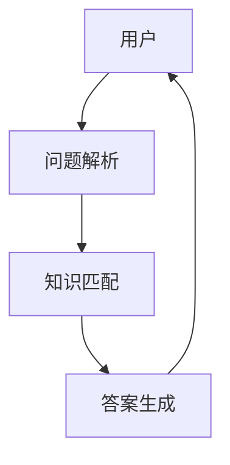
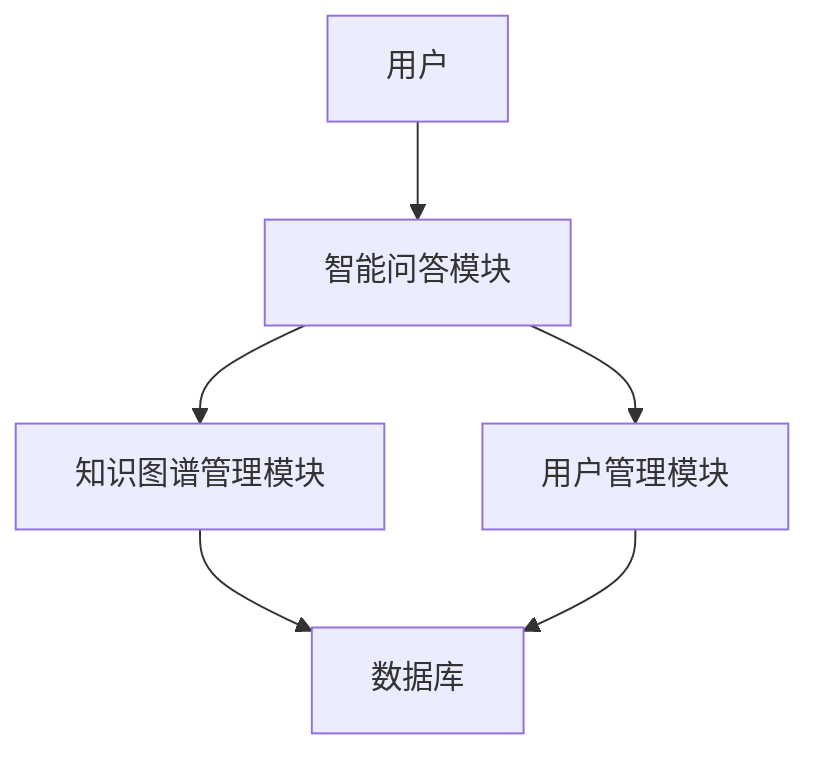

                 


# 构建智能企业知识管理平台：动态知识图谱与智能问答系统

## 关键词：知识管理平台、动态知识图谱、智能问答系统、知识图谱构建、智能问答

## 摘要：  
随着企业信息化的快速发展，知识管理平台在企业中的重要性日益凸显。动态知识图谱与智能问答系统的结合为企业提供了高效的知识管理和智能问答服务。本文详细探讨了动态知识图谱的构建原理、智能问答系统的实现机制，以及它们在企业知识管理中的应用。通过实际案例分析，展示了如何利用这些技术提升企业的知识管理水平。

---

# 第1章: 知识管理平台的背景与现状

## 1.1 知识管理平台的背景介绍

### 1.1.1 企业知识管理的重要性  
在现代企业中，知识是核心资产。有效的知识管理能够提升企业的竞争力，优化决策过程，降低重复劳动，促进知识共享和传承。知识管理平台作为企业知识管理的基础设施，帮助企业高效组织、存储和利用知识。

### 1.1.2 知识管理平台的核心目标  
知识管理平台的核心目标是：  
1. 提供统一的知识存储和管理机制。  
2. 支持快速的知识检索和查询。  
3. 实现知识的动态更新和维护。  
4. 提供智能问答服务，提升用户体验。  

### 1.1.3 当前知识管理的挑战与痛点  
当前知识管理面临以下挑战：  
- 数据量大、类型多样，难以统一管理。  
- 知识更新频繁，动态维护成本高。  
- 知识检索效率低，难以满足用户需求。  
- 缺乏智能化的问答功能，用户体验差。  

---

## 1.2 动态知识图谱的概念与特点

### 1.2.1 知识图谱的定义与演变  
知识图谱是一种以图结构形式表示知识的语义网络，由节点（实体）和边（关系）组成。动态知识图谱是传统知识图谱的升级版本，能够实时更新和维护，适应数据变化的动态性。

### 1.2.2 动态知识图谱的核心特征  
动态知识图谱具有以下核心特征：  
1. **动态性**：支持实时数据更新和版本控制。  
2. **灵活性**：能够适应数据结构的变化。  
3. **高效性**：支持快速的查询和更新操作。  
4. **可扩展性**：适用于大规模数据的处理。  

### 1.2.3 动态知识图谱与传统知识图谱的区别  
| 特性          | 动态知识图谱         | 传统知识图谱       |  
|---------------|----------------------|---------------------|  
| 更新机制      | 支持动态更新         | 更新周期较长        |  
| 数据结构      | 支持动态扩展         | 数据结构相对固定    |  
| 查询效率      | 实时高效            | 延迟较高            |  

---

## 1.3 智能问答系统的核心原理

### 1.3.1 智能问答系统的定义  
智能问答系统是一种基于自然语言处理（NLP）和知识图谱的问答系统，能够理解和回答用户的自然语言问题。

### 1.3.2 基于知识图谱的问答机制  
基于知识图谱的问答系统通过解析用户问题，匹配知识图谱中的实体和关系，生成答案。其核心步骤包括：  
1. **问题解析**：将自然语言问题转化为结构化查询。  
2. **知识匹配**：在知识图谱中找到与问题相关的实体和关系。  
3. **答案生成**：基于匹配结果生成回答。  

### 1.3.3 智能问答系统的应用场景  
智能问答系统广泛应用于企业内部问答、客服系统、智能助手等领域，能够显著提升用户体验和工作效率。

---

## 1.4 本章小结  
本章介绍了知识管理平台的背景与现状，详细探讨了动态知识图谱和智能问答系统的核心概念与特点。通过对比分析，揭示了动态知识图谱与传统知识图谱的区别，为后续章节的深入分析奠定了基础。

---

# 第2章: 动态知识图谱的构建原理

## 2.1 知识图谱的构建流程

### 2.1.1 数据采集与预处理  
数据采集是知识图谱构建的第一步，主要包括数据源的选择、数据清洗和数据标准化。  
- 数据源：结构化数据（数据库）、半结构化数据（网页、文档）、非结构化数据（文本、图像）。  
- 数据清洗：去除重复数据、填补缺失值、纠正错误数据。  
- 数据标准化：统一数据格式、编码和命名规范。  

### 2.1.2 知识抽取与融合  
知识抽取是将数据中的实体、关系和属性提取出来，构建知识图谱的基本结构。  
- 实体抽取：识别数据中的关键实体（如人名、组织名）。  
- 关系抽取：识别实体之间的关系（如“是”、“属于”）。  
- 属性抽取：识别实体的属性（如“年龄”、“职位”）。  

知识融合是将多个数据源中的知识整合到一个统一的知识图谱中，解决数据冲突和冗余问题。

### 2.1.3 知识存储与管理  
知识存储是将构建好的知识图谱存储到数据库中，支持高效的查询和更新操作。  
- 数据库选择：图数据库（Neo4j）或关系型数据库（MySQL）。  
- 索引优化：建立索引以提高查询效率。  
- 权限管理：控制数据访问权限，确保数据安全。  

---

## 2.2 动态知识图谱的更新机制

### 2.2.1 动态数据的实时更新  
动态知识图谱需要实时更新，以反映数据的变化。  
- 数据源的实时监控：通过API或事件触发器实时获取数据变化。  
- 更新策略：基于数据的重要性制定更新优先级。  

### 2.2.2 知识图谱的版本控制  
版本控制是动态知识图谱的重要特性，能够记录知识图谱的历史状态。  
- 版本管理：通过版本号记录每次更新的状态。  
- 变更日志：记录每次更新的具体内容和影响范围。  

### 2.2.3 更新算法的优化与实现  
动态知识图谱的更新算法需要高效、稳定。  
- 基于规则的更新算法：根据预定义的规则进行数据更新。  
- 基于深度学习的更新算法：利用机器学习模型预测数据变化。  

---

## 2.3 动态知识图谱的属性特征对比

### 2.3.1 基于表格的属性对比  
| 属性          | 静态知识图谱       | 动态知识图谱       |  
|---------------|-------------------|-------------------|  
| 更新机制      | 静态，不支持动态更新 | 支持实时更新       |  
| 数据结构      | 稳定，不易变化     | 动态变化，支持扩展 |  
| 查询效率      | 较低              | 较高              |  

### 2.3.2 基于ER图的实体关系分析  
```mermaid
erDiagram
    actor 用户 {
        string 用户ID
        string 用户名
        string 密码
    }
    actor 数据源 {
        string 数据ID
        string 数据内容
        string 更新时间
    }
    user 用户 -> 数据源 数据源
    数据源 -> 用户 用户
```

---

## 2.4 本章小结  
本章详细介绍了动态知识图谱的构建流程和更新机制，通过对比分析揭示了动态知识图谱的独特优势。这些内容为后续章节的智能问答系统实现奠定了基础。

---

# 第3章: 智能问答系统的原理与实现

## 3.1 智能问答系统的原理

### 3.1.1 基于知识图谱的问答流程  
基于知识图谱的问答流程包括以下步骤：  
1. **问题解析**：将自然语言问题转换为结构化查询。  
2. **知识匹配**：在知识图谱中找到与问题相关的实体和关系。  
3. **答案生成**：根据匹配结果生成自然语言回答。  

### 3.1.2 基于深度学习的问答机制  
基于深度学习的问答系统通过训练大规模语料库，学习语言的语义和上下文信息。  
- 模型选择：常用的模型包括BERT、GPT等。  
- 训练数据：包括问答对、对话历史等。  

### 3.1.3 多轮对话的实现原理  
多轮对话通过维护对话上下文，实现连续的交互。  
- 上下文表示：使用序列模型（如LSTM）表示对话历史。  
- 对话管理：根据上下文生成回复。  

---

## 3.2 智能问答系统的实现步骤

### 3.2.1 数据准备与模型训练  
- 数据准备：收集问答对、对话历史等数据。  
- 模型训练：使用深度学习框架（如TensorFlow、PyTorch）训练模型。  

### 3.2.2 模型推理与结果优化  
- 模型推理：将用户问题输入模型，生成回答。  
- 结果优化：通过相似度计算（如余弦相似度）优化回答质量。  

### 3.2.3 系统接口的设计与实现  
- 接口设计：定义RESTful API接口。  
- 接口实现：使用Flask或Django框架实现。  

---

## 3.3 智能问答系统的实体关系图



---

## 3.4 本章小结  
本章详细探讨了智能问答系统的原理与实现步骤，通过实体关系图展示了系统的整体架构。这些内容为后续章节的系统分析与设计奠定了基础。

---

# 第4章: 动态知识图谱的算法实现

## 4.1 动态知识图谱的更新算法

### 4.1.1 基于规则的更新算法  
基于规则的更新算法通过预定义的规则判断数据是否需要更新。  
- 规则定义：例如，检测数据中的错误信息并触发更新。  
- 执行步骤：  
  1. 监控数据源，检测数据变化。  
  2. 根据规则判断是否需要更新。  
  3. 执行更新操作，记录版本信息。  

### 4.1.2 基于深度学习的更新算法  
基于深度学习的更新算法通过训练模型预测数据变化。  
- 模型训练：使用历史数据训练模型，预测未来的数据变化。  
- 更新策略：根据预测结果选择最优更新策略。  

### 4.1.3 更新算法的比较与优化  
| 算法类型      | 基于规则的更新算法 | 基于深度学习的更新算法 |  
|---------------|---------------------|--------------------------|  
| 优点          | 实施简单，规则明确 | 预测能力强，适应性好    |  
| 缺点          | 需人工维护规则      | 计算复杂，需要大量数据  |  

---

## 4.2 动态知识图谱的查询算法

### 4.2.1 基于图遍历的查询算法  
基于图遍历的查询算法通过遍历图结构找到目标节点。  
- 算法步骤：  
  1. 从起点节点开始，遍历相邻节点。  
  2. 根据查询条件筛选目标节点。  
  3. 返回匹配的结果。  

### 4.2.2 基于向量的查询算法  
基于向量的查询算法将实体表示为向量，通过向量相似度计算找到最相关的实体。  
- 向量表示：使用Word2Vec等模型生成实体向量。  
- 相似度计算：使用余弦相似度或欧氏距离计算相似度。  

### 4.2.3 查询算法的性能优化  
- 索引优化：建立索引加速查询过程。  
- 并行计算：利用多线程或分布式计算提升查询效率。  

---

## 4.3 动态知识图谱的数学模型

### 4.3.1 知识图谱的表示模型  
知识图谱的表示模型可以使用图论中的邻接矩阵或邻接表表示。  
- 邻接矩阵：  
  $$ A_{i,j} = \begin{cases} 
  1 & \text{如果节点 } i \text{ 和节点 } j \text{ 有边相连} \\
  0 & \text{否则} 
  \end{cases} $$  
- 邻接表：每个节点维护一个边的列表。  

### 4.3.2 动态更新的数学公式  
动态更新的数学公式可以表示为：  
$$ \Delta = \{ (e, r, o) | e \text{ 是实体}, r \text{ 是关系}, o \text{ 是目标} \} $$  
其中，$$\Delta$$ 表示需要更新的数据变化。

### 4.3.3 查询算法的数学推导  
基于图遍历的查询算法可以表示为：  
$$ \text{查询结果} = \text{BFS}(s, q) $$  
其中，$$s$$ 是起点节点，$$q$$ 是查询条件，$$\text{BFS}$$ 是广度优先搜索算法。

---

## 4.4 本章小结  
本章详细探讨了动态知识图谱的更新算法和查询算法，通过数学模型和公式推导，展示了算法实现的具体步骤。

---

# 第5章: 智能问答系统的算法实现

## 5.1 智能问答系统的训练算法

### 5.1.1 基于监督学习的训练算法  
基于监督学习的训练算法需要标注数据进行训练。  
- 数据标注：人工标注问答对的正确答案。  
- 模型训练：使用深度学习框架训练模型。  

### 5.1.2 基于无监督学习的训练算法  
基于无监督学习的训练算法不需要标注数据，利用数据的分布特性进行训练。  
- 无监督训练：使用聚类、降维等技术提取数据特征。  

### 5.1.3 算法的比较与优化  
| 算法类型      | 基于监督学习的训练算法 | 基于无监督学习的训练算法 |  
|---------------|-------------------------|---------------------------|  
| 优点          | 精度高，结果可解释       | 无需标注数据，适合大数据 |  
| 缺点          | 数据标注成本高          | 精度较低                  |  

---

## 5.2 智能问答系统的推理算法

### 5.2.1 基于知识图谱的推理算法  
基于知识图谱的推理算法通过图遍历找到答案。  
- 算法步骤：  
  1. 解析用户问题，生成结构化查询。  
  2. 在知识图谱中进行图遍历，找到匹配的结果。  
  3. 将结果转换为自然语言回答。  

### 5.2.2 基于深度学习的推理算法  
基于深度学习的推理算法通过模型生成回答。  
- 模型选择：使用预训练的语言模型（如BERT）进行微调。  
- 推理步骤：将用户问题输入模型，生成回答。  

### 5.2.3 推理算法的性能优化  
- 模型优化：使用早停（Early Stopping）防止过拟合。  
- 并行计算：利用GPU加速推理过程。  

---

## 5.3 智能问答系统的数学模型

### 5.3.1 问答模型的表示形式  
问答模型的表示形式可以使用概率模型或生成模型。  
- 概率模型：计算问题和答案之间的概率关系。  
- 生成模型：生成与问题相关的答案。  

### 5.3.2 推理算法的数学公式  
基于知识图谱的推理算法可以表示为：  
$$ \text{答案} = \text{查询}(s, r) $$  
其中，$$s$$ 是起点节点，$$r$$ 是查询关系，$$\text{查询}$$ 是图遍历算法。

### 5.3.3 模型优化的数学推导  
模型优化的目标是最小化损失函数：  
$$ \min L = \sum_{i=1}^{n} (y_i - \hat{y}_i)^2 $$  
其中，$$L$$ 是损失函数，$$y_i$$ 是真实值，$$\hat{y}_i$$ 是预测值。

---

## 5.4 本章小结  
本章详细探讨了智能问答系统的训练算法和推理算法，通过数学公式推导，展示了算法实现的具体步骤。

---

# 第6章: 系统分析与架构设计

## 6.1 系统分析与需求分析

### 6.1.1 项目背景介绍  
本项目旨在构建一个智能企业知识管理平台，利用动态知识图谱和智能问答系统提升企业的知识管理水平。  

### 6.1.2 系统功能需求  
- 知识图谱管理：支持知识图谱的构建、更新和查询。  
- 智能问答：提供基于知识图谱的智能问答服务。  
- 用户管理：支持用户注册、登录和权限管理。  

### 6.1.3 系统性能需求  
- 查询响应时间：≤1秒。  
- 同时在线用户：≥1000人。  

---

## 6.2 系统架构设计

### 6.2.1 系统功能设计  
- 知识图谱管理模块：负责知识图谱的构建、更新和查询。  
- 智能问答模块：提供基于知识图谱的问答服务。  
- 用户管理模块：管理用户信息和权限。  

### 6.2.2 系统架构设计  


### 6.2.3 系统接口设计  
- 用户接口：RESTful API接口。  
- 数据库接口：支持增删改查操作。  

---

## 6.3 本章小结  
本章详细分析了系统的功能需求和架构设计，为后续章节的实现提供了清晰的指导。

---

# 第7章: 项目实战

## 7.1 环境安装与配置

### 7.1.1 开发环境  
- 操作系统：Windows/Linux/MacOS。  
- 开发工具：PyCharm、VS Code。  

### 7.1.2 依赖安装  
- Python库：numpy、pandas、networkx、flask。  
- 图数据库：Neo4j。  

---

## 7.2 核心代码实现

### 7.2.1 知识图谱构建代码  
```python
import networkx as nx

# 创建图
G = nx.DiGraph()

# 添加节点
G.add_nodes_from(["A", "B", "C"])

# 添加边
G.add_edges_from([("A", "B"), ("B", "C")])

# 可视化
nx.draw(G, nx.dfs_tree(G, "A"), labels=lambda n: n)
plt.show()
```

### 7.2.2 智能问答系统代码  
```python
from flask import Flask, request, jsonify

app = Flask(__name__)

@app.route('/question', methods=['POST'])
def question():
    data = request.json
    question = data['question']
    # 处理问题
    answer = "回答：" + question
    return jsonify({"result": answer})

if __name__ == '__main__':
    app.run(debug=True)
```

---

## 7.3 案例分析与解读

### 7.3.1 案例分析  
假设我们有一个企业知识图谱，包含员工、部门、职位等实体。用户询问“张三的部门是哪个？”，系统通过知识图谱查询，返回“技术部”。  

### 7.3.2 代码解读  
- 知识图谱构建代码：使用NetworkX库构建图结构，添加节点和边，可视化图结构。  
- 智能问答系统代码：使用Flask框架搭建Web服务，处理用户请求，返回答案。  

---

## 7.4 本章小结  
本章通过实际案例分析和代码实现，展示了如何利用动态知识图谱和智能问答系统构建企业知识管理平台。这些内容为读者提供了实践指导。

---

# 第8章: 总结与展望

## 8.1 总结  
本文详细探讨了智能企业知识管理平台的构建方法，重点介绍了动态知识图谱和智能问答系统的原理与实现。通过理论分析和实践案例，展示了如何利用这些技术提升企业的知识管理水平。

## 8.2 未来展望  
未来，随着人工智能技术的不断发展，动态知识图谱和智能问答系统将更加智能化和高效化。研究方向包括：  
- 更高效的更新算法。  
- 更智能的问答模型。  
- 更广泛的应用场景。  

---

# 作者：AI天才研究院 & 禅与计算机程序设计艺术

---

通过以上目录和内容的详细规划，我们可以看到，构建智能企业知识管理平台涉及的知识图谱和智能问答系统是复杂而有趣的领域。从理论到实践，我们需要深入理解每一部分的核心原理，并通过实际案例验证我们的想法。希望这篇文章能够为读者提供清晰的思路和实践指导，帮助他们在企业知识管理领域取得更大的成功。

