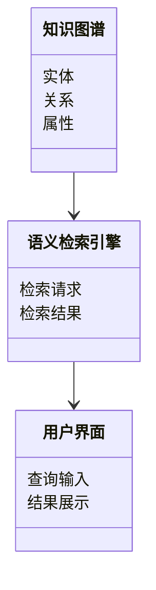
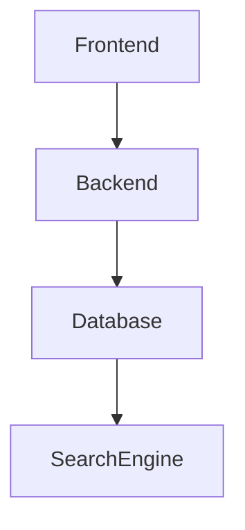

                 

# 构建智能企业知识管理平台：动态知识图谱与语义检索

> 关键词：知识管理平台、动态知识图谱、语义检索、企业知识管理、智能检索系统

> 摘要：  
> 本文深入探讨了智能企业知识管理平台的核心技术——动态知识图谱与语义检索。通过分析知识图谱的构建过程、动态更新机制以及语义检索的实现原理，结合实际案例和系统架构设计，为读者提供构建高效、智能的知识管理平台的完整解决方案。

---

## 第一章：知识管理的演变与动态知识图谱的背景

### 1.1 知识管理的演变

#### 1.1.1 从信息管理到知识管理的演进
信息管理阶段主要关注数据的存储与检索，而知识管理阶段注重对数据的深度理解和应用。企业通过知识管理可以将分散的信息转化为可复用的知识资产，从而提升竞争力。

#### 1.1.2 知识管理在企业中的重要性
知识管理帮助企业实现知识的共享、传承和创新，是提升企业效率和创新能力的关键。通过知识管理，企业可以更好地应对市场变化和技术革新。

#### 1.1.3 知识管理的挑战与机遇
知识管理的挑战包括数据孤岛、知识更新慢、语义理解不足等问题。而机遇则体现在人工智能和大数据技术的快速发展，为企业知识管理提供了新的技术手段。

### 1.2 知识图谱的概念与特点

#### 1.2.1 知识图谱的定义
知识图谱是一种以图结构表示知识的技术，通过实体和关系构建语义网络，能够有效地表示和组织复杂的知识。

#### 1.2.2 知识图谱的核心特点
知识图谱具有语义丰富性、可扩展性、动态性和结构化的特点。它能够将分散的数据整合为统一的知识体系，支持复杂的语义查询。

#### 1.2.3 知识图谱与传统数据库的区别
知识图谱通过语义关联建立实体之间的关系，而传统数据库主要关注数据的结构化存储和查询。知识图谱能够更好地支持语义理解和关联分析。

### 1.3 动态知识图谱的背景

#### 1.3.1 动态知识图谱的定义
动态知识图谱是一种能够实时更新和适应变化的知识表示方法，适用于知识快速变化的场景。

#### 1.3.2 动态知识图谱的应用场景
动态知识图谱广泛应用于实时新闻、社交媒体分析、实时客服等领域，能够快速响应数据的变化。

#### 1.3.3 动态知识图谱与静态知识图谱的对比
动态知识图谱具有实时更新、灵活性强的特点，而静态知识图谱则更适合数据相对稳定的场景。

### 1.4 语义检索的重要性

#### 1.4.1 语义检索的定义
语义检索是一种基于语义理解的检索技术，能够理解用户查询的意图，并返回与之语义相关的结果。

#### 1.4.2 语义检索的优势
语义检索能够克服传统关键字检索的局限性，提供更精准的结果，提升用户体验。

#### 1.4.3 语义检索在知识管理中的作用
语义检索是实现知识图谱价值的关键技术，能够帮助用户快速找到所需的知识。

---

## 第二章：动态知识图谱的核心概念与实现

### 2.1 知识图谱的构建过程

#### 2.1.1 数据抽取与清洗
通过爬取、API调用等方式获取数据，并进行去重、格式化等处理，确保数据质量。

#### 2.1.2 知识抽取与融合
利用自然语言处理技术从文本中提取实体、关系和属性，并进行冲突检测和数据融合。

#### 2.1.3 知识图谱的存储与管理
使用图数据库（如Neo4j）存储知识图谱，并设计合理的索引机制提升查询效率。

### 2.2 动态知识图谱的更新机制

#### 2.2.1 动态知识图谱的实时更新
通过流数据处理技术，实时更新知识图谱，确保知识的时效性。

#### 2.2.2 基于规则的动态更新
根据预设的规则检测数据变化，并触发知识图谱的更新。

#### 2.2.3 基于机器学习的动态更新
利用机器学习模型预测数据变化，并自动更新知识图谱。

### 2.3 语义检索的实现原理

#### 2.3.1 基于向量的语义检索
将文本映射为向量，通过计算向量相似度进行检索。例如，使用Word2Vec模型生成词向量。

#### 2.3.2 基于图结构的语义检索
通过图遍历算法（如BFS、DFS）在知识图谱中找到与查询相关的节点。

#### 2.3.3 混合式语义检索
结合向量和图结构的检索方法，提升检索的准确性和效率。

---

## 第三章：动态知识图谱与语义检索的数学模型

### 3.1 知识图谱的表示模型

#### 3.1.1 基于符号逻辑的知识表示
使用逻辑规则表示知识，例如：如果A→B，那么B→A。

#### 3.1.2 基于向量的知识表示
将实体和关系表示为向量，通过向量运算进行语义分析。

#### 3.1.3 基于图结构的知识表示
通过节点和边表示知识，构建语义网络。

### 3.2 动态知识图谱的更新模型

#### 3.2.1 基于冲突检测的更新模型
通过检测数据冲突，决定是否更新知识图谱。

#### 3.2.2 基于概率的更新模型
通过概率计算评估数据变化的可能性，触发知识图谱的更新。

#### 3.2.3 基于流数据的更新模型
实时处理流数据，动态更新知识图谱。

### 3.3 语义检索的数学模型

#### 3.3.1 基于余弦相似度的检索模型
计算查询向量与候选向量的余弦相似度，选择相似度最高的结果。

$$ \text{余弦相似度} = \frac{\vec{q} \cdot \vec{d}}{\|\vec{q}\| \cdot \|\vec{d}\|} $$

#### 3.3.2 基于马尔可夫链的检索模型
通过马尔可夫链建模语义关联，计算转移概率进行检索。

#### 3.3.3 基于图嵌入的检索模型
将知识图谱中的节点嵌入到低维空间，通过向量相似度进行检索。

---

## 第四章：动态知识图谱的构建算法

### 4.1 知识抽取算法

#### 4.1.1 基于规则的知识抽取
通过预设的规则从文本中提取实体和关系。

#### 4.1.2 基于模式匹配的知识抽取
利用正则表达式匹配特定模式，提取相关信息。

#### 4.1.3 基于深度学习的知识抽取
使用神经网络模型（如LSTM、BERT）进行实体识别和关系抽取。

### 4.2 知识融合算法

#### 4.2.1 基于冲突检测的知识融合
检测数据冲突并进行合并或舍弃。

#### 4.2.2 基于图结构的知识融合
通过图的合并操作，整合多个知识源的信息。

#### 4.2.3 基于机器学习的知识融合
利用机器学习模型预测知识融合的策略。

### 4.3 动态更新算法

#### 4.3.1 基于增量更新的动态知识图谱
仅更新变化的部分，减少计算开销。

#### 4.3.2 基于在线学习的动态知识图谱
实时更新模型参数，适应数据变化。

#### 4.3.3 基于流数据处理的动态知识图谱
通过流数据处理技术，实时更新知识图谱。

---

## 第五章：语义检索的实现算法

### 5.1 基于向量的语义检索

#### 5.1.1 基于Word2Vec的向量表示
使用Word2Vec模型生成词向量，进行语义相似度计算。

#### 5.1.2 基于BERT的向量表示
使用BERT模型生成上下文相关的向量表示。

#### 5.1.3 基于余弦相似度的检索
通过计算向量的余弦相似度，选择最相关的结果。

### 5.2 基于图结构的语义检索

#### 5.2.1 基于BFS的图遍历
从查询节点出发，广度优先搜索相关节点。

#### 5.2.2 基于DFS的图遍历
从查询节点出发，深度优先搜索相关节点。

#### 5.2.3 基于路径相似度的检索
计算查询节点与候选节点之间的路径相似度，选择相似度最高的结果。

---

## 第六章：系统分析与架构设计

### 6.1 问题场景介绍

#### 6.1.1 企业知识管理的痛点
知识分散、更新不及时、检索效率低等问题亟待解决。

#### 6.1.2 智能知识管理平台的功能需求
支持知识的动态更新、语义检索、知识共享等功能。

### 6.2 系统功能设计

#### 6.2.1 领域模型设计
使用Mermaid绘制类图，展示系统的核心实体和关系。

#### 6.2.2 系统架构设计
使用Mermaid绘制系统架构图，展示前端、后端和数据库的交互关系。

#### 6.2.3 接口设计
定义RESTful API接口，规范数据格式和交互流程。

#### 6.2.4 交互流程设计
使用Mermaid绘制交互序列图，展示用户与系统之间的交互过程。

---

## 第七章：项目实战与实现

### 7.1 环境安装

#### 7.1.1 安装开发环境
安装Python、Jupyter Notebook、pip等开发工具。

#### 7.1.2 安装依赖库
安装必要的库，如：networkx、numpy、scikit-learn等。

### 7.2 核心代码实现

#### 7.2.1 知识图谱构建代码
实现数据抽取、知识融合和图谱存储的代码。

#### 7.2.2 语义检索实现代码
实现基于向量的语义检索和基于图结构的语义检索的代码。

#### 7.2.3 系统接口实现
实现RESTful API接口，提供知识图谱的查询和更新功能。

### 7.3 案例分析与解读

#### 7.3.1 案例背景
选择一个具体的企业场景，例如企业内部知识共享平台。

#### 7.3.2 数据采集与处理
采集企业文档、邮件等数据，进行清洗和预处理。

#### 7.3.3 知识图谱构建
构建企业知识图谱，展示实体和关系。

#### 7.3.4 语义检索应用
实现语义检索功能，帮助用户快速找到所需知识。

### 7.4 项目总结

#### 7.4.1 项目成果
总结项目实现的功能和效果，评估系统的性能和用户体验。

#### 7.4.2 项目经验
分享项目中的经验教训，为后续开发提供参考。

---

## 第八章：最佳实践与未来展望

### 8.1 小结

#### 8.1.1 核心要点总结
总结动态知识图谱与语义检索的核心概念和技术。

#### 8.1.2 实际应用中的注意事项
在实际应用中，注意数据质量和算法优化，确保系统的稳定性和高效性。

### 8.2 注意事项

#### 8.2.1 数据质量的重要性
数据质量直接影响知识图谱的准确性和检索的效果。

#### 8.2.2 算法优化的必要性
通过优化算法提升检索效率和准确性。

#### 8.2.3 系统扩展性设计
在设计系统时，考虑未来的扩展性和可维护性。

### 8.3 拓展阅读

#### 8.3.1 推荐书籍
推荐几本与知识图谱和语义检索相关的书籍，供读者深入学习。

#### 8.3.2 推荐技术博客
推荐一些技术博客和开源项目，供读者进一步探索。

---

## 作者：AI天才研究院/AI Genius Institute & 禅与计算机程序设计艺术 /Zen And The Art of Computer Programming

---

以上是《构建智能企业知识管理平台：动态知识图谱与语义检索》的完整目录大纲和内容概述。如果需要进一步扩展或修改，请随时告知！

