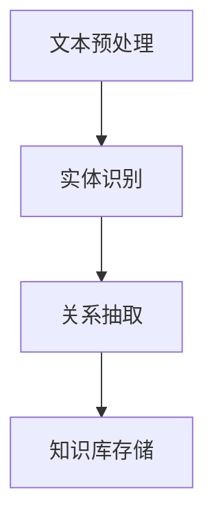
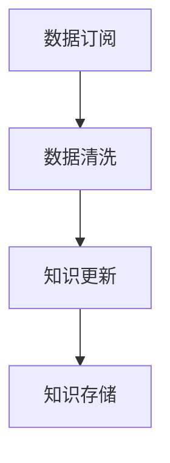
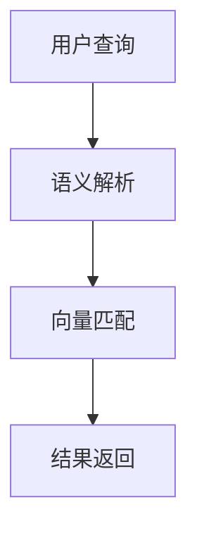
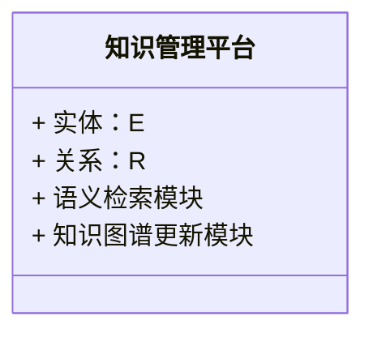
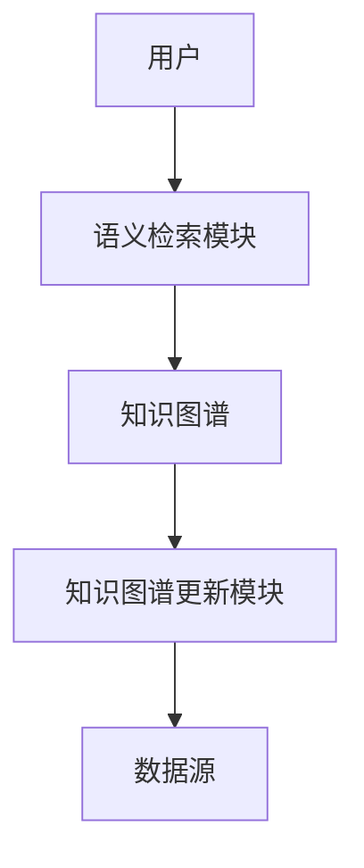

                 


# 构建智能企业知识管理平台：动态知识图谱与语义检索系统

> 关键词：知识管理平台、动态知识图谱、语义检索、知识抽取、知识图谱构建、语义理解

> 摘要：本文详细探讨了构建智能企业知识管理平台的核心技术，重点分析了动态知识图谱与语义检索系统的原理与实现。通过系统化的分析与实践，本文提出了构建智能知识管理平台的解决方案，涵盖了知识抽取、动态知识图谱构建、语义检索算法优化、系统架构设计等多个方面，并通过实际案例展示了平台的应用价值。本文适合技术人员、企业知识管理者以及对人工智能技术感兴趣的读者阅读。

---

# 第一部分：背景与核心概念

## 第1章：知识管理平台的背景与问题背景

### 1.1 知识管理平台的背景

#### 1.1.1 企业知识管理的重要性

在现代企业中，知识管理是提升竞争力的核心要素。企业通过有效管理和利用知识资源，可以显著提高决策效率、优化流程、增强创新能力。知识管理平台作为企业知识管理的重要工具，能够将分散的知识资源整合、存储和共享，为企业提供高效的知识服务。

#### 1.1.2 知识管理平台的定义与目标

知识管理平台（KMP）是一个支持企业知识创建、存储、组织、检索和应用的综合性平台。其目标是通过技术手段，将隐性知识显性化、显性知识系统化，从而实现知识的高效利用和价值最大化。

#### 1.1.3 知识管理平台的演进历程

知识管理平台经历了从简单的内容管理系统（如文档管理系统）到基于知识图谱的智能平台的演进。随着人工智能技术的发展，知识管理平台逐渐向智能化、动态化方向发展，形成了以动态知识图谱和语义检索为核心的第三代知识管理平台。

---

### 1.2 动态知识图谱的概念

#### 1.2.1 知识图谱的基本概念

知识图谱是一种以图结构形式表示知识的技术，由实体（概念）和关系组成，能够描述现实世界中的各种实体及其关系。知识图谱的核心目标是将分散的知识结构化、系统化，便于计算机理解和应用。

#### 1.2.2 动态知识图谱的特性

动态知识图谱是一种能够实时更新和演化的知识图谱，能够根据新的数据源或业务需求快速调整知识结构。其主要特性包括：

1. **实时性**：能够快速响应数据变化，保持知识的最新性。
2. **动态性**：支持在线更新和扩展，适应业务需求的变化。
3. **灵活性**：可以根据不同场景调整知识图谱的结构和内容。

#### 1.2.3 动态知识图谱与静态知识图谱的区别

| 特性                | 静态知识图谱              | 动态知识图谱              |
|---------------------|--------------------------|--------------------------|
| 数据更新方式        | 批次式更新，周期性维护    | 实时更新，动态调整        |
| 响应速度            | 较慢，适用于静态场景      | 较快，适用于动态场景      |
| 适用场景            | 知识相对稳定的领域        | 知识快速变化的领域        |

---

### 1.3 语义检索系统的核心作用

#### 1.3.1 传统检索与语义检索的对比

传统检索系统（如基于关键词的搜索引擎）依赖于关键词匹配，无法理解用户的真实意图。而语义检索系统基于知识图谱和语义理解技术，能够理解用户查询的语义，提供更精准的结果。

#### 1.3.2 语义检索的关键技术

1. **语义理解（NLP技术）**：通过自然语言处理技术理解用户查询的意图。
2. **知识图谱应用**：基于知识图谱的关系推理和语义匹配，提升检索精度。
3. **上下文理解**：结合上下文信息，提供更智能的检索结果。

#### 1.3.3 语义检索在企业中的应用价值

语义检索能够提高企业知识管理的效率，帮助员工快速找到所需信息，减少信息检索的时间成本，提升整体工作效率。

---

### 1.4 问题背景与问题描述

#### 1.4.1 传统知识管理平台的局限性

1. **数据孤岛问题**：各部门之间的知识分散，缺乏统一的管理平台。
2. **知识更新的滞后性**：传统知识图谱构建周期长，难以应对快速变化的业务需求。
3. **语义检索的不足**：基于关键词的检索方式难以满足用户的深层需求。

#### 1.4.2 动态知识图谱与语义检索的需求分析

1. **企业知识管理的动态性需求**：企业业务变化快，需要知识图谱能够实时更新。
2. **语义检索的精准性需求**：用户希望检索系统能够理解语义，提供更精准的结果。
3. **知识图谱的实时更新需求**：需要支持实时数据源的接入和知识图谱的动态更新。

#### 1.4.3 问题解决的思路与目标

1. **构建动态知识图谱**：通过实时数据源和动态更新机制，保持知识图谱的最新性。
2. **实现语义检索系统**：基于知识图谱和语义理解技术，提升检索的精准度。
3. **平台建设的总体目标**：打造一个智能化、动态化的知识管理平台，为企业提供高效的知识服务。

---

## 第2章：核心概念与联系

### 2.1 知识图谱的核心原理

#### 2.1.1 知识图谱的构成要素

知识图谱由**实体**（概念）和**关系**组成，例如“苹果是一家公司”，其中“苹果”是实体，“是”是关系。

#### 2.1.2 实体与关系的定义

- **实体**：知识图谱中的基本单元，可以是人、组织、产品等。
- **关系**：实体之间的关联，可以是“属于”、“包含”、“关联”等。

#### 2.1.3 知识图谱的构建流程

1. **知识抽取**：从文本中提取实体和关系。
2. **知识融合**：将多个数据源的知识进行整合，消除冲突。
3. **知识存储**：将结构化的知识存储到数据库中。
4. **知识更新**：根据新数据实时更新知识图谱。

---

### 2.2 动态知识图谱的特性与优势

#### 2.2.1 动态知识图谱的更新机制

动态知识图谱通过订阅实时数据源，定期检查数据变化，自动触发更新流程。

#### 2.2.2 动态知识图谱的实时性

动态知识图谱能够快速响应数据变化，确保知识的最新性。

#### 2.2.3 动态知识图谱的扩展性

动态知识图谱可以根据业务需求灵活扩展，支持新的实体和关系的添加。

---

### 2.3 语义检索系统的工作原理

#### 2.3.1 语义理解的基本概念

语义理解（Semantic Understanding）是通过自然语言处理技术，理解文本的深层含义。

#### 2.3.2 基于知识图谱的语义检索

语义检索系统通过分析用户查询的语义，匹配知识图谱中的相关实体和关系，返回最相关的结果。

#### 2.3.3 语义检索的实现流程

1. **用户查询**：用户输入查询关键词或语句。
2. **语义解析**：系统通过NLP技术解析用户的语义需求。
3. **知识图谱匹配**：根据语义需求，在知识图谱中匹配相关实体和关系。
4. **结果返回**：返回与用户需求最相关的知识结果。

---

### 2.4 核心概念的联系与对比

#### 2.4.1 知识图谱与语义检索的关系

知识图谱为语义检索提供了结构化的知识表示，语义检索基于知识图谱实现精准的语义匹配。

#### 2.4.2 动态知识图谱与静态知识图谱的对比

| 特性                | 静态知识图谱              | 动态知识图谱              |
|---------------------|--------------------------|--------------------------|
| 数据更新方式        | 批次式更新，周期性维护    | 实时更新，动态调整        |
| 响应速度            | 较慢，适用于静态场景      | 较快，适用于动态场景      |
| 适用场景            | 知识相对稳定的领域        | 知识快速变化的领域        |

---

## 第3章：核心概念的数学模型与公式

### 3.1 知识图谱的表示模型

#### 3.1.1 实体与关系的表示

知识图谱中的实体和关系可以表示为图结构，如下所示：

```
实体：E = {e1, e2, e3, ...}
关系：R = {r1, r2, r3, ...}
```

#### 3.1.2 基于向量空间模型的表示方法

向量空间模型将实体和关系表示为向量，如下所示：

$$ e_i = \vec{v}_i $$
$$ r_j = \vec{w}_j $$

#### 3.1.3 知识图谱的嵌入表示

知识图谱的嵌入表示通过将实体和关系映射到低维空间，降低计算复杂度。

---

### 3.2 动态知识图谱的更新模型

#### 3.2.1 实时更新的数学公式

动态知识图谱的实时更新可以通过以下公式表示：

$$ \Delta E = \Delta e_1 + \Delta e_2 + ... + \Delta e_n $$

其中，$\Delta e_i$ 表示第i个实体的更新量。

#### 3.2.2 基于概率的更新算法

动态知识图谱的更新可以基于概率模型，如下所示：

$$ P(e_i | r_j) = \frac{P(e_i) \cdot P(r_j | e_i)}{P(r_j)} $$

---

### 3.3 语义检索的算法模型

#### 3.3.1 基于余弦相似度的检索公式

余弦相似度用于衡量两个向量的相似程度：

$$ \cos\theta = \frac{\vec{a} \cdot \vec{b}}{|\vec{a}| |\vec{b}|} $$

---

## 第4章：核心算法的实现与流程图

### 4.1 知识抽取算法

#### 4.1.1 知识抽取的流程

知识抽取的流程如下：

1. 文本预处理：分词、句法分析。
2. 实体识别：识别文本中的实体。
3. 关系抽取：识别实体之间的关系。

#### 4.1.2 基于规则的知识抽取算法

基于规则的知识抽取算法通过预定义的规则匹配文本中的实体和关系。例如，使用正则表达式提取公司名称。

#### 4.1.3 知识抽取的流程图



---

### 4.2 动态知识图谱的构建算法

#### 4.2.1 动态知识图谱的构建流程

动态知识图谱的构建流程如下：

1. 数据源订阅：订阅实时数据源。
2. 数据清洗：清洗数据，去除无效信息。
3. 知识更新：根据新数据更新知识图谱。

#### 4.2.2 动态知识图谱的更新流程图



---

### 4.3 语义检索算法的实现

#### 4.3.1 基于向量匹配的检索算法

语义检索可以通过向量匹配实现，如下所示：

1. 用户查询：输入关键词或语句。
2. 语义解析：将查询转换为向量表示。
3. 向量匹配：在知识图谱中匹配最相似的向量。
4. 结果返回：返回匹配的结果。

#### 4.3.2 语义检索的流程图



---

## 第5章：系统分析与架构设计方案

### 5.1 问题场景介绍

#### 5.1.1 企业知识管理的痛点

企业知识管理中存在的主要痛点包括：

1. 数据分散，难以统一管理。
2. 知识更新不及时，无法应对快速变化的业务需求。
3. 语义检索能力不足，难以满足用户的深层需求。

#### 5.1.2 项目介绍

本项目旨在构建一个智能企业知识管理平台，基于动态知识图谱和语义检索技术，解决企业知识管理中的痛点。

---

### 5.2 系统功能设计

#### 5.2.1 领域模型

知识管理平台的领域模型如下：



#### 5.2.2 系统架构设计

知识管理平台的系统架构如下：



---

### 5.3 系统接口设计

#### 5.3.1 系统接口

1. **知识抽取接口**：从数据源抽取实体和关系。
2. **知识更新接口**：根据新数据更新知识图谱。
3. **语义检索接口**：根据用户查询返回相关知识。

#### 5.3.2 交互流程图


---

## 第6章：项目实战

### 6.1 环境安装

#### 6.1.1 系统环境

- 操作系统：Linux/Windows/MacOS
- 开发工具：Python、Jupyter Notebook
- 数据库：Neo4j（知识图谱数据库）
- 语言处理库：spaCy、jieba

#### 6.1.2 安装依赖

```bash
pip install neo4j python-dot neo4jupyter spacy jieba
```

---

### 6.2 系统核心实现源代码

#### 6.2.1 知识抽取代码

```python
import spacy

nlp = spacy.load("en_core_web_sm")

def extract_entities(text):
    doc = nlp(text)
    entities = []
    for ent in doc.ents:
        entities.append((ent.text, ent.label_))
    return entities

text = "Apple is a company."
print(extract_entities(text))
```

---

### 6.3 代码应用解读与分析

#### 6.3.1 知识抽取模块

知识抽取模块通过NLP工具从文本中提取实体和关系，存储到知识库中。

#### 6.3.2 知识图谱更新模块

知识图谱更新模块根据实时数据源更新知识图谱，确保知识的最新性。

#### 6.3.3 语义检索模块

语义检索模块通过向量匹配算法，在知识图谱中找到最相关的知识结果。

---

### 6.4 实际案例分析

#### 6.4.1 案例背景

某企业希望构建一个智能知识管理平台，用于管理公司内部的知识资产。

#### 6.4.2 案例分析

1. **知识抽取**：从公司文档中提取实体和关系。
2. **知识图谱构建**：将提取的知识构建为动态知识图谱。
3. **语义检索**：根据员工查询提供精准的知识结果。

---

## 第7章：总结与展望

### 7.1 项目总结

本项目通过构建动态知识图谱和语义检索系统，解决了企业知识管理中的痛点，提升了知识管理的效率和精准度。

### 7.2 未来展望

未来，知识管理平台将进一步智能化，结合更多人工智能技术，如深度学习、自然语言生成等，为企业提供更强大的知识管理能力。

---

## 附录

### 附录1：术语表

- **知识图谱**：一种以图结构形式表示知识的技术。
- **动态知识图谱**：能够实时更新和演化的知识图谱。
- **语义检索**：基于语义理解的检索技术。

### 附录2：参考文献

1. [1] 吴军. 《浪潮之巅》. 北京: 中信出版社, 2012.
2. [2] 王晓华. 《知识图谱构建与应用》. 北京: 清华大学出版社, 2020.

---

**作者：AI天才研究院/AI Genius Institute & 禅与计算机程序设计艺术/Zen And The Art of Computer Programming**

