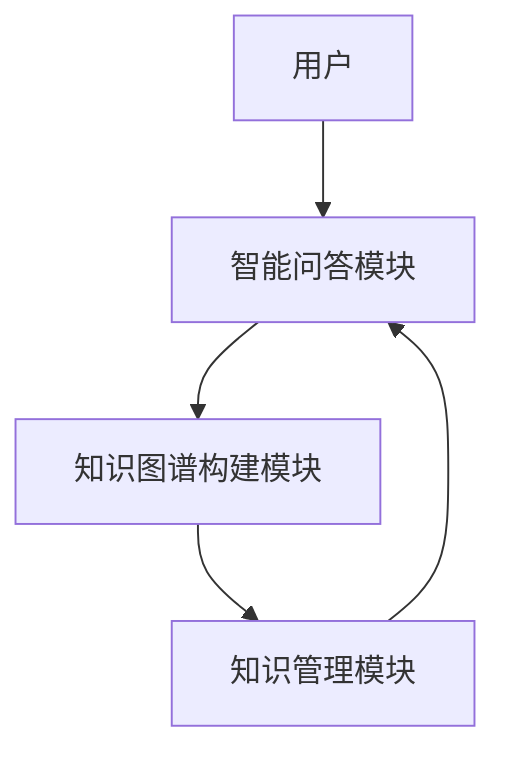

                 


# 构建智能企业知识管理平台：知识图谱与智能问答

## 关键词：知识图谱、智能问答、企业知识管理、自然语言处理、人工智能、系统架构

## 摘要：
随着企业规模的不断扩大，知识管理的重要性日益凸显。本文深入探讨了构建智能企业知识管理平台的核心技术——知识图谱与智能问答系统。首先，我们介绍了知识图谱的构建方法及其在智能问答中的应用，分析了知识图谱与智能问答的结合如何提升企业知识管理的效率和智能化水平。接着，我们详细讲解了智能问答系统的算法原理和实现方法，包括自然语言处理技术和对话管理策略。最后，我们通过实际项目案例展示了如何将知识图谱与智能问答系统集成到企业知识管理平台中，提供了系统的架构设计和优化建议。本文旨在为企业技术决策者和开发者提供理论支持和实践指导，帮助他们构建高效、智能的知识管理平台。

---

# 第1章 知识管理平台的背景与意义

## 1.1 企业知识管理的重要性

### 1.1.1 知识管理的定义与目标
知识管理（Knowledge Management）是指通过系统化的方法，对企业内外部知识进行采集、整理、存储、分析和应用的过程。其目标是将零散的知识转化为可共享、可复用的企业资产，提升企业的决策能力和竞争力。

### 1.1.2 知识管理在企业中的价值
- 提高知识利用率：通过系统化管理，避免知识孤岛，减少重复劳动。
- 促进知识传承：确保企业知识在员工流动中得以保留和传承。
- 支持快速决策：通过知识检索和分析，为决策提供实时支持。
- 降低运营成本：通过知识复用，减少重复工作，降低成本。

### 1.1.3 智能化知识管理的必要性
随着企业数据的爆炸式增长，传统的人工知识管理方式已无法满足需求。智能化知识管理通过引入人工智能技术，能够自动处理和分析海量数据，提取有价值的知识，实现知识的动态更新和智能检索。

---

## 1.2 知识图谱与智能问答的背景

### 1.2.1 知识图谱的起源与发展
知识图谱是一种以图结构形式表示知识的技术，起源于搜索引擎的需求。通过将实体及其关系表示为图中的节点和边，知识图谱能够提供语义丰富的知识表示，广泛应用于搜索引擎优化、智能问答等领域。

### 1.2.2 智能问答系统的演变
智能问答系统经历了从基于规则到基于检索，再到基于生成的演变过程：
1. **基于规则的问答系统**：通过预定义的规则匹配问题，适用于特定领域。
2. **基于检索的问答系统**：通过搜索引擎查找相似问题的答案，依赖大量训练数据。
3. **基于生成的问答系统**：利用自然语言处理模型生成回答，灵活性更高。

### 1.2.3 企业知识管理的新趋势
随着人工智能技术的成熟，企业知识管理正在向智能化、个性化方向发展。知识图谱和智能问答系统的结合，为企业提供了更高效的知识检索和交互方式。

---

## 1.3 本章小结
本章介绍了企业知识管理的重要性及其智能化发展的必要性，重点分析了知识图谱与智能问答系统在企业知识管理中的应用背景和价值。

---

# 第2章 知识图谱的核心概念与构建方法

## 2.1 知识图谱的定义与特点

### 2.1.1 知识图谱的定义
知识图谱是一种以图结构形式表示知识的技术，由节点（实体）和边（关系）组成，能够表示复杂的语义关系。

### 2.1.2 知识图谱的核心特点
- **语义丰富**：能够表示实体之间的多种关系。
- **动态更新**：支持实时更新，确保知识的准确性。
- **可扩展性**：适用于不同规模和领域。

---

## 2.2 知识图谱的构建流程

### 2.2.1 数据采集与预处理
- 数据来源：企业文档、数据库、外部知识库等。
- 数据清洗：去除噪声数据，提取有用信息。

### 2.2.2 实体识别与关系抽取
- 实体识别：通过自然语言处理技术，从文本中提取实体。
- 关系抽取：识别实体之间的关系，构建图结构。

### 2.2.3 知识图谱的存储与建模
- 数据存储：使用图数据库（如Neo4j）存储知识图谱。
- 建模：通过Schema设计图结构，定义节点和边的属性。

---

## 2.3 知识图谱的表示与推理

### 2.3.1 实体表示方法
- 使用节点表示实体，例如：`Company(公司)`、`Employee(员工)`。

### 2.3.2 关系表示方法
- 使用边表示实体之间的关系，例如：`属于(属于)`、`担任(担任)`、`管理(管理)`。

### 2.3.3 知识推理与应用
- 通过图遍历算法（如BFS、DFS）进行知识推理，例如：从“员工”节点出发，推理出“管理”关系。

---

## 2.4 本章小结
本章详细介绍了知识图谱的构建流程和核心概念，为后续章节的应用奠定了基础。

---

# 第3章 智能问答系统的核心技术

## 3.1 智能问答的基本原理

### 3.1.1 智能问答的定义与分类
智能问答系统是一种能够理解和回答自然语言问题的系统，分为基于规则、基于检索和基于生成三种类型。

### 3.1.2 自然语言处理技术
- 分词：将文本分割为词语或短语。
- 语义理解：通过词向量（如Word2Vec）理解问题含义。

### 3.1.3 对话管理与上下文理解
- 对话管理：通过状态机管理对话流程。
- 上下文理解：基于历史对话信息生成回答。

---

## 3.2 智能问答的关键技术

### 3.2.1 自然语言处理技术
- 分词：使用jieba库对中文文本进行分词。
- 语义理解：通过预训练模型（如BERT）进行问答生成。

### 3.2.2 模型训练与优化
- 模型训练：使用深度学习模型（如LSTM）进行问答训练。
- 模型优化：通过调参和数据增强提升模型性能。

### 3.2.3 对话管理与上下文理解
- 对话管理：通过状态机管理对话流程。
- 上下文理解：基于历史对话信息生成回答。

---

## 3.3 本章小结
本章重点介绍了智能问答系统的核心技术，包括自然语言处理、模型训练和对话管理等方面。

---

# 第4章 知识图谱与智能问答的结合

## 4.1 知识图谱在智能问答中的应用

### 4.1.1 知识图谱作为问答系统的知识库
- 知识图谱提供语义丰富的知识表示，支持智能问答系统的知识检索。

### 4.1.2 基于知识图谱的问答系统优势
- 提高问答的准确性：通过知识图谱的结构化知识，减少歧义。
- 支持复杂问题：能够处理多步推理的问题。

### 4.1.3 知识图谱与问答系统的结合案例
- 案例：基于知识图谱的公司组织架构问答系统。

---

## 4.2 基于知识图谱的智能问答实现

### 4.2.1 知识图谱的语义理解
- 通过实体识别和关系抽取，理解问题的语义。

### 4.2.2 基于知识图谱的问答生成
- 使用图遍历算法，从知识图谱中提取相关信息生成回答。

### 4.2.3 知识图谱的动态更新与维护
- 定期更新知识图谱，确保信息的准确性。

---

## 4.3 本章小结
本章探讨了知识图谱与智能问答系统的结合，分析了其在企业知识管理中的应用价值。

---

# 第5章 系统架构设计与实现

## 5.1 系统整体架构

### 5.1.1 系统模块划分
- 知识图谱构建模块
- 智能问答模块
- 知识管理模块

### 5.1.2 系统功能设计
- 知识图谱构建：数据采集、实体识别、关系抽取。
- 智能问答：问题理解、知识检索、回答生成。

### 5.1.3 系统架构图（Mermaid）



---

## 5.2 核心模块实现

### 5.2.1 知识图谱构建模块
- 数据预处理：清洗和结构化。
- 实体识别：使用自然语言处理技术识别实体。
- 关系抽取：通过模式匹配或深度学习模型抽取关系。

### 5.2.2 智能问答模块
- 问题理解：通过分词和语义分析理解问题。
- 知识检索：基于知识图谱进行语义匹配。
- 回答生成：根据检索结果生成回答。

### 5.2.3 知识管理模块
- 知识存储：使用图数据库存储知识图谱。
- 知识更新：定期更新知识图谱，确保信息的准确性。

---

## 5.3 系统接口设计

### 5.3.1 系统内部接口
- 智能问答模块与知识图谱构建模块之间的接口。
- 知识管理模块与智能问答模块之间的接口。

### 5.3.2 系统外部接口
- 用户通过API调用智能问答模块。

### 5.3.3 接口交互流程图（Mermaid）


---

## 5.4 本章小结
本章详细介绍了智能企业知识管理平台的系统架构设计与实现方法。

---

# 第6章 项目实战与优化

## 6.1 项目环境搭建

### 6.1.1 安装依赖
- 使用Python的`networkx`库进行知识图谱的构建。
- 使用`numpy`进行数据处理。

```bash
pip install networkx numpy
```

---

## 6.2 系统核心实现

### 6.2.1 知识图谱构建模块

```python
import networkx as nx

G = nx.Graph()
G.add_node("Company")
G.add_node("Employee")
G.add_edge("Company", "Employee", label="管理")
G.add_edge("Employee", "Position", label="担任")
```

### 6.2.2 智能问答模块

```python
def answer_question(question):
    # 实体识别
    entities = extract_entities(question)
    # 关系抽取
    relations = extract_relations(entities)
    # 知识检索
    answer = retrieve_answer(entities, relations)
    return answer
```

---

## 6.3 项目实战

### 6.3.1 案例分析
- 案例：基于知识图谱的公司组织架构问答系统。
- 实现步骤：
  1. 数据采集：收集公司组织架构数据。
  2. 实体识别：识别公司、员工、职位等实体。
  3. 关系抽取：抽取“管理”、“担任”等关系。
  4. 知识检索：根据问题检索相关知识。
  5. 回答生成：生成自然语言回答。

---

## 6.4 项目优化

### 6.4.1 性能优化
- 使用分布式存储优化知识图谱查询速度。
- 优化自然语言处理模型，提升问答系统的响应速度。

### 6.4.2 可扩展性优化
- 设计模块化架构，便于功能扩展。
- 支持多种数据源的接入。

---

## 6.5 本章小结
本章通过项目实战，详细讲解了智能企业知识管理平台的实现过程，并提出了优化建议。

---

# 第7章 总结与展望

## 7.1 总结
本文详细探讨了构建智能企业知识管理平台的核心技术——知识图谱与智能问答系统。通过理论分析和项目实战，展示了如何利用这些技术提升企业的知识管理水平。

## 7.2 展望
随着人工智能技术的不断发展，知识图谱与智能问答系统将在企业知识管理中发挥更大的作用。未来的研究方向包括：
- 更高效的图数据存储与查询技术。
- 更智能的问答生成算法。
- 更广泛的应用场景探索。

---

# 作者：AI天才研究院 & 禅与计算机程序设计艺术

