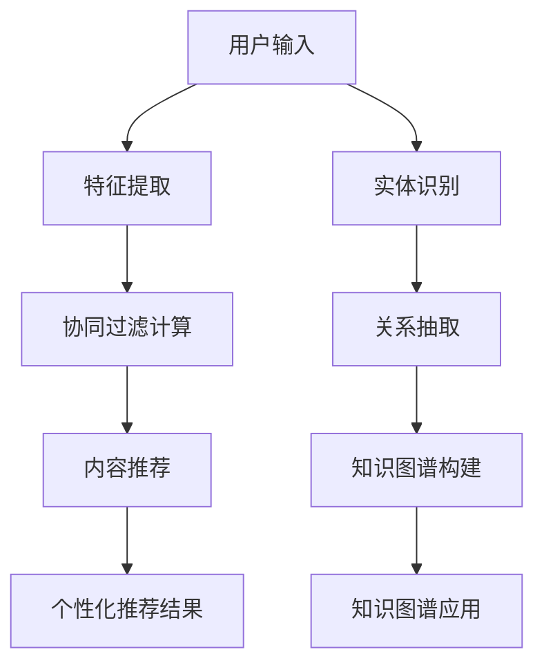
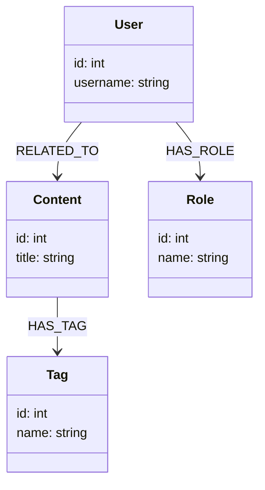
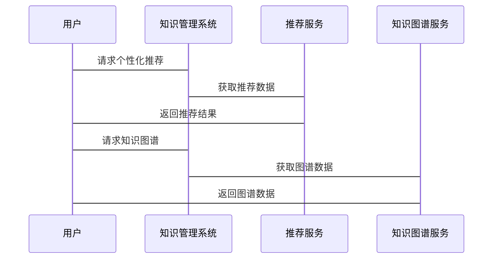

                 


# 构建智能企业知识管理系统：个性化推荐与知识图谱集成

## 关键词：智能企业知识管理系统，个性化推荐，知识图谱，协同过滤，实体识别

## 摘要：  
本文将详细介绍如何构建一个智能企业知识管理系统，重点探讨个性化推荐与知识图谱的集成。通过分析背景、核心概念、算法原理、系统架构以及项目实战，为读者提供一个从理论到实践的全面指南。我们将深入探讨协同过滤、基于内容的推荐算法，以及知识图谱的构建与应用，结合实际案例和代码实现，帮助读者理解并掌握构建智能知识管理系统的技能。

---

## 目录

### 第一部分: 智能企业知识管理系统的背景与核心概念

#### 第1章: 背景介绍与问题背景

##### 1.1 问题背景
- **1.1.1 知识管理在企业中的重要性**
  - 企业知识的分散与流失问题
  - 知识管理对企业效率和创新的提升作用
- **1.1.2 个性化推荐的需求驱动**
  - 用户行为分析与个性化需求
  - 知识管理系统中的推荐场景
- **1.1.3 知识图谱的技术推动**
  - 知识图谱在企业知识管理中的应用潜力

##### 1.2 问题描述
- **1.2.1 传统知识管理系统的局限性**
  - 知识分散、难以检索
  - 缺乏个性化服务能力
- **1.2.2 个性化推荐的挑战**
  - 数据稀疏性问题
  - 推荐算法的实时性与准确性平衡
- **1.2.3 知识图谱在企业中的应用痛点**
  - 数据质量与构建成本
  - 知识关联的复杂性

##### 1.3 问题解决与目标设定
- **1.3.1 智能企业知识管理系统的解决方案**
  - 统一的知识管理平台
  - 结合个性化推荐与知识图谱的技术融合
- **1.3.2 系统目标与核心功能**
  - 知识的高效存储与检索
  - 个性化推荐服务
  - 知识图谱的构建与可视化
- **1.3.3 边界与外延**
  - 系统的功能边界
  - 与其他系统的接口设计

##### 1.4 核心概念与结构
- **1.4.1 知识管理系统的组成要素**
  - 数据源、存储、检索引擎、用户界面
- **1.4.2 个性化推荐的实现机制**
  - 协同过滤、基于内容的推荐、混合推荐
- **1.4.3 知识图谱的构建与应用**
  - 实体识别、关系抽取、知识图谱存储

##### 1.5 本章小结
- 总结本章的核心内容，为后续章节奠定基础。

---

#### 第2章: 核心概念与联系

##### 2.1 个性化推荐的核心原理
- **2.1.1 协同过滤算法**
  - 基于用户的协同过滤与基于物品的协同过滤
  - 优缺点分析
- **2.1.2 基于内容的推荐算法**
  - 文本挖掘与特征提取
  - 内容相似度计算
- **2.1.3 混合推荐模型**
  - 协同过滤与内容推荐的结合

##### 2.2 知识图谱的构建与属性
- **2.2.1 知识图谱的定义与特点**
  - 实体、关系、属性三要素
  - 知识图谱的语义网络特性
- **2.2.2 实体识别与关系抽取**
  - 基于规则与机器学习的方法
  - 实体链接与消歧技术
- **2.2.3 知识图谱的存储与表示**
  - 图数据库（如Neo4j）与RDF存储
  - JSON-LD与知识图谱的序列化表示

##### 2.3 核心概念对比与联系
- **2.3.1 个性化推荐与知识图谱的对比分析**
  - 数据驱动 vs. 知识驱动
  - 推荐系统的实时性 vs. 知识图谱的静态性
- **2.3.2 核心概念属性对比表格**
  | 概念 | 属性 | 描述 |
  |------|------|------|
  | 个性化推荐 | 数据驱动 | 基于用户行为和偏好 |
  | 知识图谱 | 知识驱动 | 基于实体和关系的语义网络 |
- **2.3.3 ER实体关系图架构（Mermaid）**
```mermaid
erDiagram
    user {
        id INT
        username VARCHAR
        }
    content {
        id INT
        title VARCHAR
        }
    user.related_to.content{}{
        user_id INT
        content_id INT
        }
    user.has.role{}{
        user_id INT
        role VARCHAR
        }
    content.has.tag{}{
        content_id INT
        tag VARCHAR
        }
```

---

### 第3章: 算法原理与数学模型

#### 3.1 个性化推荐算法

##### 3.1.1 协同过滤算法
- **基于用户的协同过滤**
  - 相似度计算公式：$$sim(i,j) = \frac{\sum_{k} (r_{ik} - \bar{r_i})(r_{jk} - \bar{r_j})}{\sqrt{\sum_{k} (r_{ik} - \bar{r_i})^2} \cdot \sqrt{\sum_{k} (r_{jk} - \bar{r_j})^2}}$$
- **基于物品的协同过滤**
  - 相似度计算公式：$$sim(i,j) = \frac{\sum_{u} (r_{ui} - \bar{r_u})(r_{uj} - \bar{r_u})}{\sqrt{\sum_{u} (r_{ui} - \bar{r_u})^2} \cdot \sqrt{\sum_{u} (r_{uj} - \bar{r_u})^2}}$$

##### 3.1.2 基于内容的推荐算法
- **文本挖掘与特征提取**
  - TF-IDF、LSA、LDA等方法
- **内容相似度计算**
  - 使用余弦相似度：$$sim(text1, text2) = \frac{\sum_{i} text1_i \cdot text2_i}{\sqrt{\sum_{i} text1_i^2} \cdot \sqrt{\sum_{i} text2_i^2}}$$

##### 3.1.3 混合推荐模型
- **协同过滤与内容推荐的融合**
  - 混合推荐公式：$$score = \alpha \cdot score_{collaborative} + (1 - \alpha) \cdot score_{content}$$

#### 3.2 知识图谱构建算法

##### 3.2.1 实体识别与关系抽取
- **基于规则的实体识别**
  - 正则表达式、句法规则
- **基于机器学习的关系抽取**
  - 使用CRF、RNN、BERT等模型

##### 3.2.2 知识图谱构建的数学模型
- **实体表示**
  - 使用向量空间模型：$$vector(entity) = \sum_{w} word\_weight(w) \cdot vector(word)$$
- **关系表示**
  - 使用关系向量：$$vector(relation) = \sum_{w} word\_weight(w) \cdot vector(word)$$

#### 3.3 算法流程图（Mermaid）


---

#### 第4章: 系统分析与架构设计

##### 4.1 问题场景介绍
- **用户需求**
  - 知识检索、个性化推荐、知识可视化
- **系统目标**
  - 提供高效的知识管理、个性化推荐与知识图谱服务

##### 4.2 系统功能设计
- **领域模型（Mermaid 类图）**


##### 4.3 系统架构设计
- **分层架构**
  - 数据层：知识库、用户数据
  - 服务层：推荐服务、知识图谱服务
  - 表现层：用户界面、API接口

##### 4.4 系统接口设计
- **RESTful API**
  - `/api/recommendation`：获取个性化推荐
  - `/api/knowledge-graph`：获取知识图谱数据

##### 4.5 系统交互（Mermaid 序列图）


---

### 第5章: 项目实战

#### 5.1 环境安装
- **技术栈**
  - 前端：React/Vue.js
  - 后端：Python/Django
  - 数据库：MySQL/Neo4j
  - 推荐算法库：scikit-learn
  - 知识图谱库：NetworkX

#### 5.2 核心代码实现
##### 5.2.1 协同过滤算法实现
```python
import numpy as np

def collaborative_filtering(user_item_matrix):
    # 计算用户平均评分
    user_avg = np.mean(user_item_matrix, axis=1)
    # 计算物品平均评分
    item_avg = np.mean(user_item_matrix, axis=0)
    # 计算相似度矩阵
    similarity_matrix = np.zeros((user_item_matrix.shape[0], user_item_matrix.shape[0]))
    for i in range(user_item_matrix.shape[0]):
        for j in range(user_item_matrix.shape[0]):
            similarity_matrix[i][j] = np.dot((user_item_matrix[i] - user_avg[i]), (user_item_matrix[j] - user_avg[j]).T)
            similarity_matrix[i][j] /= (np.linalg.norm(user_item_matrix[i] - user_avg[i]) * np.linalg.norm(user_item_matrix[j] - user_avg[j]))
    return similarity_matrix
```

##### 5.2.2 知识图谱构建实现
```python
from networkx import *
import neo4j

def build_knowledge_graph(neo4j_uri, neo4j_user, neo4j_password):
    # 连接到Neo4j数据库
    graph = neo4j.Graph(neo4j_uri, neo4j_user, neo4j_password)
    # 创建节点和关系
    graph.run("CREATE (n:User {id: 1, name: 'Alice'})")
    graph.run("CREATE (n:Content {id: 1, title: 'Document 1'})")
    graph.run("MATCH (a:User {id:1}), (b:Content {id:1}) CREATE (a)-[r:RELATED_TO]->(b)")
```

#### 5.3 案例分析与总结
- **案例分析**
  - 知识管理系统在企业中的实际应用
  - 个性化推荐的效果评估
  - 知识图谱的可视化与分析
- **总结**
  - 系统实现的关键点
  - 遇到的问题及解决方案

---

### 第6章: 最佳实践与未来展望

#### 6.1 最佳实践
- **数据质量管理**
  - 数据清洗与预处理
  - 数据安全与隐私保护
- **系统优化**
  - 推荐算法的性能优化
  - 知识图谱的可扩展性设计
- **用户体验优化**
  - 推荐结果的可解释性
  - 知识图谱的交互设计

#### 6.2 小结
- 本文总结了构建智能企业知识管理系统的全过程
- 强调了个性化推荐与知识图谱的集成的重要性
- 为后续研究提供了方向和思路

#### 6.3 注意事项
- 数据隐私与合规性问题
- 系统的可扩展性与维护成本
- 用户反馈与系统优化

#### 6.4 拓展阅读
- 推荐系统领域的最新研究
- 知识图谱的深度学习应用
- 企业知识管理系统的前沿技术

---

## 作者：AI天才研究院 & 禅与计算机程序设计艺术

