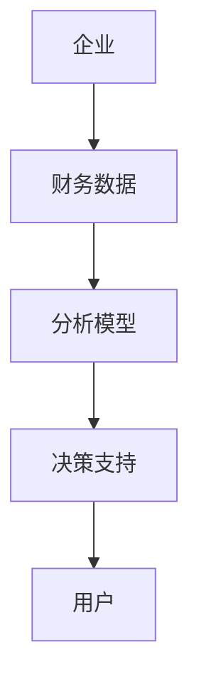
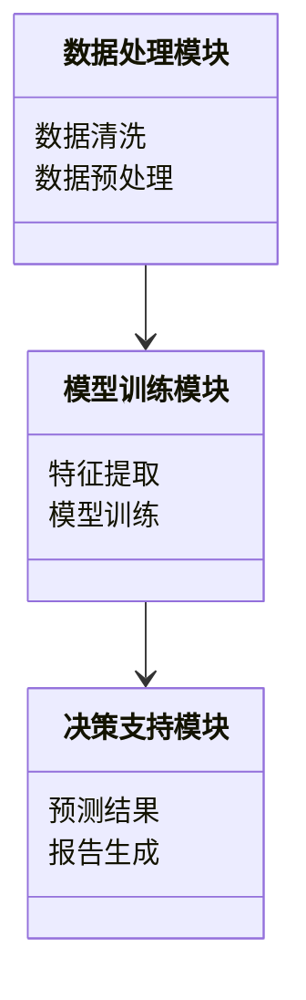
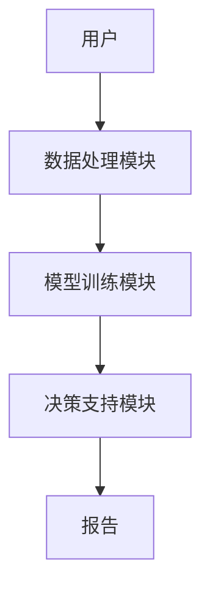
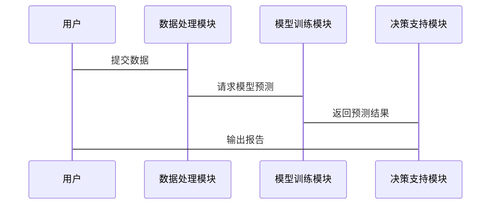

                 


# 构建智能企业财务分析系统：AI辅助决策支持

## 关键词：人工智能, 财务分析, 决策支持, 系统架构, 算法原理, 项目实战

## 摘要：  
随着企业数据的爆炸性增长和业务复杂性的增加，传统的财务分析方法逐渐暴露出效率低、精度差、实时性不足等问题。人工智能（AI）技术的引入为解决这些问题提供了新的可能性。本文将从背景介绍、核心概念、算法原理、系统架构设计、项目实战到最佳实践，全面解析如何构建一个智能企业财务分析系统。通过本文，读者可以了解如何利用AI技术提升企业的财务分析能力，从而实现更高效的决策支持。

---

## 第一章: 背景介绍

### 1.1 问题背景
传统的企业财务分析方法依赖于人工处理和统计分析，这种方法在数据量小、业务相对简单的情况下表现尚可。然而，随着企业规模的扩大和业务复杂性的增加，财务数据呈现爆炸式增长，传统的财务分析方法逐渐暴露出以下问题：

- **数据处理效率低**：人工处理大量财务数据耗时耗力，难以满足实时分析的需求。
- **分析精度有限**：传统统计方法难以捕捉数据中的非线性关系，分析结果的准确性不足。
- **缺乏智能化**：无法根据历史数据和实时数据自动调整分析策略，难以应对复杂的市场变化。

AI技术的引入，尤其是机器学习和深度学习技术，能够通过自动化处理、特征提取和模型优化，显著提升财务分析的效率和精度。AI技术还可以帮助企业在复杂市场环境中快速识别潜在风险和机会，从而实现更高效的决策支持。

### 1.2 问题描述
企业财务分析的核心目标是通过数据挖掘和分析，为管理层提供准确的财务信息和决策支持。然而，传统方法在以下几个方面存在明显不足：

- **数据预处理复杂**：财务数据通常来自多个系统，格式不一，且可能存在缺失或错误，人工处理效率低下。
- **分析模型单一**：传统财务分析方法通常依赖于固定的统计模型，难以应对复杂多变的业务场景。
- **决策支持滞后**：由于依赖人工分析，决策支持往往无法实时提供，导致企业错失市场机会或无法及时应对风险。

### 1.3 问题解决
引入AI技术后，企业财务分析系统可以通过以下方式解决问题：

- **自动化数据处理**：利用AI技术自动清洗和预处理财务数据，减少人工干预。
- **智能模型优化**：通过机器学习和深度学习算法，构建动态调整的分析模型，提高分析精度。
- **实时决策支持**：基于实时数据和模型预测，为企业提供快速的决策支持。

### 1.4 边界与外延
智能财务分析系统的边界主要集中在财务数据的处理、分析和决策支持模块。系统需要与企业的财务系统、业务系统以及其他数据分析工具进行交互。外延部分则包括数据来源的多样性、模型的可扩展性以及与企业其他系统的集成。

### 1.5 概念结构与核心要素组成
智能财务分析系统的核心要素包括：

- **数据源**：包括财务报表、交易数据、市场数据等。
- **分析模型**：包括机器学习模型、深度学习模型等。
- **决策支持模块**：根据分析结果生成决策建议。
- **用户界面**：提供直观的数据显示和交互界面。

---

## 第二章: 核心概念与联系

### 2.1 AI辅助财务分析的核心原理
AI辅助财务分析的核心原理包括数据预处理、特征提取、模型训练和结果解释四个步骤：

1. **数据预处理**：清洗数据，处理缺失值和异常值。
2. **特征提取**：从原始数据中提取有用的特征，例如销售额、利润等。
3. **模型训练**：利用机器学习算法训练模型，例如线性回归、决策树等。
4. **结果解释**：将模型输出的结果转化为易于理解的财务指标。

### 2.2 概念属性对比
以下表格对比了核心概念的属性：

| 概念 | 数据预处理 | 特征提取 | 模型训练 |
|------|------------|----------|----------|
| 目标 | 清洗数据    | 提取特征  | 训练模型  |
| 方法 | 填充缺失值  | 主成分分析 | 线性回归  |
| 输出 | 清洗后的数据 | 特征向量 | 模型权重 |

### 2.3 ER实体关系图
以下是一个简单的ER实体关系图：



---

## 第三章: 算法原理与实现

### 3.1 算法原理
#### 3.1.1 机器学习算法
机器学习算法广泛应用于财务分析，例如线性回归和决策树：

- **线性回归**：用于预测连续变量，例如股票价格。
- **决策树**：用于分类问题，例如财务风险分类。

#### 3.1.2 深度学习算法
深度学习算法在处理复杂数据时表现优异，例如神经网络：

- **神经网络**：用于处理非线性关系，例如市场趋势预测。

### 3.2 算法实现
以下是一个简单的线性回归实现：

```python
import numpy as np
from sklearn.linear_model import LinearRegression

# 生成数据
X = np.array([1, 2, 3, 4, 5]).reshape(-1, 1)
y = np.array([2, 4, 5, 4, 5])

# 训练模型
model = LinearRegression()
model.fit(X, y)

# 预测
print(model.predict([[6]]))
```

线性回归的数学模型为：

$$ y = \beta_0 + \beta_1 x + \epsilon $$

其中，$$ \beta_0 $$ 是截距，$$ \beta_1 $$ 是斜率，$$ \epsilon $$ 是误差项。

### 3.3 算法优化
优化算法是提升模型性能的关键，常用的方法包括梯度下降和Adam优化器。

#### 3.3.1 梯度下降
梯度下降的数学公式为：

$$ \theta = \theta - \alpha \cdot \nabla J(\theta) $$

其中，$$ \theta $$ 是参数，$$ \alpha $$ 是学习率，$$ \nabla J(\theta) $$ 是损失函数的梯度。

#### 3.3.2 Adam优化器
Adam优化器结合了动量和自适应学习率，公式如下：

$$ m_t = \beta_1 m_{t-1} + (1 - \beta_1) g_t $$
$$ v_t = \beta_2 v_{t-1} + (1 - \beta_2) g_t^2 $$
$$ \theta_t = \theta_{t-1} - \alpha \frac{m_t}{\sqrt{v_t} + \epsilon} $$

---

## 第四章: 系统分析与架构设计方案

### 4.1 问题场景介绍
企业财务分析系统需要处理以下场景：

- **数据处理**：清洗和预处理财务数据。
- **模型训练**：训练预测模型。
- **决策支持**：生成财务分析报告。

### 4.2 项目介绍
本项目旨在构建一个基于AI的企业财务分析系统，实现以下功能：

- **数据处理模块**：清洗和预处理财务数据。
- **模型训练模块**：训练预测模型。
- **决策支持模块**：生成财务分析报告。

### 4.3 系统功能设计
以下是系统功能设计的领域模型图：



### 4.4 系统架构设计
以下是系统架构设计的Mermaid图：



### 4.5 系统接口设计
系统接口设计包括以下内容：

- **数据输入接口**：接收财务数据。
- **模型调用接口**：调用训练好的模型进行预测。
- **报告输出接口**：输出财务分析报告。

### 4.6 系统交互设计
以下是系统交互的Mermaid序列图：



---

## 第五章: 项目实战

### 5.1 环境安装
以下是如何安装环境的步骤：

1. 安装Python和必要的库：
   ```bash
   pip install numpy scikit-learn
   ```

2. 安装TensorFlow：
   ```bash
   pip install tensorflow
   ```

### 5.2 系统核心实现
以下是核心代码实现：

```python
import numpy as np
from sklearn.linear_model import LinearRegression

# 数据处理
X = np.array([1, 2, 3, 4, 5]).reshape(-1, 1)
y = np.array([2, 4, 5, 4, 5])

# 模型训练
model = LinearRegression()
model.fit(X, y)

# 预测
print(model.predict([[6]]))
```

### 5.3 代码解读
1. **数据处理**：将数据转换为适合模型输入的格式。
2. **模型训练**：使用线性回归模型训练数据。
3. **预测**：使用训练好的模型进行预测。

### 5.4 实际案例分析
假设我们有一个企业的销售数据，我们可以使用线性回归模型预测未来的销售额。

### 5.5 项目小结
通过本项目，我们了解了如何利用AI技术构建企业财务分析系统。通过数据处理、模型训练和预测，我们可以实现高效的财务分析和决策支持。

---

## 第六章: 最佳实践

### 6.1 小结
通过本文，我们了解了如何构建智能企业财务分析系统。通过AI技术，我们可以提升财务分析的效率和精度，实现更高效的决策支持。

### 6.2 注意事项
- 数据安全：确保财务数据的安全性。
- 模型优化：定期优化模型以适应新的数据和业务需求。
- 可解释性：确保模型的可解释性，以便更好地理解分析结果。

### 6.3 拓展阅读
- 《机器学习实战》
- 《深度学习》
- 《Python机器学习》

---

## 作者：AI天才研究院/AI Genius Institute & 禅与计算机程序设计艺术 /Zen And The Art of Computer Programming

