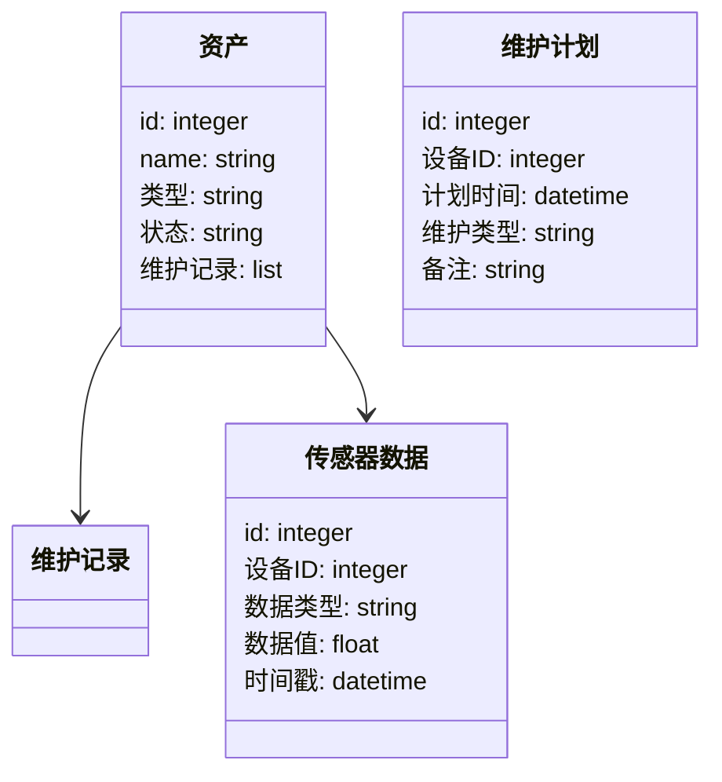

                 


# 构建智能企业资产管理平台：全生命周期优化与预测性维护

## 关键词：智能资产管理，预测性维护，全生命周期管理，机器学习，深度学习

## 摘要：  
随着企业数字化转型的加速，资产管理的智能化需求日益迫切。本文章深入探讨了如何构建一个智能企业资产管理平台，涵盖资产的全生命周期管理，并结合预测性维护技术，实现对企业资产的高效管理和优化。通过分析预测性维护的核心算法、系统架构设计以及项目实战，本文为读者提供了从理论到实践的全面指导，助力企业在资产管理领域实现智能化升级。

---

# 第1章 企业资产管理平台的背景与挑战

## 1.1 企业资产管理的重要性

### 1.1.1 资产管理的核心概念  
企业资产管理（Enterprise Asset Management，EAM）是指对企业所有资产（如设备、工具、建筑物等）进行规划、控制和优化的过程，旨在提高资产利用率、降低维护成本并延长资产寿命。  

### 1.1.2 传统资产管理的局限性  
传统的资产管理方式通常依赖人工记录和维护，存在以下问题：  
- 数据分散，缺乏统一的管理平台；  
- 维护计划不精准，导致维护成本高且效率低；  
- 缺乏预测能力，无法及时发现潜在故障；  
- 资产利用率难以量化，无法支持决策优化。  

### 1.1.3 数字化转型对资产管理的影响  
随着工业4.0和物联网（IoT）的兴起，企业资产管理正在从传统的被动维护向主动优化转变。通过数字化技术，企业可以实时监控资产状态，利用大数据和人工智能（AI）进行预测性维护，从而实现更高效的资产管理。

---

## 1.2 智能化资产管理的需求

### 1.2.1 预测性维护的必要性  
预测性维护是通过实时监测资产的状态数据（如温度、振动、压力等），利用算法预测设备的健康状况，从而提前安排维护计划。这种方式可以显著降低 unplanned downtime（非计划停机）的风险，提高资产可用性。

### 1.2.2 全生命周期管理的挑战  
资产的全生命周期管理包括从采购、使用到报废的整个过程。智能化的全生命周期管理需要整合多个部门的数据，协调各个阶段的管理流程，确保资产在整个生命周期内的高效利用。

### 1.2.3 企业资产管理的未来趋势  
未来的资产管理将更加依赖人工智能和大数据技术，通过智能化的预测性维护和优化算法，实现资产的主动管理，进一步提升企业的运营效率。

---

## 1.3 本章小结  
本章介绍了企业资产管理的重要性，分析了传统资产管理的局限性，并提出了智能化资产管理的需求。通过预测性维护和全生命周期管理，企业可以显著提高资产的利用率和可靠性，降低维护成本，从而在数字化转型中获得竞争优势。

---

# 第2章 智能企业资产管理平台的定义与特点

## 2.1 智能企业资产管理平台的定义  
智能企业资产管理平台是一个基于数字化技术的综合管理平台，通过整合物联网、大数据和人工智能技术，实现对企业资产的全生命周期管理。该平台不仅可以实时监控资产状态，还能通过预测性维护减少设备故障，优化维护计划。

## 2.2 平台的核心功能

### 2.2.1 资产数据管理  
- 支持多源数据的采集与整合，包括设备传感器数据、维护记录等；  
- 提供数据存储、查询和分析功能，支持决策优化。  

### 2.2.2 预测性维护  
- 基于机器学习算法，预测设备的健康状态；  
- 自动生成维护计划，减少 unplanned downtime。  

### 2.2.3 资产全生命周期管理  
- 跟踪资产从采购到报废的整个生命周期；  
- 提供资产利用率分析和成本优化建议。  

## 2.3 与传统资产管理的区别  

| **方面**         | **传统资产管理**                     | **智能资产管理**                     |
|------------------|------------------------------------|------------------------------------|
| 数据采集方式     | 人工记录，数据分散                 | 实时采集，数据集中                 |
| 维护方式         | 被动响应故障                       | 主动预测维护                       |
| 管理范围         | 单一阶段管理                       | 全生命周期管理                     |
| 技术基础         | 无数字化技术支持                   | 基于物联网、大数据和AI技术         |

## 2.4 本章小结  
本章详细定义了智能企业资产管理平台，并通过对比分析，突出了其与传统资产管理的区别。智能资产管理平台通过数字化技术实现了资产的高效管理和优化，为企业提供了更强大的竞争力。

---

# 第3章 预测性维护的核心算法

## 3.1 预测性维护的定义与分类

### 3.1.1 预测性维护的定义  
预测性维护是通过分析设备的历史数据和实时数据，预测设备的健康状态，从而提前安排维护工作的一种方法。

### 3.1.2 预测性维护的分类  
- 基于时间的预测性维护：根据设备的使用时间安排定期维护；  
- 基于条件的预测性维护：根据设备的状态数据动态调整维护计划。  

---

## 3.2 常见的预测性维护算法

### 3.2.1 基于机器学习的算法  
- 线性回归：用于预测设备的剩余寿命；  
- 支持向量机（SVM）：用于分类设备的健康状态；  
- 随机森林：用于处理复杂的设备状态数据。  

### 3.2.2 基于深度学习的算法  
- 循序神经网络（RNN）：用于处理时间序列数据；  
- 卷积神经网络（CNN）：用于分析设备的图像数据。  

### 3.2.3 统计分析方法  
- 方差分析：用于识别设备状态的波动性；  
- 自回归积分滑动平均模型（ARIMA）：用于预测设备的运行状态。  

---

## 3.3 算法实现的步骤

### 3.3.1 数据采集与预处理  
- 采集设备的传感器数据（如温度、振动、压力等）；  
- 对数据进行清洗和归一化处理，确保数据质量。  

### 3.3.2 模型训练与优化  
- 选择合适的算法，训练预测模型；  
- 调整模型参数，优化预测精度。  

### 3.3.3 模型部署与应用  
- 将模型部署到企业资产管理平台中；  
- 实时监控设备状态，触发维护任务。  

---

## 3.4 算法的优缺点对比

| **算法**       | **优点**                           | **缺点**                           |
|----------------|--------------------------------|--------------------------------|
| 机器学习       | 简单易用，适合中小规模数据       | 对复杂数据的处理能力有限           |
| 深度学习       | 处理能力强，适合大规模数据       | 计算资源消耗高，训练时间长           |
| 统计分析       | 方法简单，易于解释               | 预测精度较低，适用于简单场景           |

---

## 3.5 本章小结  
本章介绍了预测性维护的核心算法，包括机器学习和深度学习算法，以及统计分析方法。通过对比分析，帮助读者选择适合企业需求的算法，并了解其优缺点。

---

# 第4章 系统分析与架构设计

## 4.1 问题场景介绍  
本章将从实际的企业资产管理场景出发，分析系统的需求和目标。  

---

## 4.2 系统功能设计  

### 4.2.1 领域模型设计  
以下是领域模型的Mermaid类图：



---

### 4.2.2 系统架构设计  
以下是系统的架构图：


---

## 4.3 接口设计与交互流程  

### 4.3.1 接口设计  
以下是系统的主要接口：

- 数据采集接口：用于接收传感器数据；  
- 数据存储接口：用于存储资产信息和维护记录；  
- 数据处理接口：用于运行预测模型；  
- 用户界面接口：用于展示维护计划和资产状态。  

---

## 4.4 本章小结  
本章通过问题场景分析，设计了系统的功能模块和架构，并展示了接口设计和交互流程。这些设计为后续的系统实现奠定了基础。

---

# 第5章 项目实战

## 5.1 环境安装  

### 5.1.1 系统需求  
- 操作系统：Windows 10 或更高版本，或 Linux 系统；  
- Python 3.8 或更高版本；  
- 数据库：MySQL 或 PostgreSQL；  
- 开发工具：PyCharm 或 VS Code。  

### 5.1.2 安装依赖  
```bash
pip install numpy pandas scikit-learn matplotlib
```

---

## 5.2 核心代码实现  

### 5.2.1 数据采集与预处理  
```python
import pandas as pd
import numpy as np

# 读取传感器数据
data = pd.read_csv('sensor_data.csv')

# 数据清洗
data.dropna(inplace=True)
data = data[~data['value'].isin([0])]  # 去除异常值
```

### 5.2.2 模型训练与预测  
```python
from sklearn.ensemble import RandomForestClassifier
from sklearn.metrics import accuracy_score

# 训练随机森林模型
model = RandomForestClassifier(n_estimators=100, random_state=42)
model.fit(X_train, y_train)

# 预测设备状态
y_pred = model.predict(X_test)
print("预测准确率:", accuracy_score(y_test, y_pred))
```

---

## 5.3 项目总结  
本章通过具体的项目实战，展示了如何在企业资产管理平台中实现预测性维护功能。从环境安装到代码实现，读者可以逐步掌握系统的开发流程。

---

# 第6章 最佳实践与总结

## 6.1 小结  
本文详细介绍了智能企业资产管理平台的构建过程，包括背景、核心概念、算法原理、系统架构和项目实战。通过这些内容，读者可以全面了解如何利用智能化技术优化企业的资产管理。

---

## 6.2 注意事项  
- 数据的准确性和完整性对模型的性能影响很大，需确保数据采集和预处理的正确性；  
- 在实际应用中，需根据企业的具体需求选择合适的算法，并进行参数调优；  
- 系统的安全性和稳定性是平台成功运行的关键，需重视系统的容错设计和日志管理。  

---

## 6.3 拓展阅读  
- 《机器学习实战》  
- 《深度学习入门：基于Python和Keras》  
- 《企业资产管理：理论与实践》  

---

# 作者：AI天才研究院 & 禅与计算机程序设计艺术

---

感谢您的阅读！如需进一步探讨或合作，请随时联系！

