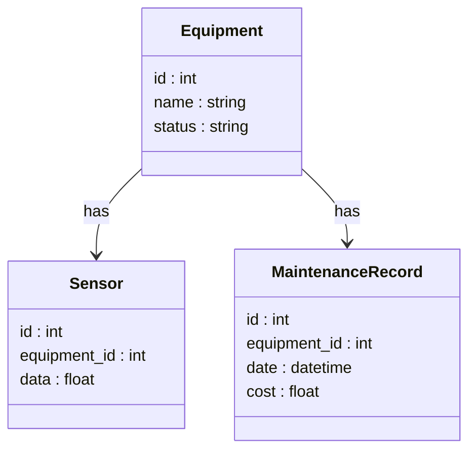
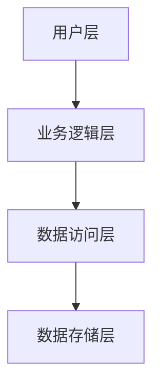
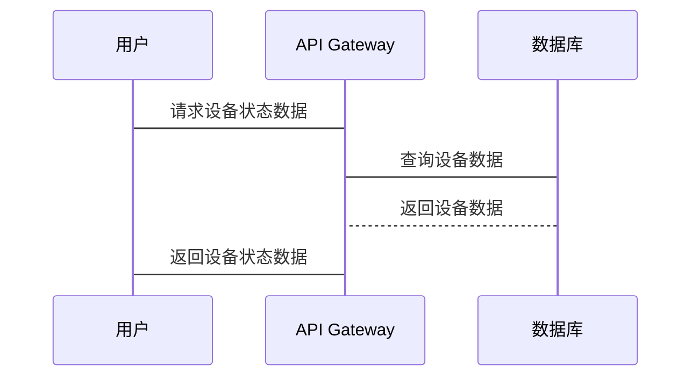

                 


```markdown
# 构建智能企业资产管理平台：全生命周期优化与预测性维护系统

> 关键词：智能企业资产管理，预测性维护，全生命周期优化，物联网技术，机器学习，系统架构设计

> 摘要：本文详细探讨了构建智能企业资产管理平台的核心概念、技术实现和系统设计。从资产管理的背景与挑战出发，深入分析了预测性维护的算法原理和全生命周期优化的实现方法。通过实际案例和系统架构设计，展示了如何利用物联网技术和机器学习算法提升企业资产管理的效率和智能化水平。

---

# 第一部分: 背景介绍

## 第1章: 企业资产管理的现状与挑战

### 1.1 传统资产管理的痛点
#### 1.1.1 资产管理的低效性
- 资产数据分散，难以统一管理
- 缺乏实时监控，导致维护滞后
- 资产利用率低，资源浪费严重

#### 1.1.2 传统维护模式的局限性
- 计划性维护的盲目性
- 突发性故障的高成本
- 维护周期长，影响企业运营

### 1.2 预测性维护的兴起
#### 1.2.1 预测性维护的基本概念
- 基于实时数据的预测性维护
- 利用机器学习算法预测设备故障

#### 1.2.2 预测性维护的优势
- 减少停机时间
- 降低维护成本
- 提高设备利用率

## 第2章: 全生命周期优化

### 2.1 资产管理的全生命周期
#### 2.1.1 资产管理的定义与范围
- 从采购到报废的全生命周期管理
- 各阶段的管理目标与关键指标

#### 2.1.2 全生命周期管理的必要性
- 提高资产利用率
- 优化维护计划
- 降低运营成本

### 2.2 全生命周期优化的核心要素
#### 2.2.1 数据采集与分析
- 多源数据的采集与整合
- 数据分析与决策支持

#### 2.2.2 优化算法的应用
- 基于机器学习的优化算法
- 运筹学方法在资产管理中的应用

---

# 第二部分: 核心概念与联系

## 第3章: 预测性维护的原理与应用

### 3.1 预测性维护的核心原理
#### 3.1.1 数据驱动的预测模型
- 时间序列分析
- 基于机器学习的回归分析

#### 3.1.2 预测性维护的实现步骤
1. 数据采集与预处理
2. 模型训练与优化
3. 预测结果的应用

### 3.2 预测性维护的实体关系图

```mermaid
erDiagram
    Equipment : 设备
    Sensor : 传感器
    MaintenanceRecord : 维护记录
    FailurePrediction : 故障预测
    Equipment --> Sensor : 配置
    Sensor --> MaintenanceRecord : 数据输入
    MaintenanceRecord --> FailurePrediction : 预测依据
```

---

## 第4章: 全生命周期优化与预测性维护的关系

### 4.1 全生命周期管理中的预测性维护
#### 4.1.1 预测性维护在设备寿命周期中的位置
- 设备运行阶段的预测性维护
- 设备维护阶段的优化决策

### 4.2 优化算法在全生命周期中的应用
#### 4.2.1 基于遗传算法的优化
- 设备维护计划的优化
- 资源分配的优化

#### 4.2.2 基于神经网络的预测模型
- 设备健康状态的预测
- 维护成本的预测与优化

---

# 第三部分: 算法原理与实现

## 第5章: 预测性维护的算法实现

### 5.1 线性回归模型
#### 5.1.1 线性回归的基本原理
- 模型假设
- 最小二乘法求解

#### 5.1.2 线性回归的实现步骤
1. 数据预处理
2. 模型训练
3. 模型评估与优化

#### 5.1.3 线性回归的Python实现
```python
import numpy as np
from sklearn.linear_model import LinearRegression

# 示例数据
X = np.array([[1], [2], [3], [4], [5]])
y = np.array([2, 4, 5, 4, 6])

# 模型训练
model = LinearRegression()
model.fit(X, y)

# 预测
print(model.predict([[6]]))  # 输出：[[7.8]]
```

### 5.2 时间序列分析
#### 5.2.1 时间序列分析的基本概念
- 时间序列的组成
- 常见的时间序列模型（ARIMA, LSTM）

#### 5.2.2 时间序列分析的应用
- 设备故障预测
- 维护周期预测

---

## 第6章: 基于机器学习的优化算法

### 6.1 支持向量机（SVM）
#### 6.1.1 SVM的基本原理
- 支持向量的概念
- 超平面的构建

#### 6.1.2 SVM在资产管理中的应用
- 设备状态分类
- 故障预测

### 6.2 神经网络
#### 6.2.1 神经网络的基本结构
- 输入层、隐藏层、输出层
- 激活函数的选择

#### 6.2.2 神经网络的训练过程
- 前向传播
- 反向传播与梯度下降

#### 6.2.3 神经网络的Python实现
```python
import tensorflow as tf
import numpy as np

# 示例数据
X = np.random.random((100, 784))
y = np.random.random((100, 10))

# 模型定义
model = tf.keras.Sequential([
    tf.keras.layers.Dense(32, activation='relu', input_shape=(784,)),
    tf.keras.layers.Dense(10, activation='softmax')
])

# 模型训练
model.compile(optimizer='adam', loss='sparse_categorical_crossentropy', metrics=['accuracy'])
model.fit(X, y, epochs=5)
```

---

# 第四部分: 系统分析与架构设计

## 第7章: 系统架构设计

### 7.1 问题场景介绍
#### 7.1.1 企业资产管理的典型问题
- 设备故障频繁
- 维护成本高昂
- 资产利用率低

### 7.2 系统功能设计
#### 7.2.1 领域模型类图


### 7.3 系统架构设计
#### 7.3.1 分层架构图


#### 7.3.2 接口设计
- RESTful API接口
- WebSocket实时通信接口

### 7.4 系统交互流程


---

# 第五部分: 项目实战

## 第8章: 项目实战与实现

### 8.1 环境安装与配置
#### 8.1.1 Python环境的安装
- 安装Python 3.8及以上版本
- 安装必要的库（numpy, pandas, scikit-learn, tensorflow）

#### 8.1.2 数据库的搭建
- 使用MySQL或MongoDB存储设备数据

### 8.2 核心功能实现
#### 8.2.1 数据采集模块
```python
import serial

# 串口数据采集
ser = serial.Serial('COM3', 9600)
while True:
    data = ser.readline().decode()
    print(data)
```

#### 8.2.2 预测性维护模块
```python
from sklearn.ensemble import RandomForestRegressor

# 训练预测模型
model = RandomForestRegressor(n_estimators=100)
model.fit(X_train, y_train)

# 预测设备故障概率
y_pred = model.predict(X_test)
```

### 8.3 实际案例分析
#### 8.3.1 案例背景
- 某制造企业设备的故障预测与维护

#### 8.3.2 数据分析与建模
- 数据清洗与特征工程
- 模型训练与验证

#### 8.3.3 模型部署与应用
- 将模型部署到生产环境
- 实时监控设备状态

---

# 第六部分: 最佳实践与总结

## 第9章: 最佳实践与总结

### 9.1 小结
- 预测性维护的优势与挑战
- 全生命周期优化的重要性

### 9.2 注意事项
- 数据质量的重要性
- 模型的可解释性
- 系统的可扩展性

### 9.3 拓展阅读
- 《机器学习实战》
- 《软件体系结构设计》
- 《物联网技术与应用》

---

作者：AI天才研究院/AI Genius Institute & 禅与计算机程序设计艺术 /Zen And The Art of Computer Programming
```

