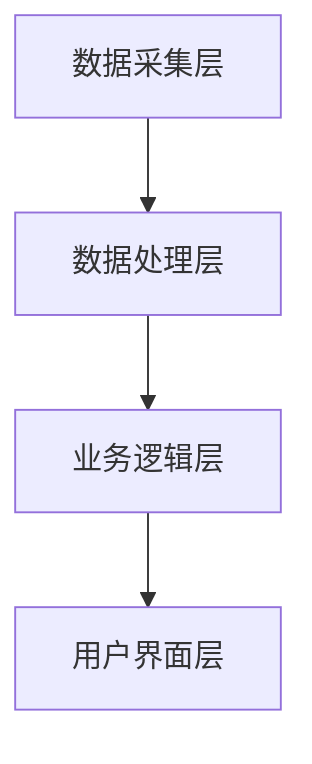
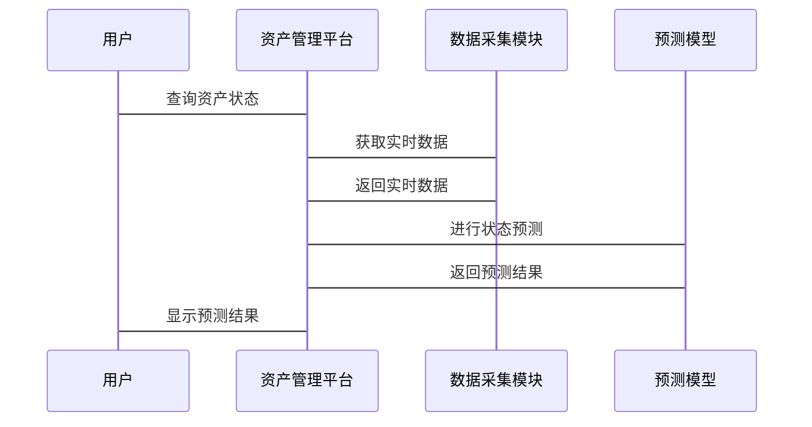

                 


# 构建智能企业资产管理平台：全生命周期成本优化与预测性维护

## 关键词：
智能企业资产管理，预测性维护，全生命周期管理，成本优化，机器学习，物联网，大数据分析

## 摘要：
本文深入探讨了智能企业资产管理平台的构建过程，重点分析了资产全生命周期管理、预测性维护及成本优化的核心技术与实现方法。通过结合物联网、大数据和人工智能等技术，文章详细阐述了如何利用先进的算法模型实现资产状态监测、故障预测和成本优化，从而帮助企业提升运营效率和降低成本。本文还提供了实际项目实战案例，帮助读者理解如何将理论应用于实践。

---

# 第一部分: 智能企业资产管理平台概述

## 第1章: 企业资产管理平台的背景与挑战

### 1.1 企业资产管理的背景

#### 1.1.1 传统资产管理的局限性
传统的资产管理方式通常依赖人工记录和局部信息化工具，存在数据分散、信息孤岛、维护成本高等问题。企业资产的全生命周期管理缺乏系统性和实时性，导致资源浪费和效率低下。

#### 1.1.2 数字化转型对企业资产管理的影响
随着数字化转型的推进，企业开始采用物联网（IoT）、大数据和人工智能（AI）等技术，将资产管理从局部信息化向智能化迈进。智能资产管理平台的出现，为企业提供了更高效、更精准的管理手段。

#### 1.1.3 智能化资产管理的需求与趋势
智能化资产管理的需求主要源于企业对降低成本、提高效率和增强竞争力的追求。未来，基于AI的预测性维护和全生命周期管理将成为企业资产管理的核心趋势。

### 1.2 资产管理平台的核心概念

#### 1.2.1 资产管理的定义与范围
资产管理是指对企业的所有资产（如设备、工具、建筑物等）进行规划、控制和优化的过程，旨在提高资产利用率和延长资产寿命。

#### 1.2.2 全生命周期管理的内涵
全生命周期管理包括资产的规划、采购、使用、维护和报废等各个阶段，强调在每个阶段进行数据采集和分析，以实现最优决策。

#### 1.2.3 预测性维护与成本优化的目标
预测性维护的目标是通过实时监测资产状态，提前预测潜在故障，从而减少停机时间。成本优化则是通过科学的资源分配和决策，降低资产管理的总体成本。

### 1.3 当前企业资产管理的主要挑战

#### 1.3.1 资产数据分散与孤岛问题
企业内部的资产数据通常分散在不同的部门和系统中，缺乏统一的平台进行整合和分析。

#### 1.3.2 维护成本高昂与效率低下
由于缺乏预测性维护，企业往往采用事后维修的方式，导致维修成本高、效率低。

#### 1.3.3 预测性维护的技术瓶颈
预测性维护需要依赖先进的数据分析和机器学习技术，而这些技术的实施需要大量数据和专业人才支持。

### 1.4 本章小结
本章介绍了智能企业资产管理平台的背景、核心概念和主要挑战，为后续的技术分析和实现奠定了基础。

---

## 第2章: 全生命周期资产管理

### 2.1 资产管理的全生命周期模型

#### 2.1.1 资产的生命周期阶段划分
资产的生命周期通常分为以下几个阶段：
- **规划阶段**：确定资产需求，制定采购计划。
- **采购阶段**：选择供应商，完成资产采购。
- **使用阶段**：资产投入使用，进行日常维护。
- **报废阶段**：资产无法使用，进行报废处理。

#### 2.1.2 各阶段的管理重点与挑战
- **规划阶段**：需要考虑资产的寿命周期成本（LCC）。
- **采购阶段**：需要选择性价比高的供应商。
- **使用阶段**：需要实时监测资产状态，及时处理故障。
- **报废阶段**：需要规范资产报废流程，避免浪费。

#### 2.1.3 全生命周期管理的实现方法
全生命周期管理需要建立统一的资产信息管理系统，整合各个阶段的数据，实现数据的共享和分析。

### 2.2 资产信息建模与管理

#### 2.2.1 资产信息模型的构建
资产信息模型需要包括资产的基本信息（如名称、型号）、使用状态、维护记录等。

#### 2.2.2 资产数据的标准化与集成
资产数据的标准化是实现数据共享的关键，需要制定统一的数据格式和编码规则。

### 2.3 资产状态监测与分析

#### 2.3.1 资产状态监测的必要性
通过实时监测资产状态，可以及时发现潜在故障，避免意外停机。

#### 2.3.2 数据采集与实时监控技术
数据采集通常采用传感器技术，实时采集资产的运行参数，并通过物联网技术传输到云端进行分析。

### 2.4 本章小结
本章详细介绍了全生命周期资产管理的模型和实现方法，强调了资产信息建模和状态监测的重要性。

---

## 第3章: 预测性维护与成本优化

### 3.1 预测性维护的定义与优势

#### 3.1.1 预测性维护的基本概念
预测性维护是一种基于资产状态数据的预测方法，通过分析历史数据和实时数据，预测资产的未来状态。

#### 3.1.2 预测性维护与传统维护的对比
- **传统维护**：事后维修，成本高、效率低。
- **预测性维护**：预防性维修，减少停机时间，降低维护成本。

### 3.2 预测性维护的核心算法

#### 3.2.1 常见的预测性维护算法
- **基于时间序列分析的算法**：如ARIMA。
- **基于机器学习的算法**：如随机森林、XGBoost。

#### 3.2.2 基于机器学习的故障预测模型
故障预测模型通常包括数据预处理、特征提取、模型训练和预测几个步骤。

### 3.3 成本优化的数学模型

#### 3.3.1 成本优化的目标
通过优化资产的维护策略，降低维护成本和停机时间。

#### 3.3.2 成本优化的数学模型
成本优化的数学模型通常包括资产的寿命周期成本（LCC）模型和预测性维护的经济模型。

---

# 第四部分: 系统架构与实现

## 第4章: 智能企业资产管理平台的系统架构

### 4.1 问题场景介绍
本章以某制造企业为例，介绍其资产管理的现状和问题。

### 4.2 项目介绍
项目目标是构建一个智能企业资产管理平台，实现资产的全生命周期管理、预测性维护和成本优化。

### 4.3 系统功能设计

#### 4.3.1 领域模型设计
领域模型包括资产信息管理、状态监测、预测性维护和成本优化四大模块。

#### 4.3.2 系统架构设计
系统架构采用分层设计，包括数据采集层、数据处理层、业务逻辑层和用户界面层。

### 4.4 系统架构图


### 4.5 系统接口设计

#### 4.5.1 数据接口
数据接口包括传感器数据接口和外部系统接口。

#### 4.5.2 用户接口
用户接口包括资产信息查询、预测性维护报告和成本优化建议。

### 4.6 系统交互流程

#### 4.6.1 交互流程图


### 4.7 本章小结
本章详细介绍了智能企业资产管理平台的系统架构和实现方法，为后续的项目实战奠定了基础。

---

## 第5章: 项目实战

### 5.1 环境安装

#### 5.1.1 系统环境
- 操作系统：Linux
- 数据库：MySQL
- 开发工具：PyCharm

#### 5.1.2 依赖安装
- Python包：pandas、numpy、scikit-learn、xgboost

### 5.2 核心代码实现

#### 5.2.1 数据预处理
```python
import pandas as pd
import numpy as np

# 读取数据
data = pd.read_csv('asset_data.csv')

# 删除缺失值
data = data.dropna()

# 标准化数据
from sklearn.preprocessing import StandardScaler
scaler = StandardScaler()
scaled_data = scaler.fit_transform(data)
```

#### 5.2.2 特征提取
```python
from sklearn.decomposition import PCA
pca = PCA(n_components=3)
principal_components = pca.fit_transform(scaled_data)
```

#### 5.2.3 模型训练
```python
from sklearn.ensemble import RandomForestClassifier
model = RandomForestClassifier()
model.fit(principal_components, target)
```

### 5.3 案例分析与解读

#### 5.3.1 数据分析
通过分析历史数据，发现某些资产的故障率较高，可以通过预测性维护降低维护成本。

#### 5.3.2 预测结果展示
预测结果可以通过图表形式展示，帮助用户直观了解资产状态。

### 5.4 项目小结
本章通过实际项目案例，详细展示了智能企业资产管理平台的实现过程，验证了平台的有效性和实用性。

---

## 第6章: 总结与展望

### 6.1 本章总结
本文详细探讨了智能企业资产管理平台的构建过程，涵盖了资产全生命周期管理、预测性维护和成本优化的核心技术与实现方法。

### 6.2 未来展望
未来，随着人工智能和物联网技术的不断发展，智能企业资产管理平台将更加智能化和自动化，为企业创造更大的价值。

### 6.3 最佳实践 tips
- 在实施预测性维护时，需要确保数据的准确性和实时性。
- 资产管理平台的构建需要结合企业的实际情况，选择合适的技术和方法。

### 6.4 小结
智能企业资产管理平台的构建是一个复杂但 rewarding 的过程，需要企业投入资源和精力，但最终将为企业带来显著的经济效益。

---

# 作者：AI天才研究院/AI Genius Institute & 禅与计算机程序设计艺术 /Zen And The Art of Computer Programming

