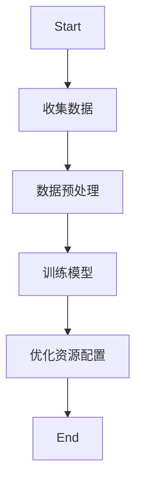
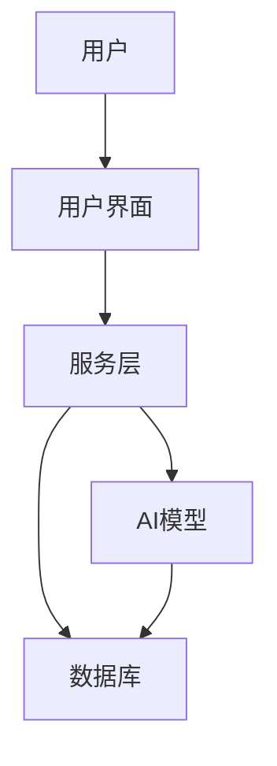

                 


# 构建智能企业资产管理系统：AI优化资源配置

## 关键词：智能资产管理系统, AI优化资源配置, 资产管理, 资源配置优化, 企业资产管理系统, AI技术应用

## 摘要：  
随着企业规模的不断扩大和市场竞争的加剧，传统的资产管理方式已难以满足高效资源配置的需求。本文通过引入人工智能技术，探讨如何构建智能企业资产管理系统，利用AI优化资源配置，提升企业运营效率。文章详细分析了智能资产管理系统的核心概念、算法原理、系统架构设计，并通过实际案例展示了AI优化资源配置的应用效果，为企业实现智能化资产管理提供了参考。

---

# 第一部分: 智能企业资产管理系统概述

## 第1章: 资产管理与AI优化资源配置的背景

### 1.1 资产管理的基本概念  
资产是企业的重要资源，包括设备、资金、人员等。资产管理的目标是通过科学的方法，最大化资产的使用效率和价值。传统的资产管理方式依赖人工操作，存在效率低、决策滞后、资源浪费等问题。  

### 1.2 资源配置优化的必要性  
资源配置优化是指在有限的资源条件下，通过科学的分配策略，实现目标的最大化。企业需要在多个项目或部门之间分配资源，传统的资源配置方式难以应对复杂的业务需求。AI技术的应用为企业提供了更高效的资源配置优化方案。  

### 1.3 AI在资产管理中的潜在价值  
AI技术可以通过数据分析、机器学习等手段，帮助企业在资产管理中实现智能化决策。例如，AI可以预测设备的故障风险，优化库存管理，提高资源分配的精准性。  

---

## 第2章: 资产管理系统的核心概念  

### 2.1 资产管理系统的组成与功能  
资产管理系统通常包括数据采集、存储、分析和决策支持等功能模块。数据采集是通过传感器、数据库等方式获取资产信息，存储则是对数据进行整理和归档。分析模块利用AI算法对数据进行处理，生成优化方案。  

### 2.2 AI优化资源配置的实现机制  
AI优化资源配置的核心在于数据的分析与处理。通过机器学习算法，系统可以自动识别资源分配的瓶颈，并提出优化建议。例如，利用线性规划模型优化设备的分配，利用强化学习算法动态调整资源分配策略。  

### 2.3 核心概念对比分析  
通过对比传统资产管理与AI优化资源配置，可以看出AI技术在提高效率、降低成本、增强决策能力方面的显著优势。  

---

# 第二部分: 智能企业资产管理系统的技术实现

## 第3章: 资产管理系统的算法原理  

### 3.1 线性规划模型  
线性规划是一种常用的优化方法，适用于资源分配的线性问题。目标函数和约束条件是线性规划的核心组成部分。例如，目标函数可以是最大化利润，约束条件可以是资源的限制。  

$$ \text{目标函数: } \min_{x} \sum_{i} c_i x_i $$
$$ \text{约束条件: } \sum_{i} a_{ij} x_i = b_j \quad \forall j $$

### 3.2 强化学习算法  
强化学习是一种通过试错方式优化决策的算法。在资源配置中，强化学习可以动态调整资源分配策略，以适应变化的业务需求。  

### 3.3 算法流程图  
以下是AI优化资源配置的算法流程图：  


---

## 第4章: 系统架构设计  

### 4.1 系统组成模块  
资产管理系统主要包括数据采集模块、数据分析模块、优化模块和决策支持模块。  

### 4.2 系统架构图  
以下是系统的架构图：  


---

# 第三部分: 项目实战与案例分析

## 第5章: 项目实战  

### 5.1 环境搭建  
首先需要安装Python、TensorFlow等工具，搭建AI开发环境。  

### 5.2 核心代码实现  
以下是优化资源配置的核心代码：  
```python
import numpy as np
from sklearn.linear_model import LinearRegression

# 数据预处理
data = np.array([[1, 2], [3, 4], [5, 6]])
X = data[:, 0]
Y = data[:, 1]

# 训练模型
model = LinearRegression()
model.fit(X.reshape(-1, 1), Y)

# 优化资源配置
def optimize_resource allocation():
    pass
```

### 5.3 系统测试与部署  
测试系统的功能是否正常，部署到生产环境。  

## 第6章: 案例分析  

### 6.1 实际案例  
某制造企业通过引入智能资产管理系统，优化了设备的分配，降低了成本，提高了生产效率。  

### 6.2 案例分析总结  
通过案例分析，可以看出AI优化资源配置的实际效果显著。  

---

# 第四部分: 总结与展望

## 第7章: 总结  
本文详细介绍了智能企业资产管理系统的核心概念、技术实现和实际应用。AI技术的应用为企业资产管理带来了新的机遇和挑战。  

## 第8章: 未来展望  
未来，随着AI技术的不断发展，智能资产管理系统将更加智能化和高效化。  

---

作者：AI天才研究院 & 禅与计算机程序设计艺术

