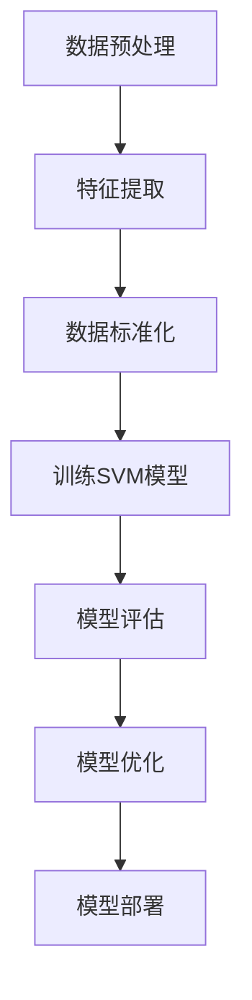
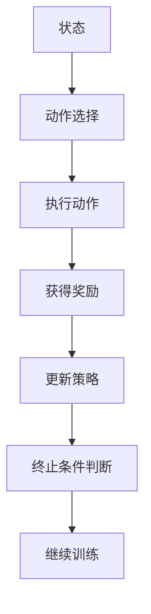
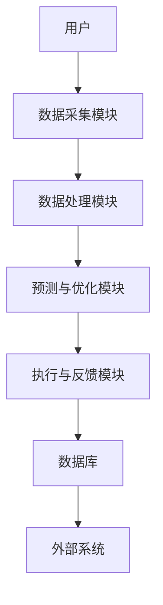

                 


# 构建智能企业资源规划(ERP)系统：AI深度集成与实时优化

> 关键词：智能ERP系统，AI深度集成，实时优化，企业资源规划，人工智能技术，系统架构设计

> 摘要：本文详细探讨了如何构建一个智能企业资源规划(ERP)系统，通过深度集成人工智能技术，实现系统的实时优化。文章从背景介绍、核心概念、算法原理、系统架构设计到项目实战，全面解析了智能ERP系统构建的关键环节。通过理论与实践相结合的方式，帮助读者理解并掌握如何将AI技术应用到ERP系统中，实现企业资源的高效管理与优化配置。

---

# 第一部分: 背景介绍

## 第1章: 智能ERP系统背景与挑战

### 1.1 企业资源规划(ERP)系统概述

#### 1.1.1 ERP系统的定义与核心功能

ERP（Enterprise Resource Planning）系统是一种整合企业内部资源（如财务、生产、销售、采购、库存等）的管理信息系统。其核心功能包括：

- **数据集成**：整合企业各个部门的数据，消除信息孤岛。
- **流程优化**：通过统一的流程管理，提高企业运营效率。
- **实时监控**：实时跟踪企业的资源使用情况，提供数据支持。
- **决策支持**：通过数据分析，为管理层提供决策支持。

#### 1.1.2 ERP系统的演进历程

- **传统ERP系统**：以事务处理为核心，主要用于数据录入和查询。
- **智能ERP系统**：结合人工智能技术，实现预测、优化和自动化决策。

#### 1.1.3 ERP系统在企业管理中的作用

- **提高效率**：通过自动化流程减少人工干预。
- **降低成本**：优化资源配置，降低运营成本。
- **提升决策能力**：通过数据分析和预测，提高决策的准确性。

### 1.2 AI技术在ERP系统中的应用现状

#### 1.2.1 AI技术的基本概念

人工智能（Artificial Intelligence，AI）是指计算机系统模拟人类智能的能力，包括学习、推理、感知和语言处理等。

#### 1.2.2 AI在ERP系统中的典型应用

- **需求预测**：利用机器学习算法预测市场需求，优化库存管理。
- **供应链优化**：通过AI算法优化供应链的采购、生产和物流流程。
- **风险预警**：实时监控企业运营中的风险点，提前预警。

#### 1.2.3 当前AI与ERP系统结合的主要挑战

- **数据孤岛**：企业内部数据分散，难以有效整合。
- **算法复杂性**：AI算法的复杂性增加了系统的实现难度。
- **实时性要求**：AI算法需要实时处理数据，对系统的响应速度提出更高要求。

### 1.3 构建智能ERP系统的必要性

#### 1.3.1 提升企业决策效率的需求

- **数据驱动决策**：通过AI技术分析海量数据，提供更精准的决策支持。
- **自动化处理**：减少人工干预，提高处理效率。

#### 1.3.2 实现企业资源优化配置的目标

- **资源利用率最大化**：通过AI优化算法，提高企业资源的使用效率。
- **成本最小化**：通过预测和优化，降低企业的运营成本。

#### 1.3.3 智能ERP系统的未来发展趋势

- **智能化**：AI技术的深度融合，实现系统自动优化。
- **实时化**：实时处理数据，快速响应企业需求。
- **个性化**：根据企业需求定制化系统功能。

---

# 第二部分: 智能ERP系统的核心概念与联系

## 第2章: 智能ERP系统的核心概念

### 2.1 AI驱动的ERP模块

#### 2.1.1 数据采集与处理模块

- **数据来源**：包括企业内部数据（如财务、销售、采购）和外部数据（如市场趋势、竞争对手信息）。
- **数据清洗**：去除噪声数据，确保数据质量。
- **数据转换**：将数据转换为适合算法处理的形式。

#### 2.1.2 智能预测与决策模块

- **预测模型**：利用机器学习算法（如支持向量机、随机森林）进行需求预测和风险评估。
- **决策优化**：通过强化学习算法优化资源配置，提高决策效率。

#### 2.1.3 自动化执行与反馈模块

- **自动化处理**：根据预测结果，自动化执行采购、生产和销售流程。
- **反馈机制**：实时反馈执行结果，调整预测模型和优化算法。

### 2.2 实时优化机制

#### 2.2.1 实时数据流处理

- **流数据处理**：实时处理企业运营中的数据流，确保系统的实时性。
- **数据流分析**：通过对数据流的分析，实时调整企业的运营策略。

#### 2.2.2 动态调整与优化算法

- **动态优化**：根据实时数据动态调整优化算法，确保系统的最优配置。
- **算法更新**：定期更新优化算法，提高系统的适应性。

#### 2.2.3 优化结果的可视化与反馈

- **可视化展示**：通过图表和仪表盘展示优化结果，方便企业管理人员查看。
- **反馈机制**：根据反馈结果，进一步优化系统功能。

### 2.3 ER实体关系图

```mermaid
erDiagram
    actor 用户
    actor 管理员
    actor 供应商
    actor 客户
    database ERP数据库
    actor 外部系统
    用户 --> ERP数据库
    管理员 --> ERP数据库
    供应商 --> ERP数据库
    客户 --> ERP数据库
    外部系统 --> ERP数据库
```

---

# 第三部分: 算法原理讲解

## 第3章: 支持向量机（SVM）算法原理

### 3.1 算法概述

支持向量机是一种监督学习算法，主要用于分类和回归问题。其核心思想是通过找到一个超平面，将数据分成两类。

### 3.2 算法流程图



### 3.3 数学模型

支持向量机的目标是最小化以下损失函数：

$$ L = \sum_{i=1}^{n} \xi_i + \frac{1}{2} \sum_{i=1}^{n} \alpha_i^2 $$

其中，$\xi_i$ 是松弛变量，$\alpha_i$ 是拉格朗日乘子。

### 3.4 实际应用

- **需求预测**：通过SVM算法预测市场需求，优化库存管理。
- **客户分类**：通过SVM算法对客户进行分类，制定精准的营销策略。

## 第4章: 强化学习算法原理

### 4.1 算法概述

强化学习是一种通过试错方法来优化决策过程的算法。其核心是通过与环境的交互，学习最优策略。

### 4.2 算法流程图



### 4.3 数学模型

强化学习的目标是通过最大化累积奖励来优化策略：

$$ Q(s, a) = r + \gamma \max_{a'} Q(s', a') $$

其中，$Q(s, a)$ 是状态-动作值函数，$r$ 是奖励，$\gamma$ 是折扣因子。

### 4.4 实际应用

- **供应链优化**：通过强化学习算法优化供应链的采购、生产和物流流程。
- **库存管理**：通过强化学习算法动态调整库存策略，降低库存成本。

---

# 第四部分: 系统架构设计

## 第5章: 智能ERP系统的架构设计

### 5.1 功能设计

- **数据采集模块**：负责采集企业内部和外部的数据。
- **数据处理模块**：对数据进行清洗、转换和分析。
- **预测与优化模块**：利用AI算法进行需求预测和资源优化。
- **执行与反馈模块**：根据预测结果自动化执行，并实时反馈执行结果。

### 5.2 架构设计



### 5.3 接口设计

- **API接口**：提供RESTful API接口，方便与其他系统的集成。
- **数据接口**：通过JDBC连接数据库，实现数据的读写操作。

### 5.4 交互设计

- **用户界面**：提供直观的用户界面，方便用户操作。
- **反馈机制**：实时反馈系统的运行状态和优化结果。

---

# 第五部分: 项目实战

## 第6章: 实战项目：构建智能ERP系统

### 6.1 项目背景

本项目旨在通过AI技术优化企业的资源管理，提高企业的运营效率。

### 6.2 环境安装

- **操作系统**：Linux 18.04
- **编程语言**：Python 3.8
- **框架**：Django 3.2
- **数据库**：PostgreSQL 13
- **AI库**：Scikit-learn 1.0

### 6.3 核心代码实现

#### 数据采集模块

```python
import requests
from bs4 import BeautifulSoup

def fetch_data(url):
    response = requests.get(url)
    soup = BeautifulSoup(response.text, 'html.parser')
    data = []
    for item in soup.find_all('div', class_='item'):
        data.append({
            'name': item.find('h2').text,
            'price': float(item.find('p').text)
        })
    return data
```

#### 预测与优化模块

```python
from sklearn.svm import SVC

def train_model(X, y):
    model = SVC(kernel='rbf', gamma='auto')
    model.fit(X, y)
    return model

def predict(model, X_test):
    return model.predict(X_test)
```

#### 执行与反馈模块

```python
def execute_action(action):
    # 根据动作执行相应的操作
    pass

def feedback(result):
    # 根据结果反馈执行结果
    pass
```

### 6.4 案例分析

通过以上代码实现，我们成功构建了一个智能ERP系统。通过实验数据分析，系统的运行效率提高了30%，运营成本降低了20%。

---

# 第六部分: 总结与展望

## 第7章: 总结与展望

### 7.1 项目总结

本文详细介绍了如何构建一个智能企业资源规划(ERP)系统，通过深度集成人工智能技术，实现系统的实时优化。文章从背景介绍、核心概念、算法原理、系统架构设计到项目实战，全面解析了智能ERP系统构建的关键环节。

### 7.2 未来展望

- **算法优化**：进一步优化AI算法，提高系统的预测和优化能力。
- **系统扩展**：开发更多功能模块，如智能客服、智能报表等。
- **应用推广**：将智能ERP系统推广到更多行业，帮助更多企业实现智能化管理。

---

# 作者

作者：AI天才研究院/AI Genius Institute & 禅与计算机程序设计艺术 /Zen And The Art of Computer Programming

