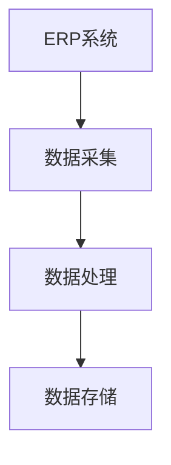
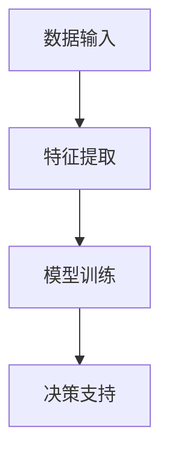
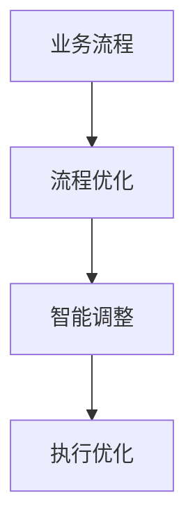
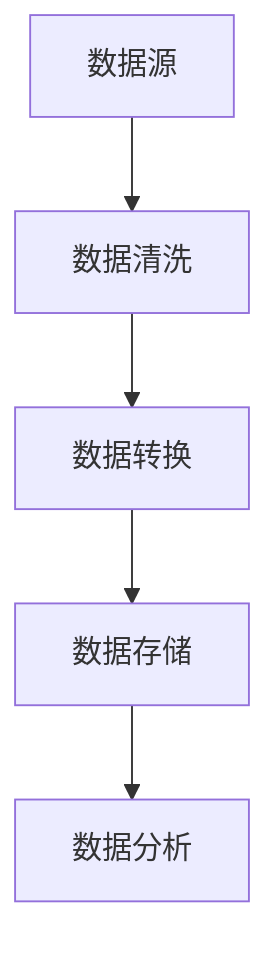
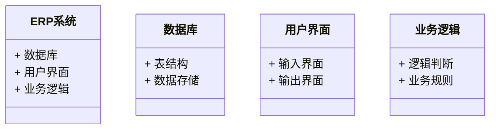
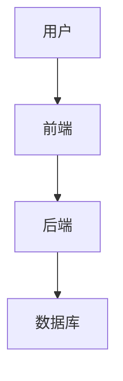
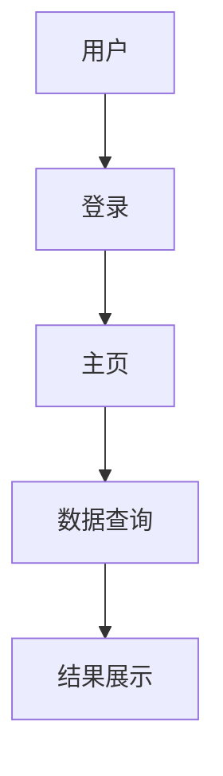

                 


# 构建智能企业资源规划(ERP)系统：AI的深度集成

---

## 关键词：  
企业资源规划(ERP), 人工智能(AI), 智能系统, 算法集成, 系统架构, 项目实战

---

## 摘要：  
随着人工智能技术的飞速发展，企业资源规划（ERP）系统正逐步向智能化方向演进。本文从ERP系统的背景出发，深入探讨AI技术如何与ERP系统深度融合，提升企业的智能化管理水平。通过分析ERP系统的功能模块、AI算法的实现原理、智能ERP系统的架构设计以及实际项目案例，本文为读者提供了一套构建智能ERP系统的完整思路。从理论到实践，从算法到架构，本文全面解析了智能ERP系统的核心技术与实现方法，为企业在数字化转型中提供有力的技术支持。

---

## 第1章: 企业资源规划(ERP)系统概述

### 1.1 ERP系统的定义与特点  
企业资源规划（ERP）系统是一种集成了企业各个业务模块（如采购、生产、销售、财务等）的管理信息系统。它通过整合企业内外部资源，实现业务流程的自动化和数据的统一管理。  

#### 1.1.1 ERP系统的特点  
1. **数据集中化**：所有业务数据统一存储，便于管理和分析。  
2. **模块化设计**：功能模块化，支持灵活配置。  
3. **跨平台支持**：支持多种操作系统和设备接入。  
4. **实时性**：数据实时更新，支持实时决策。  

#### 1.1.2 ERP系统的核心功能模块  
1. **采购与供应链管理**：优化采购流程，降低库存成本。  
2. **生产与制造管理**：监控生产过程，提高生产效率。  
3. **销售与客户关系管理**：管理客户信息，提升客户满意度。  
4. **财务管理**：实现财务数据的实时记录与分析。  

### 1.2 AI技术的发展与应用  
人工智能（AI）技术近年来取得了显著进展，已在多个领域得到了广泛应用。  

#### 1.2.1 AI技术的核心领域  
1. **机器学习**：通过数据训练模型，实现预测和分类。  
2. **自然语言处理（NLP）**：理解人类语言，实现智能对话和文本分析。  
3. **计算机视觉**：通过图像识别技术，实现视觉感知。  

#### 1.2.2 AI在企业管理中的应用  
1. **智能决策支持**：通过数据分析，辅助企业做出更明智的决策。  
2. **自动化流程管理**：利用AI技术优化业务流程，提高效率。  
3. **风险管理**：通过预测模型，识别潜在风险并提前采取措施。  

### 1.3 ERP系统与AI结合的必要性  
传统ERP系统虽然功能强大，但存在数据处理效率低、决策滞后等问题。通过引入AI技术，可以显著提升ERP系统的智能化水平。  

#### 1.3.1 AI提升ERP系统的具体表现  
1. **数据处理效率提升**：通过AI算法快速处理海量数据，提高数据准确性。  
2. **实时决策支持**：基于实时数据分析，提供动态决策支持。  
3. **个性化推荐**：根据企业需求，提供个性化业务流程优化建议。  

---

## 第2章: 智能ERP系统的核心概念与原理

### 2.1 智能ERP系统的定义与特点  
智能ERP系统是在传统ERP系统的基础上，深度集成AI技术，实现企业资源的智能化管理。  

#### 2.1.1 智能ERP系统的三大核心特点  
1. **智能化数据处理**：通过AI算法，实现数据的自动分析与预测。  
2. **自动化决策支持**：基于AI模型，提供实时决策支持。  
3. **个性化业务优化**：根据企业需求，动态调整业务流程。  

### 2.2 智能ERP系统的功能模块  

#### 2.2.1 数据采集与处理模块  
智能ERP系统需要实时采集企业内外部数据，包括销售数据、采购数据、生产数据等。  



#### 2.2.2 AI驱动的决策支持模块  
通过AI算法对数据进行分析，生成决策建议。  



#### 2.2.3 智能化业务流程管理模块  
根据AI分析结果，动态调整业务流程，提高效率。  



### 2.3 智能ERP系统的实现原理  

#### 2.3.1 数据流的处理流程  
从数据采集到数据存储的整个流程，确保数据的准确性和实时性。  



#### 2.3.2 AI算法在ERP系统中的应用  
AI算法（如机器学习、深度学习）用于数据分析与预测，为决策提供支持。  

#### 2.3.3 智能ERP系统的架构设计  
智能ERP系统的架构设计需要考虑数据流、功能模块划分以及系统接口设计。  

---

## 第3章: AI技术在ERP系统中的算法原理

### 3.1 常见AI算法在ERP中的应用  

#### 3.1.1 机器学习算法  
机器学习算法广泛应用于ERP系统的数据分析与预测。  

#### 3.1.2 深度学习算法  
深度学习算法在图像识别和自然语言处理中具有重要作用。  

#### 3.1.3 自然语言处理算法  
自然语言处理算法用于企业文档的自动分类与信息提取。  

### 3.2 机器学习算法的实现流程  

#### 3.2.1 数据预处理  
数据预处理是机器学习模型训练的基础。  

```python
import pandas as pd
data = pd.read_csv('data.csv')
# 删除缺失值
data.dropna(inplace=True)
# 标准化处理
from sklearn.preprocessing import StandardScaler
scaler = StandardScaler()
data_scaled = scaler.fit_transform(data)
```

#### 3.2.2 模型训练  
使用训练数据训练机器学习模型。  

```python
from sklearn.linear_model import LinearRegression
model = LinearRegression()
model.fit(data_scaled, target)
```

#### 3.2.3 模型评估与优化  
通过评估指标（如准确率、召回率）优化模型性能。  

### 3.3 深度学习模型的构建与应用  

#### 3.3.1 神经网络的基本结构  
神经网络由输入层、隐藏层和输出层组成。  

#### 3.3.2 深度学习模型的训练过程  
通过反向传播算法更新模型参数，优化模型性能。  

### 3.4 AI算法的数学模型与公式  

#### 3.4.1 机器学习的基本公式  
线性回归模型的数学表达式如下：  
$$y = \beta_0 + \beta_1x + \epsilon$$  

#### 3.4.2 深度学习的核心算法公式  
深度学习模型的损失函数通常使用交叉熵损失：  
$$L = -\frac{1}{N}\sum_{i=1}^{N} [y_i \log p_i + (1-y_i)\log (1-p_i)]$$  

---

## 第4章: 智能ERP系统的系统架构设计

### 4.1 系统功能设计  

#### 4.1.1 领域模型设计  
领域模型是系统功能设计的核心。  



### 4.2 系统架构设计  

#### 4.2.1 系统架构图  
系统架构设计需要考虑模块划分和交互流程。  



### 4.3 系统接口设计  
系统接口设计需要考虑模块之间的交互方式。  

### 4.4 系统交互设计  

#### 4.4.1 交互流程图  
系统交互流程图展示了用户与系统之间的交互过程。  



---

## 第5章: 智能ERP系统的项目实战

### 5.1 环境安装与配置  
项目实战需要安装必要的开发工具和依赖库。  

#### 5.1.1 安装Python环境  
使用Anaconda安装Python 3.8及以上版本。  

#### 5.1.2 安装依赖库  
安装所需的机器学习库（如Scikit-learn、TensorFlow）和数据处理库（如Pandas）。  

### 5.2 系统核心实现  

#### 5.2.1 数据预处理代码  
数据预处理是机器学习模型训练的基础。  

```python
import pandas as pd
data = pd.read_csv('data.csv')
# 删除缺失值
data.dropna(inplace=True)
# 标准化处理
from sklearn.preprocessing import StandardScaler
scaler = StandardScaler()
data_scaled = scaler.fit_transform(data)
```

#### 5.2.2 模型训练与优化  
通过机器学习算法训练模型，并进行优化。  

```python
from sklearn.linear_model import LinearRegression
model = LinearRegression()
model.fit(data_scaled, target)
```

### 5.3 项目案例分析  
通过具体案例分析，验证系统的实际应用效果。  

---

## 第6章: 最佳实践与总结

### 6.1 小结  
本文详细探讨了智能ERP系统的构建过程，从理论到实践，全面解析了AI技术与ERP系统的深度融合。  

### 6.2 注意事项  
在实际应用中，需要注意数据安全、模型优化和系统维护等问题。  

### 6.3 拓展阅读  
建议读者进一步学习相关领域的知识，如深度学习、自然语言处理等。  

---

## 作者：AI天才研究院/AI Genius Institute & 禅与计算机程序设计艺术/Zen And The Art of Computer Programming

---

### 总结  
通过本文的详细讲解，读者可以全面了解智能ERP系统的核心技术与实现方法，为企业在数字化转型中提供有力的技术支持。

