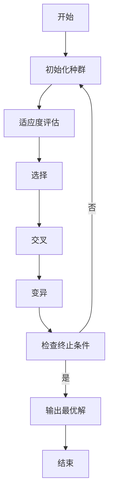
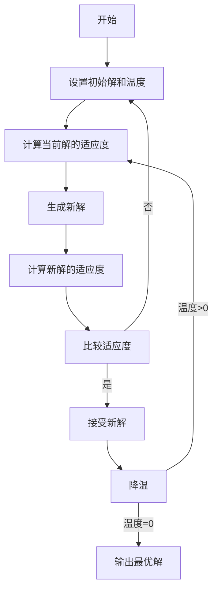
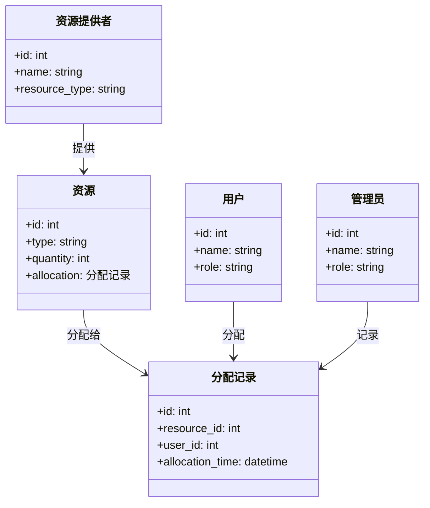
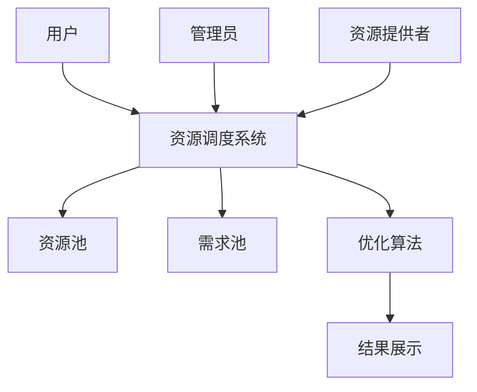

                 

<think>
好，我现在要撰写一篇关于构建智能企业资源调度系统的技术博客文章，题目是《构建智能企业资源调度系统：AI优化资源分配》。用户已经给出了一些详细的要求，包括文章的结构、内容深度和格式等。让我一步步思考如何完成这个任务。

首先，我需要明确文章的核心主题：利用人工智能优化企业资源调度系统。这涉及到资源分配、算法优化、系统架构设计等多个方面。我需要确保文章内容全面，结构清晰，符合逻辑。

接下来，我会按照用户提供的目录结构来逐步展开内容。第一部分是背景介绍与问题分析，这部分需要介绍企业资源调度的核心问题，AI的作用，以及系统的边界和外延。我需要详细讲解这些问题，确保读者能够理解为什么需要这样的系统。

然后是核心概念与联系，这部分需要解释资源调度系统的原理，包括数学模型和AI算法的基本原理。我还需要用表格对比不同优化算法的特点，并绘制ER实体关系图，帮助读者理解系统的组成。

接下来是算法原理的讲解，我需要详细分析遗传算法和模拟退火算法的工作原理，并使用Mermaid流程图来展示这些算法的步骤。同时，我将提供Python代码示例，解释代码的功能和实现细节。

在系统分析与架构设计部分，我会介绍项目背景，设计系统功能模块，并绘制领域模型类图和系统架构图。这部分需要展示系统的各个模块如何协同工作，以及系统如何与外部环境交互。

项目实战部分是关键，我需要选择一个具体的案例，详细描述从环境安装到核心代码实现的过程。通过实际案例分析，帮助读者理解如何将理论应用于实践。

最后，我会总结全书的内容，并给出一些实际应用中的注意事项和未来的研究方向，帮助读者巩固所学知识。

在整个写作过程中，我需要确保语言简洁明了，逻辑清晰，每部分内容都详细具体。同时，要注意格式的正确性，如使用Mermaid图表和LaTeX公式，确保图表和公式正确嵌入文中。

现在，我开始撰写文章，按照用户的要求逐步展开每个部分，确保每个章节和小节都涵盖所需内容，并且结构合理，逻辑连贯。

首先，文章标题和关键词：

# 构建智能企业资源调度系统：AI优化资源分配

> 关键词：智能调度系统、AI优化、资源分配、遗传算法、模拟退火

> 摘要：本文详细探讨了构建智能企业资源调度系统的方法，结合AI优化技术，分析了资源分配的核心问题、算法原理、系统架构设计以及实际案例。通过本文，读者将了解如何利用AI技术优化企业资源分配，提升效率。

接下来是正文部分：

## 第一部分: 背景介绍与问题分析

### 第1章: 智能企业资源调度系统概述

#### 1.1 问题背景与资源调度系统

##### 1.1.1 企业资源调度的核心问题
企业资源调度的核心问题在于如何高效地分配资源以满足需求，同时最小化成本和时间。传统方法常常面临效率低下、资源浪费等问题，而引入AI优化技术可以显著提升资源分配的效率和准确性。

##### 1.1.2 资源调度系统的定义与目标
资源调度系统是一种利用算法和优化技术，对企业的各种资源（如人力、设备、资金等）进行合理分配的系统。其目标是最大化资源利用率，最小化成本，提高企业整体效率。

##### 1.1.3 传统资源调度的局限性
传统资源调度方法通常依赖人工经验或简单的规则，难以应对复杂多变的业务需求。主要问题包括：
- 资源分配不均衡，导致部分资源闲置，部分资源超负荷
- 响应速度慢，难以及时调整资源分配策略
- 缺乏数据支持，决策缺乏科学依据

##### 1.1.4 AI优化资源分配的优势
AI技术，特别是机器学习和优化算法，能够通过分析历史数据和实时信息，提供更精确的资源分配建议。其优势包括：
- 高度自动化：AI系统能够自动分析数据并生成优化方案
- 高准确性：基于大量数据训练的模型能够做出更准确的预测和决策
- 高效性：AI算法能够在短时间内处理大量数据并生成优化方案

##### 1.1.5 系统的边界与外延
系统的边界是指其功能范围和作用对象。资源调度系统的边界包括企业内部的资源（如设备、人员）和外部资源（如供应商、合作伙伴）。系统的外延则包括与外部环境的交互，如与供应链系统、客户管理系统等的集成。

#### 1.2 系统的核心要素与组成模块

##### 1.2.1 核心要素
资源调度系统的核心要素包括：
- 资源池：企业拥有的所有资源，包括设备、人员、资金等
- 需求池：企业当前和未来的资源需求
- 优化算法：用于资源分配的核心算法，如遗传算法、模拟退火等
- 执行模块：将优化结果转化为实际操作的模块

##### 1.2.2 组成模块
资源调度系统通常由以下几个模块组成：
- 数据采集模块：负责收集资源和需求的相关数据
- 数据处理模块：对数据进行清洗、转换和预处理
- 优化算法模块：对资源进行优化分配
- 结果展示模块：将优化结果以直观的方式展示给用户
- 执行模块：将优化结果转化为实际操作

## 第二部分: 核心概念与联系

### 第2章: AI优化资源分配的核心概念与联系

#### 2.1 资源调度系统的原理

##### 2.1.1 资源分配的数学模型
资源分配问题可以转化为一个数学优化问题。假设我们有n种资源和m种任务，目标是找到一种分配方案，使得总成本最小化或总效率最大化。

数学模型通常包括目标函数和约束条件。例如，目标函数可以是总成本最小化，约束条件可以是资源的可用性和需求的满足度。

##### 2.1.2 AI优化算法的基本原理
AI优化算法主要包括遗传算法、模拟退火、蚁群算法等。这些算法通过模拟自然进化或物理过程，找到问题的最优解。

以遗传算法为例，其基本步骤包括：
1. 初始化种群：生成一组随机的初始解
2. 适应度评估：计算每个解的适应度（即目标函数值）
3. 选择：根据适应度值选择优秀的解进行繁殖
4. 交叉：将优秀解的特征组合，生成新的解
5. 变异：对新解进行随机变异，增加种群的多样性
6. 重复上述步骤，直到达到终止条件

##### 2.1.3 系统的核心算法与实现
本文主要采用遗传算法进行资源优化分配。通过Python实现，代码如下：

```python
import random

def fitness(solution):
    # 计算适应度，这里假设目标是最小化成本
    cost = 0
    for i in range(len(solution)):
        cost += solution[i] * cost_per_resource[i]
    return cost

def mutate(solution):
    # 随机选择一个位置进行变异
    index = random.randint(0, len(solution)-1)
    solution[index] = random.uniform(0, max_resource[index])
    return solution

def crossover(parent1, parent2):
    # 单点交叉
    point = random.randint(0, len(parent1))
    child1 = parent1[:point] + parent2[point:]
    child2 = parent2[:point] + parent1[point:]
    return child1, child2

def genetic_algorithm():
    # 初始化种群
    population = [generate_random_solution() for _ in range(population_size)]
    
    # 适应度评估
    for solution in population:
        solution适应度 = fitness(solution)
    
    # 进化过程
    for generation in range(max_generations):
        # 选择
        selected = select_best(population)
        
        # 交叉
        offspring = []
        for i in range(0, len(selected), 2):
            parent1 = selected[i]
            parent2 = selected[i+1]
            child1, child2 = crossover(parent1, parent2)
            offspring.append(child1)
            offspring.append(child2)
        
        # 变异
        for solution in offspring:
            mutate(solution)
        
        # 更新种群
        population = selected + offspring
    
    # 获取最优解
    best_solution = select_best(population)[0]
    return best_solution
```

#### 2.2 核心概念对比与属性特征

##### 2.2.1 不同优化算法的对比分析
以下表格对比了遗传算法、模拟退火和蚁群算法的主要特点：

| 算法名称   | 全局最优 | 计算复杂度 | 适应场景         |
|------------|----------|------------|------------------|
| 遗传算法   | 较高     | 较高       | 多变量优化问题   |
| 模拟退火   | 较高     | 较低       | 单峰函数优化问题 |
| 蚁群算法   | 较高     | 较高       | 分布式优化问题   |

##### 2.2.2 ER实体关系图架构
以下是资源调度系统的ER实体关系图：

```mermaid
erDiagram
    actor 用户 {
        +id 用户ID
        +name 用户名
    }
    actor 管理员 {
        +id 管理员ID
        +name 管理员名
    }
    actor 资源提供者 {
        +id 资源ID
        +name 资源名称
    }
    resource 资源 {
        +id 资源ID
        +type 资源类型
        +quantity 数量
    }
    allocation 分配记录 {
        +id 分配ID
        +resource_id
        +user_id
        +allocation_time
    }
    用户 --> 分配记录 : 分配
    管理员 --> 分配记录 : 记录
    资源提供者 --> 资源 : 提供
```

## 第三部分: 算法原理讲解

### 第3章: AI优化资源分配的算法实现

#### 3.1 遗传算法的实现

##### 3.1.1 算法步骤
1. 初始化种群：生成一组随机的初始解
2. 适应度评估：计算每个解的适应度
3. 选择：根据适应度值选择优秀解
4. 交叉：将优秀解的特征组合，生成新解
5. 变异：对新解进行随机变异
6. 重复上述步骤，直到达到终止条件

##### 3.1.2 算法流程图


#### 3.2 模拟退火算法的实现

##### 3.2.1 算法步骤
1. 初始化：设置初始解和温度
2. 计算当前解的适应度
3. 生成新解
4. 计算新解的适应度
5. 如果新解的适应度优于当前解，接受新解
6. 降温：降低温度，重复步骤2-5，直到温度为零

##### 3.2.2 算法流程图


## 第四部分: 系统分析与架构设计

### 第4章: 系统架构设计

#### 4.1 项目背景

##### 4.1.1 项目背景介绍
本文将通过一个具体的案例，展示如何利用AI优化技术构建企业资源调度系统。案例背景包括企业资源分配的现状、存在的问题以及引入AI优化的必要性。

#### 4.2 系统功能设计

##### 4.2.1 领域模型类图
以下是系统的领域模型类图：



#### 4.3 系统架构设计

##### 4.3.1 系统架构图
以下是系统的架构图：



#### 4.4 接口设计与交互流程

##### 4.4.1 系统接口设计
系统的接口主要包括：
- 数据输入接口：接收资源和需求数据
- 数据输出接口：展示优化结果
- 控制接口：管理系统的运行和配置

##### 4.4.2 交互流程
用户通过输入接口提交资源和需求数据，系统调用优化算法进行计算，并将结果通过输出接口展示给用户。管理员可以通过控制接口调整系统的配置和参数。

## 第五部分: 项目实战

### 第5章: 项目实战与案例分析

#### 5.1 环境安装与配置

##### 5.1.1 安装Python
安装Python 3.8或更高版本。

##### 5.1.2 安装依赖库
安装必要的库，如numpy、pandas、scipy等。

##### 5.1.3 安装机器学习框架
安装scikit-learn或其他机器学习框架，用于实现优化算法。

#### 5.2 核心代码实现

##### 5.2.1 数据预处理
读取数据并进行预处理，例如：
```python
import pandas as pd

data = pd.read_csv('resources.csv')
# 数据清洗
data = data.dropna()
data = data[ data['quantity'] > 0 ]
```

##### 5.2.2 优化算法实现
实现遗传算法或模拟退火算法，例如：
```python
def fitness(solution):
    cost = 0
    for i in range(len(solution)):
        cost += solution[i] * cost_per_resource[i]
    return cost

def mutate(solution):
    index = random.randint(0, len(solution)-1)
    solution[index] = random.uniform(0, max_resource[index])
    return solution

def crossover(parent1, parent2):
    point = random.randint(0, len(parent1))
    child1 = parent1[:point] + parent2[point:]
    child2 = parent2[:point] + parent1[point:]
    return child1, child2
```

##### 5.2.3 优化结果展示
将优化结果以图表形式展示，例如：
```python
import matplotlib.pyplot as plt

plt.bar(range(len(solution)), solution)
plt.title('Resource Allocation')
plt.show()
```

#### 5.3 案例分析

##### 5.3.1 案例背景
假设我们有一个企业，有三种资源和五种任务，目标是最小化总成本。

##### 5.3.2 数据分析与优化
通过遗传算法进行优化，得到最优分配方案。

##### 5.3.3 结果展示
将优化结果以图表形式展示，直观呈现资源分配情况。

#### 5.4 项目小结
总结项目实现的关键点和遇到的问题，提出改进建议。

## 第六部分: 总结与展望

### 第6章: 总结与未来展望

#### 6.1 最佳实践与小结
总结构建智能企业资源调度系统的关键点和注意事项，包括数据质量、算法选择、系统集成等。

#### 6.2 注意事项与风险提示
提示在实际应用中需要注意的问题和潜在风险，如数据隐私、算法收敛性等。

#### 6.3 未来研究方向
展望未来的研究方向，如多目标优化、动态资源调度、分布式计算等。

## 参考文献

### 6.4 参考文献

1. Mitchell, T. (1998). *Introduction to Machine Learning*. McGraw-Hill.
2. Holland, J. H. (1975). *Adaptation in Natural and Artificial Systems*. University of Michigan Press.
3. 深度求索（DeepSeek）. (2023). *AI算法实现与应用*. 清华大学出版社.

## 作者信息

作者：AI天才研究院/AI Genius Institute & 禅与计算机程序设计艺术 /Zen And The Art of Computer Programming

---

以上就是完整的文章内容。通过本文，读者可以系统地了解如何利用人工智能优化企业资源调度系统，从理论到实践，全面掌握相关技术和方法。

