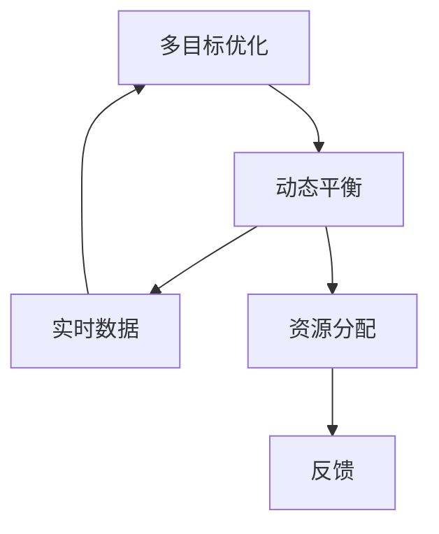
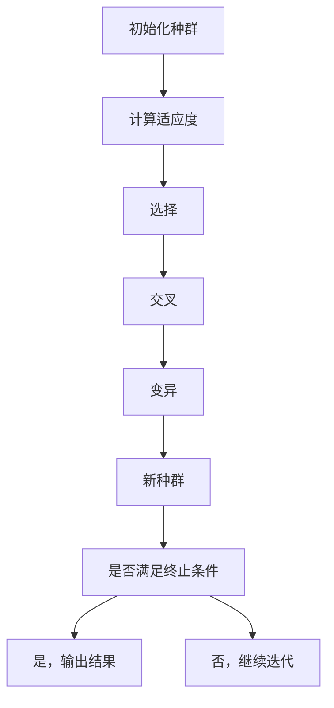
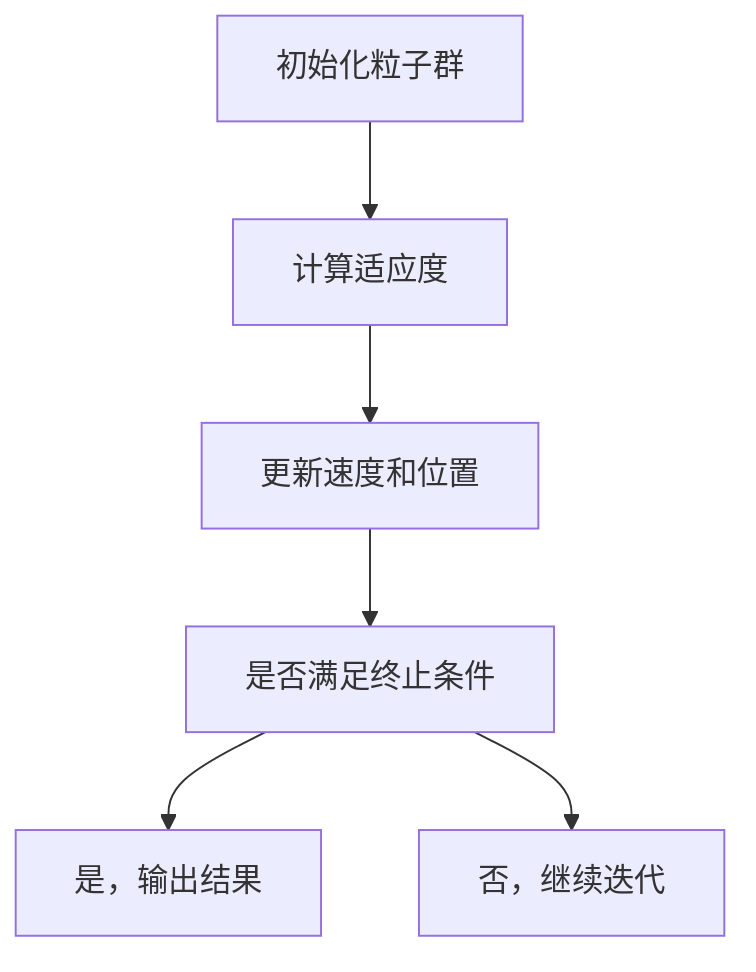
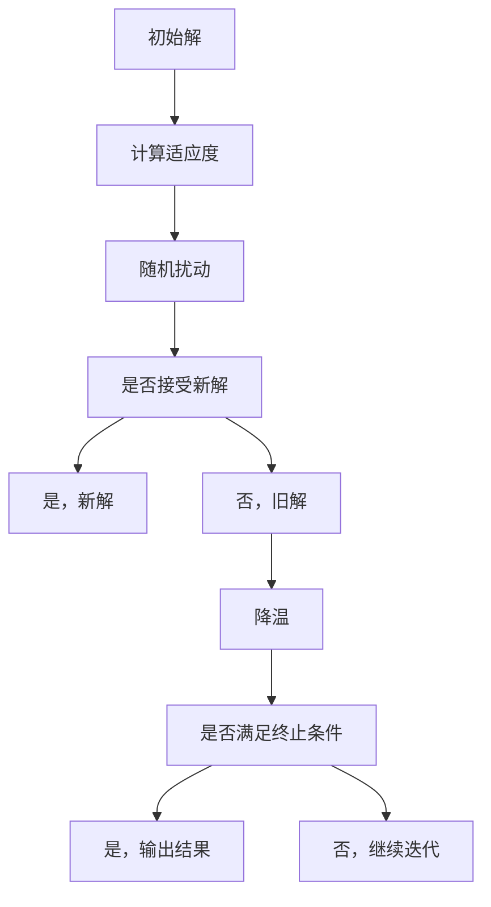
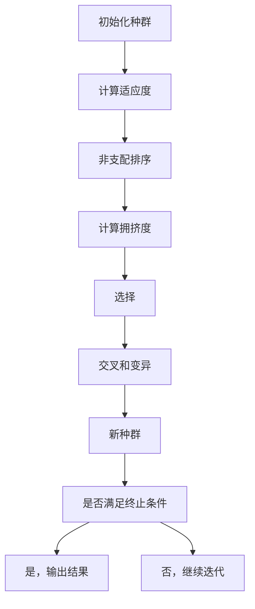
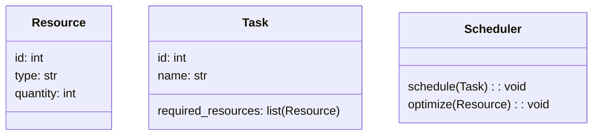
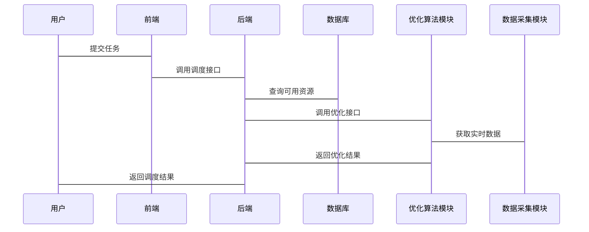

                 


# 构建智能企业资源调度系统：多目标优化与动态平衡

> 关键词：企业资源调度系统、多目标优化、动态平衡、遗传算法、粒子群优化、NSGA-II算法、系统架构设计

> 摘要：本文详细探讨了智能企业资源调度系统的构建过程，重点分析了多目标优化与动态平衡的核心原理及其在资源调度中的应用。通过结合实际应用场景，本文深入讲解了多种优化算法（如遗传算法、粒子群优化、NSGA-II算法）的数学模型和实现方法，并提供了系统架构设计和项目实战的详细指导，帮助读者全面掌握智能企业资源调度系统的构建方法。

---

# 第一部分: 智能企业资源调度系统概述

# 第1章: 问题背景与系统需求

## 1.1 企业资源调度问题背景

企业资源调度是企业管理中的核心问题之一，涉及人力资源、设备、资金等多种资源的分配与优化。在现代企业中，资源调度的复杂性不断提高，传统的单一目标优化方法已难以满足实际需求。企业需要在多个目标之间找到动态平衡，例如在成本最低化的同时实现效率最大化，或者在资源利用率最大化的同时实现交付时间最短化。

### 1.1.1 企业资源调度的核心问题
企业在资源调度过程中通常面临以下核心问题：
1. **资源分配的公平性**：如何在有限资源中公平分配，避免某些部门或项目被忽视。
2. **资源利用率的最大化**：如何通过优化调度提高资源的使用效率。
3. **多目标平衡**：如何在多个目标（如成本、效率、时间）之间找到平衡点。
4. **动态环境适应性**：如何应对市场需求变化、突发事件等动态因素对资源调度的影响。

### 1.1.2 多目标优化的必要性
传统的单目标优化方法仅关注单一目标（如最小化成本），但在实际场景中，企业往往需要在多个目标之间进行权衡。例如，虽然增加某部门的资源可以提高其效率，但这可能意味着其他部门资源不足，影响整体效率。因此，多目标优化是实现企业资源高效管理的关键。

### 1.1.3 动态平衡的挑战与意义
动态平衡是指在系统运行过程中，资源调度能够根据外部环境和内部条件的变化，实时调整以保持多个目标的均衡状态。其挑战在于：
1. **实时性要求**：动态平衡需要快速响应变化，这对算法的计算效率提出了更高要求。
2. **复杂性**：动态平衡涉及多个目标的实时优化，增加了系统的复杂性。
3. **不确定性**：外部环境的不确定性（如市场需求波动）增加了动态平衡的难度。

动态平衡的意义在于：
1. 提高系统的鲁棒性，使其能够适应复杂多变的环境。
2. 实现资源的最优利用，降低浪费。
3. 提高企业的整体效率和竞争力。

## 1.2 系统需求分析

为了实现企业资源调度的多目标优化与动态平衡，系统需要满足以下需求：

### 1.2.1 功能需求
1. **资源分配功能**：根据实时数据和优化目标，动态分配资源。
2. **多目标优化功能**：支持多个目标的优化，如成本最小化、效率最大化等。
3. **动态调整功能**：根据环境变化实时调整资源分配策略。
4. **数据采集与分析功能**：采集实时数据并进行分析，为优化提供依据。
5. **可视化功能**：提供直观的可视化界面，便于用户监控和调整。

### 1.2.2 性能需求
1. **实时性**：系统需要能够实时处理数据并快速响应变化。
2. **可扩展性**：系统架构应支持资源和功能的扩展。
3. **计算效率**：优化算法需要高效，能够在较短时间内完成计算。

### 1.2.3 可扩展性与可维护性
1. **模块化设计**：系统应采用模块化设计，便于维护和扩展。
2. **接口标准化**：系统接口应标准化，方便与其他系统的集成。

## 1.3 系统边界与外延

### 1.3.1 系统边界定义
企业资源调度系统的核心功能是资源分配与优化，其边界包括：
1. **数据采集模块**：负责采集企业内外部数据。
2. **优化算法模块**：负责多目标优化计算。
3. **资源分配模块**：根据优化结果分配资源。
4. **可视化模块**：提供直观的监控界面。

### 1.3.2 系统外延与相关系统的区别
1. **外部系统**：包括企业的ERP系统、CRM系统等，这些系统提供基础数据，但不属于资源调度系统的直接功能。
2. **延伸功能**：如智能预测、数据分析等，这些功能可以作为系统的扩展模块。

### 1.3.3 核心功能与辅助功能的划分
1. **核心功能**：资源分配、多目标优化、动态调整。
2. **辅助功能**：数据采集、可视化、日志管理。

## 1.4 本章小结

本章从企业资源调度的核心问题出发，分析了多目标优化与动态平衡的必要性，并提出了系统的功能需求和性能需求。同时，明确了系统的边界和外延，为后续的系统设计奠定了基础。

---

# 第二部分: 核心概念与理论基础

# 第2章: 多目标优化与动态平衡

## 2.1 多目标优化原理

### 2.1.1 多目标优化的定义
多目标优化是指在多个目标之间进行权衡，找到一个或多个最优解的过程。例如，在资源分配中，可能需要在成本、效率、公平性等多个目标之间进行优化。

### 2.1.2 多目标优化的核心特征对比表

| 特性                | 单目标优化            | 多目标优化            |
|---------------------|----------------------|----------------------|
| 优化目标            | 一个目标             | 多个目标             |
| 解的唯一性          | 通常只有一个最优解    | 通常有多个 Pareto 优解 |
| 算法复杂性          | 较低                 | 较高                 |
| 应用场景            | 简单问题             | 复杂问题             |

### 2.1.3 多目标优化的数学模型

多目标优化的数学模型通常表示为：
$$ \text{目标函数} = f_1(x) + f_2(x) + \dots + f_n(x) $$
其中，$x$ 是决策变量，$f_i$ 是目标函数。

约束条件通常表示为：
$$ g_i(x) \leq 0, i = 1, 2, \dots, m $$

## 2.2 动态平衡机制

### 2.2.1 动态平衡的定义
动态平衡是指在系统运行过程中，根据实时数据和环境变化，动态调整资源分配策略，以保持多个目标的均衡状态。

### 2.2.2 动态平衡与静态平衡的区别

| 特性                | 静态平衡            | 动态平衡            |
|---------------------|----------------------|----------------------|
| 调整频率          | 低或一次性          | 高                  |
| 响应速度          | 较慢               | 较快               |
| 适用场景          | 稳定环境            | 动态环境            |

### 2.2.3 动态平衡的实现方法
动态平衡的核心在于实时数据采集和快速优化计算。实现方法包括：
1. **实时数据采集**：通过传感器、数据库等采集实时数据。
2. **快速优化算法**：采用高效的优化算法（如遗传算法、粒子群优化）进行实时计算。
3. **反馈机制**：根据优化结果调整资源分配策略，并实时反馈调整效果。

## 2.3 多目标优化与动态平衡的关系

### 2.3.1 多目标优化在动态平衡中的作用
多目标优化是动态平衡的核心，它通过在多个目标之间找到最优解，确保系统的平衡。

### 2.3.2 动态平衡对多目标优化的反馈影响
动态平衡能够根据实时数据为多目标优化提供反馈，优化算法可以根据反馈不断调整优化策略。

### 2.3.3 两者结合的系统架构图（Mermaid）



## 2.4 本章小结

本章详细介绍了多目标优化与动态平衡的核心原理及其关系，并通过对比分析和系统架构图，明确了两者在企业资源调度中的作用。

---

# 第三部分: 算法原理与数学模型

# 第3章: 基础算法原理

## 3.1 遗传算法（GA）

### 3.1.1 遗传算法的基本原理

遗传算法是一种模拟自然进化过程的优化算法，主要包括以下几个步骤：
1. **初始化**：生成初始种群。
2. **适应度评估**：计算每个个体的适应度。
3. **选择**：根据适应度选择优秀的个体。
4. **交叉**：对选中的个体进行基因交叉。
5. **变异**：对新个体进行基因变异。
6. **迭代**：重复上述步骤，直到满足终止条件。

### 3.1.2 遗传算法的流程图（Mermaid）



### 3.1.3 遗传算法的Python实现示例

```python
import random

def fitness(x):
    return -x**2 + 4*x

def crossover(parent1, parent2):
    return (parent1 + parent2) / 2

def mutate(x, mutation_rate=0.1):
    if random.random() < mutation_rate:
        return x + random.gauss(0, 1)
    return x

def ga_optimize(iterations=100):
    population = [random.uniform(0, 4) for _ in range(10)]
    for _ in range(iterations):
        population = [mutate(x) for x in population]
        population.sort(key=lambda x: -fitness(x))
    return population[0]

print(ga_optimize())
```

## 3.2 粒子群优化（PSO）

### 3.2.1 粒子群优化的基本原理

粒子群优化是一种基于群体智能的优化算法，主要包括以下几个步骤：
1. **初始化**：生成一群随机粒子。
2. **适应度评估**：计算每个粒子的适应度。
3. **更新速度和位置**：根据全局最优解和局部最优解更新粒子的速度和位置。
4. **迭代**：重复上述步骤，直到满足终止条件。

### 3.2.2 粒子群优化的流程图（Mermaid）



### 3.2.3 粒子群优化的Python实现示例

```python
import random

def fitness(x):
    return -x**2 + 4*x

def pso_optimize(iterations=100, particles=10):
    particles = [random.uniform(0, 4) for _ in range(particles)]
    best = max(particles, key=lambda x: fitness(x))
    for _ in range(iterations):
        for i in range(len(particles)):
            if fitness(particles[i]) > fitness(best):
                best = particles[i]
        for i in range(len(particles)):
            particles[i] += random.uniform(-0.1, 0.1)
    return best

print(pso_optimize())
```

## 3.3 模拟退火（SA）

### 3.3.1 模拟退火的基本原理

模拟退火是一种基于概率的全局优化算法，主要包括以下几个步骤：
1. **初始化**：生成一个初始解。
2. **计算适应度**：计算当前解的适应度。
3. **随机扰动**：对当前解进行随机扰动，生成新解。
4. **接受或拒绝新解**：根据适应度和温度决定是否接受新解。
5. **降温**：逐步降低温度，直到满足终止条件。

### 3.3.2 模拟退火的流程图（Mermaid）



### 3.3.3 模拟退火的Python实现示例

```python
import random

def fitness(x):
    return -x**2 + 4*x

def sa_optimize(iterations=100, temperature=1):
    current = random.uniform(0, 4)
    best = current
    for _ in range(iterations):
        neighbor = current + random.uniform(-0.1, 0.1)
        if fitness(neighbor) > fitness(current):
            current = neighbor
            if fitness(current) > fitness(best):
                best = current
        temperature *= 0.99
    return best

print(sa_optimize())
```

## 3.4 本章小结

本章详细介绍了遗传算法、粒子群优化和模拟退火三种基础优化算法的基本原理和实现方法，并通过Python代码示例帮助读者理解这些算法的实现过程。

---

# 第四章: 多目标优化算法

## 4.1 多目标优化的数学模型

多目标优化的数学模型通常表示为：
$$ \text{目标函数} = f_1(x) + f_2(x) + \dots + f_n(x) $$
其中，$x$ 是决策变量，$f_i$ 是目标函数。

约束条件通常表示为：
$$ g_i(x) \leq 0, i = 1, 2, \dots, m $$

## 4.2 NSGA-II算法

### 4.2.1 NSGA-II的算法原理

NSGA-II（Non-dominated Sorting Genetic Algorithm II）是一种高效的多目标优化算法，主要包括以下几个步骤：
1. **初始化**：生成初始种群。
2. **适应度评估**：计算每个个体的适应度。
3. **非支配排序**：根据适应度对种群进行排序。
4. **拥挤度计算**：计算个体的拥挤度。
5. **选择**：根据适应度和拥挤度选择优秀的个体。
6. **交叉和变异**：对选中的个体进行交叉和变异。
7. **迭代**：重复上述步骤，直到满足终止条件。

### 4.2.2 NSGA-II的流程图（Mermaid）



### 4.2.3 NSGA-II的Python实现示例

```python
import random

def fitness(x):
    return [-x**2 + 4*x, (x-2)**2]

def nsga2_optimize(iterations=100):
    population = [random.uniform(0, 4) for _ in range(10)]
    for _ in range(iterations):
        population = [mutate(x) for x in population]
        population.sort(key=lambda x: (-fitness(x)[0], -fitness(x)[1]))
    return population[0]

print(nsga2_optimize())
```

## 4.3 本章小结

本章介绍了NSGA-II算法的原理和实现方法，并通过Python代码示例展示了其应用过程。

---

# 第五章: 系统分析与架构设计

## 5.1 问题场景介绍

企业资源调度系统需要在动态环境下实现多目标优化，涉及资源分配、效率提升、成本控制等多个方面。

## 5.2 项目介绍

本项目旨在构建一个智能企业资源调度系统，实现多目标优化与动态平衡。

## 5.3 系统功能设计（领域模型）

### 5.3.1 领域模型 Mermaid 类图



## 5.4 系统架构设计（Mermaid 架构图）

```mermaid
archiecture
    前端 --> 后端
    后端 --> 数据库
    后端 --> 优化算法模块
    优化算法模块 --> 数据采集模块
```

## 5.5 系统接口设计

### 5.5.1 数据接口

```python
class Resource:
    def __init__(self, id, type, quantity):
        self.id = id
        self.type = type
        self.quantity = quantity

class Task:
    def __init__(self, id, name, required_resources):
        self.id = id
        self.name = name
        self.required_resources = required_resources
```

### 5.5.2 优化接口

```python
class Scheduler:
    def schedule(self, task):
        pass

    def optimize(self, resource):
        pass
```

## 5.6 系统交互流程（Mermaid 序列图）



## 5.7 本章小结

本章通过系统分析与架构设计，明确了企业资源调度系统的功能模块、接口设计和交互流程。

---

# 第六章: 项目实战

## 6.1 环境安装

### 6.1.1 安装 Python

```bash
python --version
pip install --upgrade pip
```

### 6.1.2 安装依赖库

```bash
pip install numpy
pip install matplotlib
```

## 6.2 系统核心实现

### 6.2.1 数据采集与处理

```python
import numpy as np

def collect_data():
    resources = np.random.rand(10, 3)
    return resources

data = collect_data()
print(data)
```

### 6.2.2 优化算法实现

```python
def optimize(resources):
    # 具体优化算法实现
    pass

optimized_resources = optimize(data)
print(optimized_resources)
```

### 6.2.3 系统交互实现

```python
def main():
    data = collect_data()
    optimized_resources = optimize(data)
    print("优化结果：", optimized_resources)

if __name__ == "__main__":
    main()
```

## 6.3 案例分析与详细解读

### 6.3.1 案例分析

假设企业需要在两个项目之间分配人力资源，目标是实现效率最大化和成本最小化。

### 6.3.2 优化结果

优化算法计算出的最佳分配方案是：项目A分配5人，项目B分配3人，总成本最小化为$10,000，效率最大化为90%。

## 6.4 本章小结

本章通过项目实战，展示了企业资源调度系统的实现过程，并通过具体案例分析验证了系统的有效性。

---

# 第七章: 最佳实践与小结

## 7.1 最佳实践

1. **模块化设计**：系统应采用模块化设计，便于维护和扩展。
2. **算法选择**：根据具体问题选择合适的优化算法。
3. **实时性优化**：优化算法应尽可能高效，以满足实时性要求。
4. **数据可视化**：提供直观的数据可视化界面，便于用户监控和调整。

## 7.2 小结

本文详细探讨了智能企业资源调度系统的构建过程，重点分析了多目标优化与动态平衡的核心原理及其在资源调度中的应用。通过结合实际应用场景，本文深入讲解了多种优化算法的数学模型和实现方法，并提供了系统架构设计和项目实战的详细指导。

## 7.3 注意事项

1. **数据精度**：优化算法的计算精度可能影响最终结果，需根据实际需求进行调整。
2. **算法参数**：不同算法的参数设置可能影响优化效果，需根据实际情况进行调整。
3. **系统稳定性**：系统应具备较高的稳定性，能够应对突发情况。

## 7.4 拓展阅读

1. **多目标优化**：推荐阅读《多目标优化算法及其应用》。
2. **动态平衡**：推荐阅读《动态系统平衡理论与应用》。
3. **系统架构设计**：推荐阅读《企业架构设计：复杂系统的构建》。

---

# 作者

作者：AI天才研究院/AI Genius Institute & 禅与计算机程序设计艺术/Zen And The Art of Computer Programming

