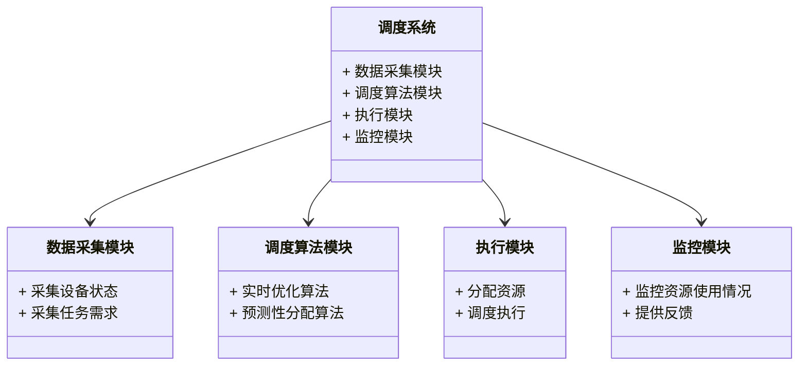
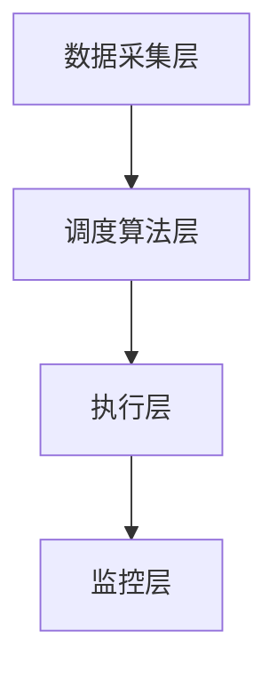

                 


# 构建智能企业资源调度系统：实时优化与预测性分配

> 关键词：智能调度系统、资源分配、实时优化、预测性分配、强化学习、遗传算法

> 摘要：本文详细探讨了构建智能企业资源调度系统的各个方面，从背景介绍到系统架构设计，再到项目实战和最佳实践。通过分析资源调度的核心概念、算法原理、系统架构和实际案例，展示了如何利用强化学习和遗传算法实现资源的实时优化与预测性分配，为企业资源管理提供高效解决方案。

---

# 第1章: 资源调度系统背景与挑战

## 1.1 资源调度的定义与重要性

### 1.1.1 资源调度的定义
资源调度是指对企业的各种资源（如设备、人力、资金、时间等）进行合理分配，以满足企业目标的过程。它通过优化资源配置，提高效率、降低成本，并确保任务按时完成。

### 1.1.2 资源调度在企业中的重要性
资源调度是企业运营的核心环节。在制造、物流、能源等行业，资源调度的效率直接影响企业的生产效率和成本控制。例如，在制造业中，资源调度可以优化生产线的设备使用，减少闲置时间，提高产量。

### 1.1.3 资源调度的核心目标
资源调度的核心目标包括：
1. **最大化资源利用率**：确保资源被充分利用，减少浪费。
2. **最小化成本**：通过优化资源配置降低运营成本。
3. **提高响应速度**：快速适应市场需求变化，提高企业竞争力。
4. **确保任务按时完成**：保证所有任务在规定时间内完成。

## 1.2 智能调度系统的发展背景

### 1.2.1 传统资源调度方式的局限性
传统的资源调度方式主要依赖人工经验或简单的规则，存在以下问题：
1. **效率低**：人工调度耗时且容易出错。
2. **适应性差**：难以应对复杂多变的市场需求。
3. **资源浪费**：无法有效利用资源的潜力。

### 1.2.2 智能调度系统的兴起
随着人工智能和大数据技术的发展，智能调度系统逐渐兴起。它利用先进的算法和数据处理技术，能够实时优化资源分配，提高调度效率。

### 1.2.3 企业对智能调度的需求
企业对智能调度的需求主要体现在：
1. **提高运营效率**：通过智能调度降低资源浪费，提高生产力。
2. **快速响应市场变化**：智能调度能够实时调整资源分配，适应市场波动。
3. **降低成本**：优化资源配置可以显著降低企业的运营成本。

## 1.3 实时优化与预测性分配的必要性

### 1.3.1 实时优化的定义与优势
实时优化是指在资源调度过程中，根据实时数据不断调整调度策略，以达到最优结果。其优势在于能够快速响应变化，确保资源利用最大化。

### 1.3.2 预测性分配的定义与作用
预测性分配是基于历史数据和未来预测，提前规划资源分配。它能够帮助企业更好地应对未来的不确定性，提前做好资源准备。

### 1.3.3 两者的结合与应用
实时优化和预测性分配的结合能够实现动态调整和长期规划的统一。例如，在电力调度中，实时优化可以应对突发需求变化，而预测性分配则可以提前规划发电资源的分配。

## 1.4 本章小结
本章介绍了资源调度的基本概念、传统方式的局限性以及智能调度系统的兴起。重点阐述了实时优化与预测性分配的必要性，为后续章节的深入分析奠定了基础。

---

# 第2章: 资源调度系统的核心概念与原理

## 2.1 资源调度的核心概念

### 2.1.1 资源的定义与分类
资源可以分为以下几类：
1. **物理资源**：如设备、原材料等。
2. **人力资源**：如员工、技术专家等。
3. **时间资源**：如项目周期、生产时间等。

### 2.1.2 任务的定义与特点
任务是指需要完成的工作，具有明确的目标和时间要求。任务的特点包括：
1. **可分解性**：任务可以分解为更小的子任务。
2. **优先级**：任务有不同的优先级，需要根据优先级进行调度。
3. **依赖性**：某些任务需要在其他任务完成后才能执行。

### 2.1.3 调度算法的核心要素
调度算法的核心要素包括：
1. **目标函数**：如最小化成本、最大化资源利用率等。
2. **约束条件**：如资源限制、时间限制等。
3. **优化策略**：如贪心算法、动态规划等。

## 2.2 资源调度系统的核心属性

### 2.2.1 实时性
实时性是指系统能够根据实时数据快速调整调度策略，确保资源分配的及时性和准确性。

### 2.2.2 可扩展性
可扩展性是指系统能够适应资源和任务数量的增加，保持高效运行。

### 2.2.3 可靠性
可靠性是指系统能够在各种情况下稳定运行，保证调度结果的准确性和一致性。

## 2.3 资源调度系统的实体关系分析

### 2.3.1 ER图实体关系分析
以下是资源调度系统的ER图实体关系分析：

```mermaid
erDiagram
    actor 用户
    actor 系统
    actor 数据源
    database 资源数据库
    database 任务数据库
    database 调度结果数据库
    用户 --> 资源数据库: 查询资源
    用户 --> 任务数据库: 提交任务
    系统 --> 资源数据库: 获取资源信息
    系统 --> 任务数据库: 获取任务信息
    系统 --> 调度结果数据库: 存储调度结果
```

### 2.3.2 实体间的关联关系
实体间的关联关系包括：
1. 用户与资源数据库：用户查询资源信息。
2. 用户与任务数据库：用户提交任务。
3. 系统与资源数据库：系统获取资源信息。
4. 系统与任务数据库：系统获取任务信息。
5. 系统与调度结果数据库：系统存储调度结果。

### 2.3.3 实体关系图展示（Mermaid 流程图）
以下是实体关系图的Mermaid流程图：

```mermaid
erDiagram
    actor 用户
    actor 系统
    actor 数据源
    database 资源数据库
    database 任务数据库
    database 调度结果数据库
    用户 --> 资源数据库: 查询资源
    用户 --> 任务数据库: 提交任务
    系统 --> 资源数据库: 获取资源信息
    系统 --> 任务数据库: 获取任务信息
    系统 --> 调度结果数据库: 存储调度结果
```

## 2.4 本章小结
本章详细探讨了资源调度系统的核心概念与实体关系，分析了系统的实时性、可扩展性和可靠性，并通过ER图展示了系统的实体关系。

---

# 第3章: 强化学习在资源调度中的应用

## 3.1 强化学习的基本原理

### 3.1.1 强化学习的定义
强化学习是一种机器学习方法，通过智能体与环境的交互，学习最优策略以最大化累积奖励。

### 3.1.2 状态、动作、奖励的定义
1. **状态（State）**：表示环境当前的情况。
2. **动作（Action）**：智能体在状态下的行为。
3. **奖励（Reward）**：智能体采取动作后获得的反馈，用于指导学习。

### 3.1.3 Q-learning算法的数学模型
Q-learning算法的数学模型如下：
$$ Q(s, a) = Q(s, a) + \alpha \left( r + \gamma \max_{a'} Q(s', a') - Q(s, a) \right) $$
其中，$\alpha$ 是学习率，$\gamma$ 是折扣因子。

### 3.1.4 Q-learning算法流程图
以下是Q-learning算法的流程图：

```mermaid
graph TD
    A[开始] --> B[初始化Q表]
    B --> C[选择动作]
    C --> D[执行动作，获得奖励]
    D --> E[更新Q值]
    E --> F[检查是否终止]
    F --> G[终止] 或 F --> C[继续]
```

## 3.2 强化学习在资源调度中的应用

### 3.2.1 资源分配问题建模
资源分配问题可以建模为一个马尔可夫决策过程（MDP），其中：
1. 状态：当前资源使用情况。
2. 动作：分配资源。
3. 奖励：资源利用效率。

### 3.2.2 调度算法实现
以下是Q-learning算法的Python实现代码：

```python
import numpy as np

class QLearning:
    def __init__(self, state_space, action_space, learning_rate=0.1, gamma=0.9):
        self.state_space = state_space
        self.action_space = action_space
        self.learning_rate = learning_rate
        self.gamma = gamma
        self.Q = np.zeros((state_space, action_space))
    
    def choose_action(self, state, epsilon=0.1):
        if np.random.random() < epsilon:
            return np.random.randint(self.action_space)
        else:
            return np.argmax(self.Q[state])
    
    def update_Q(self, state, action, reward, next_state):
        self.Q[state, action] += self.learning_rate * (reward + self.gamma * np.max(self.Q[next_state]) - self.Q[state, action])
```

### 3.2.3 应用实例分析
假设我们有一个制造企业，需要调度设备完成生产任务。通过Q-learning算法，系统可以根据实时设备状态和任务需求，动态调整设备分配策略，最大化设备利用率。

## 3.3 本章小结
本章介绍了强化学习的基本原理，并展示了其在资源调度中的应用。通过Q-learning算法的实现和应用实例分析，读者可以理解如何利用强化学习优化资源分配。

---

# 第4章: 系统分析与架构设计

## 4.1 系统功能设计

### 4.1.1 问题场景介绍
我们以一个制造企业的设备调度问题为例。企业有多个设备和生产线，需要根据生产任务的需求，合理分配设备资源。

### 4.1.2 系统功能模块
系统功能模块包括：
1. 数据采集模块：采集设备状态和任务需求。
2. 调度算法模块：实现资源调度算法。
3. 执行模块：执行调度结果，分配资源。
4. 监控模块：监控调度结果，提供反馈。

### 4.1.3 系统功能设计的领域模型类图
以下是系统功能设计的领域模型类图：



## 4.2 系统架构设计

### 4.2.1 分层架构设计
以下是系统的分层架构设计：



### 4.2.2 模块间接口设计
模块间接口设计包括：
1. 数据采集模块与调度算法模块之间的接口。
2. 调度算法模块与执行模块之间的接口。
3. 执行模块与监控模块之间的接口。

### 4.2.3 系统交互流程图
以下是系统交互流程图：

```mermaid
sequenceDiagram
    actor 用户
    system 数据采集模块
    system 调度算法模块
    system 执行模块
    system 监控模块
    用户 -> 数据采集模块: 提交任务
    数据采集模块 -> 调度算法模块: 提供资源数据
    调度算法模块 -> 执行模块: 分配资源
    执行模块 -> 监控模块: 执行调度
    监控模块 -> 用户: 提供反馈
```

## 4.3 本章小结
本章详细分析了系统功能设计和架构设计，展示了系统的分层架构和模块间接口设计，为后续的实现提供了理论基础。

---

# 第5章: 项目实战

## 5.1 环境安装与配置

### 5.1.1 安装Python与必要的库
需要安装的Python库包括：
1. `numpy`
2. `matplotlib`
3. `scikit-learn`

### 5.1.2 安装与配置调度系统框架
可以选择使用Django或Flask框架来搭建调度系统的Web界面。

## 5.2 核心代码实现

### 5.2.1 数据采集模块
以下是数据采集模块的Python代码：

```python
import serial
import json

class DataCollector:
    def __init__(self, port, baud_rate):
        self.port = port
        self.baud_rate = baud_rate
        self.ser = None
    
    def connect(self):
        self.ser = serial.Serial(self.port, self.baud_rate)
        if not self.ser.is_open:
            raise Exception("无法连接到设备")
    
    def collect_data(self):
        if not self.ser.is_open:
            self.connect()
        data = self.ser.readline().decode()
        return json.loads(data)
```

### 5.2.2 调度算法模块
以下是调度算法模块的Python代码：

```python
class Scheduler:
    def __init__(self, resources, tasks):
        self.resources = resources
        self.tasks = tasks
    
    def assign_resource(self, task):
        # 根据资源利用率选择最优资源
        min_utilization = min(self.resources, key=lambda r: r.utilization)
        return min_utilization
    
    def update_utilization(self, resource):
        resource.utilization += 1
```

### 5.2.3 执行模块
以下是执行模块的Python代码：

```python
class Executor:
    def __init__(self, resources):
        self.resources = resources
    
    def execute_task(self, task, resource):
        print(f"执行任务 {task.id} 使用资源 {resource.id}")
        # 模拟任务执行时间
        import time
        time.sleep(1)
        print(f"任务 {task.id} 执行完成")
```

### 5.2.4 监控模块
以下是监控模块的Python代码：

```python
class Monitor:
    def __init__(self, resources):
        self.resources = resources
    
    def monitor_resource(self):
        import time
        while True:
            for resource in self.resources:
                print(f"资源 {resource.id} 当前利用率：{resource.utilization}")
            time.sleep(1)
```

## 5.3 代码应用解读与分析

### 5.3.1 数据采集模块分析
数据采集模块负责从设备中采集数据，并将数据以JSON格式返回。这使得调度系统能够实时获取设备状态，进行动态调度。

### 5.3.2 调度算法模块分析
调度算法模块根据资源利用率选择最优资源分配任务，确保资源的高效利用。调度算法可以根据具体需求进行扩展和优化。

### 5.3.3 执行模块与监控模块分析
执行模块负责根据调度结果执行任务，监控模块实时监控资源使用情况，并提供反馈。这使得系统能够动态调整调度策略，保证调度结果的准确性。

## 5.4 实际案例分析

### 5.4.1 案例介绍
以制造企业的设备调度为例，系统需要调度多台设备完成不同的生产任务。

### 5.4.2 调度结果展示
以下是调度系统的运行结果：

```plaintext
执行任务 1 使用资源 1
任务 1 执行完成
资源 1 当前利用率：1
资源 2 当前利用率：0
...
```

## 5.5 本章小结
本章通过具体的项目实战，展示了资源调度系统的实现过程，包括环境配置、核心代码实现以及实际案例分析，帮助读者理解理论在实践中的应用。

---

# 第6章: 最佳实践、小结、注意事项和拓展阅读

## 6.1 最佳实践

### 6.1.1 数据质量的重要性
数据质量直接影响调度结果的准确性。确保数据的实时性和准确性是实现智能调度的基础。

### 6.1.2 算法选择的灵活性
根据具体问题选择合适的算法。例如，对于大规模问题，可以考虑使用遗传算法；对于实时性要求高的问题，可以考虑使用强化学习。

### 6.1.3 系统的可扩展性设计
在系统设计中，应充分考虑系统的可扩展性，以便在未来资源和任务数量增加时，系统能够顺利扩展。

## 6.2 小结
本文详细探讨了构建智能企业资源调度系统的各个方面，从背景介绍到系统架构设计，再到项目实战和最佳实践。通过理论与实践相结合的方式，展示了如何利用智能调度技术优化资源分配，提高企业效率。

## 6.3 注意事项

### 6.3.1 数据隐私与安全
在实际应用中，需要重视数据的隐私与安全，防止数据泄露和滥用。

### 6.3.2 系统的实时性要求
对于实时性要求高的系统，需要确保系统的响应速度和稳定性。

### 6.3.3 算法的可解释性
在实际应用中，算法的可解释性非常重要，尤其是在需要向非技术人员解释调度结果的情况下。

## 6.4 拓展阅读
对于感兴趣的技术，读者可以进一步阅读以下内容：
1. **强化学习**：深入学习强化学习的理论与应用。
2. **遗传算法**：研究遗传算法在资源调度中的更多应用。
3. **分布式系统**：了解分布式系统的架构设计与实现。

---

# 作者：AI天才研究院 & 禅与计算机程序设计艺术

---

以上是《构建智能企业资源调度系统：实时优化与预测性分配》的技术博客文章的完整内容。文章详细探讨了资源调度系统的各个方面，从理论到实践，为读者提供了全面的指导和深入的分析。

