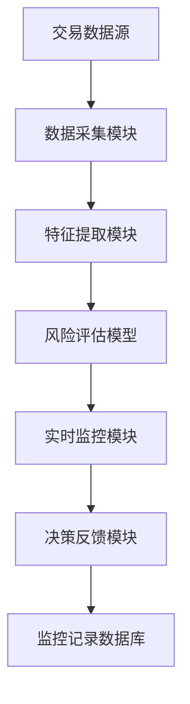

                 


# 构建智能企业风控系统：实时交易监控与欺诈检测的AI增强

## 关键词：企业风控系统，AI增强，实时交易监控，欺诈检测，机器学习，深度学习，系统架构

## 摘要：  
随着数字化转型的深入，企业风控系统在实时交易监控和欺诈检测方面面临着越来越复杂的挑战。传统的基于规则的风控系统已难以应对高度动态的欺诈手段。本文将详细探讨如何通过人工智能技术增强企业风控系统，特别是在实时交易监控与欺诈检测中的应用。我们将从核心概念、技术基础、算法原理、系统架构设计到项目实战，全面解析构建智能企业风控系统的各个方面，结合实际案例和代码实现，为读者提供深入的技术洞察。

---

# 第一部分: 企业风控系统概述

## 第1章: 企业风控系统背景与概述

### 1.1 企业风控系统的重要性

#### 1.1.1 企业风控的基本概念  
企业风控系统是通过对企业的各项业务数据进行实时监控和分析，识别潜在风险并采取相应措施，以保护企业资产和声誉的系统。  

#### 1.1.2 风险管理的核心目标  
风险管理的核心目标是通过预防、检测和应对策略，降低企业面临的风险，包括财务风险、操作风险、信用风险等。  

#### 1.1.3 数字化风控的必要性  
随着企业业务的数字化，数据量的激增和复杂性增加，传统的基于规则的风控方式已无法满足实时性和精准性的要求，数字化风控成为必然选择。  

### 1.2 实时交易监控与欺诈检测

#### 1.2.1 交易监控的定义与作用  
交易监控是对企业所有交易行为进行实时观察和分析，识别异常交易行为，防止欺诈、洗钱等非法活动。  

#### 1.2.2 欺诈检测的挑战与意义  
欺诈检测的挑战在于欺诈手段的多样性和隐蔽性，而其意义在于保护企业和消费者免受经济损失，维护信任关系。  

#### 1.2.3 AI在风控中的增强作用  
人工智能技术（如机器学习、深度学习）能够通过分析海量数据，识别复杂模式，显著提升欺诈检测的准确性和效率。  

---

## 第2章: AI增强的企业风控系统

### 2.1 AI在企业风控中的应用场景

#### 2.1.1 实时交易监控  
AI技术可以实时分析交易数据，识别异常行为，如交易金额突然增加、交易地点异常变化等。  

#### 2.1.2 欺诈行为识别  
通过机器学习模型，AI能够识别欺诈交易的模式，如重复交易、虚假身份验证等。  

#### 2.1.3 风险评估与预测  
AI可以通过历史数据和实时数据，预测未来的风险，并提供风险缓解策略。  

### 2.2 AI增强风控的核心优势

#### 2.2.1 高效性与实时性  
AI算法能够快速处理大量数据，实现实时监控和响应。  

#### 2.2.2 数据驱动的精准性  
基于海量数据的分析，AI能够识别复杂的欺诈模式，提高检测的准确性。  

#### 2.2.3 模型的可解释性  
通过可解释的机器学习模型（如随机森林、逻辑回归），AI能够提供清晰的决策依据，帮助业务人员理解模型的判断逻辑。  

### 2.3 企业风控系统的边界与外延

#### 2.3.1 系统功能边界  
企业风控系统的功能边界包括数据采集、特征提取、模型训练、实时监控和决策反馈。  

#### 2.3.2 与其他系统的交互  
企业风控系统需要与企业内部的其他系统（如支付系统、数据库）以及外部数据源（如第三方征信机构）进行交互。  

#### 2.3.3 系统的扩展性与灵活性  
系统的架构设计应具备良好的扩展性，能够根据业务需求快速调整功能模块。  

---

# 第二部分: 核心概念与技术基础

## 第3章: 核心概念与联系

### 3.1 企业风控系统的核心要素

#### 3.1.1 数据源与数据类型  
企业风控系统的主要数据源包括交易数据、用户行为数据、设备信息等，数据类型包括结构化数据和非结构化数据。  

#### 3.1.2 风险评估模型  
风险评估模型是基于历史数据训练的机器学习模型，用于预测交易的风险等级。  

#### 3.1.3 监控与反馈机制  
监控机制负责实时分析交易数据，反馈机制则根据模型预测结果调整监控策略。  

### 3.2 实时交易监控与欺诈检测的关联

#### 3.2.1 交易数据的特征分析  
特征分析是将交易数据转化为模型可理解的特征，如交易金额、时间间隔、地理位置等。  

#### 3.2.2 欺诈行为的模式识别  
通过分析欺诈交易的特征，识别其模式，如特定的交易频率、金额分布等。  

#### 3.2.3 监控系统的反馈机制  
监控系统通过反馈机制不断优化模型参数，提高检测的准确性和召回率。  

### 3.3 核心概念的ER实体关系图

```mermaid
er
    entity 交易数据 {
        key 交易ID
        attribute 时间戳, 用户ID, 交易金额, 交易地点
    }
    entity 用户行为 {
        key 用户ID
        attribute 登录时间, 设备信息, 地理位置
    }
    entity 风险评估模型 {
        key 模型ID
        attribute 风险阈值, 模型参数, 更新时间
    }
    entity 监控记录 {
        key 记录ID
        attribute 交易ID, 风险等级, 处理结果
    }
    relationship 交易数据 -[属于]-> 用户行为
    relationship 交易数据 -[使用]-> 风险评估模型
    relationship 监控记录 -[记录]-> 风险评估模型
```

---

## 第4章: 技术基础与算法原理

### 4.1 机器学习与深度学习的基础知识

#### 4.1.1 机器学习的基本概念  
机器学习是通过数据训练模型，使其能够自动识别数据中的模式。  

#### 4.1.2 深度学习的原理  
深度学习通过多层神经网络提取数据的高层次特征，适用于复杂的非线性问题。  

### 4.2 欺诈检测的经典算法

#### 4.2.1 随机森林  
随机森林是一种基于决策树的集成学习算法，适用于分类和回归问题。  

#### 4.2.2 逻辑回归  
逻辑回归是一种用于分类的线性模型，常用于二分类问题。  

#### 4.2.3 神经网络  
神经网络通过多层结构模拟人脑的神经网络，适用于复杂的模式识别任务。  

### 4.3 算法实现与数学模型

#### 4.3.1 随机森林的数学模型  
随机森林通过特征袋装和特征子集选择，生成多个决策树，并通过投票或加权的方式进行预测。  

#### 4.3.2 逻辑回归的公式  
逻辑回归的损失函数为对数损失，通过求解梯度下降优化参数。  

$$ \text{损失函数} = -\sum_{i=1}^{n} [y_i \ln(p_i) + (1 - y_i)\ln(1 - p_i)] $$  
其中，$p_i$ 是预测概率，$y_i$ 是标签。  

---

## 第5章: 系统分析与架构设计

### 5.1 问题场景介绍

#### 5.1.1 交易监控的实时性要求  
系统需要对每笔交易进行实时分析，确保在交易发生时就能识别出异常行为。  

#### 5.1.2 模型的可扩展性需求  
系统需要支持大规模数据的处理和模型的快速迭代。  

### 5.2 系统功能设计

#### 5.2.1 数据采集模块  
负责采集交易数据、用户行为数据等。  

#### 5.2.2 特征提取模块  
将原始数据转化为模型可识别的特征。  

#### 5.2.3 模型训练模块  
基于历史数据训练风险评估模型。  

#### 5.2.4 实时监控模块  
对实时交易数据进行分析，识别异常行为。  

#### 5.2.5 决策反馈模块  
根据模型预测结果调整监控策略。  

### 5.3 系统架构设计



---

## 第6章: 项目实战

### 6.1 环境配置

#### 6.1.1 安装Python环境  
使用Anaconda安装Python 3.8及以上版本。  

#### 6.1.2 安装依赖库  
安装必要的库，如scikit-learn、xgboost、pandas等。  

### 6.2 核心代码实现

#### 6.2.1 数据预处理

```python
import pandas as pd

# 加载数据
df = pd.read_csv('transaction_data.csv')

# 处理缺失值
df.dropna(inplace=True)

# 标签编码
from sklearn.preprocessing import LabelEncoder

le = LabelEncoder()
df['label'] = le.fit_transform(df['label'])
```

#### 6.2.2 特征工程

```python
from sklearn.feature_selection import SelectKBest

selector = SelectKBest(k=10)
selector.fit_transform(df.drop('label', axis=1), df['label'])
```

#### 6.2.3 模型训练与验证

```python
from sklearn.ensemble import RandomForestClassifier
from sklearn.metrics import accuracy_score

model = RandomForestClassifier(n_estimators=100, random_state=42)
model.fit(X_train, y_train)

y_pred = model.predict(X_test)
print("Accuracy:", accuracy_score(y_test, y_pred))
```

### 6.3 案例分析与结果解读

#### 6.3.1 模型性能分析  
通过混淆矩阵、ROC曲线等指标评估模型的性能。  

#### 6.3.2 模型部署与监控  
将模型部署到生产环境，实现实时监控和预测。  

---

## 第7章: 最佳实践与小结

### 7.1 最佳实践

#### 7.1.1 数据质量管理  
确保数据的完整性和准确性，避免噪声数据干扰模型。  

#### 7.1.2 模型监控与更新  
定期监控模型性能，及时更新模型参数和特征。  

#### 7.1.3 数据隐私保护  
遵守数据隐私法规，确保数据的安全性和合规性。  

### 7.2 小结  
通过AI技术增强企业风控系统，能够显著提升实时交易监控和欺诈检测的效率和准确性。结合机器学习和深度学习算法，企业可以构建更加智能和灵活的风控体系。  

---

## 作者：AI天才研究院/AI Genius Institute & 禅与计算机程序设计艺术 /Zen And The Art of Computer Programming

