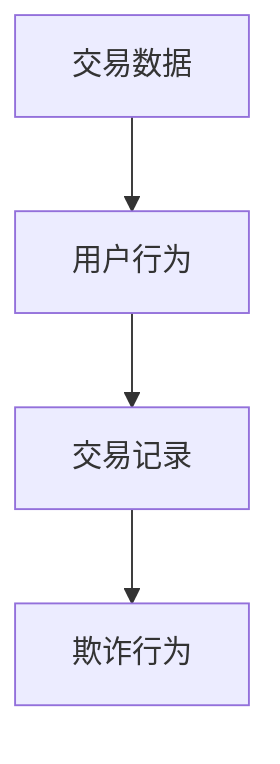
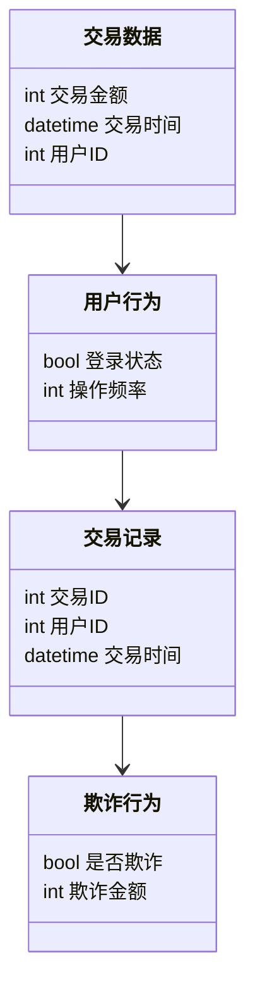
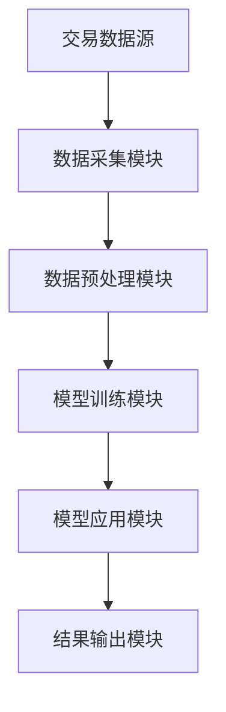
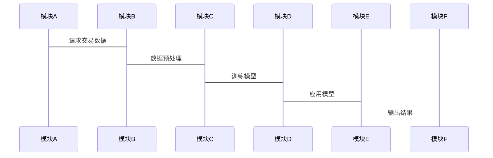

                 


# 构建智能企业风控系统：实时交易监控与欺诈模式识别

## 关键词：企业风控，实时交易监控，欺诈模式识别，人工智能，机器学习，系统架构

## 摘要：本文详细探讨了如何利用人工智能和机器学习技术构建智能企业风控系统，重点介绍了实时交易监控与欺诈模式识别的核心概念、算法原理、系统架构设计及项目实战。通过理论与实践结合，为读者提供构建高效智能风控系统的方法和思路。

---

## 第一部分: 智能企业风控系统背景与概述

### 第1章: 智能企业风控系统概述

#### 1.1 企业风控系统的重要性

企业风控系统是保障企业交易安全的重要防线，尤其是在金融、电商等领域，实时交易监控和欺诈模式识别能够有效预防和减少经济损失。随着互联网和移动支付的普及，欺诈手段日益复杂，传统的风控系统已难以应对新型威胁，因此智能化的风控系统成为必然选择。

#### 1.2 实时交易监控的必要性

实时交易监控能够快速识别异常交易行为，及时阻止欺诈发生。通过分析交易数据中的模式和异常点，系统可以在毫秒级别做出反应，确保交易的安全性。

#### 1.3 欺诈模式识别的挑战

欺诈行为多样化且不断演变，传统的规则-based系统难以应对复杂场景。机器学习和深度学习等技术能够从海量数据中提取特征，识别潜在的欺诈模式，提高检测的准确性和效率。

---

### 第2章: 核心概念与联系

#### 2.1 智能风控系统的核心概念

- **实时交易监控**：对交易数据进行实时分析，识别异常交易行为。
- **欺诈模式识别**：利用机器学习算法识别欺诈交易的模式和特征。

#### 2.2 核心概念之间的关系

| 概念 | 定义 | 关系 |
|------|------|------|
| 实时交易监控 | 数据采集与实时分析 | 数据输入 -> 模型处理 -> 输出结果 |
| 欺诈模式识别 | 通过算法识别欺诈特征 | 数据分析 -> 模型训练 -> 模型应用 |

#### 2.3 实体关系图（ER图）



---

## 第二部分: 智能风控系统的算法原理

### 第3章: 算法原理讲解

#### 3.1 监督学习算法

- **随机森林算法**：通过决策树进行特征提取和分类。

```python
import pandas as pd
from sklearn.ensemble import RandomForestClassifier

# 示例数据
data = pd.DataFrame({'交易金额': [100, 200, 300, 400], '交易时间': ['09:00', '10:00', '11:00', '12:00'], '用户ID': [1, 2, 3, 4]})
model = RandomForestClassifier()
model.fit(data[['交易金额', '交易时间']], data['用户ID'])
```

- **数学公式**：随机森林的特征重要性计算公式如下：
  $$
  \text{特征重要性} = \sum_{i=1}^{n} \text{特征贡献度}
  $$

#### 3.2 无监督学习算法

- **聚类分析**：K-means算法用于识别异常交易群体。

```python
from sklearn.cluster import KMeans

data = pd.DataFrame({'交易金额': [100, 200, 300, 400], '交易时间': ['09:00', '10:00', '11:00', '12:00']})
model = KMeans(n_clusters=2)
model.fit(data[['交易金额', '交易时间']])
```

#### 3.3 强化学习算法

- **Q-Learning**：用于动态调整风控策略。

```python
import numpy as np

# 示例状态和动作空间
state_space = ['正常交易', '异常交易']
action_space = ['允许', '阻止']

# Q-learning算法实现
class QLearning:
    def __init__(self, states, actions):
        self.q_table = {s: {a: 0 for a in actions} for s in states}

    def update(self, state, action, reward):
        self.q_table[state][action] += reward
```

---

## 第三部分: 智能风控系统的系统分析与架构设计

### 第4章: 系统分析与架构设计方案

#### 4.1 问题场景介绍

- **在线支付系统**：实时监控交易，识别欺诈行为。

#### 4.2 系统功能设计



#### 4.3 系统架构设计



#### 4.4 接口设计与交互流程



---

## 第四部分: 智能风控系统的项目实战

### 第5章: 项目实战

#### 5.1 环境安装

```bash
pip install numpy pandas scikit-learn
```

#### 5.2 核心代码实现

```python
from sklearn.ensemble import RandomForestClassifier
from sklearn.metrics import accuracy_score

# 示例数据
data = pd.DataFrame({
    '交易金额': [100, 200, 300, 400],
    '交易时间': ['09:00', '10:00', '11:00', '12:00'],
    '用户ID': [1, 2, 3, 4],
    '是否欺诈': [False, True, False, True]
})

# 特征与标签
X = data[['交易金额', '交易时间']]
y = data['是否欺诈']

# 模型训练
model = RandomForestClassifier()
model.fit(X, y)

# 预测
predicted = model.predict(X)
print('准确率:', accuracy_score(y, predicted))
```

#### 5.3 代码解读与分析

- **特征提取**：从交易金额和时间中提取特征。
- **模型训练**：使用随机森林算法训练模型。
- **结果输出**：计算准确率，评估模型性能。

#### 5.4 实际案例分析

- **案例1**：正常交易金额为100，时间为09:00，模型预测为非欺诈。
- **案例2**：交易金额为200，时间为10:00，模型预测为欺诈。

---

## 第五部分: 最佳实践与总结

### 第6章: 最佳实践

#### 6.1 注意事项

- **数据质量**：确保数据的完整性和准确性。
- **模型更新**：定期更新模型，适应新的欺诈手段。

#### 6.2 小结

本文详细介绍了智能企业风控系统的构建过程，从背景到算法，再到系统设计和项目实战，为读者提供了全面的指导。

#### 6.3 拓展阅读

- 推荐阅读《机器学习实战》和《深度学习》等书籍，深入理解相关算法和技术。

---

## 作者：AI天才研究院 & 禅与计算机程序设计艺术

感谢您的阅读！希望本文对您构建智能企业风控系统有所帮助。如需进一步探讨，请随时联系！

