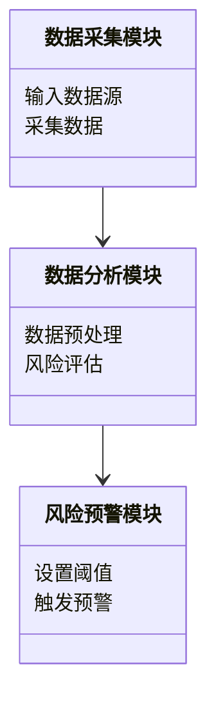
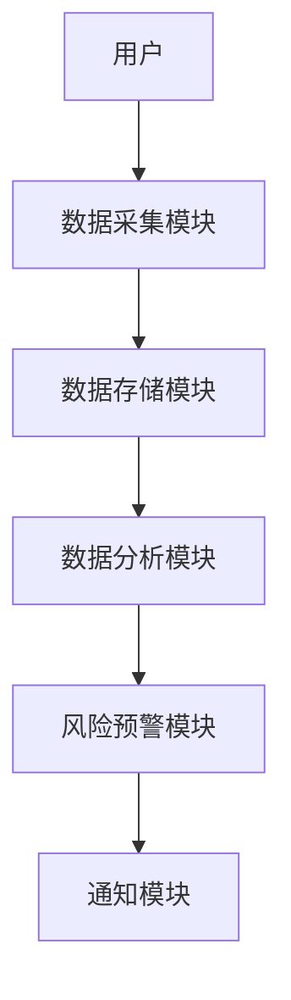

                 


# 构建智能企业风控系统：实时监控与风险预警

---

## 关键词：企业风控、实时监控、风险预警、智能风控、异常检测、时间序列分析

---

## 摘要：  
随着企业规模的不断扩大和业务的复杂化，风险控制变得至关重要。智能企业风控系统通过实时监控和风险预警，利用大数据和人工智能技术，帮助企业及时识别和应对潜在风险。本文将从背景、核心概念、算法原理、系统架构到项目实战，全面解析智能企业风控系统的构建过程，为读者提供深入的技术指导。

---

# 第1章: 智能企业风控系统背景与需求

## 1.1 企业风控的基本概念

### 1.1.1 什么是企业风控  
企业风控（Enterprise Risk Management，ERM）是指企业通过识别、评估和应对各种潜在风险，以确保业务目标的实现。它是企业管理的重要组成部分，涉及财务、运营、法律、市场等多个方面。  

### 1.1.2 企业风控的核心目标  
企业风控的核心目标包括：  
1. 识别潜在风险，避免或减少损失。  
2. 提高企业决策的准确性，优化资源配置。  
3. 建立风险预警机制，及时应对突发事件。  

### 1.1.3 企业风控的边界与外延  
企业风控的边界主要集中在企业内部管理和外部环境的相互作用。外延则扩展到与企业相关的供应链、合作伙伴、客户等外部因素。  

---

## 1.2 风险监控与预警的必要性

### 1.2.1 企业经营中的主要风险类型  
常见的企业风险类型包括：  
- **市场风险**：市场需求变化、价格波动等。  
- **信用风险**：客户违约、供应商延迟交付等。  
- **操作风险**：内部流程错误、系统故障等。  
- **合规风险**：法律、法规的合规性问题。  

### 1.2.2 风险监控对企业的重要性  
风险监控是企业风控的核心环节，能够帮助企业：  
1. 及时发现潜在风险，避免重大损失。  
2. 提高企业的抗风险能力，增强市场竞争力。  
3. 优化内部流程，提升运营效率。  

### 1.2.3 风险预警机制的作用  
风险预警机制通过实时监控和数据分析，能够：  
1. 提前发现潜在风险，避免问题扩大化。  
2. 为管理层提供决策支持，制定应对策略。  
3. 实现风险的动态管理，确保企业稳健发展。  

---

## 1.3 传统风控与智能风控的对比

### 1.3.1 传统风控的特点与局限  
传统风控主要依赖人工审核和静态数据分析，存在以下局限：  
1. **效率低**：人工审核耗时长，难以应对海量数据。  
2. **覆盖面窄**：难以覆盖所有业务场景，存在盲区。  
3. **滞后性**：发现问题时，风险可能已经造成损失。  

### 1.3.2 智能风控的优势与创新  
智能风控通过引入大数据和人工智能技术，具有以下优势：  
1. **实时性**：能够实时监控数据，快速识别风险。  
2. **精准性**：基于机器学习算法，能够精准预测和定位风险。  
3. **全面性**：覆盖更多业务场景，减少盲区。  

### 1.3.3 智能风控的核心要素  
智能风控的核心要素包括：  
1. **数据源**：包括企业内部数据和外部数据。  
2. **算法模型**：如时间序列分析、异常检测等。  
3. **实时监控**：通过流数据处理技术实现。  
4. **预警机制**：基于风险评分模型，触发预警通知。  

---

## 1.4 本章小结  
本章介绍了企业风控的基本概念、风险监控的必要性以及传统风控与智能风控的对比。通过对比分析，我们看到智能风控在实时性、精准性和全面性方面的优势，为后续章节的深入探讨奠定了基础。

---

# 第2章: 智能企业风控系统的核心概念

## 2.1 实时监控与风险预警的定义

### 2.1.1 实时监控的定义与特点  
实时监控是指通过持续采集和分析数据，及时发现和处理潜在风险。其特点包括：  
- **实时性**：数据采集和分析同步进行。  
- **连续性**：监控过程不间断。  
- **动态性**：能够根据数据变化实时调整监控策略。  

### 2.1.2 风险预警的定义与机制  
风险预警是通过设定阈值和触发条件，当风险指标达到一定程度时，系统自动发出预警通知。机制包括：  
1. **阈值设定**：根据历史数据和业务需求，设定预警阈值。  
2. **触发条件**：当数据点超过阈值时，触发预警。  
3. **通知机制**：通过邮件、短信或系统提示通知相关人员。  

---

## 2.2 风险评估与预测模型

### 2.2.1 风险评估的基本原理  
风险评估是通过对数据的分析，量化风险的可能性和影响程度。其基本原理包括：  
1. **数据采集**：收集相关业务数据。  
2. **特征提取**：从数据中提取有意义的特征。  
3. **风险评分**：基于特征对风险进行评分。  

### 2.2.2 风险预测模型的构建  
风险预测模型可以通过机器学习算法（如逻辑回归、随机森林）或深度学习模型（如LSTM）构建。模型的构建步骤包括：  
1. **数据预处理**：清洗、归一化等。  
2. **特征工程**：提取关键特征。  
3. **模型训练**：选择合适的算法进行训练。  
4. **模型评估**：通过准确率、召回率等指标评估模型性能。  

---

## 2.3 数据驱动的风控分析

### 2.3.1 数据来源与特征分析  
数据来源包括企业内部数据（如财务数据、销售数据）和外部数据（如市场数据、舆情数据）。特征分析需要关注关键指标，如交易金额、时间间隔等。  

### 2.3.2 数据预处理与特征工程  
数据预处理包括数据清洗、缺失值处理等。特征工程则需要提取特征，并进行降维处理（如PCA）。  

---

## 2.4 本章小结  
本章详细介绍了智能企业风控系统的核心概念，包括实时监控、风险预警、风险评估和数据驱动的风控分析。这些内容为后续章节的算法实现和系统设计提供了理论基础。

---

# 第3章: 智能风控系统的算法原理

## 3.1 时间序列分析

### 3.1.1 时间序列的基本概念  
时间序列是指按时间顺序排列的数据。时间序列分析的目标是通过历史数据预测未来趋势。  

### 3.1.2 时间序列预测的常用方法  
常用的时间序列预测方法包括：  
- **ARIMA模型**：适用于线性趋势和季节性变化的数据。  
- **LSTM模型**：适用于非线性变化的数据，具有良好的记忆能力。  

### 3.1.3 ARIMA模型的原理与应用  
ARIMA（自回归积分滑动平均模型）由AR、I、MA三个部分组成。其数学公式如下：  
$$ ARIMA(p, d, q) = y_t = \phi_1 y_{t-1} + \dots + \phi_p y_{t-p} + \theta_1 \epsilon_{t-1} + \dots + \theta_q \epsilon_{t-q} + \epsilon_t $$  
其中，$p$为自回归阶数，$d$为差分阶数，$q$为滑动平均阶数。  

---

## 3.2 异常检测算法

### 3.2.1 基于统计的异常检测  
基于统计的方法包括Z-score和孤立森林等。Z-score公式为：  
$$ Z = \frac{X - \mu}{\sigma} $$  
其中，$\mu$为均值，$\sigma$为标准差。  

### 3.2.2 基于机器学习的异常检测  
基于机器学习的方法包括随机森林和SVM等。随机森林通过特征重要性识别异常点。  

### 3.2.3 基于深度学习的异常检测  
基于深度学习的方法包括AE（自编码器）和VAE（变分自编码器）。AE通过重构误差识别异常点。  

---

## 3.3 风险评分模型

### 3.3.1 风险评分的定义与作用  
风险评分是对风险程度的量化，用于判断风险的高低。  

### 3.3.2 风险评分的计算方法  
风险评分可以通过线性回归或逻辑回归模型计算。逻辑回归的损失函数为：  
$$ L = -\sum_{i=1}^n [y_i \ln p_i + (1-y_i)\ln(1-p_i)] $$  
其中，$p_i$为预测概率，$y_i$为真实标签。  

---

## 3.4 本章小结  
本章详细介绍了智能风控系统中的算法原理，包括时间序列分析、异常检测和风险评分模型。这些算法为风险监控和预警提供了技术支撑。

---

# 第4章: 智能风控系统的数学模型与公式

## 4.1 时间序列

$$ ARIMA(p, d, q) = y_t = \phi_1 y_{t-1} + \dots + \phi_p y_{t-p} + \theta_1 \epsilon_{t-1} + \dots + \theta_q \epsilon_{t-q} + \epsilon_t $$  

---

## 4.2 异常检测

### 4.2.1 Z-score公式  
$$ Z = \frac{X - \mu}{\sigma} $$  

### 4.2.2 LSTM模型  
LSTM的长时记忆单元公式：  
$$ f_t = \sigma(W_f \cdot [h_{t-1}, x_t] + b_f) $$  
$$ i_t = \sigma(W_i \cdot [h_{t-1}, x_t] + b_i) $$  
$$ o_t = \sigma(W_o \cdot [h_{t-1}, x_t] + b_o) $$  
$$ g_t = \tanh(W_g \cdot [h_{t-1}, x_t] + b_g) $$  
$$ h_t = f_t \cdot h_{t-1} + i_t \cdot g_t $$  

---

## 4.3 风险评分

### 4.3.1 逻辑回归损失函数  
$$ L = -\sum_{i=1}^n [y_i \ln p_i + (1-y_i)\ln(1-p_i)] $$  

### 4.3.2 风险评分公式  
$$ score = \beta_0 + \beta_1 x_1 + \dots + \beta_n x_n $$  
其中，$\beta$为回归系数，$x$为特征变量。  

---

## 4.4 本章小结  
本章通过数学公式详细解释了时间序列分析、异常检测和风险评分模型的原理，为后续章节的系统设计和项目实现提供了理论依据。

---

# 第5章: 智能风控系统的系统分析与架构设计

## 5.1 系统分析

### 5.1.1 项目场景介绍  
假设我们正在为一家电商平台设计智能风控系统，需要实时监控交易数据，识别潜在的欺诈行为。  

### 5.1.2 系统功能设计  
系统功能包括数据采集、风险评估、预警通知和报告生成。  

### 5.1.3 领域模型类图  


---

## 5.2 系统架构设计

### 5.2.1 系统架构图  


### 5.2.2 接口设计  
API接口包括：  
1. 数据采集接口：`POST /api/data`  
2. 风险评估接口：`POST /api/risk`  
3. 预警通知接口：`POST /api/warning`  

---

## 5.3 本章小结  
本章通过系统分析和架构设计，明确了智能风控系统的各个模块和接口设计，为后续的项目实现奠定了基础。

---

# 第6章: 智能风控系统项目实战

## 6.1 环境安装

### 6.1.1 安装Python和相关库  
安装Python 3.8以上版本，安装库：  
```
pip install numpy pandas scikit-learn tensorflow
```

### 6.1.2 安装Jupyter Notebook  
```
pip install jupyter
```

---

## 6.2 系统核心实现

### 6.2.1 数据采集模块  
```python
import requests
import json

def fetch_data(api_key):
    url = f"https://api.example.com/data"
    headers = {'Authorization': f'Bearer {api_key}'}
    response = requests.get(url, headers=headers)
    return response.json()
```

### 6.2.2 数据分析模块  
```python
from sklearn.ensemble import IsolationForest
import numpy as np

def detect_anomalies(data):
    model = IsolationForest(n_estimators=100, contamination=0.05)
    model.fit(data)
    anomalies = model.predict(data)
    return np.where(anomalies == -1)[0]
```

### 6.2.3 风险预警模块  
```python
import pandas as pd
from datetime import datetime

def send_warning(message):
    print(f"Warning: {message} at {datetime.now()}")
    # 实际应用中可以替换为邮件或短信通知
```

---

## 6.3 案例分析

### 6.3.1 数据采集与处理  
假设我们从电商平台获取了交易数据，包括交易时间、金额、用户ID等。  

### 6.3.2 异常检测与预警  
使用Isolation Forest算法检测异常交易，识别出潜在的欺诈行为，并触发预警。  

### 6.3.3 风险评估与报告  
根据风险评分模型，生成风险报告，帮助企业优化风控策略。  

---

## 6.4 本章小结  
本章通过项目实战，详细讲解了智能风控系统的环境搭建、核心实现和案例分析，帮助读者更好地理解和应用相关技术。

---

# 第7章: 智能风控系统的最佳实践与注意事项

## 7.1 最佳实践

### 7.1.1 数据质量控制  
确保数据的完整性和准确性，避免噪声干扰。  

### 7.1.2 模型优化与调参  
通过交叉验证和网格搜索优化模型性能。  

### 7.1.3 系统可扩展性  
设计模块化架构，方便后续功能扩展和性能优化。  

---

## 7.2 注意事项

### 7.2.1 数据隐私与安全  
确保数据在采集、存储和分析过程中的安全性，遵守相关法律法规。  

### 7.2.2 模型解释性  
选择具有良好解释性的模型，便于业务人员理解和调整策略。  

### 7.2.3 系统稳定性  
确保系统具备高可用性和容错能力，避免因系统故障导致监控中断。  

---

## 7.3 未来发展趋势

### 7.3.1 AI与大数据的深度融合  
随着技术进步，AI和大数据的结合将更加紧密，推动风控系统的智能化发展。  

### 7.3.2 自适应风控系统  
未来的风控系统将更加智能化，能够根据环境变化自适应调整监控策略。  

### 7.3.3 区块链技术的应用  
区块链技术在数据安全和信任机制方面的优势，将为风控系统提供新的解决方案。  

---

## 7.4 本章小结  
本章总结了智能风控系统的最佳实践和注意事项，并展望了未来的发展趋势，为读者提供了宝贵的参考和指导。

---

# 作者：AI天才研究院/AI Genius Institute & 禅与计算机程序设计艺术 /Zen And The Art of Computer Programming

---

**[全文结束]**

