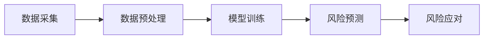
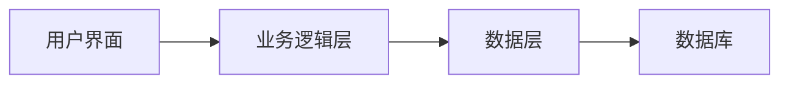

                 


# 构建智能企业风险管理系统：AI预测与防控

## 关键词：智能企业风险管理，AI预测，风险管理模型，数据处理，机器学习算法

## 摘要：  
随着企业规模的不断扩大和业务的复杂化，传统的企业风险管理方式逐渐暴露出效率低下、预测准确性不足等问题。本文将探讨如何利用人工智能技术构建智能企业风险管理系统，通过AI预测与防控实现对企业风险的智能化管理。文章从风险管理的基本概念出发，详细阐述了AI在风险管理中的应用原理、核心算法、系统架构设计及实际项目实现，为企业风险管理的智能化转型提供了理论支持和实践指导。

---

## 第一部分: 企业风险管理与AI预测概述

### 第1章: 企业风险管理的基本概念

#### 1.1 企业风险管理的定义与重要性
企业风险管理（Enterprise Risk Management，ERM）是指通过识别、评估和应对各种可能影响企业目标实现的不确定性因素，以降低风险并抓住机遇的过程。它是企业战略管理的重要组成部分，直接关系到企业的稳健发展和长期价值创造。

**风险管理的核心概念：**  
- **风险识别**：发现可能影响企业目标的各类风险。  
- **风险评估**：分析风险的性质、概率和影响程度。  
- **风险应对**：制定和实施应对策略，降低风险发生的可能性或影响。  

**企业风险管理的必要性：**  
- **保护企业资产**：通过有效管理财务、市场、运营等风险，减少资产损失。  
- **提升决策质量**：基于数据和模型的预测，帮助管理层做出更明智的决策。  
- **增强竞争力**：通过风险防控，优化资源配置，提升企业的市场竞争力。  

**风险管理的边界与外延：**  
- **内部风险**：如运营风险、财务风险等。  
- **外部风险**：如市场风险、政策风险等。  
- **风险管理的外延**：从单纯的损失控制扩展到机会识别和价值创造。

#### 1.2 企业风险管理的常见挑战
传统的企业风险管理方式主要依赖人工分析和经验判断，这种方式存在以下问题：  
1. **数据不足**：难以覆盖所有潜在风险因素。  
2. **模型简单**：传统方法往往基于统计分析，缺乏深度学习能力。  
3. **风险多样性**：企业内外部风险种类繁多，难以全面覆盖。  

### 第2章: AI在企业风险管理中的应用背景

#### 2.1 AI技术的发展与企业风险管理的结合
人工智能技术的快速发展为企业的风险管理带来了新的可能性。AI技术可以通过以下方式提升风险管理的效率和准确性：  
- **数据处理能力**：AI能够处理海量数据，提取关键特征，为风险预测提供支持。  
- **预测能力**：基于机器学习算法，AI可以构建预测模型，识别潜在风险。  
- **实时监控**：通过实时数据分析，AI能够快速发现风险信号，实现早期预警。  

**AI在企业风险管理中的优势：**  
- **高效性**：AI能够快速处理大量数据，提高风险管理的效率。  
- **准确性**：通过深度学习模型，AI可以发现人类难以察觉的模式和关联。  
- **可扩展性**：AI系统可以根据企业的需求进行扩展，适应不同规模和类型的业务。  

#### 2.2 智能企业风险管理系统的重要性
智能企业风险管理系统（Intelligent Enterprise Risk Management System，IERMS）是将AI技术应用于企业风险管理的典型应用。其重要性体现在以下几个方面：  
1. **提高风险管理效率**：通过自动化数据处理和预测模型，减少人工干预，提高效率。  
2. **实现风险预测与防控的智能化**：基于AI的预测模型，系统可以主动识别潜在风险，并提供应对策略。  
3. **支持企业数字化转型**：智能风险管理系统的引入，推动企业的数字化转型，提升整体竞争力。  

---

## 第二部分: 智能企业风险管理系统的核心概念与联系

### 第3章: AI驱动的风险预测与防控原理

#### 3.1 AI在风险预测中的核心原理
AI驱动的风险预测基于机器学习算法，通过训练模型来识别数据中的模式和关联。核心步骤包括：  
1. **数据收集**：从企业内外部获取相关数据，如财务数据、市场数据、运营数据等。  
2. **数据预处理**：清洗数据，去除噪声，提取特征。  
3. **模型训练**：使用监督学习、无监督学习或强化学习算法，训练预测模型。  
4. **风险预测**：基于训练好的模型，对潜在风险进行预测和评估。  

**机器学习模型的应用：**  
- **监督学习**：用于风险分类和回归分析。  
- **无监督学习**：用于异常检测和聚类分析。  
- **深度学习**：用于复杂模式识别，如时间序列预测。  

#### 3.2 风险预测与防控的核心要素
- **数据来源**：包括企业内部数据（如财务报表、运营数据）和外部数据（如市场趋势、政策变化）。  
- **模型选择**：根据风险类型和数据特征，选择合适的算法。  
- **结果解释**：将AI的预测结果转化为可操作的建议，帮助管理层制定应对策略。  

### 第4章: 核心概念与联系的详细分析

#### 4.1 AI模型与风险管理系统的实体关系图


#### 4.2 核心概念的属性特征对比
| 概念       | 属性                   | 特征                       |
|------------|------------------------|----------------------------|
| 数据来源    | 内部数据/外部数据      | 结构化/非结构化数据         |
| 模型选择    | 监督学习/无监督学习    | 线性模型/非线性模型         |
| 预测结果    | 风险概率/风险类别       | 时间序列/分类结果          |

---

## 第三部分: 基于机器学习的风险预测算法实现

### 第5章: 基于时间序列的风险预测算法

#### 5.1 时间序列分析的基本概念
时间序列分析是一种统计方法，用于分析随时间变化的数据。常用的时间序列模型包括ARIMA、LSTM等。

#### 5.2 使用ARIMA模型进行风险预测
ARIMA（AutoRegressive Integrated Moving Average）模型适用于线性时间序列数据的预测。其核心步骤包括：  
1. **数据平稳化**：通过差分使数据平稳。  
2. **模型参数估计**：确定AR和MA的阶数。  
3. **模型验证与预测**：验证模型的准确性，并进行预测。  

**ARIMA模型的数学公式：**  
$$ ARIMA(p, d, q) = y_t = \phi_1 y_{t-1} + \dots + \phi_p y_{t-p} + \theta_1 \epsilon_{t-1} + \dots + \theta_q \epsilon_{t-q} + \epsilon_t $$  

#### 5.3 LSTM网络的时间序列预测
LSTM（Long Short Term Memory）是一种基于深度学习的序列模型，适合处理非线性时间序列数据。

**LSTM网络的结构：**  


---

### 第6章: 风险分类与预测的机器学习算法

#### 6.1 分类算法的基本概念
分类算法用于将数据分为不同的类别，常用算法包括决策树、随机森林、逻辑回归等。

#### 6.2 使用决策树进行风险分类
决策树是一种基于树状结构的分类模型，适合处理离散型风险分类问题。

**决策树的构建过程：**  


#### 6.3 使用随机森林进行风险预测
随机森林是一种基于树集成的算法，具有高准确性和鲁棒性。

**随机森林的数学公式：**  
$$ y = \sum_{i=1}^{n} \text{Tree}(x) $$  

---

## 第四部分: 系统分析与架构设计方案

### 第7章: 问题场景与项目介绍

#### 7.1 问题场景介绍
本文以一家中型制造企业为例，设计一个智能企业风险管理系统。该系统需要实现对财务风险、市场风险和运营风险的预测与防控。

#### 7.2 项目目标与范围
- **项目目标**：构建一个基于AI的智能风险管理系统，实现风险的智能化预测与防控。  
- **项目范围**：涵盖财务、市场、运营三个主要风险领域。

#### 7.3 需求分析
- **功能需求**：风险预测、风险评估、风险应对建议。  
- **数据需求**：财务数据、市场数据、运营数据。  

---

### 第8章: 系统功能设计与架构

#### 8.1 系统功能设计
- **数据采集模块**：从企业内外部获取相关数据。  
- **数据预处理模块**：清洗数据，提取特征。  
- **模型训练模块**：训练机器学习模型。  
- **风险预测模块**：基于模型进行风险预测。  
- **风险应对模块**：生成风险应对策略。  

**系统功能设计的类图：**  


#### 8.2 系统架构设计
- **分层架构**：包括数据层、业务逻辑层和用户界面层。  
- **接口设计**：提供API接口，方便与其他系统集成。  

**系统架构设计的架构图：**  


---

## 第五部分: 项目实战与应用案例

### 第9章: 项目实战与核心代码实现

#### 9.1 环境安装
- **Python环境**：建议使用Anaconda或virtualenv。  
- **依赖库安装**：如pandas、numpy、scikit-learn、keras等。  

#### 9.2 核心代码实现
以下是基于Python的代码示例：

```python
# 数据预处理
import pandas as pd
import numpy as np

# 加载数据
data = pd.read_csv('risk_data.csv')

# 特征提取
X = data.drop('risk_label', axis=1)
y = data['risk_label']

# 划分训练集和测试集
from sklearn.model_selection import train_test_split
X_train, X_test, y_train, y_test = train_test_split(X, y, test_size=0.2)

# 模型训练
from sklearn.ensemble import RandomForestClassifier
model = RandomForestClassifier(n_estimators=100)
model.fit(X_train, y_train)

# 模型预测
y_pred = model.predict(X_test)

# 模型评估
from sklearn.metrics import accuracy_score
print('Accuracy:', accuracy_score(y_test, y_pred))
```

#### 9.3 代码应用解读与分析
- **数据预处理**：清洗数据，提取特征。  
- **模型训练**：使用随机森林算法训练分类模型。  
- **模型预测**：基于训练好的模型，进行风险分类预测。  
- **模型评估**：计算准确率，评估模型性能。  

---

### 第10章: 案例分析与实际应用

#### 10.1 实际应用案例
以某制造企业的财务风险预测为例，使用随机森林算法进行风险分类。通过模型预测，识别潜在的财务风险，并生成应对策略。

#### 10.2 系统交互流程
1. **用户输入**：用户输入企业数据。  
2. **数据处理**：系统自动清洗数据，提取特征。  
3. **模型预测**：系统基于训练好的模型进行风险预测。  
4. **结果展示**：系统生成风险报告，提供应对建议。  

---

## 第六部分: 总结与展望

### 第11章: 总结与最佳实践

#### 11.1 总结
本文详细探讨了如何利用AI技术构建智能企业风险管理系统，从理论到实践，全面介绍了风险管理的核心概念、算法实现和系统设计。通过实际案例的分析，验证了AI技术在风险管理中的有效性。

#### 11.2 最佳实践
- **数据质量**：确保数据的完整性和准确性。  
- **模型选择**：根据业务需求选择合适的算法。  
- **结果解释**：将AI的预测结果转化为可操作的建议。  

### 12章: 展望
随着AI技术的不断进步，智能企业风险管理系统将更加智能化和自动化。未来的研究方向包括：  
- **更复杂的模型**：如图神经网络，用于处理复杂的风险关系。  
- **实时预测**：通过流数据处理技术，实现实时风险预测。  
- **多模态数据融合**：结合文本、图像等多种数据源，提升预测精度。  

---

## 作者：AI天才研究院/AI Genius Institute & 禅与计算机程序设计艺术 /Zen And The Art of Computer Programming

