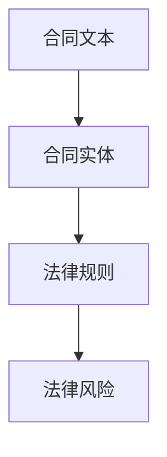
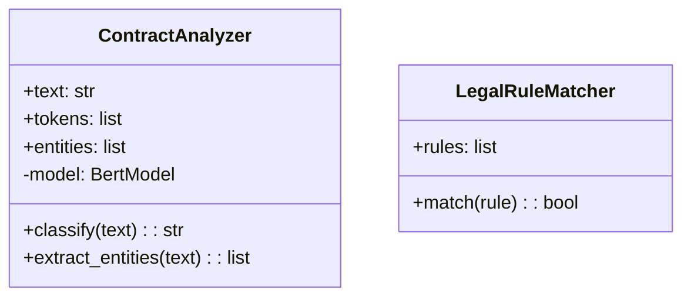
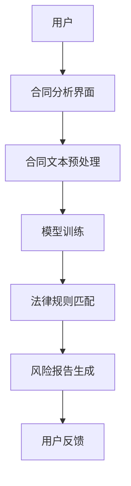
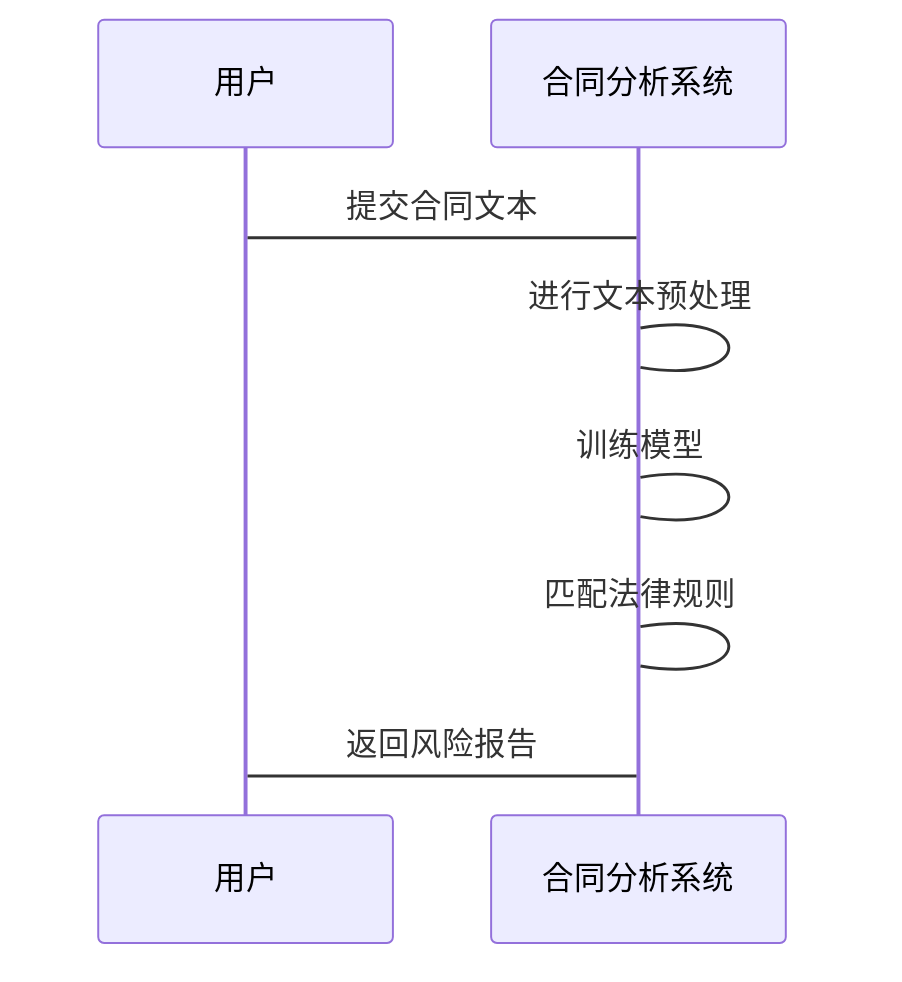

                 


# 构建智能合同分析系统：AI辅助法律风险管理

> 关键词：智能合同分析系统、AI辅助、法律风险管理、自然语言处理、法律规则引擎

> 摘要：本文详细探讨了构建智能合同分析系统的各个方面，包括其背景、核心概念、算法原理、系统架构、项目实战和最佳实践。文章旨在通过清晰的逻辑和专业的技术语言，帮助读者理解如何利用AI技术辅助法律风险管理，构建高效的智能合同分析系统。

---

## 第1章: 智能合同分析系统背景介绍

### 1.1 问题背景

#### 1.1.1 合同分析的复杂性
合同分析是一项复杂的任务，涉及大量法律术语和条款的识别。传统的人工分析方法效率低下，容易出错，尤其是在处理大量合同文档时，容易遗漏关键条款或误解法律条文。

#### 1.1.2 传统合同管理的痛点
- **效率低下**：人工审核合同需要大量时间，尤其是在处理大量合同的情况下。
- **准确性不足**：人为错误可能导致法律风险，例如遗漏关键条款或误读合同条件。
- **一致性缺失**：不同律师对同一合同的解读可能不同，导致不一致的结果。

#### 1.1.3 AI技术在合同管理中的应用潜力
AI技术，尤其是自然语言处理（NLP）和机器学习（ML），能够快速分析大量合同文档，识别关键条款，降低法律风险，并提高效率。

### 1.2 问题描述

#### 1.2.1 合同文本的多样性和复杂性
合同文本通常包含复杂的法律术语和条款，且格式多样，包括表格、段落和列表等。这些多样性和复杂性增加了人工分析的难度。

#### 1.2.2 法律风险的识别与管理难点
- **隐含条款**：某些条款可能隐藏在合同的深层，容易被忽视。
- **条款变更**：合同中的条款可能频繁变更，人工跟踪困难。
- **法律适用性**：不同地区的法律条款不同，需要灵活处理。

#### 1.2.3 传统合同分析的效率瓶颈
传统合同分析主要依赖人工，效率低且容易出错。尤其是在处理大量合同时，人工分析的时间和成本都较高。

### 1.3 问题解决

#### 1.3.1 AI技术如何辅助合同分析
AI技术可以通过以下方式辅助合同分析：
- **自动识别关键条款**：使用NLP技术识别合同中的关键条款，例如违约责任、付款条款等。
- **智能分类**：根据合同类型、行业或地区进行分类，便于后续处理。
- **风险预警**：识别潜在的法律风险，并提供预警。

#### 1.3.2 智能合同分析系统的功能定位
智能合同分析系统的功能定位是辅助法律专业人士快速、准确地分析合同，识别潜在风险，提高效率和准确性。

#### 1.3.3 系统如何降低法律风险
通过自动识别关键条款和潜在风险，系统可以帮助法律专业人士提前发现并处理问题，降低法律纠纷的可能性。

### 1.4 系统的边界与外延

#### 1.4.1 系统的功能边界
智能合同分析系统的功能主要集中在合同文本的分析和法律风险管理，不包括合同生成或其他法律事务的处理。

#### 1.4.2 系统的适用范围
系统适用于需要处理大量合同的企业，尤其是金融、法律和商业领域。它可以帮助企业快速分析合同，降低法律风险。

#### 1.4.3 系统与其他法律管理工具的关系
智能合同分析系统可以与其他法律管理工具（如合同管理软件、法律数据库）集成，形成一个完整的法律风险管理平台。

### 1.5 核心概念组成

#### 1.5.1 合同文本处理
合同文本处理包括文本清洗、分词、实体识别和关键词提取等步骤。这些步骤为后续的分析奠定了基础。

#### 1.5.2 AI模型训练
AI模型训练是通过大量标注数据训练NLP模型，使其能够识别合同中的关键条款和法律风险。

#### 1.5.3 法律规则引擎
法律规则引擎用于根据预定义的法律规则匹配合同内容，识别潜在的法律风险。它通常与AI模型结合使用，提供更准确的结果。

---

## 第2章: 智能合同分析系统的核心概念与联系

### 2.1 核心概念原理

#### 2.1.1 合同文本的特征提取
合同文本的特征提取包括识别合同中的关键词、实体和语义结构。这些特征有助于模型更好地理解合同内容。

#### 2.1.2 AI模型的训练与优化
AI模型的训练涉及数据预处理、模型选择和优化。通过不断迭代训练，模型能够更准确地识别合同中的关键条款。

#### 2.1.3 法律规则的匹配机制
法律规则的匹配机制是通过预定义的规则库，将合同内容与相关法律条款进行匹配，识别潜在的法律风险。

### 2.2 核心概念属性特征对比

| 概念       | 属性特征                     |
|------------|------------------------------|
| 合同文本   | 文本长度、关键词、语义结构     |
| AI模型     | 模型类型、训练数据、准确率     |
| 法律规则   | 法律条款、规则权重、适用场景   |

### 2.3 ER实体关系图



---

## 第3章: 智能合同分析系统的算法原理

### 3.1 算法原理概述

#### 3.1.1 自然语言处理（NLP）算法
NLP算法用于合同文本的分词、实体识别和语义分析。常用算法包括词袋模型（Bag-of-Words）、TF-IDF和神经网络模型（如BERT）。

#### 3.1.2 法律规则匹配算法
法律规则匹配算法通过预定义的规则库，将合同内容与相关法律条款进行匹配，识别潜在的法律风险。

### 3.2 算法实现步骤

#### 3.2.1 合同文本预处理
合同文本预处理包括去除噪声、分词和实体识别。例如，使用jieba进行中文分词。

#### 3.2.2 模型训练
使用预训练的NLP模型（如BERT）进行合同文本分类，识别合同类型和关键条款。

#### 3.2.3 法律规则匹配
将合同内容与法律规则库进行匹配，识别潜在的法律风险。

### 3.3 代码实现

#### 3.3.1 环境安装
```bash
pip install jieba transformers
```

#### 3.3.2 核心代码实现
```python
import jieba
from transformers import BertTokenizer, BertModel

# 分词
def contract_tokenization(text):
    words = jieba.lcut(text)
    return words

# 模型训练
tokenizer = BertTokenizer.from_pretrained('bert-base-chinese')
model = BertModel.from_pretrained('bert-base-chinese')

def contract_classification(text):
    inputs = tokenizer.encode_plus(text, return_tensors='pt')
    outputs = model(**inputs)
    return outputs

# 法律规则匹配
def legal_rule_matching(text):
    rules = ['违约责任', '付款条款', '保密义务']
    for rule in rules:
        if rule in contract_tokenization(text):
            return rule
    return None
```

---

## 第4章: 智能合同分析系统的系统架构设计

### 4.1 系统功能设计

#### 4.1.1 领域模型类图


#### 4.1.2 系统架构图


#### 4.1.3 系统接口设计
系统提供以下接口：
- `contract_tokenization(text: str) -> list`
- `contract_classification(text: str) -> str`
- `legal_rule_matching(text: str) -> str`

#### 4.1.4 系统交互序列图


---

## 第5章: 智能合同分析系统的项目实战

### 5.1 环境安装
```bash
pip install jieba transformers
```

### 5.2 核心代码实现
```python
import jieba
from transformers import BertTokenizer, BertModel

# 分词
def contract_tokenization(text):
    words = jieba.lcut(text)
    return words

# 模型训练
tokenizer = BertTokenizer.from_pretrained('bert-base-chinese')
model = BertModel.from_pretrained('bert-base-chinese')

def contract_classification(text):
    inputs = tokenizer.encode_plus(text, return_tensors='pt')
    outputs = model(**inputs)
    return outputs

# 法律规则匹配
def legal_rule_matching(text):
    rules = ['违约责任', '付款条款', '保密义务']
    for rule in rules:
        if rule in contract_tokenization(text):
            return rule
    return None
```

### 5.3 代码应用解读与分析
- **合同分词**：使用jieba对合同文本进行分词，提取关键词。
- **模型训练**：使用BERT模型对合同文本进行分类，识别合同类型。
- **法律规则匹配**：将合同内容与预定义的法律规则进行匹配，识别潜在的法律风险。

### 5.4 案例分析
以一份简单的合同为例，分析系统的实现步骤：
1. **分词**：将合同文本分词，提取关键词。
2. **模型训练**：使用BERT模型对合同文本进行分类，识别合同类型。
3. **法律规则匹配**：将合同内容与预定义的法律规则进行匹配，识别潜在的法律风险。

### 5.5 项目小结
通过本项目的实战，读者可以掌握智能合同分析系统的实现步骤，包括环境配置、核心代码实现和案例分析。

---

## 第6章: 智能合同分析系统的最佳实践

### 6.1 小结
智能合同分析系统通过AI技术辅助法律风险管理，提高了合同分析的效率和准确性。

### 6.2 注意事项
- 数据隐私保护：确保合同数据的安全和隐私。
- 模型优化：不断优化模型，提高识别准确率。
- 规则库维护：定期更新法律规则库，确保其适用性。

### 6.3 拓展阅读
- 《Python机器学习实战》
- 《自然语言处理入门》
- 《法律风险管理与控制》

---

## 作者信息

作者：AI天才研究院/AI Genius Institute & 禅与计算机程序设计艺术 /Zen And The Art of Computer Programming

---

本文详细探讨了构建智能合同分析系统的各个方面，从背景介绍到算法实现，再到系统架构和项目实战，帮助读者全面理解如何利用AI技术辅助法律风险管理。希望本文能为相关领域的从业者提供有价值的参考和启发。

