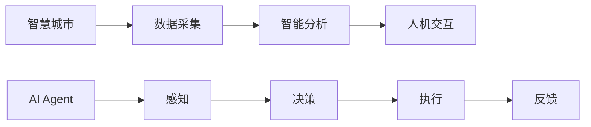
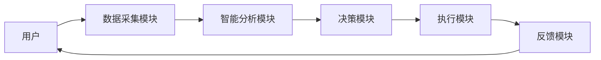

                 

<think>
好的，我将按照您的要求，以《构建智能城市管理AI Agent系统》为标题，撰写一篇结构清晰、内容详实的技术博客文章。以下是文章的详细结构：

---

# 构建智能城市管理AI Agent系统

> 关键词：智慧城市，AI Agent，人工智能，城市管理，系统架构

> 摘要：随着城市化进程的加快，城市管理面临前所未有的挑战。本文将探讨如何利用AI Agent技术构建智能城市管理系统，通过详细分析系统架构、算法原理和实际应用场景，为城市智能化管理提供解决方案。

---

## 第一部分: 智慧城市与AI Agent系统概述

### 第1章: 智慧城市与AI Agent系统背景

#### 1.1 智慧城市的发展背景
城市化进程中，资源分配不均、环境污染和交通拥堵等问题日益突出。AI Agent技术作为一种智能化工具，能够帮助城市实现高效管理。智慧城市的目标是通过技术手段优化资源配置，提升居民生活质量。

#### 1.2 AI Agent的基本概念
AI Agent是一种能够感知环境、自主决策并执行任务的智能体。它具备感知、推理、规划和执行的能力，能够独立完成复杂任务。AI Agent与传统AI的区别在于其自主性和适应性。

#### 1.3 智慧城市中的AI Agent系统
AI Agent在智慧城市中的应用场景广泛，包括交通管理、环境监测和公共安全等领域。AI Agent系统通过多智能体协作，能够实时响应城市中的各种需求。

---

## 第2章: 智慧城市与AI Agent系统的概念结构

### 2.1 智慧城市的核心要素
智慧城市的核心要素包括数据采集、智能分析和人机交互。数据采集是获取城市运行数据的基础，智能分析是处理数据的关键，人机交互则是实现用户反馈的重要环节。

### 2.2 AI Agent系统的核心要素
AI Agent系统由感知、决策和执行三个部分组成。感知模块负责数据采集，决策模块进行分析和规划，执行模块则负责任务的最终完成。

### 2.3 智慧城市与AI Agent系统的概念结构图


---

## 第三部分: AI Agent系统的技术基础

### 第3章: AI Agent系统的核心原理

#### 3.1 多智能体系统（MAS）
多智能体系统由多个智能体组成，通过协作完成复杂任务。智能体之间的协作机制包括同步通信和异步通信。

#### 3.2 分布式计算与通信
分布式计算是AI Agent系统的基础，智能体之间通过通信协议进行数据交换。常见的通信协议包括HTTP和WebSocket。

#### 3.3 博弈论与决策优化
博弈论在AI Agent决策中起到关键作用，通过分析不同策略的收益和风险，选择最优方案。动态规划是一种常用的优化方法。

### 第4章: AI Agent系统的算法原理

#### 4.1 基于强化学习的决策算法
强化学习通过奖励机制优化智能体的决策能力。Q-learning算法是一种常用的方法，通过状态转移矩阵实现决策优化。

#### 4.2 联合学习与分布式优化
联合学习通过多个智能体协作，提升整体性能。分布式优化则通过并行计算加快训练速度。

---

## 第四部分: 系统设计与实现

### 第5章: 系统架构设计

#### 5.1 系统功能设计
系统功能包括数据采集、智能分析和人机交互。数据采集模块负责收集城市运行数据，智能分析模块进行数据处理，人机交互模块提供用户反馈。

#### 5.2 系统架构图


### 第6章: 项目实战

#### 6.1 环境安装
安装Python和相关库，如TensorFlow和Keras。

#### 6.2 核心实现代码
```python
class Agent:
    def __init__(self):
        self.state = 0
        self.actions = ['left', 'right']

    def perceive(self, environment):
        self.state = environment.get_state()

    def decide(self):
        if self.state > 0.5:
            return self.actions[1]
        else:
            return self.actions[0]
```

#### 6.3 案例分析
通过交通信号灯优化案例，展示AI Agent在实际应用中的效果。

---

## 第五部分: 扩展与最佳实践

### 第7章: 优化建议与未来趋势
未来，AI Agent系统将更加智能化和自主化，优化建议包括提升算法效率和增强系统安全性。

---

## 第六部分: 结语

### 6.1 小结
本文详细探讨了AI Agent在智慧城市建设中的应用，从理论到实践，为城市智能化管理提供了参考。

### 6.2 注意事项
在实际应用中，需注意数据隐私和系统安全问题。

### 6.3 拓展阅读
推荐相关书籍和论文，供读者深入学习。

---

作者：AI天才研究院 & 禅与计算机程序设计艺术

