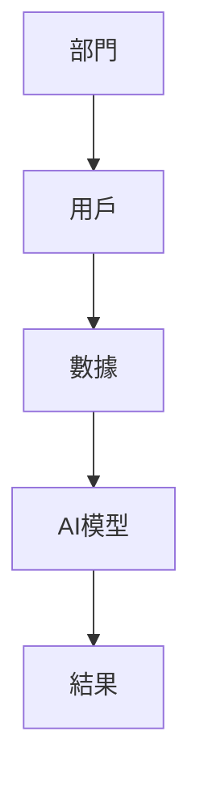
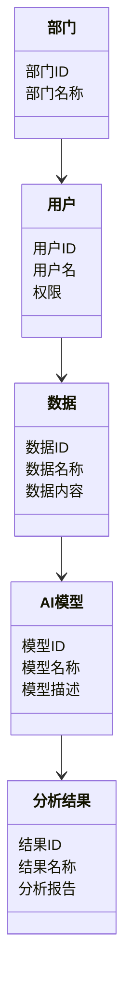
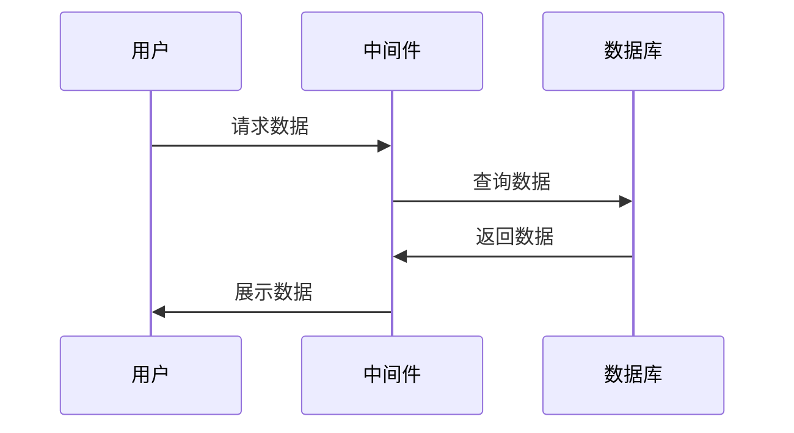

                 


# 构建跨部门AI协作平台：打破信息孤岛

## 关键词：跨部门协作、信息孤岛、AI协作平台、数据共享、系统架构、协同过滤

## 摘要：跨部门协作是企业中常见的挑战，信息孤岛问题严重阻碍了数据共享和协作效率。本文通过构建跨部门AI协作平台，详细探讨了打破信息孤岛的核心概念、算法原理、系统架构和项目实战，提供了实用的技术解决方案和最佳实践。

---

# 第一部分: 背景介绍

## 第1章: 跨部門AI協作平台的背景與挑戰

### 1.1 啥叫跨部門信息孤岛

#### 1.1.1 信息孤岛的定义
信息孤岛是指数据分散在不同的部门或系统中，导致数据无法有效共享和利用的现象。例如，销售部门的客户数据与市场部门的营销数据无法互通，导致重复工作和决策失误。

#### 1.1.2 跨部門協作中的信息孤岛問題
在企业中，跨部门协作常常因信息孤岛而受阻。例如，HR部门和财务部门在处理员工薪资时，可能需要共享员工信息，但由于数据分散，导致效率低下。

#### 1.1.3 信息孤岛对企业的影响
信息孤岛会导致企业内部资源浪费、决策延迟、协作效率低下等问题，进而影响企业的竞争力。

#### 1.1.4 跨部門信息孤岛的特征
跨部门信息孤岛通常表现为：
- 数据格式不统一
- 系统接口不兼容
- 数据权限管理复杂
- 数据冗余和重复

#### 1.1.5 跨部門信息孤岛的分类
跨部门信息孤岛可以分为以下几类：
- 部门间数据孤岛：数据分布在不同部门，无法共享
- 系统间数据孤岛：数据分布在不同系统中，无法互通
- 数据格式孤岛：数据格式不统一，难以整合

### 1.2 跨部門AI協作平台的核心目标

#### 1.2.1 破解信息孤岛，實現數據共享
跨部门AI协作平台的核心目标是打破信息孤岛，实现数据的共享和互通。

#### 1.2.2 提升協作效率，降低溝通成本
通过平台的协作功能，提升跨部门协作效率，降低沟通成本。

#### 1.2.3 支持AI技術在跨部門中的應用
平台需要集成AI技术，支持跨部门的数据分析和决策支持。

### 1.3 跨部門AI協作平台的边界与外延

#### 1.3.1 平台的功能边界
- 数据共享与同步
- AI模型的集成与应用
- 跨部門协作功能的实现

#### 1.3.2 平台的外延應用
- 支持多部門協作
- 支持跨企業協作
- 支持外部合作伙伴的数据共享

#### 1.3.3 平台的技术限制
- 数据安全与隐私保护
- 系统性能限制
- 数据格式兼容性

### 1.4 跨部門AI協作平台的核心要素

#### 1.4.1 平台的基本结构
跨部门AI协作平台通常包括以下几个核心部分：
- 数据存储层
- 数据处理层
- AI模型层
- 用户界面层

#### 1.4.2 平台的关键功能
- 数据上传与下载
- 数据预处理
- AI模型训练与部署
- 数据共享与权限管理
- 结果展示与分析

#### 1.4.3 平台的用户角色
- 管理员：负责平台的管理和配置
- 数据提供者：提供数据的部门
- 数据消费者：需要数据进行分析的部门
- AI开发者：负责AI模型的开发与部署

---

## 第2章: 跨部門協作平台的核心概念與聯絡

### 2.1 跨部門協作平台的定义与原理

#### 2.1.1 平台的定义
跨部门AI协作平台是一个支持多部門協作的平台，通过数据共享和AI技术支持，实现跨部門的高效协作。

#### 2.1.2 平台的工作原理
1. 数据上传：各部门将数据上传到平台
2. 数据处理：平台对数据进行预处理和清洗
3. AI模型训练：AI模型在平台中进行训练
4. 数据分析：各部门使用AI模型进行数据分析
5. 结果展示：平台展示分析结果

#### 2.1.3 平台的核心技术
- 数据存储与管理
- 数据处理与清洗
- AI模型训练与部署
- 数据共享与权限管理

### 2.2 跨部門協作的核心概念

#### 2.2.1 跨部門協作的定义
跨部門協作是指不同部門之間通过共享资源和信息，共同完成任务的过程。

#### 2.2.2 跨部門協作的關鍵要素
- 資源共享
- 信息共享
- 協作流程
- 权限管理

#### 2.2.3 跨部門協作的優勢
- 提高效率
- 降低成本
- 提升决策质量
- 促进创新

### 2.3 跨部門協作平台的實體關係圖



### 2.4 跨部門協作平台的功能特徵对比表

| 特征 | 描述 |
|------|------|
| 跨部門支持 | 支持多部門協作 |
| 数据共享 | 支持數據共享與同步 |
| AI功能 | 集成AI技術進行數據分析 |
| 界面设计 | 提供統一的用戶界面 |
| 安全性 | 提供數據安全保護 |

---

## 第3章: 跨部門AI協作平台的算法原理

### 3.1 協同過濾算法

#### 3.1.1 協同過濾的定義
协同过滤是一种基于用户行为或数据相似性推荐相关内容的算法。

#### 3.1.2 協同過濾的原理
1. 收集用户行为数据
2. 计算用户之间的相似度
3. 根据相似度推荐内容

#### 3.1.3 協同過濾的实现步骤

1. 数据预处理：清洗数据，提取用户行为特征
2. 计算相似度：使用余弦相似度等方法计算用户相似度
3. 推荐生成：根据相似度生成推荐列表

#### 3.1.4 協同過濾的优缺点
- 优点：推荐结果准确，用户接受度高
- 缺点：计算复杂，数据稀疏性问题

### 3.2 協同過濾算法的Python实现

```python
import numpy as np
from sklearn.metrics.pairwise import cosine_similarity

# 示例数据：用户-项目评分矩阵
X = np.array([[4, 3, 0],
              [3, 0, 3],
              [0, 2, 4]])

# 计算余弦相似度
similarity = cosine_similarity(X)
print(similarity)
```

#### 3.2.1 算法的数学模型
$$ \text{余弦相似度} = \frac{\sum x_i y_i}{\sqrt{\sum x_i^2} \sqrt{\sum y_i^2}} $$

#### 3.2.2 算法的公式推导
通过计算用户行为的相似性，生成推荐列表。

#### 3.2.3 算法的案例分析
假设用户A和用户B的评分数据如下：
- 用户A：[4, 3, 0]
- 用户B：[3, 0, 3]
计算他们的余弦相似度：
$$ \text{余弦相似度} = \frac{4*3 + 3*0 + 0*3}{\sqrt{4^2 + 3^2 + 0^2} \times \sqrt{3^2 + 0^2 + 3^2}} = \frac{12}{5 \times 3\sqrt{2}} \approx 0.894 $$

---

## 第4章: 跨部門AI協作平台的系统分析与架构设计

### 4.1 系統分析

#### 4.1.1 項目介紹
跨部门AI协作平台旨在打破信息孤岛，实现数据共享和AI协作。

#### 4.1.2 系統功能設計
- 数据上传与管理
- 数据处理与清洗
- AI模型训练与部署
- 数据共享与权限管理

#### 4.1.3 領域模型设计



#### 4.1.4 系統架构设计


#### 4.1.5 系統接口设计
- 数据接口：数据上传、下载接口
- AI接口：模型训练、预测接口
- 权限接口：权限管理接口

#### 4.1.6 系統交互流程



---

## 第5章: 跨部門AI協作平台的项目实战

### 5.1 環境安裝

```bash
# 安装必要的库
pip install numpy pandas scikit-learn flask
```

### 5.2 系統核心實現

```python
from flask import Flask, request, jsonify

app = Flask(__name__)

@app.route('/upload', methods=['POST'])
def upload():
    # 获取上传的数据
    data = request.json
    # 数据处理
    return jsonify({'status': 'success', 'message': '数据上传成功'})

if __name__ == '__main__':
    app.run(debug=True)
```

### 5.3 系統核心代码實現

```python
import numpy as np
from sklearn.neighbors import NearestNeighbors

# 数据预处理
X = np.array([[4, 3, 0],
              [3, 0, 3],
              [0, 2, 4]])

# 训练模型
model = NearestNeighbors(n_neighbors=2, metric='cosine')
model.fit(X)

# 查询相似用户
distances, indices = model.kneighbors([4, 3, 0])
print(indices)
```

### 5.4 案例分析

#### 5.4.1 数据上传与处理
1. 用户上传数据
2. 平台对数据进行清洗和预处理
3. 数据存储到数据库

#### 5.4.2 AI模型训练
1. 使用预处理后的数据训练AI模型
2. 模型部署到平台
3. 用户可以通过平台调用模型进行数据分析

#### 5.4.3 数据共享与权限管理
1. 数据上传后，设置数据的访问权限
2. 其他部门根据权限访问数据
3. 数据使用情况可以被监控和记录

---

## 第6章: 总结与展望

### 6.1 总结
跨部门AI协作平台通过打破信息孤岛，实现了数据共享和高效协作。平台结合了AI技术，为企业提供了强大的数据分析能力。

### 6.2 展望
未来，跨部门AI协作平台将更加智能化，支持更多AI技术的应用，如自然语言处理、机器学习等。同时，平台的安全性和数据隐私保护也将进一步加强。

---

## 附錄

### 附錄A: 颸要術語表

- 跨部門信息孤岛：数据分散在不同部门，无法共享的现象
- 協同過濾：基于用户行为或数据相似性推荐相关内容的算法
- 系統架構：平台的技术架构设计

### 附錄B: 関連閱讀

- 《分布式系统设计与实现》
- 《机器学习实战》
- 《企业架构设计：复杂系统的构建》

---

## 作者信息

作者：AI天才研究院/AI Genius Institute & 禅与计算机程序设计艺术 /Zen And The Art of Computer Programming

---

这篇文章详细介绍了跨部门AI协作平台的构建，从背景、核心概念到算法原理、系统设计和项目实战，内容丰富，结构清晰。

