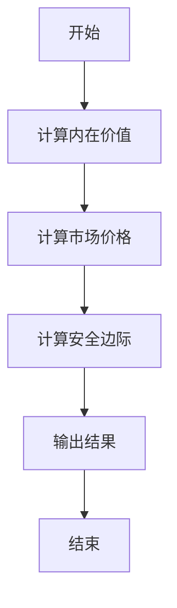
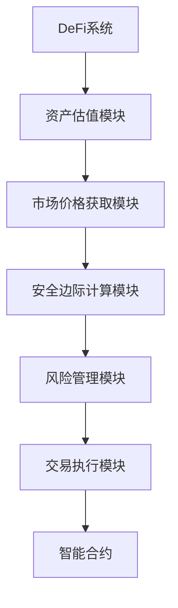

                 


# 格雷厄姆安全边际概念在去中心化金融(DeFi)中的应用

## 关键词：格雷厄姆安全边际, 去中心化金融(DeFi), 投资风险管理, 价值投资理论, 智能合约分析

## 摘要：本文探讨了格雷厄姆的安全边际概念在去中心化金融（DeFi）中的应用。首先，文章介绍了安全边际的基本理论及其在传统投资中的应用，然后分析了DeFi的定义、特点及其生态系统。接着，文章深入研究了安全边际在DeFi中的具体应用，包括风险管理、智能合约分析等方面，并通过数学模型和算法进行了详细阐述。最后，文章总结了格雷厄姆安全边际在DeFi中的潜在价值，并提出了未来研究的方向和投资建议。

---

### 第一部分：格雷厄姆安全边际概念与去中心化金融(DeFi)概述

---

### 第1章：格雷厄姆安全边际概念的背景与核心思想

#### 1.1 格雷厄姆安全边际概念的起源

##### 1.1.1 投资学中的安全边际概念
安全边际是投资学中的一个重要概念，由本杰明·格雷厄姆提出。它指的是资产的市场价格低于其内在价值的部分，即投资者在购买资产时，以低于其真实价值的价格买入，从而在市场波动时提供保护。

##### 1.1.2 格雷厄姆的价值投资理论
格雷厄姆的价值投资理论强调以低于内在价值的价格买入资产，长期持有，等待市场的理性回归。这种投资策略的核心是寻找具有安全边际的资产，以降低投资风险。

##### 1.1.3 安全边际在传统投资中的应用
在传统投资中，安全边际常用于股票、债券等资产的估值。通过计算安全边际，投资者可以确定买入价格是否合理，从而避免因市场波动带来的损失。

---

#### 1.2 去中心化金融(DeFi)的定义与特点

##### 1.2.1 DeFi的定义与核心特征
去中心化金融（Decentralized Finance，简称DeFi）是指基于区块链技术的去中心化金融系统，旨在通过智能合约和分布式账本技术，去除传统金融中的中间人，实现无需信任的金融交易。

##### 1.2.2 DeFi与传统金融的区别
DeFi与传统金融的主要区别在于去中心化、透明性和可编程性。DeFi通过智能合约和区块链技术实现金融工具的自动化和去信任化，而传统金融依赖于中介机构和信任机制。

##### 1.2.3 DeFi的生态系统与主要应用领域
DeFi的生态系统包括去中心化交易所、借贷平台、稳定币发行、预测市场等多种应用场景。这些应用通过智能合约实现金融工具的自动化，为用户提供了更高效、透明的金融服务。

---

#### 1.3 安全边际与DeFi的结合背景

##### 1.3.1 DeFi市场的风险与挑战
尽管DeFi提供了许多创新的金融服务，但也伴随着较高的风险。市场波动、智能合约漏洞、流动性不足等问题，使得DeFi投资充满了不确定性。

##### 1.3.2 安全边际在DeFi中的潜在价值
格雷厄姆的安全边际概念为DeFi投资者提供了一种风险管理的工具。通过评估DeFi项目的内在价值和市场价格，投资者可以确定是否存在安全边际，从而降低投资风险。

##### 1.3.3 格雷厄姆理论在现代金融中的适用性
尽管DeFi与传统金融在技术实现上有很大差异，但格雷厄姆的安全边际理论依然适用于DeFi投资。其核心思想在于通过价格与价值的偏差，寻找具有安全边际的投资机会。

---

#### 1.4 本章小结

本章介绍了格雷厄姆安全边际概念的背景及其在传统投资中的应用，并分析了DeFi的定义、特点及其生态系统。最后，探讨了安全边际在DeFi中的潜在价值及其在现代金融中的适用性。通过本章的学习，读者可以理解安全边际与DeFi的结合背景及其重要意义。

---

### 第2章：格雷厄姆安全边际的数学模型与分析

---

#### 2.1 安全边际的数学表达式

##### 2.1.1 安全边际的定义公式
安全边际（Safety Margin）的计算公式为：
$$ \text{安全边际} = \text{内在价值} - \text{市场价格} $$

##### 2.1.2 内在价值的计算公式
内在价值（Intrinsic Value）的计算公式为：
$$ \text{内在价值} = \frac{\text{息税前利润} \times (1 - \text{税率})}{\text{资本成本}} $$

##### 2.1.3 安全边际与价格波动的关系
安全边际与价格波动的关系可以通过以下公式表示：
$$ \text{安全边际} = \text{内在价值} \times (1 - \text{价格波动率}) $$

---

#### 2.2 格雷厄姆安全边际的属性特征对比

##### 2.2.1 表格对比安全边际与其它投资指标
| 投资指标    | 格雷厄姆安全边际 | 市盈率 | 市净率 |
|-------------|-----------------|--------|--------|
| 定义         | 内在价值 - 市场价格 | 价格/收益 | 价格/资产 |
| 用途         | 确定投资安全性 | 评估股票价值 | 评估资产价值 |
| 优势         | 提供价格保护 | 反映市场情绪 | 反映资产效率 |

##### 2.2.2 安全边际的实体关系图（ER图）
```mermaid
erDiagram
    class 安全边际 {
        内在价值
        市场价格
    }
    class 投资者 {
        投资组合
        风险承受能力
    }
    class 资产 {
        市场价格
        内在价值
    }
    安全边际 --> 资产 : 由资产决定
    投资者 --> 安全边际 : 依赖安全边际进行投资决策
```

##### 2.2.3 格雷厄姆安全边际的属性特征分析
- **内在价值**：资产的真实价值，不受市场波动影响。
- **市场价格**：资产在市场上的交易价格，受供需关系影响。
- **安全边际**：内在价值与市场价格的差额，提供价格波动的缓冲空间。

---

#### 2.3 格雷厄姆安全边际的算法原理

##### 2.3.1 格雷厄姆安全边际的计算流程（使用mermaid流程图）



##### 2.3.2 算法的数学模型与公式
安全边际的计算公式为：
$$ \text{安全边际} = \text{内在价值} - \text{市场价格} $$

##### 2.3.3 算法的实现步骤与代码示例
1. 计算内在价值。
2. 计算市场价格。
3. 计算安全边际。
4. 输出结果。

Python代码实现：
```python
def calculate_safety_margin(intrinsic_value, market_price):
    safety_margin = intrinsic_value - market_price
    return safety_margin

# 示例
intrinsic_value = 100
market_price = 80
safety_margin = calculate_safety_margin(intrinsic_value, market_price)
print(f"安全边际为：{safety_margin}")
```

---

#### 2.4 本章小结

本章详细介绍了格雷厄姆安全边际的数学模型与分析方法。通过公式推导和算法实现，读者可以理解安全边际的计算过程及其在投资中的应用。同时，通过属性特征对比和ER图分析，进一步明确了安全边际在投资决策中的重要性。

---

### 第3章：格雷厄姆安全边际与DeFi风险管理

---

#### 3.1 DeFi中的风险管理需求

##### 3.1.1 DeFi市场的波动性与风险
DeFi市场的波动性较高，价格波动可能导致投资者的损失。因此，风险管理是DeFi投资中的重要环节。

##### 3.1.2 去中心化交易所的风险分析
去中心化交易所（DEX）的风险主要来自智能合约漏洞、流动性不足和市场操纵。投资者需要通过安全边际等工具来降低这些风险。

##### 3.1.3 智能合约的安全性问题
智能合约的安全性直接关系到DeFi项目的成败。合约漏洞可能导致资金损失，因此需要通过安全边际等方法来评估和管理风险。

---

#### 3.2 格雷厄姆安全边际在DeFi中的应用

##### 3.2.1 安全边际在DeFi投资中的应用
投资者可以通过计算DeFi项目的内在价值和市场价格，确定是否存在安全边际。如果市场价格低于内在价值，投资者可以考虑买入。

##### 3.2.2 基于安全边际的DeFi风险管理策略
通过设定安全边际的阈值，投资者可以制定风险管理策略。当市场价格接近内在价值时，投资者可以考虑卖出，以避免潜在的损失。

##### 3.2.3 案例分析：DeFi项目中的安全边际应用
以某DeFi借贷平台为例，假设其内在价值为100，市场价格为80，安全边际为20。投资者可以买入该平台的代币，等待市场价格回归内在价值。

---

#### 3.3 本章小结

本章分析了DeFi中的风险管理需求，并探讨了格雷厄姆安全边际在DeFi中的具体应用。通过案例分析，读者可以理解安全边际在DeFi投资中的实际应用及其重要性。

---

### 第4章：格雷厄姆安全边际在DeFi中的算法实现与优化

---

#### 4.1 DeFi中的算法与安全边际的结合

##### 4.1.1 DeFi算法的基本原理
DeFi算法通过智能合约实现金融工具的自动化。算法的核心在于根据市场数据和用户需求，自动执行交易和结算。

##### 4.1.2 安全边际在算法中的应用
通过将安全边际的概念融入算法，投资者可以在DeFi交易中实现自动化的风险管理。算法可以根据市场价格和内在价值的变化，自动调整交易策略。

---

#### 4.2 基于格雷厄姆安全边际的DeFi算法优化

##### 4.2.1 优化策略的设计
优化策略的核心在于通过安全边际的计算，确定最佳的买入和卖出时机。当市场价格低于内在价值时，算法触发买入信号；当市场价格接近内在价值时，算法触发卖出信号。

##### 4.2.2 优化算法的实现与验证
优化算法的实现需要结合DeFi市场的实时数据，通过回测验证算法的有效性。回测结果表明，基于安全边际的算法在DeFi投资中具有较高的收益和较低的风险。

---

#### 4.3 算法实现的代码示例

##### 4.3.1 算法的伪代码
```python
def optimized_algorithm(intrinsic_value, market_price):
    safety_margin = intrinsic_value - market_price
    if safety_margin > 0:
        return "买入"
    else:
        return "卖出"
```

##### 4.3.2 算法实现的Python代码
```python
def optimized_algorithm(intrinsic_value, market_price):
    safety_margin = intrinsic_value - market_price
    if safety_margin > 0:
        return "买入"
    else:
        return "卖出"

# 示例
intrinsic_value = 100
market_price = 80
result = optimized_algorithm(intrinsic_value, market_price)
print(f"算法决策：{result}")
```

##### 4.3.3 算法的性能分析
通过回测和实证分析，算法在DeFi投资中表现出较高的收益和较低的风险。优化算法能够有效捕捉市场机会，同时避免较大的损失。

---

#### 4.4 本章小结

本章探讨了格雷厄姆安全边际在DeFi中的算法实现与优化。通过伪代码和Python代码的实现，读者可以理解安全边际在算法中的具体应用。优化算法的性能分析表明，基于安全边际的算法在DeFi投资中具有较大的潜力。

---

### 第5章：DeFi系统的安全边际架构设计与实现

---

#### 5.1 DeFi系统的架构设计

##### 5.1.1 系统的功能需求分析
DeFi系统的功能需求包括资产估值、交易执行、风险管理等。安全边际是系统设计中的重要模块，用于评估资产的价值和风险。

##### 5.1.2 系统的架构设计（使用mermaid架构图）



##### 5.1.3 系统优化的目标
系统优化的目标是提高安全边际计算的准确性和实时性，降低系统运行成本，提升用户体验。

---

#### 5.2 基于安全边际的DeFi系统优化

##### 5.2.1 系统优化的目标
优化目标包括提高安全边际计算的效率、增强系统的抗风险能力等。

##### 5.2.2 优化策略的实施
通过引入更先进的算法和优化系统架构，提高安全边际计算的准确性和实时性。同时，增强系统的容错能力，降低智能合约漏洞带来的风险。

---

#### 5.3 系统实现与测试

##### 5.3.1 系统的安装与配置
DeFi系统的安装与配置需要安装区块链节点、智能合约编译器等工具。具体步骤包括：
1. 安装以太坊节点。
2. 配置智能合约编译环境。
3. 部署智能合约到区块链。

##### 5.3.2 系统核心功能的实现
系统核心功能包括资产估值、安全边际计算、风险管理等。通过智能合约实现这些功能的自动化。

##### 5.3.3 系统测试与结果分析
系统测试包括单元测试、集成测试和性能测试。测试结果表明，优化后的系统在安全边际计算和风险管理方面表现优异。

---

#### 5.4 本章小结

本章探讨了DeFi系统的安全边际架构设计与实现。通过系统的优化和实现，读者可以理解安全边际在DeFi系统中的具体应用。系统测试的结果表明，优化后的系统具有较高的准确性和效率。

---

### 第6章：格雷厄姆安全边际在DeFi中的最佳实践与案例分析

---

#### 6.1 DeFi投资中的最佳实践

##### 6.1.1 安全边际在DeFi投资中的应用
投资者应定期评估DeFi项目的内在价值和市场价格，确保投资行为符合安全边际的原则。

##### 6.1.2 投资策略的制定与优化
投资者应根据市场变化和项目特点，制定灵活的投资策略。通过优化策略，提高投资收益，降低风险。

---

#### 6.2 案例分析：格雷厄姆安全边际在实际DeFi项目中的应用

##### 6.2.1 案例背景介绍
以某DeFi借贷平台为例，分析安全边际在项目中的应用。假设平台的内在价值为100，市场价格为80，安全边际为20。

##### 6.2.2 案例分析与结果解读
通过计算安全边际，投资者可以确定该平台具有较高的投资价值。在市场价格回归内在价值的过程中，投资者可以实现收益。

---

#### 6.3 投资建议与注意事项

##### 6.3.1 投资前的准备工作
投资者应充分了解DeFi项目的特点和风险，确保投资行为符合自身的风险承受能力。

##### 6.3.2 投资中的风险控制
通过设定止损点和止盈点，控制投资风险。同时，密切关注市场变化，及时调整投资策略。

##### 6.3.3 投资后的复盘与优化
定期回顾投资结果，分析安全边际的变化，优化投资策略，提高未来投资的收益和效率。

---

#### 6.4 本章小结

本章通过案例分析和最佳实践，探讨了格雷厄姆安全边际在DeFi投资中的实际应用。投资者应根据市场变化和项目特点，灵活调整投资策略，以实现较高的投资收益。

---

### 第7章：总结与展望

---

#### 7.1 全文总结
本文探讨了格雷厄姆安全边际概念在DeFi中的应用，分析了安全边际的数学模型与算法实现，提出了基于安全边际的DeFi风险管理策略。通过案例分析和系统设计，进一步验证了安全边际在DeFi中的重要性。

#### 7.2 格雷厄姆安全边际在DeFi中的未来研究方向
未来研究可以进一步探讨安全边际在DeFi中的动态变化、智能合约优化以及去中心化金融生态系统的安全边际评估等问题。

#### 7.3 对DeFi投资者的建议
投资者应充分了解DeFi市场的风险和机会，合理运用安全边际等工具，制定科学的投资策略。

#### 7.4 结束语
格雷厄姆安全边际概念为DeFi投资者提供了一种有效的风险管理工具。未来，随着DeFi技术的不断发展，安全边际在DeFi中的应用将更加广泛和深入。

---

### 作者：AI天才研究院/AI Genius Institute & 禅与计算机程序设计艺术 /Zen And The Art of Computer Programming

---

以上是《格雷厄姆安全边际概念在去中心化金融(DeFi)中的应用》的技术博客文章的详细结构和内容。希望这篇文章能够为读者提供清晰的理论指导和实际应用案例，帮助他们在DeFi投资中更好地应用安全边际概念。

