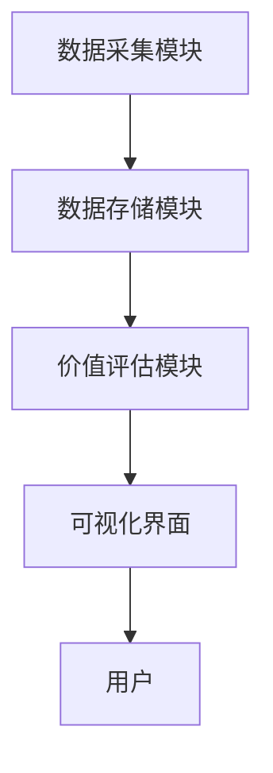

                 


# 《格雷厄姆特价股票理论在共享经济平台时代的新思考》

---

## 关键词：  
- 格雷厄姆特价股票理论  
- 共享经济平台  
- 价值投资  
- 数学模型  
- 系统架构  

---

## 摘要：  
本文探讨了格雷厄姆特价股票理论在共享经济平台时代的新应用。通过分析共享经济平台的特点与挑战，结合格雷厄姆价值投资的核心原则，构建了一个基于数学模型的评估框架，并通过系统架构设计与项目实战，展示了如何在共享经济平台中实现价值投资的创新应用。文章最后总结了核心观点，并展望了未来的发展方向。

---

## 第一章: 引言  

### 1.1 格雷厄姆特价股票理论的背景  
格雷厄姆特价股票理论是价值投资的鼻祖本杰明·格雷厄姆提出的，其核心在于寻找市场价格低于内在价值的股票，以实现长期稳定的收益。该理论强调安全边际和内在价值的计算，为投资者提供了规避市场波动风险的策略。

### 1.2 共享经济平台的崛起  
共享经济平台（如滴滴出行、Airbnb等）通过技术手段实现了资源的高效配置与共享，改变了传统经济模式下的资源利用方式。这些平台的特点包括双边市场、零工经济、去中心化以及数据驱动的决策。

### 1.3 理论与实践的结合  
随着共享经济的快速发展，传统的价值投资理论在面对新型平台时显得力不从心。本文旨在探讨如何将格雷厄姆的理论与共享经济平台的特点相结合，提出一种新的价值评估方法。

---

## 第二章: 格雷厄姆特价股票理论的核心概念  

### 2.1 格雷厄姆价值投资的核心原则  
- **内在价值**：资产的真正价值是其未来现金流的现值，与市场价格无关。  
- **安全边际**：买入价格低于内在价值，以规避市场波动带来的风险。  
- **市场先生**：市场情绪波动会影响股票价格，但不会影响其内在价值。  

### 2.2 格雷厄姆理论的数学模型  

#### 2.2.1 内在价值计算公式  
$$ V = \frac{E}{k} $$  
其中，$V$为内在价值，$E$为预期收益，$k$为折现率。  

#### 2.2.2 安全边际计算公式  
$$ \text{安全边际} = \frac{\text{内在价值} - \text{市场价格}}{\text{内在价值}} \times 100\% $$  

### 2.3 核心概念的对比分析  

| 属性       | 格雷厄姆特价股票理论 | 共享经济平台 |
|------------|----------------------|--------------|
| 核心目标   | 价值投资             | 资源共享与优化配置 |
| 参与主体   | 投资者               | 平台用户与资源提供者 |
| 价值评估   | 内在价值             | 平台效率与用户满意度 |

---

## 第三章: 共享经济平台的特点与挑战  

### 3.1 共享经济平台的商业模式  
- 双边市场：平台连接供需双方，通过数据匹配实现高效交易。  
- 零工经济：用户既是消费者也是服务提供者，具有灵活性和多样性。  
- 数据驱动：平台通过大数据分析优化资源配置。  

### 3.2 平台面临的挑战  
- **信任问题**：用户之间的信任需要平台机制来建立和维护。  
- **动态变化**：市场需求和供给随时变化，影响平台的稳定性。  
- **竞争压力**：新兴平台的崛起对传统企业造成威胁。  

### 3.3 平台的价值评估维度  
- 用户活跃度：日活用户数（DAU）、月活用户数（MAU）。  
- 交易频率：每用户平均交易次数（ATU）。  
- 平台效率：订单完成率、用户满意度。  

---

## 第四章: 格雷厄姆理论与共享经济平台的结合  

### 4.1 格雷厄姆理论在平台中的应用  
- **内在价值评估**：基于平台的未来现金流，计算其内在价值。  
- **安全边际策略**：选择市场价格低于内在价值的平台进行投资。  
- **长期持有**：避免短期市场波动，关注平台的长期增长潜力。  

### 4.2 平台价值评估的数学模型  

#### 4.2.1 平台价值计算公式  
$$ V = \frac{E}{k} $$  
其中，$E$为平台未来现金流，$k$为折现率。  

#### 4.2.2 平台安全边际计算公式  
$$ \text{安全边际} = \frac{\text{内在价值} - \text{市场价格}}{\text{内在价值}} \times 100\% $$  

### 4.3 平台价值评估的系统架构  

#### 4.3.1 系统功能模块  
- 数据采集模块：收集平台的交易数据、用户数据等。  
- 价值评估模块：基于数学模型计算平台的内在价值与安全边际。  
- 可视化界面：展示评估结果，帮助投资者做出决策。  

#### 4.3.2 系统架构设计  



---

## 第五章: 项目实战  

### 5.1 项目背景与目标  
本文以某共享经济平台为例，设计一个基于格雷厄姆理论的价值评估系统，帮助投资者判断平台的投资价值。  

### 5.2 项目实现  

#### 5.2.1 环境安装  
- 安装Python、Pandas、Matplotlib等工具。  

#### 5.2.2 核心代码实现  

```python
import pandas as pd
import numpy as np

def calculate_intrinsic_value(revenue, growth_rate, discount_rate):
    # 内在价值计算
    return revenue * (1 + growth_rate) / discount_rate

def calculate_margin_of_safety(market_value, intrinsic_value):
    # 安全边际计算
    return (intrinsic_value - market_value) / intrinsic_value * 100

# 示例数据
revenue = 10000000
growth_rate = 0.1
discount_rate = 0.05
market_value = 50000000

# 计算内在价值
intrinsic_value = calculate_intrinsic_value(revenue, growth_rate, discount_rate)
print(f"内在价值: {intrinsic_value}")

# 计算安全边际
margin_of_safety = calculate_margin_of_safety(market_value, intrinsic_value)
print(f"安全边际: {margin_of_safety}%")
```

### 5.3 实际案例分析  
以滴滴出行为例，计算其内在价值与安全边际，分析其投资价值。  

### 5.4 项目小结  
通过代码实现，我们能够快速评估共享经济平台的投资价值，并为投资者提供决策支持。

---

## 第六章: 总结与展望  

### 6.1 核心观点总结  
本文通过分析格雷厄姆特价股票理论与共享经济平台的结合，提出了一种基于数学模型的价值评估方法，并通过项目实战验证了其可行性。  

### 6.2 未来展望  
未来，随着人工智能技术的发展，价值评估将更加精准和高效。同时，共享经济平台的多样化也将推动格雷厄姆理论的进一步创新与应用。

---

## 作者：  
AI天才研究院/AI Genius Institute & 禅与计算机程序设计艺术 /Zen And The Art of Computer Programming

