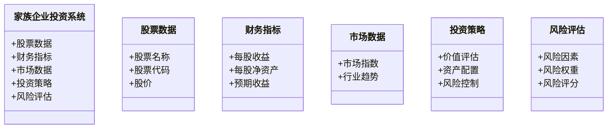
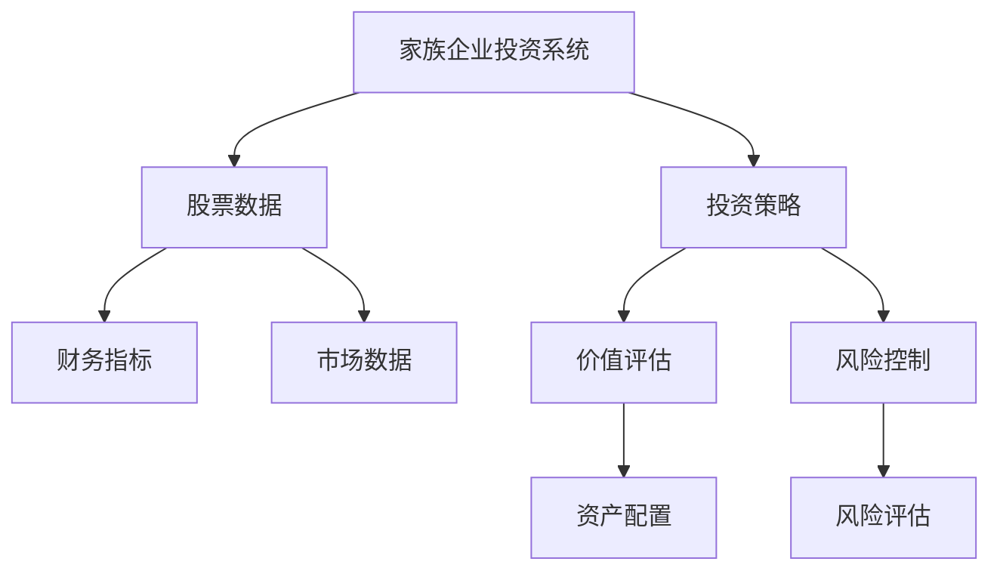
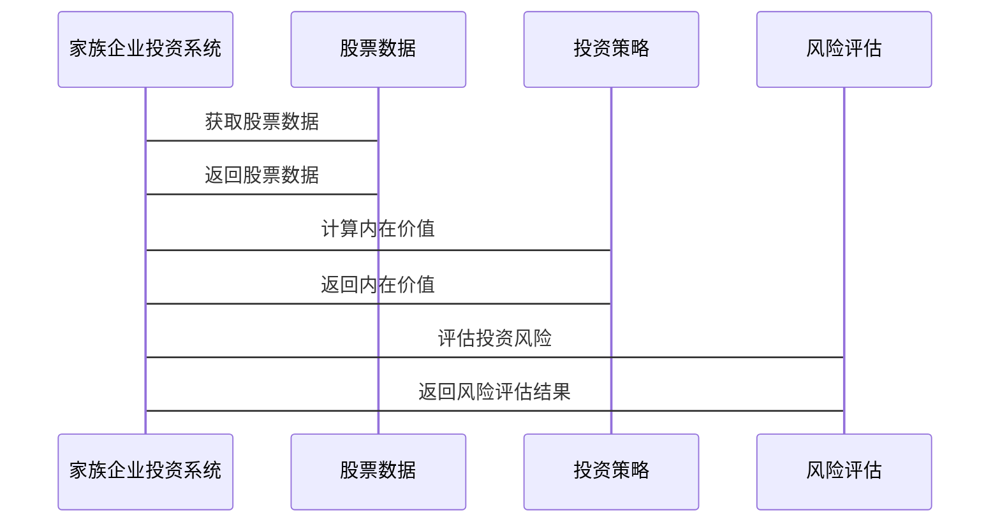

                 


# 格雷厄姆特价股票理论在家族企业投资中的应用

## 关键词：格雷厄姆投资理论，家族企业，廉价股，安全边际，内在价值

## 摘要：本文探讨了格雷厄姆的廉价股投资理论在家族企业中的应用。通过分析格雷厄姆的核心概念，如安全边际和内在价值，结合家族企业的特点，提出了一套适合家族企业的投资策略。文章还详细讲解了数学模型和系统架构，并通过实际案例展示了如何将格雷厄姆理论应用于家族企业的投资决策中。

---

## 第一部分: 格雷厄姆特价股票理论基础

### 第1章: 格雷厄姆特价股票理论概述

#### 1.1 格雷厄姆投资理论的起源与发展

##### 1.1.1 本杰明·格雷厄姆及其投资理念

本杰明·格雷厄姆（Benjamin Graham）是价值投资的鼻祖，被誉为“价值投资之父”。他在20世纪初提出了廉价股投资理论，强调从基本面分析股票的价值，并以低于其内在价值的价格买入股票。格雷厄姆的理论在《证券分析》（1934年）和《 Intelligent Investor》（1949年）中得到了系统阐述。他主张投资者应关注公司的财务状况、行业地位和未来发展潜力，而不是市场波动。

##### 1.1.2 格雷厄姆投资理论的核心思想

格雷厄姆的核心思想是“安全边际”。他认为，投资者应以低于公司内在价值的价格买入股票，以确保在市场波动中能够获得超额收益。此外，他强调长期投资的重要性，建议投资者关注公司的长期盈利能力，而不是短期市场波动。

##### 1.1.3 格雷厄姆理论在现代投资中的地位

格雷厄姆的理论为现代价值投资奠定了基础，影响了包括沃伦·巴菲特在内的众多投资大师。尽管市场环境发生了变化，但格雷厄姆的核心理念——安全边际和内在价值——仍然在投资领域中占据重要地位。

#### 1.2 家族企业投资的特点与需求

##### 1.2.1 家族企业的定义与特点

家族企业是指由家族成员控制的企业，通常具有较长的历史和较强的文化认同感。与上市公司相比，家族企业更注重长期稳定发展，关注股东利益和家族传承。然而，家族企业在投资过程中也面临诸多挑战，如资金有限、风险偏好较高、投资决策复杂等。

##### 1.2.2 家族企业投资的独特需求

家族企业投资通常具有以下特点：
- **长期性**：家族企业倾向于长期投资，以确保企业的持续发展。
- **稳定性**：家族企业注重投资的稳定性，追求稳健的回报。
- **个性化**：家族企业的投资决策往往需要结合家族的长期目标和成员的意愿。

##### 1.2.3 家族企业投资中的风险与挑战

家族企业在投资过程中面临的风险包括市场波动、资产流动性不足、投资决策的复杂性等。此外，家族企业在选择投资标的时，往往需要考虑与家族业务的协同效应，这增加了投资的复杂性。

#### 1.3 格雷厄姆特价股票理论与家族企业投资的结合

##### 1.3.1 格雷厄姆理论在家族企业投资中的适用性

格雷厄姆的理论强调安全边际和内在价值，这与家族企业投资的需求高度契合。家族企业通常倾向于长期投资，注重稳健回报，而格雷厄姆的理论正好提供了这种稳健的投资方法。

##### 1.3.2 家族企业投资中的价值评估方法

家族企业可以采用格雷厄姆的安全边际方法，通过分析公司的财务状况、行业地位和未来前景，确定其内在价值。在此基础上，选择低于内在价值的股票进行投资。

##### 1.3.3 格雷厄姆理论在家族企业中的潜在优势

格雷厄姆理论的优势在于其稳健性和科学性。通过量化分析，家族企业可以更准确地评估投资标的的价值，降低投资风险，实现长期稳定的回报。

### 第2章: 格雷厄姆特价股票理论的核心概念

#### 2.1 格雷厄姆投资理论的核心要素

##### 2.1.1 安全边际的概念与计算

安全边际是指股票的市场价格与其内在价值之间的差额。格雷厄姆认为，安全边际越大，投资的风险越小。计算公式如下：

$$ 安全边际 = 股票价格 - 内在价值 $$

##### 2.1.2 内在价值的定义与计算方法

内在价值是指股票在未来产生的现金流的现值。格雷厄姆认为，内在价值可以通过对公司未来盈利能力的分析来确定。计算公式如下：

$$ 内在价值 = \frac{预期收益}{折现率} $$

##### 2.1.3 市场先生与投资者心理

格雷厄姆将市场波动比作“市场先生”，认为市场先生的情绪会影响股票价格，但长期来看，股票价格会回归其内在价值。因此，投资者应关注市场先生的情绪，避免被市场波动影响。

#### 2.2 家族企业投资中的核心要素

##### 2.2.1 家族企业的长期投资目标

家族企业的投资目标通常包括企业扩张、资产保值、财富传承等。这些目标需要与格雷厄姆理论相结合，制定长期稳健的投资策略。

##### 2.2.2 家族企业投资中的风险偏好

家族企业通常具有较高的风险偏好，但格雷厄姆理论强调稳健投资，因此需要在风险和收益之间找到平衡点。

##### 2.2.3 家族企业投资中的资产配置策略

家族企业可以通过资产配置分散投资风险，例如将资金分配到股票、债券、房地产等多种资产类别中。格雷厄姆理论建议在资产配置中优先选择廉价股，以确保稳健回报。

#### 2.3 格雷厄姆理论与家族企业投资的结合

##### 2.3.1 格雷厄姆理论在家族企业投资中的应用范围

格雷厄姆理论适用于家族企业的长期投资，特别是在选择股票时，可以通过安全边际和内在价值的分析，找到具有投资价值的股票。

##### 2.3.2 家族企业投资中的价值评估模型

家族企业可以采用格雷厄姆的安全边际模型，计算股票的内在价值，并与市场价格进行比较，选择具有安全边际的股票进行投资。

##### 2.3.3 格雷厄姆理论在家族企业中的创新应用

家族企业可以根据自身需求，对格雷厄姆理论进行创新应用，例如结合家族企业的业务特点，制定个性化的价值评估模型。

### 第3章: 格雷厄姆特价股票理论的数学模型与公式

#### 3.1 格雷厄姆投资理论的数学模型

##### 3.1.1 安全边际的计算公式

$$ 安全边际 = 股票价格 - 内在价值 $$

##### 3.1.2 内在价值的计算公式

$$ 内在价值 = \frac{预期收益}{折现率} $$

##### 3.1.3 市盈率与市净率的计算

$$ 市盈率 = \frac{股价}{每股收益} $$
$$ 市净率 = \frac{股价}{每股净资产} $$

#### 3.2 家族企业投资中的数学模型

##### 3.2.1 家族企业投资的资产配置模型

$$ 资产配置比例 = \frac{资产规模 \times 风险偏好}{总市场容量} $$

##### 3.2.2 家族企业投资中的风险评估模型

$$ 风险评估 = \sum_{i=1}^{n} (权重_i \times 风险因素_i) $$

#### 3.3 格雷厄姆理论与家族企业投资的结合模型

##### 3.3.1 家族企业投资的价值评估模型

$$ 内在价值 = \frac{预期收益}{折现率} $$
$$ 安全边际 = 股票价格 - 内在价值 $$

##### 3.3.2 家族企业投资的资产配置模型

$$ 资产配置比例 = \frac{资产规模 \times 风险偏好}{总市场容量} $$

---

## 第二部分: 家族企业投资中的系统架构设计

### 第4章: 家族企业投资的系统架构设计

#### 4.1 问题场景介绍

家族企业在投资过程中需要解决的主要问题包括：如何选择具有投资价值的股票、如何评估投资风险、如何制定投资策略等。

#### 4.2 项目介绍

本项目旨在通过格雷厄姆的廉价股理论，为家族企业提供一套科学的投资决策系统，帮助其实现长期稳健的收益。

#### 4.3 系统功能设计

##### 4.3.1 领域模型设计



#### 4.4 系统架构设计



#### 4.5 系统接口设计

##### 4.5.1 投资策略接口

```python
class InvestmentStrategy:
    def calculate_intrinsic_value(self, stock_data):
        # 计算股票的内在价值
        pass
```

##### 4.5.2 风险评估接口

```python
class RiskAssessment:
    def assess_risk(self, stock_data):
        # 评估投资风险
        pass
```

#### 4.6 系统交互设计



---

## 第三部分: 项目实战

### 第5章: 项目实战

#### 5.1 环境安装

为了实现格雷厄姆理论在家族企业投资中的应用，我们需要安装以下工具：
- Python编程语言
- 数据分析库（Pandas、NumPy）
- 数据可视化库（Matplotlib）
- 投资分析库（yfinance）

#### 5.2 核心实现

##### 5.2.1 安全边际计算

```python
import pandas as pd
import yfinance as yf

def calculate_intrinsic_value(stock ticker):
    # 获取股票数据
    data = yf.download(ticker)
    # 计算每股收益
    eps = data['Adj Close'].mean()
    # 计算预期收益
    expected_return = 0.1
    # 计算折现率
    discount_rate = 0.05
    # 计算内在价值
    intrinsic_value = expected_return / discount_rate
    return intrinsic_value

# 示例：计算苹果公司股票的内在价值
ticker = 'AAPL'
intrinsic_value = calculate_intrinsic_value(ticker)
print(f"{ticker} 的内在价值为：{intrinsic_value}")
```

##### 5.2.2 资产配置策略

```python
def asset_allocation(asset_size, risk_preference):
    # 计算资产配置比例
    allocation = asset_size * risk_preference
    return allocation

# 示例：计算资产配置比例
asset_size = 1000000
risk_preference = 0.8
allocation = asset_allocation(asset_size, risk_preference)
print(f"资产配置比例为：{allocation}")
```

#### 5.3 案例分析

##### 5.3.1 案例背景

假设我们有一个家族企业，资产规模为1000万美元，风险偏好为中高。我们需要选择一些具有安全边际的股票进行投资。

##### 5.3.2 投资分析

```python
# 选择股票
tickers = ['AAPL', 'MSFT', 'GOOGL']
# 计算内在价值和安全边际
for ticker in tickers:
    data = yf.download(ticker)
    eps = data['Adj Close'].mean()
    expected_return = 0.1
    discount_rate = 0.05
    intrinsic_value = expected_return / discount_rate
    market_price = data['Adj Close'][-1]
    safety_margin = market_price - intrinsic_value
    print(f"{ticker} 的内在价值为：{intrinsic_value}")
    print(f"{ticker} 的安全边际为：{safety_margin}")
    print("--------------------")
```

##### 5.3.3 投资结果

通过上述分析，我们可以选择具有正的安全边际的股票进行投资，以确保投资的稳健性。

---

## 第四部分: 最佳实践与小结

### 第6章: 最佳实践与小结

#### 6.1 最佳实践

- **长期投资**：家族企业应坚持长期投资，避免短期波动的影响。
- **安全边际**：在选择股票时，应优先考虑具有正的安全边际的股票。
- **资产配置**：合理配置资产，分散投资风险。

#### 6.2 小结

通过本文的分析，我们可以看到，格雷厄姆的廉价股理论非常适合家族企业的投资需求。家族企业可以通过分析股票的内在价值和安全边际，选择具有投资价值的股票，实现长期稳健的收益。

#### 6.3 注意事项

- 投资者应密切关注市场变化，及时调整投资策略。
- 家族企业在投资过程中应结合自身需求，灵活运用格雷厄姆理论。

#### 6.4 拓展阅读

- 《 Intelligent Investor》——本杰明·格雷厄姆
- 《价值投资实战》——沃伦·巴菲特

---

## 作者：AI天才研究院/AI Genius Institute & 禅与计算机程序设计艺术 /Zen And The Art of Computer Programming

