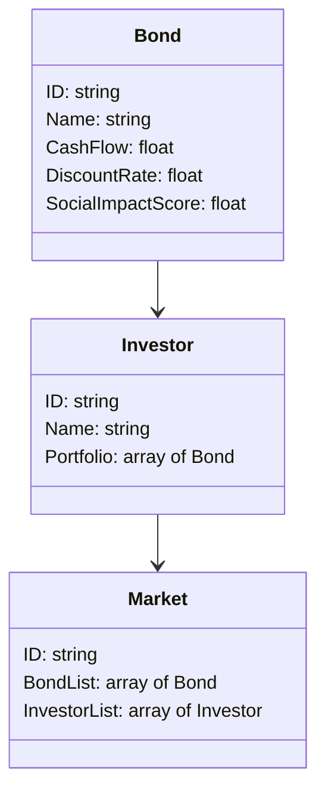
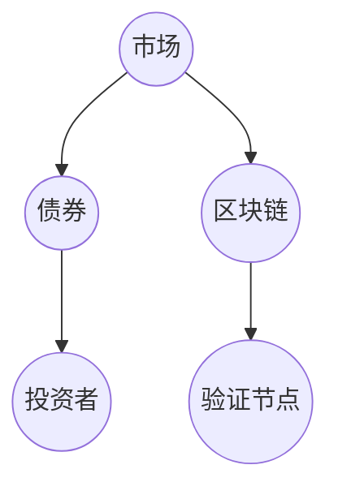

                 


# 《格雷厄姆特价股票理论在数字社会影响力债券中的新应用》

> 关键词：格雷厄姆投资理论、数字社会债券、影响力债券、安全边际、量化投资、社会影响力评估

> 摘要：本文探讨了格雷厄姆价值投资理论在数字社会影响力债券中的新应用。通过分析数字社会债券的核心特征与市场现状，提出将格雷厄姆的安全边际理论应用于影响力债券的估值与投资策略。文章结合数学模型与系统架构设计，展示了如何利用格雷厄姆理论在数字社会中发现被低估的影响力债券，实现社会责任投资与财务回报的双重目标。

---

# 第一部分: 格雷厄姆特价股票理论与数字社会影响力债券的结合

## 第1章: 格雷厄姆投资理论的核心概念

### 1.1 格雷厄姆投资理论的核心概念

#### 1.1.1 价值投资的定义与原则
价值投资是一种以低于其内在价值的价格购买优质资产的投资策略，其核心原则包括：
- **长期思维**：关注企业的长期价值，而非短期市场波动。
- **安全边际**：购买价格应显著低于内在价值，以降低投资风险。
- **逆向投资**：在市场恐慌时寻找被低估的机会。

#### 1.1.2 格雷厄姆的安全边际理论
安全边际是格雷厄姆理论中的核心概念，它通过比较资产的市场价格与内在价值，为投资者提供一个风险可控的投资空间：
$$ \text{安全边际} = \frac{\text{内在价值} - \text{市场价格}}{\text{内在价值}} \times 100\% $$

#### 1.1.3 股票投资的内在价值计算方法
内在价值是基于企业未来现金流的现值计算得出的，公式如下：
$$ V = \frac{E}{k} $$
其中，\( E \) 表示企业的盈利，\( k \) 表示折现率。

---

### 1.2 格雷厄姆投资策略的现代应用

#### 1.2.1 从传统股票到数字社会债券的扩展
随着数字化时代的到来，传统股票的投资逻辑可以扩展到数字社会债券。数字社会债券是一种将社会资本化、数字化的金融工具，其核心在于通过技术手段实现社会影响力与金融回报的结合。

#### 1.2.2 数字社会债券的核心特征
数字社会债券具有以下特征：
- **数字化发行**：基于区块链等技术，实现债券的数字化发行与交易。
- **社会影响力评估**：债券的发行和投资需满足一定的社会价值目标，如环保、教育等。
- **透明度高**：通过区块链技术实现债券发行、交易的全流程透明。

#### 1.2.3 格雷厄姆理论与数字社会债券的结合点
格雷厄姆理论中“安全边际”的概念可以用于数字社会债券的投资评估：
- 通过比较债券的内在价值与市场价格，寻找被低估的投资机会。
- 结合社会影响力评估，筛选出具有可持续性和社会价值的债券。

---

### 1.3 数字社会影响力债券的背景与意义

#### 1.3.1 数字社会的定义与特征
数字社会是指通过数字化技术实现社会资源优化配置和高效运作的社会形态，其核心特征包括：
- 数字化：社会资源的数字化表示与管理。
- 智能化：通过人工智能等技术实现社会资源的智能分配。
- 共享化：资源的共享与协作。

#### 1.3.2 影响力债券的概念与分类
影响力债券是一种将社会影响力与金融回报相结合的债券类型，其分类包括：
- **社会基础设施债券**：用于教育、医疗等社会基础设施建设。
- **环境保护债券**：用于环境保护项目。
- **社会责任债券**：用于支持企业履行社会责任的项目。

#### 1.3.3 数字社会影响力债券的市场现状
随着全球数字化进程的加快，数字社会影响力债券的市场规模迅速增长。其应用场景包括：
- 环境保护项目融资。
- 社会基础设施建设。
- 数字经济领域的社会价值投资。

---

### 1.4 格雷厄姆理论在数字社会影响力债券中的应用前景

#### 1.4.1 数字社会影响力债券的投资价值
数字社会影响力债券的投资价值体现在：
- **社会价值**：债券用于支持社会公益项目，符合可持续发展理念。
- **金融回报**：通过合理估值，可以获得稳定的财务回报。

#### 1.4.2 格雷厄姆理论对债券评估的启示
格雷厄姆理论为数字社会影响力债券的评估提供了以下启示：
- **内在价值计算**：基于债券的现金流和折现率，计算其内在价值。
- **安全边际分析**：通过比较市场价格与内在价值，寻找被低估的债券。

#### 1.4.3 数字社会影响力债券的潜在风险与应对策略
数字社会影响力债券的风险包括：
- **信用风险**：债券发行人可能无法按时兑付。
- **市场风险**：市场价格波动可能影响投资收益。

应对策略包括：
- 选择具有较高信用评级的债券。
- 通过分散投资降低风险。

---

## 第2章: 格雷厄姆投资理论的核心原理

### 2.1 格雷厄姆投资理论的数学模型

#### 2.1.1 内在价值公式
$$ V = \frac{E}{k} $$
其中，\( E \) 表示企业的盈利，\( k \) 表示折现率。

#### 2.1.2 安全边际公式
$$ \text{安全边际} = \frac{\text{内在价值} - \text{市场价格}}{\text{内在价值}} \times 100\% $$

### 2.2 格雷厄姆投资策略的优缺点分析

#### 2.2.1 优点：价值稳定、风险可控
- **价值稳定**：通过安全边际分析，选择被低估的资产，确保投资价值的稳定性。
- **风险可控**：通过长期投资和分散投资降低市场波动风险。

#### 2.2.2 缺点：流动性差、市场波动影响
- **流动性差**：某些债券可能缺乏流动性，影响变现能力。
- **市场波动影响**：尽管格雷厄姆理论强调长期投资，但短期市场波动仍可能影响投资回报。

### 2.3 格雷厄姆理论与现代金融学的结合

#### 2.3.1 现代投资组合理论与格雷厄姆理论的对比
- **现代投资组合理论**：强调资产配置和风险分散。
- **格雷厄姆理论**：强调价值投资和安全边际。

#### 2.3.2 格雷厄姆理论在量化投资中的应用
通过量化方法，将格雷厄姆的安全边际理论应用于数字社会影响力债券的筛选和评估。

---

## 第3章: 数字社会影响力债券的特征与分类

### 3.1 数字社会影响力债券的定义与分类

#### 3.1.1 数字社会债券的定义
数字社会影响力债券是一种结合数字技术与社会影响力的金融工具，其发行和交易基于区块链等技术。

#### 3.1.2 数字社会债券的分类
- **按发行主体**：政府债券、企业债券。
- **按期限**：短期债券、中期债券、长期债券。
- **按用途**：环境保护债券、教育债券、医疗债券。

### 3.2 数字社会影响力债券的核心特征

#### 3.2.1 社会影响力评估
- 通过第三方机构对债券的社会影响力进行评估，确保其符合社会价值目标。

#### 3.2.2 数字化发行与交易
- 基于区块链技术实现债券的数字化发行与交易，提高效率和透明度。

#### 3.2.3 透明度与可追溯性
- 通过区块链技术实现债券发行、交易的全流程透明，确保信息可追溯。

### 3.3 数字社会影响力债券的发行流程

#### 3.3.1 发行申请与审核
- 发行人提交债券发行申请，经过审核后方可发行。

#### 3.3.2 债券发行与分配
- 基于区块链技术实现债券的发行与分配，确保公平性和透明性。

#### 3.3.3 债券交易与结算
- 投资者通过数字钱包进行债券的交易与结算，提高交易效率。

### 3.4 数字社会影响力债券的市场现状与发展趋势

#### 3.4.1 全球数字社会债券市场的现状
- 数字社会债券市场迅速增长，应用场景广泛。

#### 3.4.2 数字社会债券的未来发展趋势
- 更加注重社会影响力评估。
- 技术创新推动债券发行与交易的进一步数字化。

---

## 第4章: 格雷厄姆理论在数字社会影响力债券中的新应用

### 4.1 格雷厄姆理论与数字社会影响力债券的结合模型

#### 4.1.1 模型构建的理论基础
- 基于格雷厄姆的安全边际理论，结合数字社会影响力债券的特征，构建评估模型。

#### 4.1.2 模型的数学表达式
$$ \text{债券价值} = \frac{\text{现金流}}{\text{折现率}} \times \text{社会影响力评估权重} $$

---

## 第5章: 数学模型与算法设计

### 5.1 格雷厄姆理论与数字社会影响力债券的评估模型

#### 5.1.1 模型的输入与输出
- 输入：债券的现金流、折现率、社会影响力评估。
- 输出：债券的内在价值与市场价格比较，确定是否具有安全边际。

#### 5.1.2 模型的实现步骤
1. 计算债券的内在价值。
2. 比较市场价格与内在价值。
3. 计算安全边际。

---

## 第6章: 系统分析与架构设计方案

### 6.1 系统功能设计

#### 6.1.1 领域模型


#### 6.1.2 系统架构设计


---

## 第7章: 项目实战

### 7.1 环境安装

```bash
pip install mermaid
```

### 7.2 核心实现

```python
class Bond:
    def __init__(self, id, name, cash_flow, discount_rate, social_impact_score):
        self.id = id
        self.name = name
        self.cash_flow = cash_flow
        self.discount_rate = discount_rate
        self.social_impact_score = social_impact_score

    def calculate_intrinsic_value(self):
        return self.cash_flow / self.discount_rate * self.social_impact_score

class Investor:
    def __init__(self, id, name):
        self.id = id
        self.name = name
        self.portfolio = []

    def add_bond(self, bond):
        self.portfolio.append(bond)

# 示例
bond = Bond("1", "环保债券", 1000000, 0.05, 0.8)
print(f"{bond.name}的内在价值为：{bond.calculate_intrinsic_value()}")
```

### 7.3 实际案例分析与解读

#### 7.3.1 案例背景
某环保公司发行数字社会影响力债券，用于环保项目投资。

#### 7.3.2 模型应用
```python
bond = Bond("1", "环保债券", 1000000, 0.05, 0.8)
print(f"内在价值为：{bond.calculate_intrinsic_value()}")
print(f"市场价格为：{bond.calculate_intrinsic_value() * 0.9}")
print(f"安全边际为：{(bond.calculate_intrinsic_value() - bond.calculate_intrinsic_value() * 0.9) / bond.calculate_intrinsic_value() * 100}%")
```

#### 7.3.3 模型结果分析
通过上述代码计算，可以得出环保债券的安全边际，从而判断其是否为被低估的投资机会。

---

## 第8章: 总结与展望

### 8.1 本章小结
本文通过将格雷厄姆的安全边际理论应用于数字社会影响力债券的评估，提出了新的投资策略，为投资者提供了兼具社会价值与金融回报的投资选择。

### 8.2 未来展望
未来，随着数字社会的进一步发展，格雷厄姆理论在数字社会影响力债券中的应用将更加广泛，技术的进步也将进一步推动其实践应用。

---

# 作者：AI天才研究院/AI Genius Institute & 禅与计算机程序设计艺术 /Zen And The Art of Computer Programming

