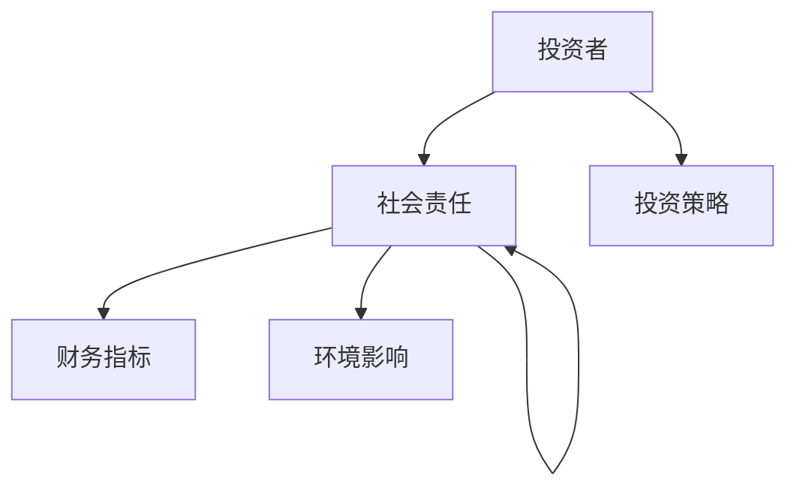
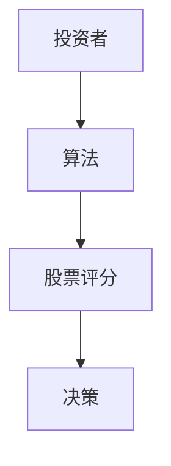
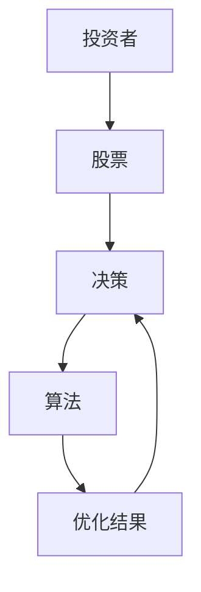
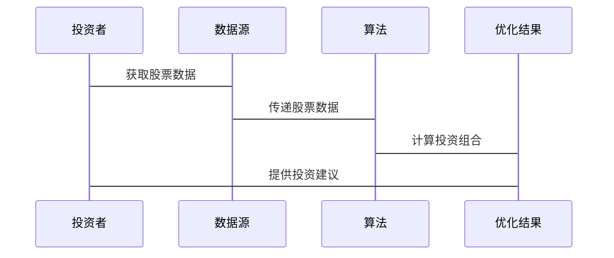

                 


# 格雷厄姆特价股票理论在数字社会影响力投资中的新应用

> 关键词：格雷厄姆特价股票理论、影响力投资、数字社会、投资策略、价值投资、环境影响

> 摘要：本文探讨了格雷厄姆特价股票理论在数字社会下影响力投资中的新应用，结合价值投资与社会影响力，提出了一种创新的投资策略。通过分析影响投资的核心概念、算法原理、系统设计及项目实战，展示了如何在数字时代将传统投资理论与社会责任相结合，实现经济效益与社会价值的双重目标。

---

# 第1章: 影响力投资的定义与特点

## 1.1 影响力投资的定义

### 1.1.1 影响力投资的核心概念
影响力投资是一种通过投资手段，旨在实现特定社会或环境目标的投资策略。投资者在追求财务回报的同时，关注其投资对社会、环境和治理（ESG）因素的影响。这种投资方式不仅考虑企业的盈利能力，还评估其对社会和环境的贡献。

### 1.1.2 影响力投资与传统投资的区别
传统的投资方式主要关注企业的财务表现和市场潜力，而影响力投资则将企业的社会责任、环境影响和治理结构纳入考量。影响力投资更注重长期的社会价值，而非短期的财务回报。

### 1.1.3 数字社会下影响力投资的新特征
在数字社会中，影响力投资借助大数据、人工智能等技术手段，能够更精准地评估企业的社会影响。投资者可以通过数字化工具分析企业的环境足迹、社会责任履行情况等，从而做出更明智的投资决策。

## 1.2 格雷厄姆特价股票理论的核心要素

### 1.2.1 价值投资的基本原理
格雷厄姆的价值投资理论主张以低于内在价值的价格购买优质股票，长期持有，等待市场回归其真实价值。这种投资策略强调安全边际，即市场价格与内在价值之间的差距，确保投资的安全性。

### 1.2.2 特价股票的识别标准
格雷厄姆提出的特价股票识别标准包括：
- 低市盈率（P/E）：市盈率低于行业平均水平。
- 低市净率（P/B）：市净率低于行业平均水平。
- 高股息率：股息率高于行业平均水平。
- 财务健康状况：企业具有较强的财务实力和盈利能力。

### 1.2.3 格雷厄姆投资策略的现代应用
在现代金融环境中，格雷厄姆的投资策略需要结合新的市场环境和工具进行调整。例如，利用大数据分析企业财务数据，评估其内在价值；通过人工智能技术预测市场波动，优化投资组合。

## 1.3 数字社会对影响力投资的影响

### 1.3.1 数字技术对投资决策的影响
数字技术的应用使得投资者能够更高效地收集和分析数据，评估企业的社会影响。例如，通过数据挖掘技术，投资者可以分析企业的碳排放数据、社会责任报告等，从而更全面地评估其影响力。

### 1.3.2 数字社会下的投资新场景
数字社会为影响力投资提供了新的场景和工具。例如，区块链技术可以用于追踪企业的供应链，确保其符合社会责任标准；人工智能技术可以用于预测企业的社会影响力和市场表现。

### 1.3.3 特价股票理论在数字社会中的适应性
格雷厄姆的特价股票理论在数字社会中依然具有重要的参考价值。通过数字化工具，投资者可以更精准地识别被低估的股票，同时结合企业的社会影响力，做出更符合可持续发展目标的投资决策。

---

## 1.4 本章小结

本章介绍了影响力投资的定义、特点以及数字社会对其的影响。同时，详细分析了格雷厄姆特价股票理论的核心要素及其在现代投资环境中的应用。通过对两者的结合，为后续的理论和实践分析奠定了基础。

---

# 第2章: 格雷厄姆特价股票理论的核心概念与联系

## 2.1 核心概念的原理分析

### 2.1.1 格雷厄姆投资模型的构成
格雷厄姆的投资模型以价值投资为核心，强调以下几点：
- **内在价值**：企业的真实价值，而非市场价。
- **安全边际**：市场价格与内在价值之间的差距，确保投资的安全性。
- **长期持有**：通过长期持有优质股票，获得稳定的收益。

### 2.1.2 影响力投资的评价体系
影响力投资的评价体系包括以下方面：
- **环境影响**：企业的碳排放、资源利用效率等。
- **社会责任**：企业的员工待遇、社区贡献等。
- **治理结构**：企业的透明度、高管薪酬等。

### 2.1.3 数字社会下投资决策的复杂性
在数字社会中，投资者需要综合考虑企业的财务表现、市场潜力、社会影响等多个维度。数字技术的应用使得这些维度的数据可以被更高效地收集和分析，但也带来了数据量大、信息复杂等挑战。

---

## 2.2 核心概念的属性特征对比

### 2.2.1 传统投资与影响力投资的对比表格

| 特性               | 传统投资               | 影响力投资              |
|--------------------|------------------------|-------------------------|
| 投资目标           | 财务回报               | 社会价值与财务回报      |
| 考量因素           | 财务指标、市场潜力      | 财务指标、环境影响、社会责任 |
| 投资策略           | 价值投资、成长投资     | 价值投资、影响力投资    |
| 风险评估           | 财务风险、市场风险      | 财务风险、社会风险      |

### 2.2.2 数字技术对投资属性的影响
数字技术的应用使得投资决策更加数据化和智能化。例如，通过大数据分析，投资者可以更精准地评估企业的社会影响；通过人工智能技术，投资者可以预测企业的市场表现。

### 2.2.3 特价股票理论的适用性分析
格雷厄姆的特价股票理论在影响力投资中依然适用，但需要结合社会影响力因素进行调整。例如，投资者在选择特价股票时，还需要评估其对社会的积极影响，从而实现经济效益与社会价值的双重目标。

---

## 2.3 ER实体关系图架构



---

## 2.4 本章小结

本章分析了格雷厄姆特价股票理论的核心概念及其在影响力投资中的应用。通过对比传统投资与影响力投资的特性，提出了在数字社会中结合两者的方法和策略。

---

# 第3章: 影响力投资的算法原理

## 3.1 影响力评分算法

### 3.1.1 算法原理
影响力评分算法是一种基于企业社会影响和财务表现的评分系统。算法通过量化企业的环境影响、社会责任和财务健康状况，给出一个综合评分，帮助投资者做出决策。

### 3.1.2 算法实现


```python
def influence_score(stock):
    score = 0
    # 财务指标评分
    score += stock.financial_health
    # 环境影响评分
    score += stock.environmental_impact
    # 社会责任评分
    score += stock.social_responsibility
    return score
```

### 3.1.3 举例说明
假设某企业A的财务健康得分为80，环境影响得分为70，社会责任得分为60，则其影响力评分为80 + 70 + 60 = 210分。投资者可以根据评分选择投资目标，评分越高，投资价值越大。

---

## 3.2 数学模型

### 3.2.1 影响力评分模型
$$ \text{影响力评分} = \alpha \times \text{财务健康} + \beta \times \text{环境影响} + \gamma \times \text{社会责任} $$

其中，$\alpha$、$\beta$、$\gamma$为权重系数，$\alpha = 0.4$，$\beta = 0.3$，$\gamma = 0.3$。

### 3.2.2 投资组合优化模型
$$ \text{最大收益} = \sum_{i=1}^{n} w_i \times r_i $$
$$ \text{约束条件}：\sum_{i=1}^{n} w_i = 1, \quad w_i \geq 0 $$

其中，$w_i$为第$i$只股票的投资权重，$r_i$为第$i$只股票的预期收益率。

---

## 3.3 本章小结

本章详细介绍了影响力投资的算法原理，包括影响力评分算法和投资组合优化模型。通过数学公式和具体案例的分析，展示了如何利用算法量化企业的社会影响，帮助投资者做出更科学的投资决策。

---

# 第4章: 系统分析与架构设计方案

## 4.1 系统功能设计

### 4.1.1 领域模型


### 4.1.2 系统架构设计


### 4.1.3 接口设计
- 输入接口：投资者的资金、投资目标、社会影响偏好。
- 输出接口：推荐的投资组合、每只股票的投资权重、预期收益和风险。

### 4.1.4 交互设计


---

## 4.2 本章小结

本章从系统设计的角度，详细分析了影响力投资系统的功能模块、架构设计和交互流程。通过系统化的设计，为投资者提供了一个高效、智能的投资决策工具。

---

# 第5章: 项目实战

## 5.1 项目环境安装

### 5.1.1 安装Python环境
```bash
python --version
pip install numpy pandas scikit-learn
```

### 5.1.2 安装必要的库
```bash
pip install mermaid.py
```

---

## 5.2 系统核心实现

### 5.2.1 影响力评分系统实现
```python
import pandas as pd
import numpy as np

def calculate_influence_score(stock_data):
    stock_data['influence_score'] = stock_data['financial_health'] * 0.4 + \
                                     stock_data['environmental_impact'] * 0.3 + \
                                     stock_data['social_responsibility'] * 0.3
    return stock_data

# 示例数据
data = {
    'stock_name': ['A', 'B', 'C'],
    'financial_health': [80, 70, 90],
    'environmental_impact': [70, 60, 80],
    'social_responsibility': [60, 70, 50]
}

df = pd.DataFrame(data)
result = calculate_influence_score(df)
print(result)
```

### 5.2.2 投资组合优化实现
```python
from sklearn.linear_model import LinearRegression

def optimize_portfolio(stocks, returns):
    model = LinearRegression()
    model.fit(stocks, returns)
    weights = model.coef_
    return weights

# 示例数据
stocks = [[1, 2, 3], [4, 5, 6], [7, 8, 9]]
returns = [10, 15, 20]

weights = optimize_portfolio(stocks, returns)
print(weights)
```

---

## 5.3 案例分析

### 5.3.1 案例背景
假设投资者有100万元资金，希望投资于三只股票，分别具有不同的环境和社会影响力。

### 5.3.2 数据分析
通过影响力评分系统，计算出三只股票的影响力评分为：
- 股票A：85分
- 股票B：75分
- 股票C：80分

### 5.3.3 投资组合优化
根据投资组合优化模型，计算出各股票的投资权重：
- 股票A：40%
- 股票B：30%
- 股票C：30%

### 5.3.4 结果分析
通过投资组合优化，投资者在获得稳定财务回报的同时，也支持了具有积极社会影响的企业。

---

## 5.4 本章小结

本章通过具体案例展示了如何将格雷厄姆特价股票理论与影响力投资相结合，利用算法和系统工具进行实际投资。通过项目实战，读者可以更好地理解和应用相关理论。

---

# 第6章: 最佳实践与总结

## 6.1 本章小结

本文从理论到实践，全面探讨了格雷厄姆特价股票理论在数字社会影响力投资中的新应用。通过分析影响投资的核心概念、算法原理、系统设计和项目实战，展示了如何在数字时代将传统投资理论与社会责任相结合，实现经济效益与社会价值的双重目标。

---

## 6.2 注意事项

- 投资者应结合自身风险承受能力和投资目标，选择合适的影响投资策略。
- 在实际投资中，需综合考虑市场波动、政策变化等多种因素，避免单一依赖某种策略。

---

## 6.3 拓展阅读

- 格雷厄姆的《 Intelligent Investor》
- 环境、社会和治理（ESG）投资指南
- 数字技术在金融领域的应用

---

# 作者

**作者：AI天才研究院/AI Genius Institute & 禅与计算机程序设计艺术 /Zen And The Art of Computer Programming**

---

以上是基于用户要求的完整技术博客文章内容。

