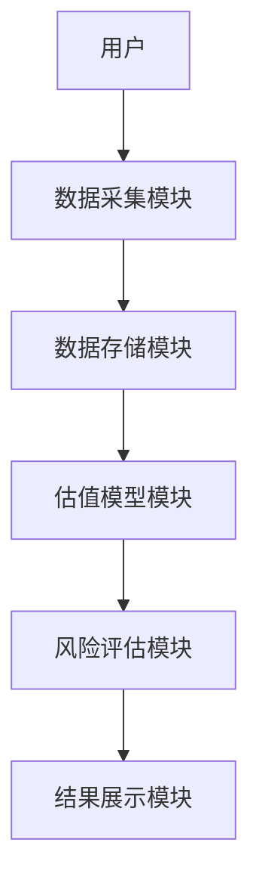

                 


# 格雷厄姆特价股票理论在数字经济时代的演变

## 关键词：
- 价值投资
- 数字经济
- 股票估值
- 安全边际
- 数据资产

## 摘要：
本文探讨了本杰明·格雷厄姆的价值投资理论在数字经济时代下的演变。格雷厄姆的安全边际理论和低估值股票筛选方法在传统金融市场中被广泛应用，但在数字经济环境下，数据资产的崛起和科技企业的特性对传统估值方法提出了新的挑战。本文通过分析这些变化，提出了结合数据资产价值和科技企业特点的新型估值模型，为投资者在数字经济时代下应用格雷厄姆理论提供了新的思路和方法。

---

# 第一部分: 格雷厄姆特价股票理论的背景与核心概念

## 第1章: 格雷厄姆投资理论的起源与发展

### 1.1 本杰明·格雷厄姆的价值投资理论
本杰明·格雷厄姆是价值投资的鼻祖，他的投资理念的核心在于寻找市场低估的股票，并通过安全边际来降低投资风险。以下是格雷厄姆理论的核心要素：

- **安全边际**：安全边际 = 股票的内在价值 - 市场价格。当市场价格低于内在价值时，股票具有投资价值。
- **低市盈率与低市净率**：格雷厄姆倾向于投资市盈率和市净率低于市场平均水平的股票，认为这些股票更可能被市场低估。
- **分散投资**：通过分散投资降低非系统性风险，避免因单一股票的波动而造成重大损失。

### 1.2 格雷厄姆理论的数学模型
格雷厄姆的安全边际理论可以通过以下公式表示：

$$
\text{安全边际} = \text{内在价值} - \text{市场价格}
$$

其中，内在价值可以通过企业未来现金流的现值计算得出。格雷厄姆建议投资者选择市场价格低于内在价值的股票进行投资。

---

## 第2章: 数字经济时代下的股票投资新特点

### 2.1 数字经济环境下的投资环境变化
在数字经济时代，科技企业的崛起改变了传统的投资环境。以下是数字经济时代下的投资特点：

- **数据资产的崛起**：数据成为企业的核心资产，但传统财务报表中并未直接反映数据的价值。
- **科技企业的无形资产**：科技企业的核心价值往往体现在专利、技术团队和研发能力上，而非传统的有形资产。
- **高增长与高风险并存**：科技企业通常具有较高的增长潜力，但也伴随着较高的市场风险。

### 2.2 格雷厄姆理论在数字经济时代的挑战与机遇
传统格雷厄姆理论主要适用于低市盈率、低市净率的股票，但在数字经济时代，科技企业的高市盈率和高市净率使其难以满足传统筛选标准。以下是格雷厄姆理论在数字经济时代的挑战与机遇：

- **挑战**：科技企业的研发投入和未来收益预测具有较高的不确定性，传统估值模型难以准确反映其价值。
- **机遇**：通过结合数据资产价值和科技企业的未来增长潜力，可以对传统估值模型进行优化，更好地适应数字经济环境。

---

# 第二部分: 格雷厄姆特价股票理论的核心概念与数学模型

## 第3章: 特价股票的核心概念与数学模型

### 3.1 安全边际理论的数学模型
安全边际是格雷厄姆理论的核心，其计算公式如下：

$$
\text{安全边际} = \text{内在价值} - \text{市场价格}
$$

其中，内在价值可以通过以下公式计算：

$$
\text{内在价值} = \sum_{t=1}^{\infty} \frac{\text{现金流}_t}{(1 + r)^t}
$$

其中，$r$ 是折现率，$\text{现金流}_t$ 是第$t$年的现金流。

### 3.2 市盈率与市净率的数学分析
市盈率（P/E）和市净率（P/B）是传统估值方法的重要指标，其计算公式分别为：

$$
\text{市盈率} = \frac{\text{股价}}{\text{每股收益}}
$$

$$
\text{市净率} = \frac{\text{股价}}{\text{每股净资产}}
$$

在格雷厄姆理论中，通常建议选择市盈率和市净率低于市场平均水平的股票。

---

## 第4章: 数字经济时代下股票估值的新维度

### 4.1 数据资产的估值模型
在数字经济时代，数据资产的估值成为新的挑战。数据资产的估值可以通过以下步骤进行：

1. **数据的可变现能力**：评估数据资产的商业价值，包括数据的用途、潜在客户和市场需求。
2. **数据的成本**：包括数据采集、存储和处理的成本。
3. **数据的质量**：数据的准确性和完整性对估值结果有重要影响。

数据资产的估值公式可以表示为：

$$
\text{数据资产价值} = \text{数据的可变现能力} - \text{数据的成本} - \text{数据的质量风险}
$$

### 4.2 科技企业的估值挑战与解决方案
科技企业的估值需要考虑研发投入、技术创新和未来增长潜力。以下是解决方案：

1. **研发投入的评估**：将研发投入视为未来收益的来源，通过折现方法计算其对内在价值的贡献。
2. **技术创新的评估**：评估技术创新的市场前景和竞争优势，可以通过专利数量、技术团队实力等指标进行量化。
3. **未来增长潜力的评估**：通过预测未来几年的收入增长率，调整折现率以反映增长潜力。

---

# 第三部分: 系统分析与架构设计

## 第5章: 系统功能设计与架构图

### 5.1 系统功能设计
股票估值系统需要实现以下功能：

- **数据采集**：获取股票的基本信息、财务数据和市场数据。
- **估值模型**：包括传统估值模型和数字经济时代下的新型估值模型。
- **风险评估**：通过安全边际和分散投资降低投资风险。

### 5.2 系统架构设计
以下是股票估值系统的架构图：



### 5.3 接口设计与交互流程
股票估值系统的交互流程如下：

1. 用户输入股票代码。
2. 系统采集股票的基本信息和财务数据。
3. 系统计算股票的内在价值和市场价格。
4. 系统评估数据资产价值和科技企业增长潜力。
5. 系统生成估值报告，包括安全边际、市盈率和市净率等指标。
6. 用户根据估值报告做出投资决策。

---

# 第四部分: 项目实战

## 第6章: 项目实战与代码实现

### 6.1 具体案例分析
以某科技公司为例，分析其在数字经济环境下的估值过程：

1. **数据采集**：获取该公司的财务数据和市场数据。
2. **传统估值**：计算市盈率和市净率，发现其市盈率远高于行业平均水平。
3. **数字经济估值**：评估数据资产价值和未来增长潜力，调整估值模型。
4. **结果对比**：通过对比传统估值和数字经济时代下的估值，发现该公司具有较高的投资价值。

### 6.2 代码实现与解读
以下是股票估值系统的Python代码实现：

```python
import pandas as pd
import numpy as np

def calculate_intrinsic_value(cash_flows, discount_rate):
    return np.sum(cash_flows / (1 + discount_rate)**np.arange(len(cash_flows)))

def calculate_pe_ratio(price, eps):
    return price / eps

def calculate_pb_ratio(price, book_value_per_share):
    return price / book_value_per_share

# 示例数据
price = 100
eps = 20
book_value_per_share = 50
cash_flows = [10, 12, 15, 20]
discount_rate = 0.1

intrinsic_value = calculate_intrinsic_value(cash_flows, discount_rate)
pe_ratio = calculate_pe_ratio(price, eps)
pb_ratio = calculate_pb_ratio(price, book_value_per_share)

print(f"内在价值: {intrinsic_value}")
print(f"市盈率: {pe_ratio}")
print(f"市净率: {pb_ratio}")
```

### 6.3 案例分析与结果解读
通过上述代码，我们计算出该股票的内在价值为127，市盈率为5，市净率为2。结合安全边际理论，该股票具有较高的投资价值。

---

# 第五部分: 总结与展望

## 第7章: 总结与展望

### 7.1 格雷厄姆理论的演变总结
格雷厄姆的价值投资理论在数字经济时代下需要不断演变，通过结合数据资产价值和科技企业的特点，可以更好地适应新的市场环境。

### 7.2 未来发展趋势与建议
未来，随着人工智能和大数据技术的发展，股票估值模型将更加复杂和精准。投资者需要不断学习和适应，以应对市场的变化。

---

# 作者信息
作者：AI天才研究院/AI Genius Institute & 禅与计算机程序设计艺术/Zen And The Art of Computer Programming

