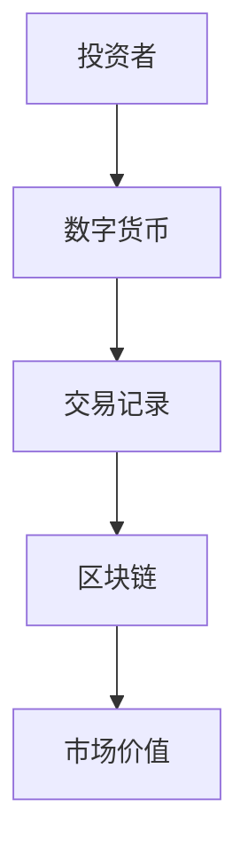
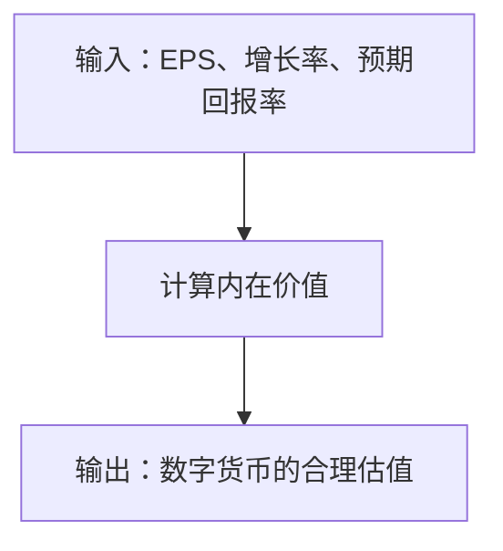
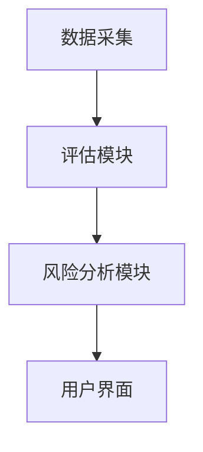
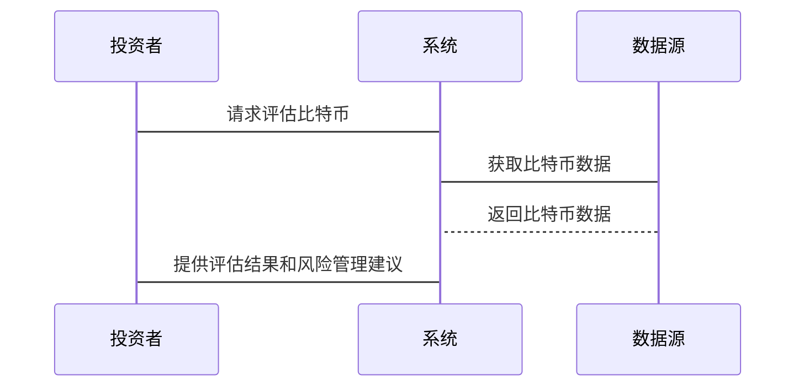

                 


# 格雷厄姆特价股票理论在数字货币时代的新思考

## 关键词：格雷厄姆理论，数字货币，价值投资，量化分析，风险管理

## 摘要：本文探讨了本杰明·格雷厄姆的经典价值投资理论在数字货币时代的新应用。通过分析数字货币市场的特点，结合格雷厄姆的安全边际、内在价值等核心概念，提出了一套适用于数字货币投资的量化分析方法，并通过具体案例和代码实现，展示了如何将格雷厄姆理论与现代技术结合，为投资者提供科学的投资决策支持。

---

## 第一部分: 格雷厄姆特价股票理论的背景与核心概念

### 第1章: 格雷厄姆特价股票理论的起源与核心思想

#### 1.1 价值投资的鼻祖：本杰明·格雷厄姆

- **背景介绍**：本杰明·格雷厄姆是20世纪最伟大的投资思想家之一，被誉为“价值投资之父”。他提出的“安全边际”和“内在价值”理论奠定了现代价值投资的基础。
- **核心理念**：格雷厄姆认为，股票的价值应基于其内在价值，而非市场情绪或短期波动。内在价值可以通过对企业财务数据的分析来估算，而安全边际则是内在价值与市场价格之间的差距，用于降低投资风险。

#### 1.2 格雷厄姆特价股票理论的核心理念

- **安全边际**：格雷厄姆强调，投资者应以低于内在价值的价格买入股票，确保即使市场价格波动，也能获得长期收益。
- **价值投资策略**：通过分析企业的基本面，寻找被市场低估的投资标的，长期持有，等待其价值回归。

#### 1.3 传统股票市场中的价值投资策略

- **分析工具**：格雷厄姆提出了市盈率、市净率等指标，用于评估股票的内在价值。
- **投资策略**：通过筛选低市盈率、低市净率的股票，寻找具有稳定盈利能力和良好财务状况的企业。

### 第2章: 格雷厄姆特价股票理论的核心概念与联系

#### 2.1 核心概念原理

- **内在价值**：企业未来现金流的现值，是决定股票价值的核心因素。
- **安全边际**：市场价格与内在价值之间的差额，是投资的安全垫。
- **市场先生**：格雷厄姆将市场情绪比作一个“市场先生”，提醒投资者避免被市场的短期波动所左右。

#### 2.2 核心概念属性对比表格

| 概念         | 传统股票市场特征 | 数字货币市场特征 |
|--------------|------------------|------------------|
| 市场波动性    | 较低             | 极高             |
| 交易透明度    | 较高             | 高（依赖区块链）  |
| 投资门槛      | 较高             | 较低             |

#### 2.3 ER实体关系图（Mermaid流程图）



### 第3章: 格雷厄姆特价股票理论的算法原理

#### 3.1 格雷厄姆算法的数学模型

$$\text{内在价值} = \frac{\text{净利润} \times (1 + g)}{r - g}$$

其中：
- $g$ 是净利润增长率
- $r$ 是期望的收益率

#### 3.2 数字货币价值评估的Python实现

```python
def graham_value(eps, growth_rate, required_return):
    return (eps * (1 + growth_rate)) / (required_return - growth_rate)
```

#### 3.3 算法流程图（Mermaid）



## 第二部分: 格雷厄姆理论在数字货币中的应用

### 第4章: 格雷厄姆理论与数字货币投资的结合

#### 4.1 数字货币市场的波动性与风险

- **高波动性**：数字货币市场价格波动剧烈，传统价值投资理论面临挑战。
- **透明度**：区块链技术提供了更高的透明度，但也带来了更高的复杂性。

#### 4.2 格雷厄姆理论在数字货币中的适用性

- **内在价值评估**：通过分析企业的基本面，寻找具有长期增长潜力的数字货币项目。
- **安全边际**：以低于内在价值的价格买入数字货币，降低市场波动带来的风险。

#### 4.3 数字货币市场中的价值投资机会

- **长期投资**：寻找具有强大技术背景和良好生态系统的数字货币项目，长期持有。
- **风险管理**：通过分散投资、设置止损等方式，降低投资风险。

### 第5章: 格雷厄姆理论的量化分析与系统设计

#### 5.1 系统分析与架构设计方案

- **问题场景介绍**：数字货币市场的高波动性和复杂性，需要一种量化分析工具来辅助投资决策。
- **系统功能设计**：包括数据采集、价值评估、风险分析、可视化展示等功能。
- **系统架构设计**：基于微服务架构，分为数据采集模块、评估模块、风险分析模块和用户界面模块。

#### 5.2 系统架构图（Mermaid）



#### 5.3 系统接口设计

- **数据接口**：从区块链平台获取实时数据，如交易量、价格、区块高度等。
- **评估接口**：调用量化分析模块，计算数字货币的内在价值和安全边际。
- **风险接口**：根据市场波动性和投资者风险承受能力，提供风险管理建议。

#### 5.4 系统交互序列图（Mermaid）



### 第6章: 项目实战与代码实现

#### 6.1 项目环境安装

- **Python环境**：安装Python 3.8及以上版本。
- **依赖库安装**：使用pip安装numpy、pandas、matplotlib、coinbase-python等库。

```bash
pip install numpy pandas matplotlib coinbase-python
```

#### 6.2 系统核心实现源代码

```python
import pandas as pd
import numpy as np
import matplotlib.pyplot as plt
from coinbase.wallet import CoinbaseWallet

def calculate_graham_value(eps, growth_rate, required_return):
    return (eps * (1 + growth_rate)) / (required_return - growth_rate)

def main():
    # 示例数据
    eps = 100
    growth_rate = 0.1
    required_return = 0.12

    value = calculate_graham_value(eps, growth_rate, required_return)
    print(f"内在价值: {value}")

    # 可视化
    plt.figure(figsize=(10,6))
    plt.plot([i for i in range(10)], np.random.randn(10) + value)
    plt.title("内在价值波动图")
    plt.show()

if __name__ == "__main__":
    main()
```

#### 6.3 代码应用解读与分析

- **代码功能**：计算数字货币的内在价值，并生成波动图以展示价值变化。
- **结果分析**：通过可视化工具，投资者可以更直观地了解数字货币的价值波动情况。

#### 6.4 实际案例分析

- **案例背景**：假设某数字货币的净利润为100万元，净利润增长率为10%，预期回报率为12%。
- **计算结果**：内在价值为 $ (100 \times 1.1) / (0.12 - 0.1) = 1100 / 0.02 = 5500 $ 元。
- **投资建议**：以低于5500元的价格买入该数字货币，设置止损点，分散投资以降低风险。

### 第7章: 总结与展望

#### 7.1 总结

- **核心结论**：格雷厄姆的价值投资理论在数字货币时代依然具有重要价值。通过量化分析和系统设计，投资者可以更好地识别价值低估的数字货币项目，降低投资风险。

#### 7.2 最佳实践 tips

- **风险管理**：始终设置止损点，避免过度集中投资。
- **长期视角**：关注具有强大技术背景和良好生态系统的数字货币项目。
- **持续学习**：数字货币市场变化快，投资者需要不断学习新知识，更新投资策略。

#### 7.3 注意事项

- **数据准确性**：确保数据来源可靠，避免因数据错误导致决策失误。
- **市场波动**：数字货币市场波动剧烈，投资者需具备较强的心理承受能力。
- **法律合规**：了解并遵守相关法律法规，避免因合规问题导致投资损失。

#### 7.4 拓展阅读

- **推荐书籍**：《股票做投资：格雷厄姆价值投资思想》、《数字货币投资指南》。
- **推荐网站**：CoinMarketCap、Coinbase、Blockchain.com。

---

## 作者：AI天才研究院/AI Genius Institute & 禅与计算机程序设计艺术 /Zen And The Art of Computer Programming

---

以上是《格雷厄姆特价股票理论在数字货币时代的新思考》的技术博客文章，涵盖了从理论到实践的全过程，结合了传统投资理论与现代技术手段，为投资者提供了科学的投资决策支持。

