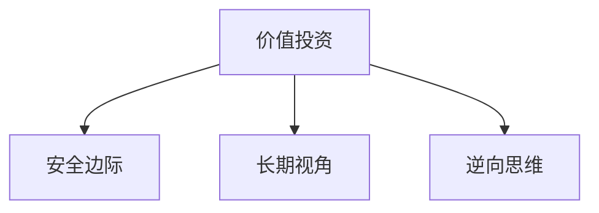
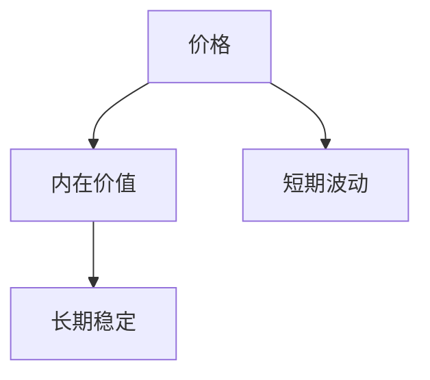
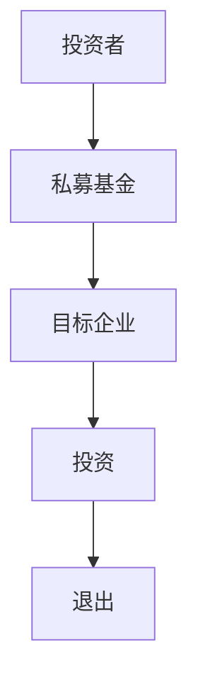
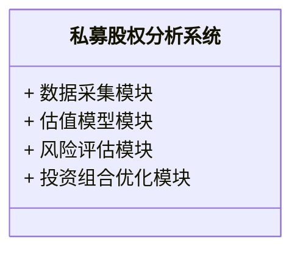
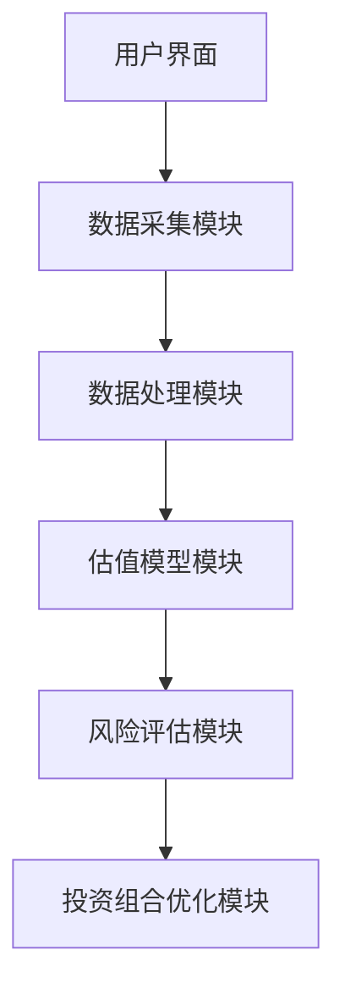
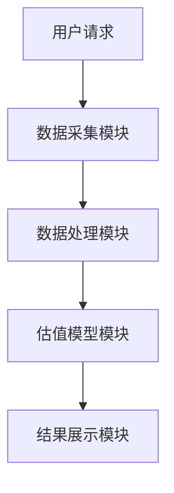

                 


```markdown
# 《格雷厄姆特价股票理论在私募股权投资中的应用》

## 关键词
- 格雷厄姆投资理论
- 特价股票
- 私募股权投资
- 价值投资
- 股票估值

## 摘要
本文探讨了格雷厄姆的价值投资理论在私募股权投资中的应用，通过详细分析理论背景、数学模型、系统设计和实际案例，展示了如何将格雷厄姆的“安全边际”理念应用于私募股权选择和估值。文章结构清晰，内容详实，旨在为投资者提供实用的指导。

---

# 第一部分: 格雷厄姆特价股票理论的背景与基础

## 第1章: 格雷厄姆特价股票理论概述

### 1.1 格雷厄姆投资理论的核心概念

#### 1.1.1 价值投资的基本原理
价值投资是一种以低于内在价值的价格购买优质股票的投资策略。格雷厄姆强调，市场波动为投资者提供了以折扣价买入的机会。以下是价值投资的核心原理：

- **安全边际**：购买价格低于内在价值，确保即使出现估值错误，也能获得正收益。
- **长期视角**：关注企业的长期盈利能力，而非短期市场波动。
- **逆向思维**：在市场恐慌时买入，在市场狂热时卖出。



#### 1.1.2 特价股票的定义与特征
特价股票是指市场价格低于其内在价值的股票。以下是特价股票的主要特征：

| 特征 | 描述 |
|------|------|
| 低估值 | 市盈率、市净率等指标低于行业平均水平 |
| 高分红率 | 相对于股价，股息收益率较高 |
| 财务健康 | 资产负债表稳健，现金流充裕 |
| 行业地位 | 在行业内具有竞争优势 |

#### 1.1.3 格雷厄姆投资策略的核心要素
格雷厄姆的投资策略主要包括以下要素：

- **筛选标准**：基于财务指标（如市盈率、市净率）筛选低价股票。
- **安全边际**：确保买入价格低于内在价值。
- **分散投资**：通过投资多个标的降低风险。

---

### 1.2 格雷厄姆投资理论的哲学基础

#### 1.2.1 "安全边际"的概念
安全边际是格雷厄姆理论的核心，指买入价格与内在价值之间的差距。通过安全边际，投资者可以在估值错误时仍能获利。

#### 1.2.2 投资中的"margin of safety"
安全边际不仅提供保护，还能增加投资的确定性。以下是安全边际的重要性：

- **保护本金**：即使估值错误，也能避免重大损失。
- **提高收益潜力**：内在价值的提升带来的额外收益。

#### 1.2.3 价值与价格的长期关系
格雷厄姆认为，市场价格围绕内在价值波动，长期来看，价格会回归价值。以下是价值与价格的关系：



---

### 1.3 格雷厄姆投资理论的现代发展

#### 1.3.1 理论的演变与应用
现代价值投资流派在格雷厄姆的基础上进行了扩展，例如巴菲特的“护城河”概念和彼得·林奇的选股方法。

#### 1.3.2 现代价值投资流派的分化
不同投资者对格雷厄姆理论的解读不同，形成了多种价值投资风格。

#### 1.3.3 格雷厄姆理论在私募股权中的潜在应用
格雷厄姆理论在私募股权中的应用需要结合私募股权的特点，例如高杠杆和高风险。

---

## 第2章: 私募股权投资的基本原理

### 2.1 私募股权投资的定义与特点

#### 2.1.1 私募股权的定义
私募股权是指通过非公开方式向特定投资者募集资金，投资于未上市公司或进行企业重组的投资形式。

#### 2.1.2 私募股权与传统投资的区别
| 方面 | 私募股权 | 传统投资 |
|------|----------|-----------|
| 流动性 | 低       | 高         |
| 风险 | 高       | 中/低     |
| 收益 | 高       | 中/低     |

#### 2.1.3 私募股权的运作模式
私募股权的运作模式包括：

- **收购**：购买现有企业部分或全部股权。
- **重组**：对企业进行财务或战略调整。
- **上市**：通过IPO或出售实现退出。



### 2.2 私募股权市场的参与者

#### 2.2.1 投资者角色
投资者包括高净值个人、机构投资者和主权财富基金。

#### 2.2.2 管理人与顾问的角色
私募基金管理人负责投资决策，顾问提供行业分析和市场研究。

#### 2.2.3 相关中介机构的作用
律师、会计师和托管银行等机构提供法律、财务和托管服务。

### 2.3 私募股权投资的生命周期

#### 2.3.1 投资阶段划分
私募股权的投资阶段通常包括：

1. **种子阶段**：初创企业。
2. **成长阶段**：快速成长期。
3. **成熟阶段**：稳定盈利期。
4. **收割阶段**：准备出售。

#### 2.3.2 退出机制与收益分配
常见的退出机制包括：

- **首次公开募股（IPO）**：企业上市后出售股票。
- **并购**：出售给其他企业。
- **破产清算**：在企业失败时出售资产。

#### 2.3.3 风险与回报的平衡
私募股权投资风险较高，但潜在回报也高。以下是风险与回报的平衡：

| 风险 | 描述 |
|------|------|
| 市场风险 | 市场波动影响股价 |
| 信用风险 | 企业违约风险 |
| 流动性风险 | 无法及时变现 |

---

# 第二部分: 格雷厄姆特价股票理论在私募股权投资中的应用

## 第3章: 格雷厄姆理论与私募股权投资的结合

### 3.1 格雷厄姆理论在私募股权投资中的适用性分析

#### 3.1.1 价值投资与私募股权的契合点
价值投资强调低估值和安全边际，与私募股权的高回报和高风险特性相契合。

#### 3.1.2 私募股权市场的特殊性与挑战
私募股权市场的特殊性包括：

- **信息不对称**：私募股权的信息透明度较低。
- **高杠杆**：通常使用杠杆放大收益和风险。
- **较长的投资周期**：私募股权需要较长时间才能实现退出。

#### 3.1.3 格雷厄姆理论的适应
格雷厄姆理论需要根据私募股权的特点进行调整，例如：

- **动态调整安全边际**：考虑私募股权的高杠杆和高风险。
- **关注非流动性风险**：私募股权的流动性较低，需要调整估值方法。

### 3.2 格雷厄姆理论在私募股权估值中的应用

#### 3.2.1 贴现现金流模型（DCF）
贴现现金流模型是私募股权估值的核心工具。以下是DCF模型的步骤：

1. **预测现金流**：预测未来5-10年的现金流。
2. **计算加权平均资本成本（WACC）**：确定合适的折现率。
3. **贴现现金流**：将未来现金流贴现到现值。
4. **加总现值**：将各年的现值相加，得到企业价值。

DCF模型的公式如下：

$$
\text{企业价值} = \sum_{t=1}^{n} \frac{\text{现金流}_t}{(1 + \text{WACC})^t}
$$`

#### 3.2.2 市盈率与市净率的调整
私募股权的市盈率和市净率需要根据行业特点和企业具体情况调整。

#### 3.2.3 安全边际的重新定义
在私募股权中，安全边际需要考虑高杠杆和高风险因素。

### 3.3 格雷厄姆理论与私募股权投资的结合案例

#### 3.3.1 案例背景
某私募基金计划投资一家成长期科技公司。

#### 3.3.2 格雷厄姆理论的应用步骤
1. **财务分析**：评估公司的财务状况和盈利能力。
2. **估值模型**：使用DCF模型评估企业价值。
3. **安全边际计算**：确保买入价格低于DCF估值。
4. **投资决策**：基于安全边际和团队判断做出投资决策。

### 3.4 格雷厄姆理论在私募股权风险管理中的应用

#### 3.4.1 风险识别与评估
私募股权投资中的主要风险包括市场风险、信用风险和流动性风险。

#### 3.4.2 格雷厄姆理论的风险管理策略
1. **分散投资**：通过投资多个项目降低风险。
2. **严格筛选**：选择财务健康、行业地位稳固的企业。
3. **动态调整**：根据市场变化和企业状况调整投资组合。

---

## 第4章: 数学模型与算法实现

### 4.1 格雷厄姆理论的数学模型

#### 4.1.1 贴现现金流模型
贴现现金流模型的Python实现如下：

```python
def discounted_cash_flow(cash_flows, discount_rate):
    present_value = 0
    for year, cash_flow in enumerate(cash_flows):
        discount_factor = (1 + discount_rate) ** year
        present_value += cash_flow / discount_factor
    return present_value
```

#### 4.1.2 市盈率与市净率的计算
市盈率（P/E）和市净率（P/B）的计算公式分别为：

$$
\text{P/E} = \frac{\text{股价}}{\text{每股收益}}
$$

$$
\text{P/B} = \frac{\text{股价}}{\text{每股净资产}}
$$`

### 4.2 算法实现与代码示例

#### 4.2.1 贴现现金流模型的实现
以下是贴现现金流模型的Python代码示例：

```python
def calculate_enterprise_value(operating_cash_flow, wacc):
    present_value = 0
    for year in range(1, 11):
        if year == 1:
            cash_flow = operating_cash_flow * 1.1
        elif year == 2:
            cash_flow = operating_cash_flow * 1.2
        else:
            cash_flow = operating_cash_flow * 1.05 ** (year - 2)
        discount_factor = (1 + wacc) ** year
        present_value += cash_flow / discount_factor
    return present_value
```

#### 4.2.2 市盈率与市净率的计算
市盈率和市净率的计算代码示例：

```python
def calculate_pe_ratio(price, eps):
    return price / eps

def calculate_pb_ratio(price, book_value_per_share):
    return price / book_value_per_share
```

---

## 第5章: 系统分析与架构设计

### 5.1 系统功能设计

#### 5.1.1 系统功能模块
私募股权分析系统的功能模块包括：

- 数据采集与处理
- 估值模型计算
- 风险评估与管理
- 投资组合优化



### 5.2 系统架构设计

#### 5.2.1 系统架构图
以下是私募股权分析系统的架构图：



#### 5.2.2 数据流图
以下是系统的数据流图：



---

## 第6章: 项目实战与案例分析

### 6.1 项目环境配置

#### 6.1.1 环境要求
- 操作系统：Windows/Mac/Linux
- Python版本：3.8以上
- 库依赖：pandas, numpy, matplotlib

### 6.2 核心实现代码

#### 6.2.1 数据采集与处理
以下是数据采集和处理的代码示例：

```python
import pandas as pd

def load_data(file_path):
    df = pd.read_csv(file_path)
    return df

def preprocess_data(df):
    df.dropna(inplace=True)
    df['date'] = pd.to_datetime(df['date'])
    return df
```

#### 6.2.2 估值模型实现
以下是估值模型的实现代码：

```python
import numpy as np

def calculate_wacc(risk_free_rate, market_risk_premium, beta):
    return risk_free_rate + beta * market_risk_premium

def discounted_cash_flow(cash_flows, wacc):
    present_value = 0
    for year in range(len(cash_flows)):
        discount_factor = (1 + wacc) ** (year + 1)
        present_value += cash_flows[year] / discount_factor
    return present_value
```

### 6.3 案例分析与结果解读

#### 6.3.1 案例背景
假设我们投资于一家成长期的科技公司。

#### 6.3.2 数据分析与处理
使用历史财务数据和行业数据进行分析。

#### 6.3.3 模型计算与结果
使用DCF模型计算企业价值，并与市场价格进行对比，评估安全边际。

#### 6.3.4 投资决策
基于模型计算结果和安全边际，做出投资决策。

### 6.4 项目总结与反思

#### 6.4.1 成功经验
- 理论与实践相结合
- 模型的准确性和实用性

#### 6.4.2 经验教训
- 数据获取的困难
- 模型假设的局限性

---

## 第7章: 总结与展望

### 7.1 总结

#### 7.1.1 核心内容回顾
本文详细探讨了格雷厄姆价值投资理论在私募股权投资中的应用，从理论基础到实际应用进行了全面分析。

#### 7.1.2 实践意义
本文的研究为私募股权投资者提供了新的思路和方法，帮助他们在复杂的市场环境中做出更明智的投资决策。

### 7.2 展望

#### 7.2.1 理论研究
未来可以进一步研究格雷厄姆理论与其他投资理论的结合。

#### 7.2.2 实践应用
可以尝试将格雷厄姆理论应用于其他类型的投资，如房地产投资。

#### 7.2.3 技术创新
随着人工智能和大数据技术的发展，可以开发更智能的估值模型和投资管理系统。

---

## 第8章: 最佳实践与注意事项

### 8.1 最佳实践

#### 8.1.1 理论学习
深入学习格雷厄姆的投资理论，理解其核心思想和应用场景。

#### 8.1.2 数据分析
注重数据的准确性和完整性，选择合适的估值模型。

#### 8.1.3 投资决策
结合定性和定量分析，做出更科学的投资决策。

### 8.2 注意事项

#### 8.2.1 风险管理
高度重视私募股权投资的风险，制定合理的风险管理策略。

#### 8.2.2 法律合规
确保投资活动符合相关法律法规，避免法律风险。

#### 8.2.3 持续学习
金融市场变化莫测，需要不断学习和更新知识。

---

## 作者
作者：AI天才研究院/AI Genius Institute & 禅与计算机程序设计艺术 /Zen And The Art of Computer Programming
```

