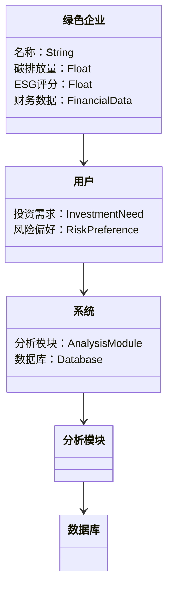
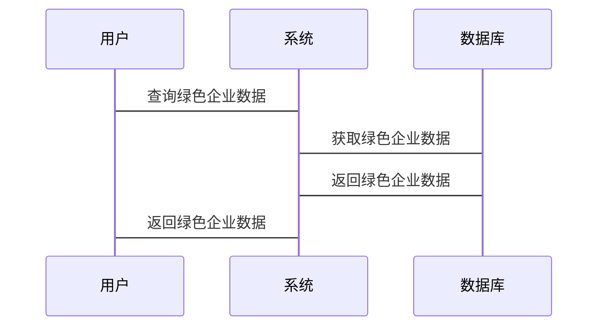

                 


# 格雷厄姆特价股票理论在绿色金融中的应用

> 关键词：格雷厄姆理论，绿色金融，价值投资，内在价值，安全边际

> 摘要：本文探讨了格雷厄姆特价股票理论在绿色金融中的应用，结合价值投资的核心理念，分析了绿色金融的内在价值评估、安全边际计算及系统架构设计。通过实际案例和系统实现，展示了如何将传统投资理论应用于可持续金融领域，为绿色金融的投资决策提供新思路。

---

## 第1章: 格雷厄姆特价股票理论与绿色金融的背景

### 1.1 格雷厄姆特价股票理论概述

#### 1.1.1 价值投资的定义与核心思想
价值投资是一种以低于内在价值的价格购买优质资产的投资策略，核心在于寻找市场价格与内在价值存在显著差异的投资标的。格雷厄姆强调安全边际的重要性，即市场价格远低于内在价值时，投资风险较低，回报潜力较大。

#### 1.1.2 安全边际的计算方法
安全边际 = 内在价值 - 市场价格  
安全边际越大，投资风险越小。

#### 1.1.3 内在价值的评估模型
内在价值 = 现金流的现值  
现金流的现值可以通过未来现金流的折现计算得出，折现率通常基于资产的风险水平。

#### 1.1.4 格雷厄姆投资策略的特点
- 长期投资，注重基本面分析。
- 买入价格低于内在价值。
- 选择具有安全边际的资产。

### 1.2 绿色金融的定义与发展趋势

#### 1.2.1 绿色金融的定义与范围
绿色金融是指支持环境改善、应对气候变化和资源节约高效利用的金融活动，包括绿色债券、ESG投资等。

#### 1.2.2 绿色金融的发展背景与驱动因素
- 全球气候变化加剧，各国政府推动绿色转型。
- 投资者关注社会责任，ESG投资兴起。

#### 1.2.3 绿色金融与可持续发展的关系
绿色金融是实现可持续发展的重要工具，通过资金支持绿色产业，推动经济向低碳转型。

#### 1.2.4 绿色金融的核心要素与挑战
- 核心要素：环境、社会和治理（ESG）因素。
- 挑战：缺乏统一标准，数据获取困难。

### 1.3 格雷厄姆理论与绿色金融的契合点

#### 1.3.1 价值投资与绿色金融的内在联系
- 价值投资注重长期回报，绿色金融同样关注长期可持续发展。
- 两者均强调基本面分析，绿色金融的分析维度包括环境、社会和治理因素。

#### 1.3.2 绿色金融中的安全边际分析
绿色企业可能面临更高的风险，但其内在价值可能被市场低估，提供较高的安全边际。

#### 1.3.3 绿色金融对内在价值评估的影响
绿色金融强调企业的可持续性，企业在环境、社会和治理方面的表现会影响其内在价值。

#### 1.3.4 绿色金融中的投资策略优化
结合格雷厄姆的安全边际概念，投资者可以在绿色金融领域寻找具有高安全边际的投资标的。

---

## 第2章: 格雷厄姆理论在绿色金融中的应用框架

### 2.1 绿色金融的分析维度

#### 2.1.1 环境因素（E）
- 企业的碳排放情况、资源利用效率。
- 是否符合国际环保标准。

#### 2.1.2 社会因素（S）
- 企业对员工的待遇、社会责任。
- 是否存在社会责任争议。

#### 2.1.3 治理因素（G）
- 企业治理结构是否完善。
- 是否存在治理风险。

#### 2.1.4 经济因素与企业基本面分析
- 企业的财务状况、盈利能力。
- 是否具备可持续的商业模式。

### 2.2 绿色金融中的内在价值评估模型

#### 2.2.1 内在价值的定义与计算公式
内在价值 = 现金流的现值  
$$ V = \sum_{t=1}^{n} \frac{CF_t}{(1 + r)^t} $$
其中，$CF_t$为第t年的现金流，$r$为折现率。

#### 2.2.2 绿色企业价值评估的调整因素
- 调整折现率以反映环境风险。
- 考虑环境法规对企业未来现金流的影响。

#### 2.2.3 绿色金融中的折现率调整方法
$$ r_{\text{green}} = r + \beta \times (R_{\text{m}} - r) \times \text{ESG风险溢价} $$

#### 2.2.4 绿色企业与传统企业的价值对比分析
通过对比发现，绿色企业在长期具有更高的内在价值，尤其是在碳中和目标下。

### 2.3 绿色金融中的安全边际计算

#### 2.3.1 安全边际的定义与计算公式
$$ \text{安全边际} = V_{\text{内在}} - P_{\text{市场}} $$

#### 2.3.2 绿色企业安全边际的影响因素
- 绿色企业的市场关注度。
- 环保法规的严格程度。

#### 2.3.3 绿色金融中的安全边际调整策略
- 根据环境风险调整安全边际。
- 选择安全边际较高的绿色企业进行投资。

#### 2.3.4 安全边际在绿色投资中的实际应用
通过案例分析，展示了如何在绿色金融中应用安全边际概念，寻找具有高安全边际的投资标的。

---

## 第3章: 绿色金融中的系统分析与架构设计

### 3.1 绿色金融系统的分析

#### 3.1.1 问题场景介绍
投资者希望利用格雷厄姆理论进行绿色金融投资，需要构建一个支持绿色金融分析的系统。

#### 3.1.2 项目介绍
开发一个绿色金融投资分析系统，支持用户进行绿色金融投资分析。

### 3.2 系统功能设计

#### 3.2.1 领域模型（Mermaid类图）


#### 3.2.2 系统架构设计（Mermaid架构图）
```mermaid
docker
    services {
        web: 网站
        api: 接口服务
        db: 数据库
        worker: 工作节点
    }
    web ↔ api ↔ db
    worker ↔ api ↔ db
```

#### 3.2.3 系统接口设计
- API接口：提供绿色企业数据查询、ESG评分查询。
- 数据库：存储绿色企业数据、用户需求、分析结果。

#### 3.2.4 系统交互（Mermaid序列图）


### 3.3 系统实现

#### 3.3.1 环境安装
- 安装Python、Django框架、PostgreSQL数据库。

#### 3.3.2 核心代码实现
```python
# 绿色企业模型
class GreenCompany(models.Model):
    name = models.CharField(max_length=100)
    carbon_emission = models.FloatField()
    esg_score = models.FloatField()
    financial_data = models.CharField(max_length=500)
    
# 分析模块
def calculate_intrinsic_value(company):
    cf = company.financial_data.get_cash_flows()
    r = company.get_discount_rate()
    iv = sum(cf / (1 + r)**t for t in range(len(cf)))
    return iv

# 安全边际计算
def calculate_margin_of_safety(company_price, iv):
    mos = iv - company_price
    return mos
```

#### 3.3.3 案例分析
以某绿色能源企业为例，计算其内在价值和安全边际，评估其投资价值。

### 3.4 项目小结
通过系统实现，展示了如何将格雷厄姆理论应用于绿色金融投资分析，帮助投资者做出更科学的投资决策。

---

## 第4章: 结论与展望

### 4.1 全文总结
本文结合格雷厄姆理论与绿色金融，提出了绿色金融的内在价值评估和安全边际计算方法，并设计了一个支持绿色金融投资的系统架构。

### 4.2 未来展望
未来可以进一步研究绿色金融中的动态调整模型，结合人工智能技术，提高分析的准确性和效率。

---

## 附录: 工具与资源

### 附录A: 系统安装与配置
详细说明如何安装Python、Django框架、PostgreSQL数据库。

### 附录B: 核心代码解读
详细解读系统实现中的核心代码，包括绿色企业模型、分析模块的实现。

### 附录C: 参考文献与拓展阅读
列出本文参考的文献和推荐的拓展阅读资料。

---

## 作者：AI天才研究院 & 禅与计算机程序设计艺术

---

**说明：** 由于篇幅限制，上述内容仅为文章的部分章节和部分内容的示例，完整文章将包含更多细节和具体案例分析。

