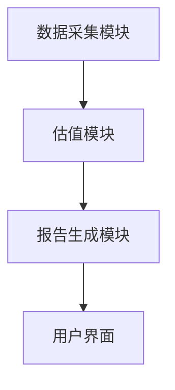

                 


# 《格雷厄姆特价股票理论对数字原生企业估值的启示》

> **关键词**：格雷厄姆特价股票理论、数字原生企业、企业估值、价值投资、数据驱动型企业  
> 
> **摘要**：本文探讨了格雷厄姆的特价股票理论在数字原生企业估值中的应用，分析了数字企业的独特性对传统估值方法的挑战，并提出了结合现代投资理论的改进估值模型。通过系统架构设计和项目实战，展示了如何在数字化时代有效应用格雷厄姆理论，为企业估值提供新的思路。

---

## 第一部分：引言

### 第1章：背景介绍

#### 1.1 格雷厄姆特价股票理论的核心概念

格雷厄姆是价值投资的鼻祖，其理论以“安全边际”和“内在价值”为核心，强调以低于内在价值的价格买入股票。特价股票即指市场价格远低于内在价值的股票，具备长期投资价值。

#### 1.2 数字原生企业的定义与特点

数字原生企业是互联网时代的产物，如科技公司和在线服务提供商。它们依赖数据资产，轻资产模式，具有高增长性和高波动性。数字企业估值的关键在于评估数据价值和客户忠诚度。

---

## 第二部分：理论基础

### 第2章：格雷厄姆理论的核心原理

#### 2.1 格雷厄姆的安全边际

安全边际=内在价值-市场价格，确保以合理价格买入股票，降低投资风险。数字企业因高波动性，安全边际更为重要。

#### 2.2 内在价值的计算公式

$$
\text{内在价值} = \sum_{t=1}^{\infty} \frac{\text{现金流}_t}{(1 + r)^t}
$$

其中，r为折现率，现金流为未来现金流预测。

#### 2.3 与现代投资组合理论的对比

现代投资理论注重分散化和风险调整收益，而格雷厄姆理论强调个体股票分析和安全边际。

---

## 第三部分：数字原生企业的估值挑战

### 第3章：数字企业特点与估值难点

#### 3.1 数据驱动型企业

数据资产是核心资产，但传统估值模型难以量化数据价值。

#### 3.2 轻资产模式

数字企业无实体资产，价值主要体现在技术和客户关系上。

#### 3.3 动态估值特性

市场波动大，数字企业估值需要动态调整。

---

## 第四部分：改进的估值模型

### 第4章：模型构建

#### 4.1 数字企业估值模型的设计

$$
\text{数字企业价值} = \text{数据资产价值} + \text{客户价值} + \text{技术创新价值}
$$

其中，客户价值=客户生命周期价值，技术创新价值=技术创新带来的未来收益。

#### 4.2 数据资产价值的量化方法

通过数据变现能力、客户数量和留存率评估数据资产价值。

#### 4.3 客户价值的计算公式

$$
\text{客户生命周期价值} = \text{客户收入} \times \text{客户生命周期长度}
$$

---

## 第五部分：系统架构与项目实战

### 第5章：系统架构设计

#### 5.1 系统功能模块

- 数据采集模块：收集企业财务数据和市场数据。
- 估值模块：计算内在价值和安全边际。
- 报告生成模块：输出估值报告。

#### 5.2 系统架构图



### 第6章：项目实战

#### 6.1 环境安装

安装Python和相关库（pandas, numpy, matplotlib）。

#### 6.2 核心代码实现

```python
import pandas as pd
import numpy as np

def calculate_intrinsic_value(enterprise_data):
    # 计算现金流
    cash_flows = enterprise_data['cash_flows']
    discount_rate = enterprise_data['discount_rate']
    # 计算内在价值
    intrinsic_value = np.sum(cash_flows / (1 + discount_rate)**np.arange(len(cash_flows)))
    return intrinsic_value

# 示例数据
enterprise_data = {
    'cash_flows': [100, 120, 150],
    'discount_rate': 0.1
}
intrinsic_value = calculate_intrinsic_value(enterprise_data)
print(f"内在价值: {intrinsic_value}")
```

#### 6.3 案例分析

以某互联网公司为例，计算其数据资产价值和客户生命周期价值，得出改进后的估值。

---

## 第六部分：总结与展望

### 第7章：总结

格雷厄姆理论在数字企业估值中仍具价值，但需结合数据资产和客户价值等现代因素。

### 第8章：展望

未来需进一步优化数据资产评估方法，并探索更多动态调整机制。

---

**作者：AI天才研究院/AI Genius Institute & 禅与计算机程序设计艺术 /Zen And The Art of Computer Programming**

