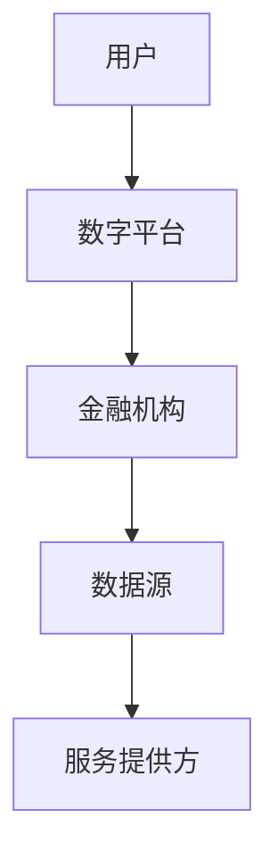

                 

# 《格雷厄姆特价股票理论对数字普惠金融可持续性的启示》

---

## 关键词：  
格雷厄姆特价股票理论、数字普惠金融、可持续性、金融创新、风险管理、价值投资

---

## 摘要：  
本文探讨了格雷厄姆的特价股票理论在数字普惠金融领域的应用，分析了该理论对提升数字普惠金融可持续性的启示。通过结合价值投资理念与数字技术，本文提出了优化数字普惠金融系统的策略，并通过实际案例验证了理论的可行性。文章内容涵盖理论背景、系统分析、算法实现与项目实战，为金融领域的技术创新与可持续发展提供了新的思路。

---

# 第1章 格雷厄姆特价股票理论的背景与核心概念

## 1.1 格雷厄姆特价股票理论的背景介绍

### 1.1.1 价值投资的起源与演变  
格雷厄姆是价值投资的鼻祖，他的理论起源于20世纪初，最初旨在帮助投资者在市场波动中发现被低估的股票。格雷厄姆强调基本面分析，认为股票的内在价值是其价格波动的基础。

### 1.1.2 格雷厄姆投资理念的核心思想  
格雷厄姆提出，投资者应以低于其内在价值的价格买入股票，并长期持有，以抵御市场的短期波动。他的理论强调安全边际，即买入价格远低于内在价值，以降低风险。

### 1.1.3 特价股票理论的定义与特征  
特价股票是指其市场价格远低于其内在价值的股票。格雷厄姆认为，这类股票具有较高的投资价值，适合长期持有。

## 1.2 格雷厄姆特价股票理论的数学模型与公式

### 1.2.1 格雷厄姆的内在价值计算公式  
格雷厄姆提出了以下内在价值计算公式：  
$$ V = \frac{E}{4.41} $$  
其中，$E$ 是企业未来7年的平均收益总和。

### 1.2.2 格雷厄姆的防御性投资策略  
格雷厄姆的防御性投资策略可以用以下公式表示：  
$$ D = \frac{P}{E} $$  
其中，$P$ 是股票价格，$E$ 是企业收益。

## 1.3 格雷厄姆特价股票理论与现代金融的联系

### 1.3.1 价值投资与现代资产定价模型的关系  
格雷厄姆的理论为现代资产定价模型提供了基础，尤其是在基本面分析和风险管理方面。

### 1.3.2 格雷厄姆理论在量化投资中的应用  
格雷厄姆的理论被广泛应用于量化投资中，尤其是在大数据分析和算法交易中，通过量化模型筛选出具有价值的股票。

### 1.3.3 格雷厄姆理论的局限性与改进方向  
格雷厄姆理论主要适用于传统金融领域，但在数字普惠金融中，其适用性需要结合数字技术进行调整。

---

# 第2章 数字普惠金融的现状与挑战

## 2.1 数字普惠金融的定义与特点

### 2.1.1 数字普惠金融的定义  
数字普惠金融是指利用数字技术，为传统金融体系难以覆盖的群体提供金融服务，包括信贷、保险、支付等。

### 2.1.2 数字普惠金融的核心特征  
数字普惠金融的核心特征包括便捷性、普及性和高效性。

### 2.1.3 数字普惠金融与传统金融的区别  
数字普惠金融通过技术手段降低了金融服务的成本，提高了服务的覆盖面，而传统金融更多依赖于线下渠道。

## 2.2 数字普惠金融的数学模型与系统架构

### 2.2.1 数字普惠金融的系统架构图  

### 2.2.2 数字普惠金融的风险评估模型  
$$ R = \alpha \cdot P + \beta \cdot Q $$  
其中，$P$ 是平台风险，$Q$ 是用户信用风险，$\alpha$ 和 $\beta$ 是系数。

## 2.3 数字普惠金融的现状与挑战

### 2.3.1 数字技术在普惠金融中的应用  
数字技术如大数据、人工智能等在普惠金融中的应用，极大地提高了金融服务的效率。

### 2.3.2 数字普惠金融的可持续性问题  
数字普惠金融的可持续性问题主要表现在技术障碍、监管缺失和用户信任等方面。

### 2.3.3 数字普惠金融的监管与政策支持  
监管政策的完善和政策支持是数字普惠金融发展的关键因素。

---

# 第3章 格雷厄姆特价股票理论对数字普惠金融的启示

## 3.1 格雷厄姆理论与数字普惠金融的结合点

### 3.1.1 价值投资理念在普惠金融中的应用  
价值投资理念可以用于筛选具有长期价值的普惠金融项目。

### 3.1.2 格雷厄姆理论对普惠金融风险控制的启示  
格雷厄姆的防御性投资策略可以应用于普惠金融的风险控制，通过筛选低风险、高收益的项目来优化投资组合。

### 3.1.3 数字技术如何放大格雷厄姆理论的价值  
数字技术可以通过大数据分析和人工智能，快速筛选出具有价值的普惠金融项目，从而放大格雷厄姆理论的应用效果。

---

# 第4章 格雷厄姆理论对数字普惠金融可持续性的优化策略

## 4.1 格雷厄姆理论在数字普惠金融中的应用框架

### 4.1.1 数字普惠金融的核心要素  
数字普惠金融的核心要素包括技术、数据、服务和监管。

### 4.1.2 格雷厄姆理论在数字普惠金融中的应用流程  
格雷厄姆理论的应用流程包括需求分析、系统设计、风险评估和优化策略。

## 4.2 格雷厄姆理论对数字普惠金融的优化策略

### 4.2.1 优化策略一：基于格雷厄姆理论的风险管理  
通过格雷厄姆的防御性投资策略，优化数字普惠金融的风险管理，降低投资风险。

### 4.2.2 优化策略二：技术与理论的结合  
结合数字技术，如大数据和人工智能，优化格雷厄姆理论的实现，提高投资效率。

### 4.2.3 优化策略三：长期价值导向  
通过格雷厄姆的长期价值投资理念，引导数字普惠金融的可持续发展。

---

# 第5章 项目实战：基于格雷厄姆理论的数字普惠金融系统设计

## 5.1 项目背景与需求分析

### 5.1.1 项目背景  
本文设计了一个基于格雷厄姆理论的数字普惠金融系统，旨在优化普惠金融的可持续性。

### 5.1.2 项目需求  
系统需求包括用户需求、技术需求和监管需求。

## 5.2 系统架构设计

### 5.2.1 系统架构图  

### 5.2.2 系统功能设计  
系统功能包括用户注册、投资评估、风险管理等。

## 5.3 核心算法实现

### 5.3.1 格雷厄姆理论的实现  
通过Python代码实现格雷厄姆理论的核心算法。

### 5.3.2 系统优化与测试  
通过系统测试和优化，验证算法的有效性。

---

# 第6章 总结与展望

## 6.1 核心启示  
格雷厄姆理论为数字普惠金融的可持续性提供了重要的理论支持和技术启示。

## 6.2 实践中的注意事项  
在实际应用中，需要结合具体情况进行调整和优化。

## 6.3 未来展望  
未来，随着技术的发展，格雷厄姆理论在数字普惠金融中的应用将更加广泛和深入。

---

# 作者：AI天才研究院/AI Genius Institute & 禅与计算机程序设计艺术 /Zen And The Art of Computer Programming

