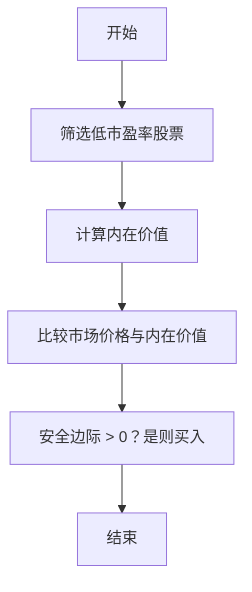
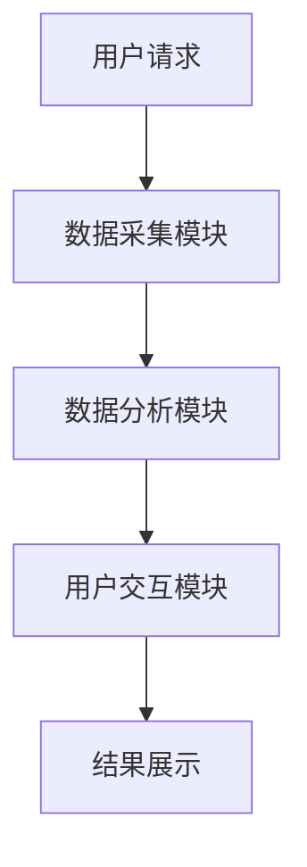
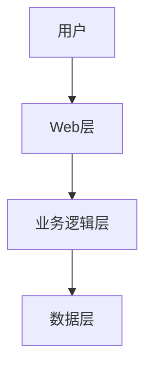
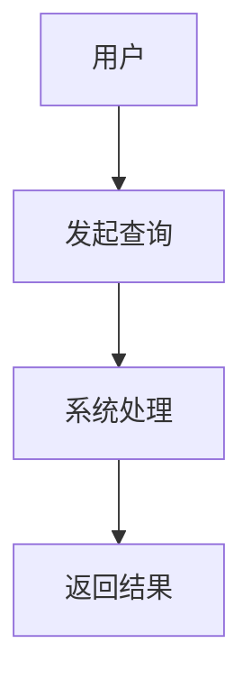

                 


# 格雷厄姆特价股票理论对数字普惠金融的启示

> 关键词：格雷厄姆投资理论、数字普惠金融、价值投资、算法实现、系统架构、项目实战

> 摘要：本文深入探讨了格雷厄姆特价股票理论在数字普惠金融领域的应用，从理论背景、核心概念、算法实现、系统架构、项目实战等多个维度展开分析，揭示了如何将传统投资理论与现代数字技术相结合，为普惠金融的发展提供新的思路和解决方案。

---

## 第1章 格雷厄姆特价股票理论概述

### 1.1 格雷厄姆投资理论的起源与发展

格雷厄姆投资理论是价值投资的鼻祖，由本杰明·格雷厄姆在20世纪初提出。其核心思想是寻找市场价格低于其内在价值的股票，通过安全边际的分析，降低投资风险并实现长期稳定的收益。

#### 1.1.1 价值投资的起源与发展
价值投资起源于20世纪初，格雷厄姆与大卫·多德共同提出“安全边际”概念，强调以低于内在价值的价格买入股票。这一理论在后来被沃伦·巴菲特等投资者发扬光大。

#### 1.1.2 格雷厄姆的选股标准
格雷厄姆提出了一系列选股标准，包括：
1. **低市盈率**：市盈率低于行业平均水平。
2. **低市净率**：市净率低于行业平均水平。
3. **高股息率**：股息率高于行业平均水平。
4. **足够大的公司规模**：公司市值较大，财务数据稳定。

#### 1.1.3 特价股票的定义与特点
特价股票是指市场价格低于其内在价值的股票，具有以下特点：
- 价格被市场低估。
- 具备安全边际。
- 长期增值潜力。

### 1.2 格雷厄姆投资理论的核心思想

#### 1.2.1 安全边际的概念
安全边际是指股票的市场价格与其内在价值之间的差额。格雷厄姆认为，只有当市场价格低于内在价值时，投资才具备安全边际。

#### 1.2.2 内在价值的计算方法
内在价值是基于公司基本面数据（如净利润、现金流、资产等）计算得出的公司合理估值。

#### 1.2.3 价值投资与成长投资的对比
价值投资注重安全边际和低估值，而成长投资注重高成长性和未来潜力。

### 1.3 数字普惠金融的背景与现状

#### 1.3.1 数字普惠金融的定义
数字普惠金融是指通过数字技术手段，为中小企业、低收入群体等传统金融难以覆盖的群体提供便捷、低成本的金融服务。

#### 1.3.2 数字普惠金融的发展现状
随着互联网、大数据、人工智能等技术的发展，数字普惠金融在全球范围内快速崛起，但仍面临信息不对称、风险控制难等问题。

#### 1.3.3 数字普惠金融与传统金融的区别
数字普惠金融通过技术创新降低了金融服务成本，提高了服务效率，而传统金融依赖于分支机构和人工服务。

---

## 第2章 格雷厄姆特价股票理论与数字普惠金融的结合

### 2.1 格雷厄姆理论在金融领域的应用

#### 2.1.1 格雷厄姆理论的核心模型
格雷厄姆的核心模型包括内在价值计算、安全边际分析等。

#### 2.1.2 格雷厄姆理论的数学公式
内在价值公式：
$$
\text{内在价值} = \frac{\text{净利润} \times (1 + g)}{r - g}
$$
其中，$g$为增长率，$r$为贴现率。

#### 2.1.3 格雷厄姆理论的优缺点
优点：注重安全边际，风险可控；缺点：对市场短期波动适应性差。

### 2.2 数字普惠金融的核心模式

#### 2.2.1 数字普惠金融的主要模式
包括基于大数据的风控、智能投顾、区块链金融等。

#### 2.2.2 数字普惠金融的技术创新
大数据分析、人工智能、区块链等技术的应用。

#### 2.2.3 数字普惠金融的市场定位
服务低收入群体、小微企业等传统金融难以覆盖的客户。

### 2.3 格雷厄姆理论对数字普惠金融的启示

#### 2.3.1 格雷厄姆理论在数字普惠金融中的应用
通过大数据分析筛选低估值企业，为普惠金融提供投资标的。

#### 2.3.2 数字普惠金融如何借鉴格雷厄姆理论
利用大数据技术计算企业内在价值，寻找市场价格低于内在价值的企业。

#### 2.3.3 格雷厄姆理论对数字普惠金融的未来影响
推动普惠金融从“价格”向“价值”投资转变，降低金融风险。

---

## 第3章 格雷厄姆特价股票理论的数学模型与算法

### 3.1 格雷厄姆理论的数学模型

#### 3.1.1 内在价值的计算公式
$$
\text{内在价值} = \frac{\text{净利润} \times (1 + g)}{r - g}
$$

#### 3.1.2 安全边际的计算方法
$$
\text{安全边际} = \text{内在价值} - \text{市场价格}
$$

#### 3.1.3 市盈率与市净率的对比分析
市盈率公式：
$$
\text{市盈率} = \frac{\text{股价}}{\text{每股净利润}}
$$
市净率公式：
$$
\text{市净率} = \frac{\text{股价}}{\text{每股净资产}}
$$

### 3.2 格雷厄姆投资策略的算法实现

#### 3.2.1 算法流程图


#### 3.2.2 算法实现的Python代码
```python
def calculate_intrinsic_value(net_profit, growth_rate, discount_rate):
    return (net_profit * (1 + growth_rate)) / (discount_rate - growth_rate)

def greaham_strategy(stock_list, discount_rate=0.1):
    selected_stocks = []
    for stock in stock_list:
        iv = calculate_intrinsic_value(stock.net_profit, stock.growth_rate, discount_rate)
        if stock.price < iv:
            selected_stocks.append(stock)
    return selected_stocks
```

### 3.3 数字普惠金融中的算法应用

#### 3.3.1 算法在普惠金融中的具体应用
通过算法筛选低估值企业，降低投资风险。

#### 3.3.2 算法的优化与改进
结合大数据和机器学习，动态调整内在价值计算模型。

#### 3.3.3 算法的未来发展趋势
向智能化、自动化方向发展，提高普惠金融的服务效率。

---

## 第4章 数字普惠金融系统的架构设计

### 4.1 系统功能设计

#### 4.1.1 系统功能模块
- 数据采集模块
- 数据分析模块
- 用户交互模块

#### 4.1.2 系统功能流程图


### 4.2 系统架构设计

#### 4.2.1 系统架构图


#### 4.2.2 系统接口设计
- 数据接口：与第三方数据源对接。
- 用户接口：提供查询和交互功能。

### 4.3 系统交互设计

#### 4.3.1 系统交互流程图


---

## 第5章 项目实战：基于格雷厄姆理论的数字普惠金融系统实现

### 5.1 环境安装

#### 5.1.1 安装Python
```bash
python --version
pip install requests pandas numpy
```

#### 5.1.2 安装其他依赖
```bash
pip install matplotlib scikit-learn
```

### 5.2 系统核心实现

#### 5.2.1 数据采集模块
```python
import requests

def fetch_stock_data(url):
    response = requests.get(url)
    return response.json()
```

#### 5.2.2 数据分析模块
```python
import pandas as pd

def calculate_intrinsic_value(stocks):
    for stock in stocks:
        iv = stock.net_profit * (1 + stock.growth_rate) / (stock.discount_rate - stock.growth_rate)
        stock.iv = iv
    return stocks
```

#### 5.2.3 用户交互模块
```python
def main():
    stocks = fetch_stock_data('https://api.example.com/stocks')
    stocks = calculate_intrinsic_value(stocks)
    for stock in stocks:
        if stock.price < stock.iv:
            print(f"{stock.name} is undervalued")
```

### 5.3 项目总结与小结

#### 5.3.1 项目小结
通过格雷厄姆理论实现数字普惠金融系统，为普惠金融提供了一种新的思路。

#### 5.3.2 注意事项
- 数据来源的可靠性
- 模型的动态调整

#### 5.3.3 拓展阅读
建议阅读格雷厄姆的《证券分析》和巴菲特的《投资之道》。

---

## 第6章 总结与展望

### 6.1 核心内容回顾
本文从格雷厄姆理论出发，结合数字普惠金融的需求，提出了一种基于价值投资的普惠金融解决方案。

### 6.2 未来展望
未来，随着人工智能和大数据技术的发展，格雷厄姆理论在数字普惠金融中的应用将更加广泛和深入。

---

## 作者：AI天才研究院/AI Genius Institute & 禅与计算机程序设计艺术/Zen And The Art of Computer Programming

---

**本文为AI天才研究院原创文章，转载请注明出处。**

