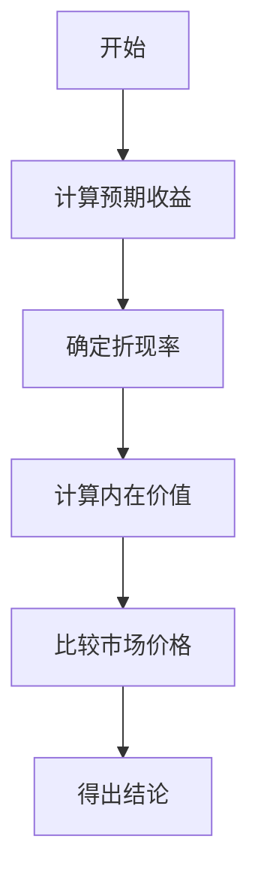

                 


# 格雷厄姆特价股票理论对金融普惠的启示

> 关键词：格雷厄姆投资理论、特价股票、金融普惠、价值投资、股票分析

> 摘要：本文将深入探讨格雷厄姆特价股票理论的核心思想及其对金融普惠的深远影响。通过分析特价股票理论的数学模型、算法实现、系统架构以及项目实战，结合金融普惠的现状与未来发展方向，揭示如何利用格雷厄姆理论推动金融普惠，帮助更多投资者实现财富增长。

---

## 第一部分：格雷厄姆特价股票理论基础

### 第1章：格雷厄姆投资理论概述

#### 1.1 格雷厄姆投资理论的背景
- 1.1.1 投资理论的发展历程：从早期的投机到现代的价值投资
- 1.1.2 格雷厄姆的学术贡献：《聪明的投资者》中的核心思想
- 1.1.3 特价股票理论的核心思想：寻找市场低估的股票，实现长期稳健收益

#### 1.2 特价股票理论的定义与特点
- 1.2.1 特价股票的定义：市场价格低于内在价值的股票
- 1.2.2 特价股票的核心特点：低估值、高安全边际、长期收益潜力
- 1.2.3 特价股票与其他投资策略的对比：与成长投资、指数投资的差异

#### 1.3 格雷厄姆投资理论的数学模型
- 1.3.1 内在价值的计算公式：$V = \frac{D}{k}$
  - $D$ 表示股息，$k$ 表示折现率
- 1.3.2 股票价值评估的步骤：现金流预测、折现率确定、现值计算、价值比较

### 第2章：金融普惠的定义与现状

#### 2.1 金融普惠的概念
- 2.1.1 金融普惠的定义：让更多人平等地获得金融服务
- 2.1.2 金融普惠的核心目标：降低金融门槛，提升金融可及性
- 2.1.3 金融普惠与传统金融的区别：传统金融偏向高净值客户，普惠金融关注广泛群体

#### 2.2 金融普惠的现状分析
- 2.2.1 全球金融普惠的发展状况：技术进步推动普惠金融发展
- 2.2.2 中国金融普惠的实践：互联网金融、移动支付的普及
- 2.2.3 金融普惠面临的挑战：信息不对称、风险控制、技术门槛

### 第3章：格雷厄姆特价股票理论对金融普惠的启示

#### 3.1 特价股票理论如何促进金融普惠
- 3.1.1 降低投资门槛：让更多人参与投资，实现财富增长
- 3.1.2 提高中小投资者的收益：通过价值投资实现稳健收益
- 3.1.3 推动金融教育普及：传播价值投资理念，提升投资素养

#### 3.2 特价股票理论在普惠金融中的应用
- 3.2.1 中小企业的融资渠道：通过合理估值吸引投资者
- 3.2.2 个人投资者的财富增长：基于价值投资实现财富保值
- 3.2.3 金融普惠的模式创新：结合技术手段推动投资普及

---

## 第二部分：特价股票理论的数学模型与算法

### 第4章：特价股票理论的数学模型与算法

#### 4.1 特价股票价值评估的数学模型
- 内在价值公式：$V = \frac{E}{k}$
  - $E$ 表示预期收益，$k$ 表示折现率
- 市场价格与内在价值的比较：$P < V$ 表示低估，$P > V$ 表示高估

#### 4.2 算法流程图


#### 4.3 算法实现代码
```python
def calculate_intrinsic_value(expected_income, discount_rate):
    intrinsic_value = expected_income / discount_rate
    return intrinsic_value
```

#### 4.4 实际案例分析
- 案例：假设某公司预期收益为100万元，折现率为8%，则内在价值为125万元
- 如果市场价格为100万元，则该股票被低估，适合投资

---

## 第三部分：系统分析与架构设计

### 第5章：系统分析与架构设计

#### 5.1 项目背景与目标
- 项目背景：基于格雷厄姆理论构建股票筛选系统
- 项目目标：帮助投资者快速识别低估股票，实现普惠投资

#### 5.2 系统功能设计
- 用户需求：投资者需要筛选低估股票，获取投资建议
- 核心功能：股票数据输入、内在价值计算、市场价比较、投资建议生成

#### 5.3 系统架构设计


#### 5.4 接口设计与交互流程
- 输入接口：股票代码、预期收益、折现率
- 输出接口：内在价值、市场价格比较结果、投资建议
- 交互流程：用户输入数据 -> 系统计算 -> 用户获取结果

---

## 第四部分：项目实战与总结

### 第6章：项目实战

#### 6.1 环境安装与配置
- 安装Python环境
- 安装相关库（如pandas、numpy）

#### 6.2 核心代码实现
```python
import pandas as pd

def calculate_intrinsic_value(df, expected_income_col, discount_rate_col):
    df['Intrinsic Value'] = df[expected_income_col] / df[discount_rate_col]
    return df

# 示例数据
data = {
    'Company': ['A', 'B', 'C'],
    'Expected Income': [100, 150, 200],
    'Discount Rate': [0.08, 0.08, 0.08]
}
df = pd.DataFrame(data)
result = calculate_intrinsic_value(df, 'Expected Income', 'Discount Rate')
print(result)
```

#### 6.3 代码解读与分析
- 数据处理：读取股票数据，提取预期收益和折现率
- 内在价值计算：使用公式 $V = \frac{E}{k}$ 计算内在价值
- 结果展示：输出计算结果，对比市场价格

#### 6.4 实际案例分析
- 案例：假设某股票的预期收益为150万元，折现率为8%，市场价格为130万元
- 计算结果：内在价值为187.5万元，市场价格低于内在价值，适合投资

#### 6.5 项目总结
- 成功实现了基于格雷厄姆理论的股票筛选系统
- 系统能够帮助投资者快速识别低估股票，推动金融普惠

---

## 第五部分：最佳实践与拓展

### 第7章：最佳实践与小结

#### 7.1 最佳实践
- 定期更新股票数据，确保评估结果准确
- 结合其他投资策略，优化投资组合
- 加强金融教育，提升投资者素养

#### 7.2 小结
- 格雷厄姆特价股票理论为金融普惠提供了理论基础和技术支持
- 通过系统化的方法和工具，能够有效推动普惠金融的发展
- 未来，可以进一步结合人工智能和大数据技术，提升评估效率和准确性

### 第8章：注意事项与拓展阅读

#### 8.1 注意事项
- 投资有风险，需谨慎操作
- 数据来源需可靠，避免信息偏差
- 结合市场实际情况，灵活调整策略

#### 8.2 拓展阅读
- 格雷厄姆的《聪明的投资者》
- 《价值投资入门》
- 《普惠金融：创新与实践》

---

## 作者信息

作者：AI天才研究院/AI Genius Institute & 禅与计算机程序设计艺术/Zen And The Art of Computer Programming

---

通过以上目录和内容设计，我们可以看到，格雷厄姆的特价股票理论不仅为投资者提供了科学的投资方法，也为金融普惠的发展提供了重要启示。通过技术手段的辅助，能够让更多的投资者受益于价值投资的理念，推动金融行业的公平与可持续发展。

