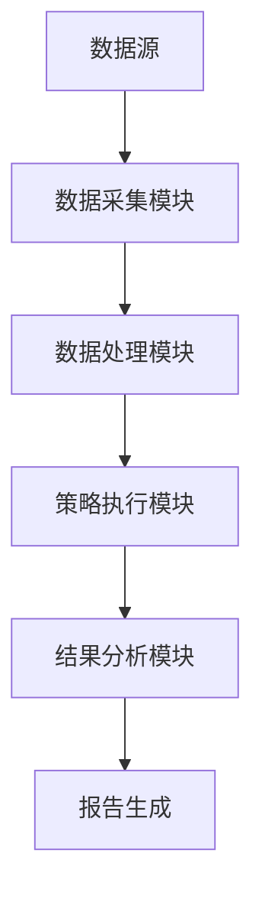
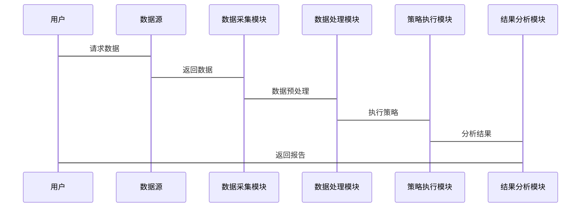

                 


# 格雷厄姆特价股票策略在不同市场信息不对称下的表现

> 关键词：格雷厄姆策略、信息不对称、价值投资、股票定价、安全边际

> 摘要：本文深入探讨了格雷厄姆特价股票策略在不同市场信息不对称下的表现。通过分析价值投资的核心理念、数学模型、算法实现以及系统架构，结合实际案例和项目实战，展示了信息不对称对策略的影响，并提出了优化策略的建议。文章从背景介绍到系统设计，再到项目实现，层层深入，为读者提供全面的技术视角。

---

## 第一部分：背景介绍

### 第1章：价值投资与格雷厄姆策略的基本概念

#### 1.1 价值投资的定义与核心理念

##### 1.1.1 价值投资的起源与发展

价值投资是一种以基本面分析为基础的投资策略，起源于20世纪初，由本杰明·格雷厄姆和戴维·多德共同提出。其核心理念是寻找市场价格低于其内在价值的股票，通过长期持有实现收益。格雷厄姆的价值投资理论奠定了现代投资学的基础，至今仍被广泛应用于股票投资中。

##### 1.1.2 格雷厄姆投资理念的核心要素

格雷厄姆的价值投资理念可以归纳为以下几点：

1. **安全边际**：购买股票时，以低于其内在价值的价格买入，确保即使市场价格波动，也能获得长期收益。
2. **防御性投资者**：专注于寻找那些具有稳定盈利能力和较低波动性的股票，避免高风险投资。
3. **逆向思维**：在市场恐慌时买入，在市场狂热时卖出。

##### 1.1.3 特价股票的定义与特征

特价股票是指市场价格显著低于其内在价值的股票。这类股票通常被市场忽视或低估，具有较大的上涨潜力。其特征包括：

- 低市盈率（P/E）：股价/每股收益比值较低。
- 低市净率（P/B）：股价/每股净资产比值较低。
- 高股息率：相对于市场平均水平，股息收益率较高。

#### 1.2 信息不对称对股票市场的基本影响

##### 1.2.1 信息不对称的定义与表现形式

信息不对称是指市场参与者之间掌握的信息不均等，通常表现为以下几种形式：

1. **内部信息**：公司高管或大股东掌握的未公开信息。
2. **专业信息**：机构投资者或分析师掌握的专业知识和数据。
3. **信息延迟**：普通投资者获取信息的时间较晚。

##### 1.2.2 信息不对称对股票定价的影响

信息不对称会导致股票价格偏离其真实价值。例如，掌握内部信息的投资者可以在利好消息公布前买入股票，或在利空消息公布前卖出股票，从而获得超额收益。这种行为会扭曲市场价格，影响市场效率。

##### 1.2.3 不对称信息下的市场效率分析

信息不对称会降低市场效率，表现为：

1. **价格扭曲**：市场价格无法准确反映公司的真实价值。
2. **交易成本增加**：普通投资者因信息不足，难以做出明智决策。
3. **市场波动加剧**：信息不对称可能导致市场过度反应。

---

### 第2章：格雷厄姆策略在不同市场环境下的表现

#### 2.1 牛市、熊市与震荡市中的策略应用

##### 2.1.1 牛市中的策略表现

在牛市中，市场情绪高涨，股票价格被高估。格雷厄姆策略因其注重安全边际，可能会表现不佳。因为策略倾向于买入低估股票，而牛市中低估股票较少，策略可能需要调整，例如适当放宽安全边际要求。

##### 2.1.2 熊市中的策略表现

在熊市中，市场恐慌，股票价格被低估，格雷厄姆策略表现较好。此时，投资者可以以较低价格买入优质股票，长期持有，等待市场回升。

##### 2.1.3 震荡市中的策略调整

震荡市中，市场波动剧烈，格雷厄姆策略需要灵活调整。例如，可以适当缩短持有期限，或增加对高分红股票的配置。

#### 2.2 信息不对称对策略表现的影响

##### 2.2.1 信息不对称的来源与类型

信息不对称主要来源于以下方面：

1. **内部信息**：公司内部人士掌握的未公开信息。
2. **专业信息**：机构投资者和分析师的专业知识和资源。
3. **信息延迟**：普通投资者获取信息的时间较晚。

##### 2.2.2 不对称信息对策略收益的影响

信息不对称会导致以下问题：

1. **交易成本增加**：普通投资者难以获得优质低价股票。
2. **策略失效**：策略无法捕捉到真正的低估股票。
3. **市场波动加剧**：信息不对称加剧市场波动，影响策略表现。

##### 2.2.3 如何通过信息不对称优化策略

为了应对信息不对称，可以采取以下措施：

1. **加强基本面分析**：通过深入研究公司财务报表，识别低估股票。
2. **利用技术分析**：结合技术指标，判断股票的买卖时机。
3. **分散投资**：通过分散投资降低信息不对称带来的风险。

---

### 第3章：格雷厄姆策略的算法原理与实现

#### 3.1 策略的基本算法框架

##### 3.1.1 数据采集与预处理

数据采集是策略实现的基础。需要收集以下数据：

1. **股票价格**：包括收盘价、开盘价、最高价、最低价。
2. **财务数据**：包括每股收益（EPS）、每股净资产（BPS）、股息率（Dividend Yield）。
3. **市场数据**：包括市场指数、行业平均值。

数据预处理包括清洗数据、填补缺失值、标准化处理。

##### 3.1.2 价值比率计算与筛选

价值比率是衡量股票是否低估的重要指标，常用的比率包括：

1. **市盈率（P/E）**：股价/每股收益。
2. **市净率（P/B）**：股价/每股净资产。
3. **股息率**：股息/股价。

筛选低估股票的标准通常为：P/E < 市场平均值，P/B < 市场平均值，股息率 > 行业平均值。

##### 3.1.3 安全边际计算与投资决策

安全边际是格雷厄姆策略的核心。计算公式为：

$$ \text{安全边际} = \text{内在价值} - \text{市场价格} $$

内在价值可以通过DCF模型或资产重置价值估算。当安全边际为正时，买入股票；为负时，卖出股票。

#### 3.2 基于Python的策略实现

##### 3.2.1 环境搭建与数据获取

需要安装以下Python库：

- **pandas**：数据处理。
- **numpy**：数值计算。
- **yfinance**：数据获取。
- **matplotlib**：数据可视化。
- **backtrader**：回测框架。

##### 3.2.2 核心算法实现代码

以下是一个简单的格雷厄姆策略实现示例：

```python
import pandas as pd
import yfinance as yf

def calculate_pe(stock_data):
    return stock_data['Close'] / stock_data['eps']

def calculate_pb(stock_data):
    return stock_data['Close'] / stock_data['book_value']

def greaham_strategy(stock_data):
    pe = calculate_pe(stock_data)
    pb = calculate_pb(stock_data)
    dividend_yield = stock_data['dividend_yield']
    
    # 筛选条件：P/E < 市场平均值，P/B < 市场平均值，股息率 > 行业平均值
    market_avg_pe = stock_data['pe'].mean()
    market_avg_pb = stock_data['pb'].mean()
    industry_avg_dividend = stock_data['dividend_yield'].mean()
    
    selected_stocks = stock_data[(pe < market_avg_pe) & (pb < market_avg_pb) & (dividend_yield > industry_avg_dividend)]
    return selected_stocks

# 获取数据
stock_data = yf.download(tickers='AAPL', start='2020-01-01', end='2023-12-31')
stock_data['eps'] = ...  # 假设已计算好每股收益
stock_data['book_value'] = ...  # 假设已计算好每股净资产
stock_data['dividend_yield'] = ...  # 假设已计算好股息率

# 实现策略
selected_stocks = greaham_strategy(stock_data)
print(selected_stocks)
```

##### 3.2.3 策略回测与结果分析

回测是验证策略的重要步骤。可以通过回测分析策略的收益、风险和稳定性。常用指标包括：

1. **夏普比率**：衡量收益与风险的关系。
2. **最大回撤**：衡量策略的最大亏损。
3. **年化收益**：衡量策略的收益能力。

---

## 第四部分：系统分析与接口设计

### 第4章：系统架构与接口设计

#### 4.1 系统功能模块划分

##### 4.1.1 数据采集模块

数据采集模块负责从数据源获取股票数据，包括：

- 股票价格
- 财务数据
- 市场数据

##### 4.1.2 数据处理模块

数据处理模块负责对采集的数据进行清洗、计算价值比率和筛选低估股票。

##### 4.1.3 策略执行模块

策略执行模块根据筛选结果生成投资组合，并执行交易。

##### 4.1.4 结果分析模块

结果分析模块负责对策略的回测结果进行分析，并生成报告。

#### 4.2 系统架构设计

以下是系统的架构设计图：



#### 4.3 系统接口设计

系统接口设计包括：

1. **数据接口**：提供数据获取和处理的API。
2. **策略接口**：提供策略执行的API。
3. **报告接口**：提供结果分析的API。

#### 4.4 系统交互设计

以下是系统交互的序列图：



---

## 第五部分：项目实战

### 第5章：项目实战

#### 5.1 项目环境配置

##### 5.1.1 系统环境

需要安装以下软件：

- Python 3.8+
- Jupyter Notebook
- yfinance
- pandas
- numpy
- matplotlib

##### 5.1.2 数据源配置

可以选择Yahoo Finance作为数据源。

#### 5.2 核心代码实现

##### 5.2.1 数据获取与预处理

```python
import yfinance as yf
import pandas as pd

# 获取数据
stock_data = yf.download(tickers='AAPL', start='2020-01-01', end='2023-12-31')
stock_data['eps'] = ...  # 假设已计算好每股收益
stock_data['book_value'] = ...  # 假设已计算好每股净资产
stock_data['dividend_yield'] = ...  # 假设已计算好股息率
```

##### 5.2.2 策略实现

```python
def greaham_strategy(stock_data):
    pe = stock_data['Close'] / stock_data['eps']
    pb = stock_data['Close'] / stock_data['book_value']
    dividend_yield = stock_data['dividend_yield']
    
    market_avg_pe = pe.mean()
    market_avg_pb = pb.mean()
    industry_avg_dividend = dividend_yield.mean()
    
    selected_stocks = stock_data[(pe < market_avg_pe) & (pb < market_avg_pb) & (dividend_yield > industry_avg_dividend)]
    return selected_stocks
```

##### 5.2.3 回测与分析

```python
selected_stocks = greaham_strategy(stock_data)
print(selected_stocks)
```

---

## 第六部分：总结与展望

### 第6章：总结与展望

#### 6.1 核心结论

本文深入分析了格雷厄姆特价股票策略在不同市场信息不对称下的表现，得出以下结论：

1. **安全边际**：安全边际是策略的核心，能够有效降低投资风险。
2. **信息不对称**：信息不对称对策略表现有显著影响，需要通过加强基本面分析和分散投资来优化。
3. **系统架构**：系统的模块化设计能够提高策略的执行效率和可扩展性。

#### 6.2 未来研究方向

未来可以进一步研究以下方向：

1. **动态调整策略**：根据市场变化动态调整筛选条件。
2. **多因子模型**：引入更多因子，如动量因子、波动率因子，提高策略的收益能力。
3. **机器学习**：利用机器学习算法优化策略，提高预测精度。

---

## 附录

### 附录A：术语表

- **市盈率（P/E）**：股价/每股收益。
- **市净率（P/B）**：股价/每股净资产。
- **安全边际**：内在价值 - 市场价格。

### 附录B：工具推荐

- **数据源**：Yahoo Finance、Alpha Vantage。
- **数据处理工具**：Python（pandas、numpy）。
- **可视化工具**：Matplotlib、Plotly。

---

## 参考文献

1. 格雷厄姆，B. (1974). *The Intelligent Investor*. 麦格劳-希尔出版公司。
2. 多德，D. (1934). *Security Analysis*. 麦格劳-希尔出版公司。
3. Fama, E. F. (1970). *Markets Are Efficient Only Part of the Time*. The Business Economist.

---

作者：AI天才研究院/AI Genius Institute & 禅与计算机程序设计艺术/Zen And The Art of Computer Programming

