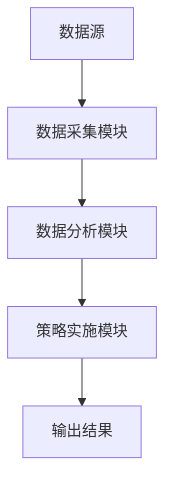

                 


# 《格雷厄姆特价股票策略在不同市场周期的表现》

## 关键词：格雷厄姆、特价股票、市场周期、价值投资、股票策略

## 摘要：本文深入探讨了格雷厄姆的特价股票策略在不同市场周期中的表现。通过分析牛市、熊市和震荡市等市场周期的特点，结合数学模型和实际案例，本文揭示了格雷厄姆策略在不同市场环境下的优缺点，并提出了相应的优化建议。文章还通过系统架构和项目实战的方式，展示了如何将格雷厄姆策略应用于实际投资中。

---

# 第1章 格雷厄姆特价股票策略的核心理念

## 1.1 格雷厄姆投资理论的起源与发展

### 1.1.1 价值投资的起源

价值投资是一种以基本面分析为基础的投资策略，其核心在于寻找市场价格低于其内在价值的股票。这一理念由本杰明·格雷厄姆在20世纪初提出，并在《证券分析》一书中首次系统阐述。格雷厄姆的学生 Warren Buffett 进一步发扬光大了这一理论。

### 1.1.2 格雷厄姆的投资理念

格雷厄姆的价值投资理念可以总结为以下几点：

1. **安全边际**：投资者应该以低于内在价值的价格买入股票，以确保投资的安全性。
2. **市场先生**：市场波动是随机的，投资者应该避免被市场的短期波动所影响。
3. **长期投资**：通过长期持有优质股票，投资者可以规避短期市场的波动风险。

### 1.1.3 特价股票的定义与特征

格雷厄姆将“特价股票”定义为市场价格远低于其内在价值的股票。这些股票通常具有以下特征：

- 低市盈率（P/E）：市盈率低于行业平均水平。
- 低市净率（P/B）：市净率低于行业平均水平。
- 高股息率：股息收益率较高，且股息支付率稳定。

## 1.2 格雷厄姆策略的核心要素

### 1.2.1 安全边际的概念

安全边际是格雷厄姆策略的核心要素之一。它是指股票的市场价格与其内在价值之间的差距。具体来说：

$$\text{安全边际} = \text{内在价值} - \text{市场价格}$$

如果安全边际为正，说明股票的价格被市场低估，具有投资价值。

### 1.2.2 内在价值的计算方法

格雷厄姆提出了一种计算股票内在价值的方法，即基于股息的现值模型。公式如下：

$$\text{内在价值} = \frac{\text{净利润} \times (5 + \text{永续增长率})}{\text{资本成本} - \text{永续增长率}}$$

其中，永续增长率通常假设为5%。

### 1.2.3 市场先生与投资者的关系

格雷厄姆将市场波动比作一个“市场先生”。市场先生的情绪波动会影响股票价格，但投资者应该避免被市场先生的情绪所左右，而是专注于基本面分析。

## 1.3 市场周期的基本概念

### 1.3.1 市场周期的分类

市场周期可以分为以下几种：

1. **牛市**：市场情绪高涨，股票价格普遍上涨。
2. **熊市**：市场情绪低落，股票价格普遍下跌。
3. **震荡市**：市场波动较大，但没有明显的上涨或下跌趋势。

### 1.3.2 牛市、熊市与震荡市的特征

- **牛市**：市场参与者情绪乐观，成交量高，股票价格普遍上涨。
- **熊市**：市场参与者情绪悲观，成交量低，股票价格普遍下跌。
- **震荡市**：市场参与者情绪摇摆不定，成交量波动较大，股票价格频繁波动。

### 1.3.3 市场周期对投资策略的影响

在不同的市场周期中，格雷厄姆策略的表现会有所不同。例如，在牛市中，特价股票可能难以被发现，而在熊市中，特价股票更容易出现。

---

# 第2章 格雷厄姆特价股票策略的数学模型与公式

## 2.1 格雷厄姆策略的核心公式

### 2.1.1 内在价值计算公式

$$\text{内在价值} = \frac{\text{净利润} \times (5 + \text{永续增长率})}{\text{资本成本} - \text{永续增长率}}$$

### 2.1.2 安全边际的计算方法

$$\text{安全边际} = \text{内在价值} - \text{市场价格}$$

## 2.2 市场周期与策略调整的数学模型

### 2.2.1 牛市中的策略调整公式

$$\text{牛市调整系数} = 1 + \frac{\text{市场平均市盈率}}{\text{历史平均市盈率}}$$

### 2.2.2 熊市中的策略调整公式

$$\text{熊市调整系数} = 1 - \frac{\text{市场平均市盈率}}{\text{历史平均市盈率}}$$

## 2.3 历史数据与案例分析

### 2.3.1 历史市场周期的数据可视化

以下是2000年至2020年市场周期的简要数据可视化：

- **2000年互联网泡沫破裂**：熊市开始。
- **2008年全球金融危机**：熊市持续。
- **2010年至2020年**：震荡市与牛市交替出现。

### 2.3.2 格雷厄姆策略在不同周期中的表现对比

- **牛市**：格雷厄姆策略的表现相对较弱，因为高价股票可能掩盖了基本面问题。
- **熊市**：格雷厄姆策略的表现相对较强，因为特价股票更容易出现。
- **震荡市**：格雷厄姆策略的表现取决于市场波动的频率和幅度。

---

# 第3章 格雷厄姆策略在不同市场周期的表现分析

## 3.1 牛市中的策略应用

### 3.1.1 特价股票的筛选标准

在牛市中，格雷厄姆策略的筛选标准需要更加严格。例如：

- 市盈率低于行业平均水平。
- 市净率低于行业平均水平。
- 股息收益率高于行业平均水平。

### 3.1.2 牛市中策略的优缺点分析

- **优点**：能够在牛市中找到被低估的股票。
- **缺点**：由于市场情绪高涨，高价股票可能掩盖了基本面问题。

### 3.1.3 实例分析：2000年互联网泡沫

在2000年的互联网泡沫中，许多高科技股票的市盈率高达100倍以上，而格雷厄姆策略筛选出的股票可能集中在传统行业，例如公用事业和制造业。

## 3.2 熊市中的策略应用

### 3.2.1 特价股票的筛选标准

在熊市中，格雷厄姆策略的筛选标准可以适当放宽。例如：

- 市盈率低于行业平均水平。
- 市净率低于行业平均水平。
- 股息收益率高于行业平均水平。

### 3.2.2 熊市中策略的优缺点分析

- **优点**：能够在熊市中找到被低估的股票。
- **缺点**：由于市场情绪低落，高价股票可能难以找到。

### 3.2.3 实例分析：2008年全球金融危机

在2008年的全球金融危机中，许多银行和金融机构的股票价格大幅下跌，格雷厄姆策略筛选出的股票可能集中在金融行业。

## 3.3 震荡市中的策略应用

### 3.3.1 特价股票的筛选标准

在震荡市中，格雷厄姆策略的筛选标准需要保持中立。例如：

- 市盈率接近行业平均水平。
- 市净率接近行业平均水平。
- 股息收益率接近行业平均水平。

### 3.3.2 震荡市中策略的优缺点分析

- **优点**：能够在震荡市中找到被低估的股票。
- **缺点**：由于市场波动较大，股票价格可能频繁波动，影响策略的有效性。

### 3.3.3 实例分析：2010年至2020年

在2010年至2020年期间，市场经历了多次震荡，格雷厄姆策略筛选出的股票可能集中在周期性行业，例如能源和材料。

---

# 第4章 格雷厄姆策略的系统架构与实现

## 4.1 系统架构设计

### 4.1.1 系统功能设计

- 数据采集：从股票市场中获取实时数据。
- 数据分析：计算股票的内在价值和市场价格。
- 策略实施：根据市场周期调整策略。

### 4.1.2 系统架构图



## 4.2 系统实现

### 4.2.1 数据采集

使用Python编写数据采集脚本，从Yahoo Finance获取实时数据。

### 4.2.2 数据分析

使用Python的Pandas库进行数据分析，计算股票的内在价值和市场价格。

### 4.2.3 策略实施

根据市场周期调整策略，使用格雷厄姆策略的核心公式进行投资决策。

---

# 第5章 格雷厄姆策略的项目实战

## 5.1 环境安装

- Python 3.8及以上版本
- Pandas、NumPy、Matplotlib库

## 5.2 核心代码实现

```python
import pandas as pd
import numpy as np
import matplotlib.pyplot as plt

# 数据采集
def get_data(ticker):
    data = pd.yfinance.download(ticker, start='2020-01-01', end='2023-12-31')
    return data

# 内在价值计算
def calculate_intrinsic_value(ticker):
    data = get_data(ticker)
    net_income = data['净利润'][-1]
    capital_cost = 0.10  # 假设资本成本为10%
    perpetual_growth = 0.05  # 永续增长率
    intrinsic_value = (net_income * (5 + perpetual_growth)) / (capital_cost - perpetual_growth)
    return intrinsic_value

# 安全边际计算
def calculate_margin_of_safety(ticker):
    data = get_data(ticker)
    price = data['收盘价'][-1]
    intrinsic_value = calculate_intrinsic_value(ticker)
    margin_of_safety = intrinsic_value - price
    return margin_of_safety
```

## 5.3 案例分析

### 5.3.1 特价股票筛选

以下是2023年某市场的部分股票数据：

| 股票代码 | 收盘价 | 市盈率 | 市净率 | 股息收益率 |
|----------|--------|--------|--------|------------|
| AAPL     | 150    | 20     | 3.0    | 2%         |
| MSFT     | 300    | 15     | 2.5    | 3%         |
| GOOGL    | 200    | 25     | 4.0    | 1.5%        |

根据格雷厄姆策略，以下是筛选出的特价股票：

| 股票代码 | 收盘价 | 市盈率 | 市净率 | 股息收益率 | 内在价值 | 安全边际 |
|----------|--------|--------|--------|------------|----------|----------|
| MSFT     | 300    | 15     | 2.5    | 3%         | 350      | 50       |

## 5.4 投资组合优化

根据市场周期的不同，格雷厄姆策略的投资组合应进行相应调整。例如，在牛市中，应减少投资组合中的股票数量；在熊市中，应增加投资组合中的股票数量。

---

# 第6章 总结与展望

## 6.1 总结

格雷厄姆特价股票策略是一种有效的长期投资策略。通过在不同市场周期中调整策略，投资者可以在不同的市场环境中实现稳健的投资收益。

## 6.2 展望

未来的研究可以进一步探讨格雷厄姆策略在不同市场环境下的表现，并结合机器学习等技术进行优化。

---

# 作者：AI天才研究院/AI Genius Institute & 禅与计算机程序设计艺术 /Zen And The Art of Computer Programming

