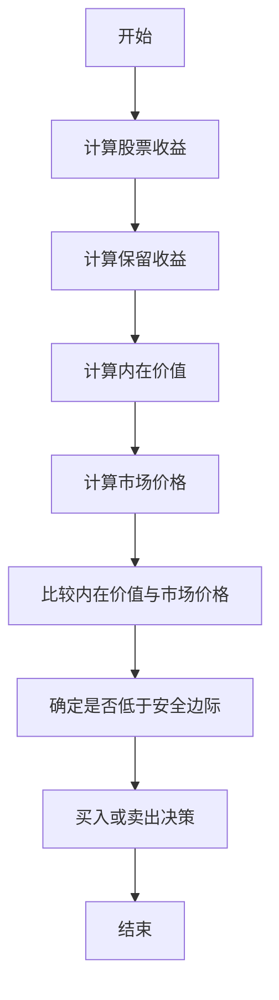

                 


# 格雷厄姆特价股票策略在不同市场周期的适应性研究

## 关键词：格雷厄姆投资理论，特价股票，市场周期，价值投资，投资策略

## 摘要：本文系统性地探讨了格雷厄姆特价股票策略在不同市场周期中的适应性。通过分析格雷厄姆价值投资理论的核心要素，结合市场周期的特点，深入研究了该策略在牛市和熊市中的表现，并提出了优化建议。文章还通过数学建模和系统架构设计，展示了如何在实际投资中应用这些策略，并通过实战案例进一步验证了策略的有效性。

---

## 第一部分: 格雷厄姆特价股票策略的背景与基础

### 第1章: 价值投资与格雷厄姆投资理论概述

#### 1.1 价值投资的起源与发展

##### 1.1.1 价值投资的定义与核心理念

- 价值投资是一种以基本面分析为基础的投资方法，旨在通过识别市场价格低于内在价值的股票来实现长期收益。
- 核心理念包括：安全边际、长期投资、逆向思维。

##### 1.1.2 格雷厄姆的投资理论与方法

- 格雷厄姆是价值投资的鼻祖，提出了“安全边际”概念。
- 他的策略注重股票的内在价值计算，而非市场情绪。

##### 1.1.3 格雷厄姆策略的核心要素

- 低市盈率、低市净率、高股息率等。

#### 1.2 特价股票的定义与特点

##### 1.2.1 特价股票的定义

- 特价股票是指市场价格显著低于内在价值的股票。

##### 1.2.2 特价股票的识别标准

- 市盈率低于行业平均水平、市净率低于1、股息率高等。

##### 1.2.3 特价股票与市场周期的关系

- 特价股票在熊市中更容易出现，但在牛市中也可能被市场忽视。

#### 1.3 格雷厄姆策略的适用性分析

##### 1.3.1 格雷厄姆策略的核心思想

- 买入并持有低估的股票，等待市场重新评估其价值。

##### 1.3.2 格雷厄姆策略在不同市场周期的表现

- 在熊市中表现优异，在牛市中可能跑输市场。

##### 1.3.3 格雷厄姆策略的优缺点

- 优点：长期稳定收益、风险较低。
- 缺点：在牛市中可能表现不佳，需要较长的时间周期。

---

## 第二部分: 格雷厄姆策略在不同市场周期的适应性分析

### 第2章: 牛市中的格雷厄姆策略应用

#### 2.1 牛市的基本特征与投资者行为

##### 2.1.1 牛市的定义与主要特征

- 牛市：市场情绪高涨，股价普遍上涨，投资者乐观。

##### 2.1.2 牛市中投资者的心理与行为

- 投资者倾向于高估股票价值，追求短期收益。

##### 2.1.3 牛市中格雷厄姆策略的应用挑战

- 高价股票充斥市场，低估股票难寻。

#### 2.2 格雷厄姆策略在牛市中的表现

##### 2.2.1 特价股票在牛市中的机会

- 少数低估股票可能被市场忽视，存在上涨空间。

##### 2.2.2 格雷厄姆策略在牛市中的风险

- 由于市场整体上涨，策略可能跑输指数。

##### 2.2.3 特价股票在牛市中的选择标准

- 严格筛选，寻找真正低估的股票。

#### 2.3 牛市中格雷厄姆策略的优化建议

##### 2.3.1 策略调整的方向

- 降低仓位，选择防御性股票。

##### 2.3.2 风险控制的措施

- 设置止损点，分散投资。

##### 2.3.3 投资组合的优化

- 结合其他策略，如股息投资。

#### 2.4 本章小结

- 总结格雷厄姆策略在牛市中的应用挑战和优化方向。

---

### 第3章: 熊市中的格雷厄姆策略应用

#### 3.1 熊市的基本特征与投资者行为

##### 3.1.1 熊市的定义与主要特征

- 市场情绪低落，股价普遍下跌，投资者悲观。

##### 3.1.2 熊市中投资者的心理与行为

- 投资者倾向于恐慌性抛售，忽视基本面。

##### 3.1.3 熊市中格雷厄姆策略的应用机会

- 特价股票大量出现，提供买入机会。

#### 3.2 格雷厄姆策略在熊市中的表现

##### 3.2.1 特价股票在熊市中的机会

- 低估股票价格被压低，具备上涨潜力。

##### 3.2.2 格雷厄姆策略在熊市中的优势

- 策略在熊市中表现优异，跑赢指数。

##### 3.2.3 特价股票在熊市中的选择标准

- 重点关注低市盈率、低市净率、高股息率的股票。

#### 3.3 熊市中格雷厄姆策略的优化建议

##### 3.3.1 策略调整的方向

- 增加防御性股票配置。

##### 3.3.2 风险控制的措施

- 保持充足流动性，避免过度杠杆。

##### 3.3.3 投资组合的优化

- 重点配置低估股票，分散行业风险。

#### 3.4 本章小结

- 总结格雷厄姆策略在熊市中的优势和优化策略。

---

## 第三部分: 格雷厄姆策略的数学模型与系统架构设计

### 第4章: 数学模型与算法原理

#### 4.1 格雷厄姆策略的数学模型

##### 4.1.1 内在价值计算模型

- 使用格雷厄姆的内在价值公式：$V = \text{收益} \times (4.5 \times \text{保留收益})$。

##### 4.1.2 市场价格与内在价值的关系

- 当市场价格低于内在价值时，股票具有投资价值。

##### 4.1.3 价值安全边际计算

- 格雷厄姆建议以内在价值的三分之二作为买入价格。

#### 4.2 算法流程图



#### 4.3 Python代码实现

```python
def calculate_intrinsic_value(earnings, retained_earnings):
    return earnings * (4.5 * retained_earnings)

def calculate_margin_of_safety(intrinsic_value, market_price):
    return intrinsic_value * 0.6667 < market_price

# 示例
earnings = 10
retained_earnings = 20
market_price = 50

intrinsic_value = calculate_intrinsic_value(earnings, retained_earnings)
margin_of_safety = calculate_margin_of_safety(intrinsic_value, market_price)

print(f"内在价值: {intrinsic_value}")
print(f"安全边际: {margin_of_safety}")
```

### 第5章: 系统架构与接口设计

#### 5.1 系统架构设计


#### 5.2 接口设计

- 数据采集接口：`GET /data?symbol=XXX`
- 分析接口：`POST /analyze`
- 策略执行接口：`POST /execute`

---

## 第四部分: 格雷厄姆策略的实战应用与案例分析

### 第6章: 特价股票筛选与投资组合优化

#### 6.1 实战项目介绍

- 项目目标：筛选低估股票，构建投资组合。

#### 6.2 特价股票筛选标准

##### 6.2.1 市盈率筛选

- 市盈率低于行业平均水平。

##### 6.2.2 市净率筛选

- 市净率低于1。

##### 6.2.3 股息率筛选

- 股息率高于行业平均水平。

#### 6.3 投资组合优化

##### 6.3.1 股票选择

- 从多个行业中选择低估股票，分散风险。

##### 6.3.2 配置比例

- 根据股票的低估程度和行业风险，调整配置比例。

#### 6.4 实战案例分析

##### 6.4.1 案例一：2020年新冠疫情后的市场

- 筛选出低估股票，如某金融股，随后股价反弹。

##### 6.4.2 案例二：2023年科技股熊市

- 投资某科技公司，股价在熊市中被低估，随后回升。

#### 6.5 项目小结

- 总结实战经验，强调策略的有效性和灵活性。

---

## 第五部分: 总结与展望

### 第7章: 格雷厄姆策略的总结与展望

#### 7.1 本研究的总结

- 格雷厄姆策略在熊市中表现优异，在牛市中需谨慎调整。

#### 7.2 策略的优缺点

- 优点：长期稳定收益，风险较低。
- 缺点：在牛市中可能跑输市场，需要较长的时间周期。

#### 7.3 对未来研究的展望

- 结合大数据和机器学习，优化股票筛选模型。
- 研究不同市场环境下策略的动态调整。

---

## 作者

作者：AI天才研究院/AI Genius Institute & 禅与计算机程序设计艺术 /Zen And The Art of Computer Programming

