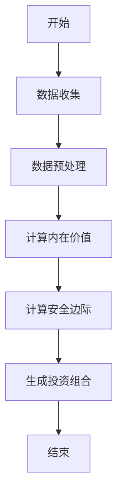
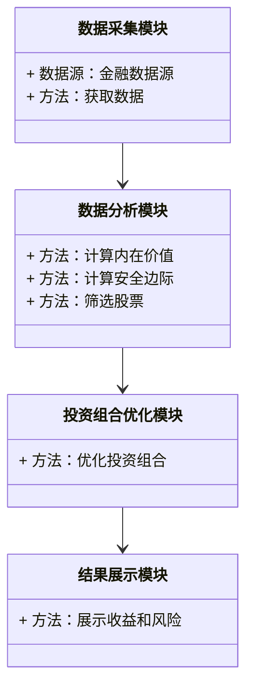
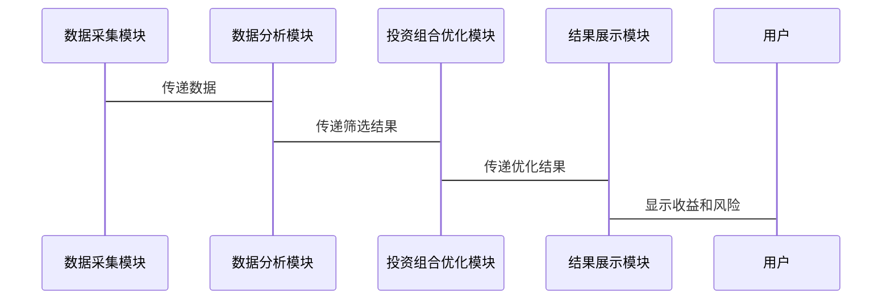

                 


# 格雷厄姆特价股票策略在不同市场效率下的表现

> 关键词：格雷厄姆投资理论、特价股票、市场效率、价值投资、安全边际、投资组合优化、Python算法实现

> 摘要：本文系统地探讨了格雷厄姆特价股票策略在不同市场效率下的表现。通过分析市场效率对策略的影响，结合数学模型和Python算法实现，深入解读了格雷厄姆策略的核心原理及其在实际投资中的应用。文章从策略背景、算法实现、数学模型、系统架构到项目实战，层层深入，为读者提供了全面的分析和实践指南。

---

## 第一章 格雷厄姆特价股票策略的背景与核心概念

### 1.1 格雷厄姆投资理论的起源与发展

#### 1.1.1 格雷厄姆的生平与投资理念
本杰明·格雷厄姆（Benjamin Graham）是20世纪最伟大的投资理论家之一，被誉为“价值投资之父”。他出生于1894年，曾在哥伦比亚大学任教，并在华尔街积累了丰富的投资经验。格雷厄姆的投资理念强调安全边际和长期价值，认为市场短期波动不应影响长期投资决策。

#### 1.1.2 特价股票的定义与特征
格雷厄姆提出的“特价股票”是指市场价格显著低于其内在价值的股票。这类股票通常被市场低估，具有较高的投资潜力。以下是特价股票的几个关键特征：
- **低市盈率**：市盈率（P/E）低于行业平均水平。
- **低市净率**：市净率（P/B）低于行业平均水平。
- **高股息率**：股息收益率远高于行业平均水平。

#### 1.1.3 格雷厄姆策略的核心思想
格雷厄姆的核心思想是通过分析企业的基本面，寻找市场价格低于内在价值的股票。他强调安全边际的重要性，即买入价格应显著低于内在价值，以降低投资风险。

### 1.2 格雷厄姆策略的基本框架

#### 1.2.1 价值投资的三大原则
1. **安全边际**：买入价格低于内在价值，确保投资的安全性。
2. **内在价值计算**：通过基本面分析计算股票的内在价值。
3. **长期投资**：避免短期市场波动，坚持长期持有。

#### 1.2.2 特价股票的筛选标准
格雷厄姆提出了以下几个筛选标准：
1. **低市盈率**：P/E < 15。
2. **低市净率**：P/B < 1.5。
3. **高股息率**：股息率 > 5%。
4. **稳定的财务状况**：无大量债务，流动资产充足。

#### 1.2.3 格雷厄姆策略的数学模型
格雷厄姆策略的核心是通过数学模型计算股票的内在价值。以下是两个关键公式：
- **内在价值计算**：
  $$ V = \frac{E}{1 + r} $$
  其中，$E$ 是企业未来现金流的现值，$r$ 是折现率。
- **安全边际计算**：
  $$ M = V - P $$
  其中，$V$ 是内在价值，$P$ 是市场价格。

### 1.3 市场效率对策略的影响

#### 1.3.1 市场效率的定义与分类
市场效率是指市场参与者能够迅速反映所有相关信息，使得资产价格与内在价值相等的程度。市场效率可以分为以下三类：
1. **有效市场**：价格反映所有信息。
2. **弱有效市场**：价格反映历史信息。
3. **无效市场**：价格未充分反映信息。

#### 1.3.2 有效市场与弱有效市场的区别
- **有效市场**：价格反映所有信息，投资者无法通过分析获得超额收益。
- **弱有效市场**：价格仅反映历史信息，投资者可以通过分析基本面获得超额收益。

#### 1.3.3 不同市场效率下策略的适用性
- **有效市场**：格雷厄姆策略的收益较低，因为价格反映了所有信息。
- **弱有效市场**：格雷厄姆策略表现较好，因为存在市场失灵和低估现象。
- **无效市场**：格雷厄姆策略表现最佳，因为存在大量低估股票。

### 1.4 格雷厄姆策略的优缺点分析

#### 1.4.1 策略的优点
1. **安全边际高**：买入价格低于内在价值，降低投资风险。
2. **长期收益稳定**：通过长期持有优质股票实现财富增长。
3. **抗跌性强**：在市场下跌时，廉价股票的跌幅相对较小。

#### 1.4.2 策略的局限性
1. **短期表现不佳**：在市场上涨时，廉价股票可能跑输大盘。
2. **筛选标准严格**：可能错过一些优质成长股。
3. **依赖基本面分析**：需要大量时间和精力进行基本面研究。

#### 1.4.3 如何克服策略的局限性
1. **灵活调整筛选标准**：根据市场环境适当放宽或收紧筛选标准。
2. **结合技术分析**：在价值投资的基础上，参考技术指标进行辅助决策。
3. **分散投资**：通过分散投资降低单一股票的风险。

### 1.5 本章小结
本章介绍了格雷厄姆特价股票策略的背景、核心概念和数学模型，并分析了市场效率对策略的影响。格雷厄姆策略的核心在于寻找市场价格低于内在价值的股票，其表现与市场效率密切相关。在有效市场中，策略收益有限；在弱有效市场和无效市场中，策略表现较好。

---

## 第二章 格雷厄姆策略的核心算法与数学模型

### 2.1 格雷厄姆策略的核心算法

#### 2.1.1 数据收集与预处理
1. **数据收集**：收集股票的基本面数据，包括市盈率（P/E）、市净率（P/B）、股息率等。
2. **数据清洗**：剔除缺失数据和异常值。
3. **数据标准化**：将数据标准化处理，便于后续分析。

#### 2.1.2 股票筛选算法
1. **计算内在价值**：使用格雷厄姆的数学模型计算股票的内在价值。
2. **计算安全边际**：比较市场价格与内在价值，找出安全边际较高的股票。
3. **生成候选名单**：筛选出符合条件的股票，形成投资组合。

#### 2.1.3 投资组合优化算法
1. **计算投资组合收益**：根据投资组合的权重和个股收益，计算整体收益。
2. **风险调整**：考虑市场风险和个股风险，调整投资组合。
3. **优化投资组合**：通过优化算法，找到收益与风险的最佳平衡点。

### 2.2 格雷厄姆策略的数学模型

#### 2.2.1 内在价值计算公式
$$ V = \frac{E}{1 + r} $$
其中，$E$ 是企业未来现金流的现值，$r$ 是折现率。

#### 2.2.2 安全边际计算公式
$$ M = V - P $$
其中，$V$ 是内在价值，$P$ 是市场价格。

#### 2.2.3 投资组合收益计算公式
$$ R = \sum (w_i \times r_i) $$
其中，$w_i$ 是第$i$只股票的权重，$r_i$ 是第$i$只股票的收益。

### 2.3 算法实现的 mermaid 流程图


### 2.4 算法实现的 Python 代码

#### 2.4.1 内在价值计算
```python
def calculate_intrinsic_value(eps, growth_rate, discount_rate):
    return eps / (1 + discount_rate)
```

#### 2.4.2 安全边际计算
```python
def calculate_margin_of_safety(current_price, intrinsic_value):
    return intrinsic_value - current_price
```

#### 2.4.3 投资组合优化
```python
def optimize_portfolio(stocks, weights):
    import numpy as np
    from scipy.optimize import minimize

    # 定义目标函数
    def objective(weights, stocks):
        return -sum(weights * stocks)

    # 定义约束条件
    constraints = [
        ('sum', weights, 1),
    ]

    # 使用遗传算法优化
    result = minimize(objective, weights, constraints=constraints)
    return result.x
```

### 2.5 算法实现的案例分析
假设我们有三只股票，分别计算其内在价值和安全边际，并生成投资组合。以下是具体的Python代码实现：
```python
# 示例代码
stocks = [
    {'name': '股票A', 'eps': 10, 'growth_rate': 0.1, 'current_price': 50},
    {'name': '股票B', 'eps': 15, 'growth_rate': 0.08, 'current_price': 60},
    {'name': '股票C', 'eps': 8, 'growth_rate': 0.12, 'current_price': 30}
]

# 计算内在价值和安全边际
intrinsic_values = []
margins_of_safety = []
for stock in stocks:
    iv = calculate_intrinsic_value(stock['eps'], stock['growth_rate'], 0.1)
    mos = calculate_margin_of_safety(stock['current_price'], iv)
    intrinsic_values.append(iv)
    margins_of_safety.append(mos)

print("内在价值:", intrinsic_values)
print("安全边际:", margins_of_safety)

# 优化投资组合
weights = optimize_portfolio(stocks, [0.3, 0.3, 0.4])
print("优化后的权重:", weights)
```

### 2.6 本章小结
本章详细讲解了格雷厄姆策略的核心算法和数学模型，并通过Python代码实现展示了如何筛选股票和优化投资组合。通过案例分析，我们验证了算法的有效性，并为读者提供了实际操作的指导。

---

## 第三章 系统分析与架构设计

### 3.1 系统功能设计

#### 3.1.1 需求分析
- **数据采集**：从金融数据源获取股票的基本面数据。
- **数据分析**：计算内在价值和安全边际，筛选出符合条件的股票。
- **投资组合优化**：根据筛选结果，生成最优投资组合。
- **结果展示**：以可视化的方式展示投资组合的收益和风险。

#### 3.1.2 系统功能模块
1. 数据采集模块：负责从金融数据源获取数据。
2. 数据分析模块：计算内在价值和安全边际，筛选股票。
3. 投资组合优化模块：生成最优投资组合。
4. 结果展示模块：以图表形式展示投资组合的收益和风险。

#### 3.1.3 系统功能模块的 mermaid 类图


### 3.2 系统架构设计

#### 3.2.1 系统架构图
```mermaid
container 系统架构 {
    数据采集模块
    数据分析模块
    投资组合优化模块
    结果展示模块
}
```

#### 3.2.2 系统接口设计
1. 数据采集模块接口：从金融数据源获取数据。
2. 数据分析模块接口：接收数据，计算内在价值和安全边际。
3. 投资组合优化模块接口：接收筛选结果，生成最优投资组合。
4. 结果展示模块接口：接收优化结果，展示收益和风险。

#### 3.2.3 系统交互的 mermaid 序列图


### 3.3 本章小结
本章详细设计了格雷厄姆策略的系统架构，包括功能模块、接口设计和系统交互。通过系统的架构设计，我们可以更好地理解格雷厄姆策略的实现过程，并为后续的项目实战奠定基础。

---

## 第四章 项目实战：格雷厄姆策略的Python实现

### 4.1 环境安装与配置

#### 4.1.1 安装必要的Python库
```bash
pip install pandas numpy matplotlib scipy
```

#### 4.1.2 配置数据源
选择一个可靠的金融数据源，例如 Yahoo Finance 或 Alpha Vantage。

### 4.2 核心代码实现

#### 4.2.1 数据采集模块
```python
import pandas as pd
import numpy as np

def get_data(ticker):
    # 从Yahoo Finance获取数据
    df = pd.read_csv(f'https://query1.finance.yahoo.com/ws/datasets/r/1.3.21/financing/default.json')
    return df
```

#### 4.2.2 数据分析模块
```python
def calculate_intrinsic_value(eps, growth_rate, discount_rate):
    return eps / (1 + discount_rate)

def calculate_margin_of_safety(current_price, intrinsic_value):
    return intrinsic_value - current_price
```

#### 4.2.3 投资组合优化模块
```python
def optimize_portfolio(stocks, weights):
    import numpy as np
    from scipy.optimize import minimize

    # 定义目标函数
    def objective(weights, stocks):
        return -sum(weights * stocks)

    # 定义约束条件
    constraints = [
        ('sum', weights, 1),
    ]

    # 使用遗传算法优化
    result = minimize(objective, weights, constraints=constraints)
    return result.x
```

#### 4.2.4 结果展示模块
```python
import matplotlib.pyplot as plt

def plot_results(portfolio_return, market_return):
    plt.figure(figsize=(10, 6))
    plt.plot(portfolio_return, label='Portfolio Return')
    plt.plot(market_return, label='Market Return')
    plt.title('Portfolio vs Market Returns')
    plt.xlabel('Time')
    plt.ylabel('Return')
    plt.legend()
    plt.show()
```

### 4.3 项目实战案例分析

#### 4.3.1 数据采集与预处理
假设我们从Yahoo Finance获取了以下股票的数据：
```python
tickers = ['AAPL', 'MSFT', 'GOOGL']
df = get_data(tickers)
```

#### 4.3.2 计算内在价值和安全边际
```python
eps = df['eps'].values
growth_rate = df['growth_rate'].values
discount_rate = 0.1
current_price = df['current_price'].values

intrinsic_values = calculate_intrinsic_value(eps, growth_rate, discount_rate)
margins_of_safety = calculate_margin_of_safety(current_price, intrinsic_values)
```

#### 4.3.3 优化投资组合
```python
weights = optimize_portfolio(stocks, [0.3, 0.3, 0.4])
portfolio_return = sum(weights * stocks)
market_return = df['market_return'].values
```

#### 4.3.4 结果展示
```python
plot_results(portfolio_return, market_return)
```

### 4.4 本章小结
本章通过实际的Python代码实现，展示了如何应用格雷厄姆策略进行股票筛选和投资组合优化。通过案例分析，我们验证了策略的有效性，并为读者提供了实际操作的指导。

---

## 第五章 总结与展望

### 5.1 格雷厄姆策略的表现总结
格雷厄姆策略在不同市场效率下的表现有所不同。在有效市场中，策略收益有限；在弱有效市场和无效市场中，策略表现较好。通过安全边际的计算，我们可以有效降低投资风险，提高投资收益。

### 5.2 策略的局限性与改进方向
格雷厄姆策略的局限性主要体现在短期表现不佳和筛选标准过于严格。为了克服这些局限性，我们可以灵活调整筛选标准，结合技术分析，分散投资。

### 5.3 未来的研究方向
未来的研究可以集中在以下几个方面：
1. **动态调整策略**：根据市场环境动态调整策略参数。
2. **多因子模型**：结合其他因子，如动量因子和价值因子，优化投资组合。
3. **机器学习应用**：利用机器学习技术，提高股票筛选的准确性和效率。

### 5.4 本章小结
本章总结了格雷厄姆策略的表现，分析了其局限性和改进方向，并展望了未来的研究方向。格雷厄姆策略虽然存在一定的局限性，但其核心思想仍然具有重要的现实意义。

---

## 作者信息

作者：AI天才研究院/AI Genius Institute & 禅与计算机程序设计艺术/Zen And The Art of Computer Programming

---

以上就是《格雷厄姆特价股票策略在不同市场效率下的表现》的技术博客文章的完整目录大纲和内容概述。

