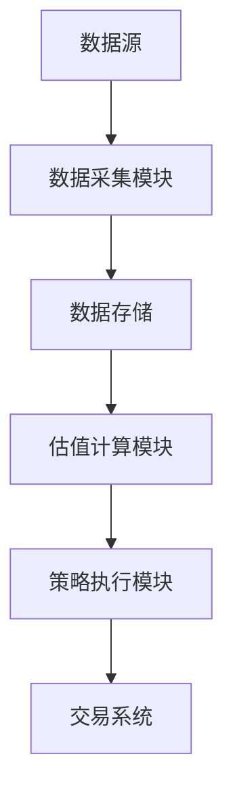

                 


# 《格雷厄姆特价股票策略在不同市场透明度下的表现》

## 关键词：
- 格雷厄姆投资理论
- 特价股票策略
- 市场透明度
- 价值投资
- 投资策略

## 摘要：
本文系统地分析了格雷厄姆特价股票策略在不同市场透明度下的表现。首先，我们介绍了格雷厄姆的投资理论及其核心概念，探讨了市场透明度的定义和其对股票策略的影响。接着，我们深入分析了格雷厄姆策略的数学模型，并结合实际案例，评估了该策略在透明和非透明市场中的表现。最后，我们设计了一个系统架构，展示了如何在不同市场环境中实现和优化该策略，提出了在实际应用中的注意事项和未来研究方向。

---

## 第1章：格雷厄姆特价股票策略的背景与核心概念

### 1.1 格雷厄姆投资理论的起源与发展

#### 1.1.1 价值投资的起源
价值投资是一种以基本面分析为基础的投资策略，其核心在于寻找市场中被低估的股票。本杰明·格雷厄姆是这一理论的奠基人，他在20世纪初提出了“安全边际”和“内在价值”等核心概念。

#### 1.1.2 格雷厄姆的学术贡献
格雷厄姆的学生彼得·林奇和沃伦·巴菲特继承并发展了他的理论。格雷厄姆的投资策略强调长期持有和分散投资，旨在通过识别市场错误定价的机会来实现超额收益。

#### 1.1.3 特价股票策略的核心思想
格雷厄姆的特价股票策略关注那些市场价格远低于其内在价值的股票。他提出了一系列指标，如市盈率（P/E）、市净率（P/B）和股息率，用于识别这些低估的股票。

### 1.2 市场透明度的基本概念

#### 1.2.1 市场透明度的定义
市场透明度指的是市场参与者获取信息的难易程度。透明的市场通常具有高效的信息传播机制，而低透明的市场则存在信息不对称的问题。

#### 1.2.2 不同市场的特点和透明度
- **透明市场**：信息公开、透明，投资者能够及时获取公司的财务数据和市场动态。
- **非透明市场**：信息不透明，投资者难以获取关键数据，市场波动较大。

#### 1.2.3 透明度对策略的影响
在透明市场中，信息的及时性和准确性使得格雷厄姆策略更容易实施；而在非透明市场中，信息不对称会增加策略执行的难度，影响策略的有效性。

### 1.3 格雷厄姆策略与市场透明度的联系

#### 1.3.1 格雷厄姆策略在透明市场中的表现
透明市场中，投资者能够快速识别被低估的股票，从而提高策略的有效性。然而，随着信息的透明化，其他投资者也可能采取相同的策略，导致竞争加剧，影响超额收益。

#### 1.3.2 非透明市场中的策略调整
在非透明市场中，投资者需要依赖间接指标和替代数据来评估股票价值。这增加了策略的复杂性，但同时也为那些能够获取更多信息的投资者提供了机会。

#### 1.3.3 透明度对策略长期影响
长期来看，透明度的提高可能会降低格雷厄姆策略的有效性，因为市场参与者会更早识别低估的股票，导致价格回归合理水平的速度加快。

---

## 第2章：格雷厄姆特价股票策略的数学模型

### 2.1 格雷厄姆策略的核心指标

#### 2.1.1 市盈率（P/E）
市盈率是股票价格与每股收益（EPS）的比值，用于衡量股票的投资价值。公式为：
$$ P/E = \frac{股票价格}{每股收益} $$

#### 2.1.2 市净率（P/B）
市净率是股票价格与每股净资产的比值，用于评估股票的内在价值。公式为：
$$ P/B = \frac{股票价格}{每股净资产} $$

#### 2.1.3 股息率
股息率是股票的年股息与股票价格的比值，用于衡量投资回报。公式为：
$$ 股息率 = \frac{年股息}{股票价格} \times 100\% $$

### 2.2 格雷厄姆的内在价值计算

#### 2.2.1 内在价值公式
内在价值是基于公司未来现金流的现值计算得出的。格雷厄姆提出了一种简化的方法：
$$ 内在价值 = \frac{未来现金流}{折现率} $$

#### 2.2.2 现金流量折现法
更详细的内在价值计算公式为：
$$ 内在价值 = \sum_{t=1}^{n} \frac{CF_t}{(1 + r)^t} $$
其中，$CF_t$ 是第t年的现金流，$r$ 是折现率，$n$ 是预测的年数。

#### 2.2.3 估值误差的分析
由于市场透明度的影响，内在价值的计算可能存在误差。在透明市场中，估值误差较小，而在非透明市场中，估值误差较大。

### 2.3 市场透明度的量化指标

#### 2.3.1 透明度指数的定义
透明度指数衡量市场的信息透明程度，范围从0（完全不透明）到1（完全透明）。

#### 2.3.2 透明度对估值模型的影响
透明度越高，估值模型的准确性越高。反之，透明度越低，估值模型的误差越大。

#### 2.3.3 不同透明度下的策略调整
在低透明度市场中，投资者需要引入更多的调整因子，以修正估值模型，减少误差。

---

## 第3章：透明市场中的格雷厄姆策略

### 3.1 高透明度市场的特点

#### 3.1.1 信息的及时性和准确性
透明市场中，投资者能够及时获取公司的财务数据和市场动态，从而更准确地评估股票价值。

#### 3.1.2 投资者行为的理性化
透明市场中的投资者行为更加理性，基于基本面分析的投资策略更容易被市场接受。

#### 3.1.3 市场波动的规律性
透明市场中的波动主要由基本面变化驱动，而非情绪化波动。

### 3.2 格雷厄姆策略在透明市场中的表现

#### 3.2.1 长期收益分析
透明市场中，格雷厄姆策略能够实现稳定的长期收益，但由于信息透明，竞争加剧，超额收益可能下降。

#### 3.2.2 短期波动的应对策略
在透明市场中，短期波动较小，投资者可以更专注于长期价值，减少短期操作。

#### 3.2.3 透明度对选股标准的影响
透明度越高，选股标准越严格，投资者需要更加谨慎地选择股票。

---

## 第4章：非透明市场中的格雷厄姆策略

### 4.1 低透明度市场的特点

#### 4.1.1 信息不对称问题
非透明市场中，信息不对称问题严重，投资者难以获取关键数据，增加了投资难度。

#### 4.1.2 市场波动的不可预测性
非透明市场中的波动主要由情绪化和信息不对称驱动，难以预测。

#### 4.1.3 投资者决策的难度
由于信息不透明，投资者需要依赖间接指标和替代数据进行决策，增加了决策难度。

### 4.2 格雷厄姆策略在非透明市场中的挑战

#### 4.2.1 估值误差的扩大
非透明市场中，估值误差较大，影响策略的有效性。

#### 4.2.2 策略执行的难度
由于信息不透明，策略执行的难度增加，需要更多的资源和时间。

#### 4.2.3 信息不透明对投资决策的影响
信息不透明增加了投资决策的不确定性，影响策略的实施效果。

---

## 第5章：系统分析与架构设计

### 5.1 系统功能设计

#### 5.1.1 数据采集模块
- 采集市场数据，包括股票价格、财务指标等。
- 数据清洗与预处理。

#### 5.1.2 估值计算模块
- 计算内在价值和市场价值。
- 评估股票的低估情况。

#### 5.1.3 策略执行模块
- 根据市场透明度调整策略。
- 执行买入和卖出操作。

### 5.2 系统架构图


### 5.3 接口设计

#### 5.3.1 数据接口
- 数据接口用于获取市场数据，格式为JSON或CSV。

#### 5.3.2 用户接口
- 提供用户友好的界面，展示策略执行情况和投资组合表现。

#### 5.3.3 策略执行接口
- 接收策略参数，执行买卖操作。

---

## 第6章：项目实战与案例分析

### 6.1 环境安装

#### 6.1.1 数据源的选择
选择可靠的金融数据源，如Yahoo Finance或Alpha Vantage。

#### 6.1.2 工具安装与配置
安装Python和相关库，如Pandas、NumPy和Matplotlib。

### 6.2 核心代码实现

#### 6.2.1 数据清洗与预处理
```python
import pandas as pd

# 读取数据
data = pd.read_csv('stock_data.csv')

# 删除缺失值
data.dropna(inplace=True)

# 标准化数据
data = data.drop(columns=['Volume'])
```

#### 6.2.2 估值模型的实现
```python
def calculate_intrinsic_value(stock_data, discount_rate):
    cash_flow = stock_data['Cash Flow'].values
    intrinsic_value = 0
    for t in range(len(cash_flow)):
        intrinsic_value += cash_flow[t] / (1 + discount_rate)**t
    return intrinsic_value

# 示例计算
iv = calculate_intrinsic_value(data, 0.05)
print(iv)
```

#### 6.2.3 策略实现
```python
def graham_strategy(stock_data, market_transparency):
    # 计算格雷厄姆指标
    pe = stock_data['PE'].values
    pb = stock_data['PB'].values
    dividend_yield = stock_data['Dividend Yield'].values
    
    # 根据透明度调整策略
    if market_transparency > 0.7:
        threshold_pe = 15
        threshold_pb = 1.5
    else:
        threshold_pe = 20
        threshold_pb = 2.0
    
    # 执行策略
    buy_signals = []
    for i in range(len(pe)):
        if pe[i] < threshold_pe and pb[i] < threshold_pb and dividend_yield[i] > 2%:
            buy_signals.append(True)
        else:
            buy_signals.append(False)
    return buy_signals

# 示例计算
buy_signals = graham_strategy(data, 0.8)
print(buy_signals)
```

---

## 第7章：总结与展望

### 7.1 总结
本文系统地分析了格雷厄姆特价股票策略在不同市场透明度下的表现。通过理论分析和案例研究，我们发现透明市场中的策略表现更为稳定，而非透明市场中的策略执行难度较大。

### 7.2 展望
未来研究可以进一步探讨市场透明度与策略表现的关系，优化估值模型，并探索其他投资策略在不同市场环境中的表现。

---

## 附录

### 附录A：术语表
- 格雷厄姆投资理论：基于基本面分析的价值投资理论。
- 特价股票：市场价格低于内在价值的股票。
- 市场透明度：市场信息的公开程度。

### 附录B：参考文献
- 格雷厄姆，B. (1974). 《The Intelligent Investor》。
- 林奇，P. (1987). 《One Up on Wall Street》。

---

## 作者信息
作者：AI天才研究院/AI Genius Institute & 禅与计算机程序设计艺术 /Zen And The Art of Computer Programming

