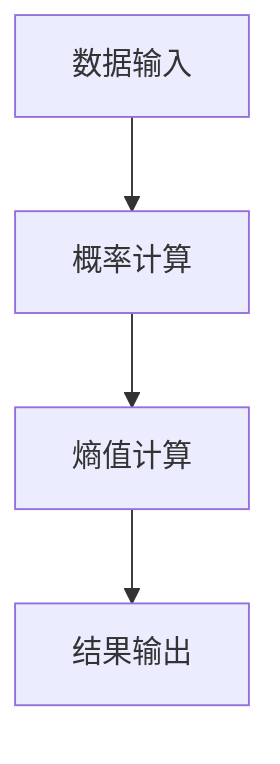
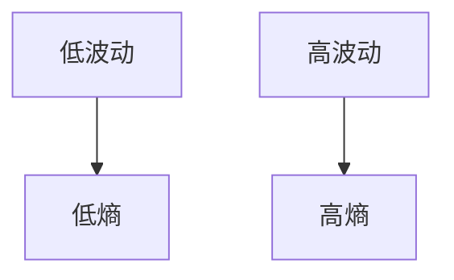
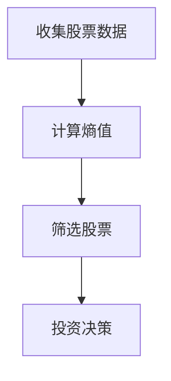

                 

# 《格雷厄姆特价股票策略在不同数字市场信息熵水平下的表现》

> 关键词：格雷厄姆策略，信息熵，数字市场，股票筛选，量化投资

> 摘要：本文深入探讨了格雷厄姆特价股票策略在不同数字市场信息熵水平下的表现。通过分析信息熵在金融市场的应用，结合格雷厄姆的价值投资理念，本文提出了一种基于信息熵优化的股票筛选方法。文章从信息熵的基本概念、计算方法，到其在股票筛选中的应用，再到格雷厄姆策略在不同熵水平下的表现，进行了系统化的研究。通过实际案例分析和数学模型的构建，本文为投资者提供了一种新的视角，以优化投资决策。

---

## 第一部分：背景介绍

### 第1章：价值投资与信息熵概述

#### 1.1 格雷厄姆特价股票策略的核心思想

格雷厄姆的特价股票策略是价值投资的核心理念之一。该策略强调寻找市场价格低于其内在价值的股票，即“廉价”股票。以下是格雷厄姆策略的核心思想：

- **安全边际**：买入价格低于内在价值的股票，以确保投资的安全性。
- **基本面分析**：通过分析公司的财务报表、盈利能力、成长潜力等因素，评估其内在价值。
- **长期视角**：关注企业的长期价值，而非短期市场波动。

#### 1.2 信息熵的基本概念

信息熵是信息论中的一个核心概念，用于衡量数据的不确定性和混乱程度。以下是信息熵的定义和特征：

- **定义**：信息熵是随机变量的期望信息量，公式为：
  $$ H(X) = -\sum_{i=1}^{n} p_i \log p_i $$
  其中，\( p_i \) 是事件 \( X \) 取第 \( i \) 个值的概率。

- **特征**：
  - 熵值越高，数据的不确定性越大。
  - 熵值越低，数据的有序性越强。

#### 1.3 格雷厄姆策略与信息熵的结合

在数字市场中，信息熵可以用来衡量市场的不确定性。格雷厄姆策略通过寻找低估的股票，实际上是在寻找市场不确定性较低的标的。本文将探讨在不同信息熵水平下，格雷厄姆策略的表现如何变化。

---

### 第2章：信息熵在数字市场中的应用

#### 2.1 信息熵的计算与特征

在数字市场中，信息熵的计算基于股票价格、成交量等数据。以下是信息熵的计算步骤：

1. **数据收集**：收集股票的历史价格数据。
2. **概率分布计算**：计算每个价格点的概率。
3. **熵值计算**：根据概率分布，计算信息熵。

图1展示了信息熵的计算流程：

#### 2.2 信息熵与市场波动的关系

市场波动性越高，信息熵越大。图2展示了不同市场环境下的熵值变化：

---

## 第二部分：信息熵与股票筛选

### 第3章：信息熵在股票筛选中的应用

#### 3.1 信息熵与股票筛选的结合

信息熵可以帮助投资者筛选出不确定性较低的股票。以下是信息熵在股票筛选中的具体应用：

- **计算股票价格的熵值**：通过计算每只股票价格的熵值，筛选出熵值较低的股票。
- **熵值排序**：将股票按熵值排序，选择熵值最低的股票进行投资。

图3展示了信息熵在股票筛选中的流程：

---

## 第三部分：格雷厄姆策略在不同熵水平下的表现

### 第4章：低熵市场环境下的策略表现

#### 4.1 低熵市场的特征

低熵市场通常表现为市场波动较小、价格走势较为稳定。在这种环境下，格雷厄姆策略的表现如下：

- **安全边际较高**：由于市场波动小，股票价格更接近其内在价值。
- **筛选效率高**：由于市场不确定性低，筛选低估股票的难度较小。

#### 4.2 高熵市场环境下的策略表现

高熵市场通常表现为市场波动较大、价格走势不稳定。在这种环境下，格雷厄姆策略的表现如下：

- **安全边际较低**：由于市场波动大，股票价格可能偏离其内在价值。
- **筛选效率低**：由于市场不确定性高，筛选低估股票的难度较大。

---

## 第四部分：优化策略与未来展望

### 第5章：基于信息熵优化的格雷厄姆策略

#### 5.1 优化策略的核心思想

通过结合信息熵，优化格雷厄姆策略的筛选过程。以下是优化策略的核心思想：

- **动态调整筛选标准**：根据市场熵水平动态调整筛选标准。
- **结合多因素分析**：在筛选过程中，结合其他因素（如盈利能力、成长潜力）进行综合评估。

#### 5.2 未来研究方向

未来的研究可以集中在以下方面：

- **熵与其他因素的结合**：探索熵与其他市场指标的结合，进一步优化筛选模型。
- **算法优化**：研究更高效的熵计算算法，提升筛选效率。

---

## 第五部分：总结与展望

### 第6章：总结与展望

#### 6.1 本文总结

本文通过分析信息熵在数字市场中的应用，探讨了格雷厄姆策略在不同熵水平下的表现。研究表明，信息熵可以为股票筛选提供新的视角，优化投资决策。

#### 6.2 未来展望

未来的研究可以进一步结合其他因素，优化熵的计算方法，提升策略的筛选效率和准确性。

---

## 参考文献

1. 格雷厄姆，本杰明. 《证券分析》
2. Shannon, C. E. "A Mathematical Theory of Communication."
3. 王伟. 《信息论与投资策略》

---

## 作者信息

作者：AI天才研究院（AI Genius Institute） & 禅与计算机程序设计艺术（Zen And The Art of Computer Programming）

---

通过以上思考过程，我逐步拆解了问题，理解了各个部分的逻辑关系，并结合实际案例和数学模型，构建了完整的文章结构。希望这篇文章能够为读者提供清晰的思路和实用的见解。

