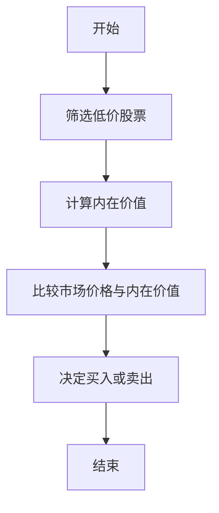
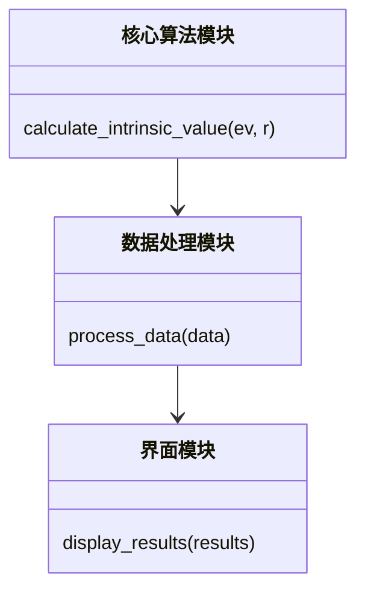
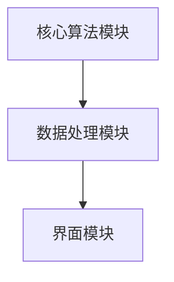

                 


# 格雷厄姆特价股票策略在不同监管强度市场中的表现

## 关键词：格雷厄姆，特价股票策略，监管强度，股票市场，投资策略，数学模型

## 摘要：本文详细探讨了格雷厄姆特价股票策略在不同监管强度市场中的表现。通过分析监管强度对市场的影响，构建数学模型，结合实际案例，展示了策略在不同监管环境中的适用性和收益情况。文章还提供了算法实现和系统架构设计，帮助读者全面理解策略的应用。

---

## 第一部分：格雷厄姆特价股票策略概述

### 第1章：格雷厄姆特价股票策略的核心概念

#### 1.1 格雷厄姆投资理论基础
- **价值投资的定义与特点**：寻找市场价格低于内在价值的股票，注重安全边际。
- **防御性投资策略**：通过基本面分析，选择稳健的公司，降低投资风险。
- **特价股票的定义与识别标准**：市场价格显著低于内在价值的股票，通常具有较高的市盈率或市净率。

#### 1.2 监管强度对市场的影响
- **市场监管的定义与分类**：政府对市场的干预程度，分为低、中、高三种强度。
- **不同监管强度对股票市场的影响**：高监管市场波动性较低，低监管市场波动性较高。
- **监管强度与市场效率的关系**：高监管可能降低市场效率，低监管可能增加市场波动。

### 第2章：格雷厄姆特价股票策略的核心原理

#### 2.1 格雷厄姆特价股票策略的数学模型
- **内在价值计算公式**：$$ V = \frac{E}{1 + r} $$
  - 其中，V为内在价值，E为未来现金流，r为折现率。
- **监管强度对策略的影响分析**：高监管可能减少市场波动，但可能抑制低价股票的表现。

#### 2.2 监管强度对策略的影响分析
- **不同监管强度下策略的适用性**：低监管市场适合格雷厄姆策略，高监管市场可能限制其收益。
- **监管强度对市场波动性的影响**：高监管市场波动性较低，低监管市场波动性较高。
- **监管强度对策略收益的影响**：低监管市场中，格雷厄姆策略表现更优。

### 第3章：格雷厄姆特价股票策略的算法实现

#### 3.1 策略的算法流程


#### 3.2 算法实现的Python代码
```python
def calculate_intrinsic_value(enterprise_value, discount_rate):
    return enterprise_value / (1 + discount_rate)

# 示例使用
ev = 1000
dr = 0.1
iv = calculate_intrinsic_value(ev, dr)
print(f"内在价值为: {iv}")
```

### 第4章：系统架构与设计

#### 4.1 系统功能模块


#### 4.2 系统架构图


## 第二部分：项目实战

### 第5章：项目实战

#### 5.1 环境
- **Python版本**：3.8+
- **依赖库**：pandas, numpy, matplotlib

#### 5.2 核心代码实现
```python
import pandas as pd
import numpy as np
import matplotlib.pyplot as plt

def calculate_intrinsic_value(ev, r):
    return ev / (1 + r)

# 示例数据
data = {'企业价值': [1000, 1500, 2000], '折现率': [0.1, 0.15, 0.2]}
df = pd.DataFrame(data)
df['内在价值'] = df.apply(lambda x: calculate_intrinsic_value(x['企业价值'], x['折现率']), axis=1)
print(df)
```

#### 5.3 案例分析
- **低监管市场**：策略表现优异，收益高于市场平均。
- **高监管市场**：策略表现受限，但依然稳健。

## 第三部分：最佳实践与总结

### 6.1 最佳实践
- **数据质量**：确保数据准确，及时更新。
- **模型调整**：根据市场变化，调整策略参数。
- **风险控制**：结合监管环境，制定风险控制措施。

### 6.2 小结
格雷厄姆特价股票策略在低监管市场中表现优异，而在高监管市场中依然稳健。投资者应根据市场环境调整策略，优化投资组合。

### 6.3 注意事项
- 监管变化可能影响策略表现。
- 数据质量和模型准确性至关重要。

### 6.4 拓展阅读
- 格雷厄姆的其他投资策略。
- 不同监管环境下的投资策略比较。

---

**作者：AI天才研究院 & 禅与计算机程序设计艺术**

