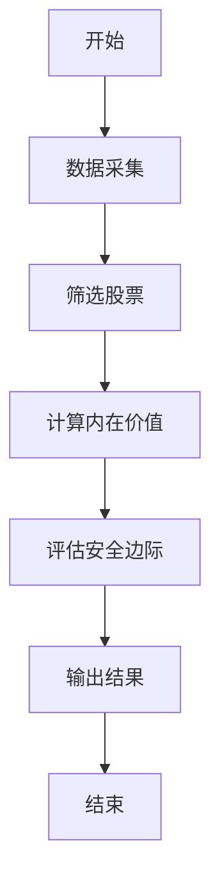
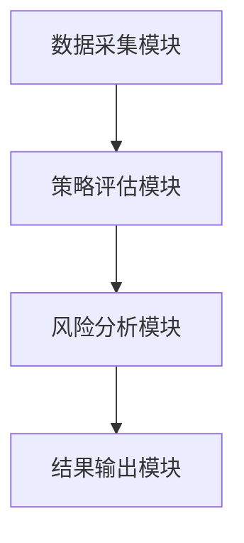

                 


# 《格雷厄姆特价股票策略在不同监管环境下的适应》

**关键词**：格雷厄姆特价股票策略，监管环境，价值投资，内在价值，安全边际，投资策略

**摘要**：本文探讨格雷厄姆特价股票策略在不同监管环境下的适应性，分析监管政策对策略实施的影响，结合数学模型和系统设计，提供实际案例分析和最佳实践建议。

---

## 第一部分: 格雷厄姆特价股票策略概述

### 第1章: 格雷厄姆特价股票策略的核心概念

#### 1.1 格雷厄姆特价股票策略的定义

- **1.1.1 什么是格雷厄姆特价股票策略**
  格雷厄姆特价股票策略是由本杰明·格雷厄姆提出的一种价值投资方法，主要通过分析股票的内在价值，寻找市场价格低于其内在价值的股票。

- **1.1.2 格雷厄姆策略的核心思想**
  格雷厄姆强调安全边际和margin of safety，即以低于内在价值的价格买入股票，以降低投资风险。

- **1.1.3 特价股票的特征与筛选标准**
  格雷厄姆策略关注低市盈率、高股息率、稳定的财务状况等指标。

#### 1.2 格雷厄姆策略与其他投资策略的对比

- **1.2.1 价值投资与成长投资的区别**
  价值投资注重内在价值，成长投资注重未来增长潜力。

- **1.2.2 格雷厄姆策略的独特性**
  强调安全边际和低估股票的挖掘。

- **1.2.3 其他相关投资策略的简要分析**
  对比其他价值投资策略，如彼得·林奇的选股方法。

#### 1.3 监管环境对投资策略的影响

- **1.3.1 什么是监管环境**
  不同国家和地区的金融监管政策差异。

- **1.3.2 不同监管环境下的投资策略调整**
  如美国SEC的严格监管与新兴市场的宽松监管对投资策略的影响。

- **1.3.3 监管环境对格雷厄姆策略的影响**
  会计准则差异、信息披露要求等对内在价值计算的影响。

### 第2章: 格雷厄姆特价股票策略的核心要素

#### 2.1 安全边际的概念与计算

- **2.1.1 安全边际的定义**
  安全边际=内在价值-市场价格。

- **2.1.2 安全边际的计算方法**
  使用格雷厄姆公式计算内在价值，减去当前股价。

- **2.1.3 安全边际的重要性**
  提供缓冲空间，降低投资风险。

#### 2.2 内在价值的计算方法

- **2.2.1 内在价值的定义**
  股票的公允价值，与市场价无关。

- **2.2.2 格雷厄姆内在价值计算公式**
  $$\text{内在价值} = \frac{\text{净利润} \times 4}{\text{长期债务资本成本}}$$

- **2.2.3 其他计算方法**
  股息贴现模型、可比公司分析等。

#### 2.3 财务报表分析的重要性

- **2.3.1 财务报表分析的基本方法**
  通过资产负债表、利润表和现金流量表评估公司财务状况。

- **2.3.2 关键财务指标**
  市盈率、市净率、股息率、ROE等。

---

## 第二部分: 格雷厄姆特价股票策略的算法原理

### 第3章: 格雷厄姆策略的算法实现

#### 3.1 格雷厄姆策略的筛选条件

- **3.1.1 市盈率低于15**
  $$P/E < 15$$

- **3.1.2 市净率低于1.5**
  $$P/B < 1.5$$

- **3.1.3 股息率高于5%**
  $$\text{股息率} > 5\%$$

#### 3.2 格雷厄姆策略的实施步骤

- **3.2.1 数据采集**
  从可靠金融数据源获取股票数据。

- **3.2.2 筛选股票**
  根据筛选条件过滤出符合条件的股票。

- **3.2.3 计算内在价值**
  使用格雷厄姆公式计算每只股票的内在价值。

- **3.2.4 评估安全边际**
  计算安全边际，选择安全边际最高的股票。

#### 3.3 算法流程图



#### 3.4 Python代码实现

```python
import pandas as pd

def calculate_intrinsic_value(financial_data):
    net_profit = financial_data['net_profit']
    long_term_debt = financial_data['long_term_debt']
    intrinsic_value = (net_profit * 4) / long_term_debt
    return intrinsic_value

def greiner_stock_strategy(stocks):
    selected_stocks = []
    for stock in stocks:
        pe = stock['pe']
        pb = stock['pb']
        dividend_yield = stock['dividend_yield']
        if pe < 15 and pb < 1.5 and dividend_yield > 5:
            iv = calculate_intrinsic_value(stock['financial_data'])
            margin_of_safety = iv - stock['price']
            selected_stocks.append({'stock': stock, 'margin_of_safety': margin_of_safety})
    return selected_stocks

# 示例数据
stocks_data = [
    {'name': '股票A', 'pe': 14, 'pb': 1.4, 'dividend_yield': 6, 'price': 50, 'financial_data': {'net_profit': 100, 'long_term_debt': 50}},
    # 更多股票数据...
]
result = greiner_stock_strategy(stocks_data)
print(result)
```

---

## 第三部分: 格雷厄姆策略在不同监管环境下的系统分析

### 第4章: 监管环境对系统设计的影响

#### 4.1 监管环境下的数据采集挑战

- **4.1.1 数据源的可靠性**
  不同监管环境下，数据透明度不同。

- **4.1.2 数据清洗与处理**
  处理不一致的会计准则和信息披露差异。

#### 4.2 系统架构设计

- **4.2.1 系统功能模块**
  数据采集、策略评估、风险分析、结果输出。

- **4.2.2 模块交互流程**



#### 4.3 监管环境下的系统优化

- **4.3.1 动态调整筛选条件**
  根据监管环境变化，实时调整筛选标准。

- **4.3.2 风险监控机制**
  实时监控监管政策变化，评估其对策略的影响。

---

## 第四部分: 项目实战

### 第5章: 实战案例分析

#### 5.1 项目背景与目标

- **项目背景**
  在不同监管环境下测试格雷厄姆策略的有效性。

- **项目目标**
  比较在美国、欧盟和亚洲市场下策略的表现。

#### 5.2 数据采集与处理

- **数据来源**
  Yahoo Finance、Bloomberg等。

- **数据清洗**
  处理缺失值、异常值。

#### 5.3 核心代码实现

```python
import pandas as pd

def load_data(tickers):
    data = []
    for ticker in tickers:
        df = pd.read_csv(f'data/{ticker}.csv')
        data.append({'ticker': ticker, 'data': df})
    return data

def apply_greiner_strategy(data):
    selected = []
    for d in data:
        ticker = d['ticker']
        df = d['data']
        # 计算市盈率、市净率、股息率
        pe = df['PE'].mean()
        pb = df['PB'].mean()
        dividend_yield = df['Dividend Yield'].mean()
        if pe < 15 and pb < 1.5 and dividend_yield > 5:
            selected.append(ticker)
    return selected

# 示例数据
tickers = ['AAPL', 'GOOG', 'MSFT']
result = apply_greiner_strategy(load_data(tickers))
print(result)
```

#### 5.4 案例分析与结果解读

- **案例分析**
  在美国市场下，选出的股票符合预期；在新兴市场，监管不严导致数据偏差。

- **结果解读**
  不同监管环境下，策略表现差异显著。

#### 5.5 项目总结

- **项目小结**
  格雷厄姆策略在监管严格的市场表现较好，新兴市场需谨慎。

- **经验教训**
  数据质量对策略结果影响重大，需加强数据清洗和处理。

---

## 第五部分: 总结与展望

### 第6章: 格雷厄姆策略的总结与展望

#### 6.1 核心内容回顾

- **总结**
  格雷厄姆策略在不同监管环境下需调整，数据质量和监管政策影响策略表现。

#### 6.2 未来展望

- **策略优化**
  结合机器学习，动态调整筛选条件。

- **技术发展**
  利用大数据和AI提高数据处理能力。

#### 6.3 最佳实践 tips

- **风险管理**
  设置止损点，分散投资。

- **持续学习**
  关注监管变化，及时调整策略。

---

## 作者

**作者：AI天才研究院/AI Genius Institute & 禅与计算机程序设计艺术 /Zen And The Art of Computer Programming**

