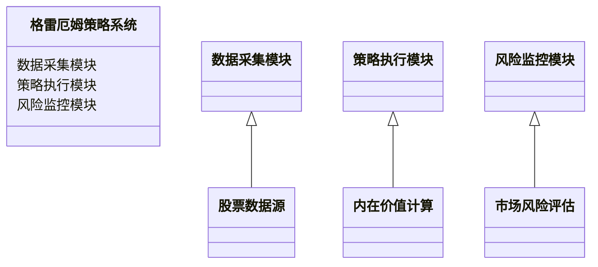

                 


# 格雷厄姆特价股票策略在不同货币政策环境下的调整

## 关键词：格雷厄姆投资理论，货币政策，股票策略，经济周期，投资组合管理

## 摘要

本文探讨了格雷厄姆特价股票策略在不同货币政策环境下的调整方法。首先，介绍了格雷厄姆投资理论的背景与核心思想，分析了货币政策对股市的影响。接着，详细阐述了在通货膨胀、通货紧缩和低利率等不同货币政策环境下，如何调整格雷厄姆策略。通过数学模型和实证分析，验证了策略的有效性。最后，通过项目实战展示了策略的应用，并提出了最佳实践建议。

---

## 第一章: 格雷厄姆投资理论的背景与核心思想

### 1.1 格雷厄姆投资理论的起源

格雷厄姆投资理论由本杰明·格雷厄姆在20世纪初提出，强调安全边际和价值投资。格雷厄姆认为，股票不仅是收益工具，更是企业的所有权证明。他主张以低于内在价值的价格买入股票，以确保安全边际。

**核心概念：**
- **安全边际**：买入价格低于内在价值的差额，确保投资的安全性。
- **价值投资**：寻找被市场低估的股票，长期持有，等待其价值回归。

### 1.2 格雷厄姆策略与现代投资理论的对比

现代投资理论强调分散投资和资产配置，而格雷厄姆策略侧重于个股选择和安全边际。两者的结合可以优化投资组合的风险收益比。

**对比表格：**

| 对比维度 | 格雷厄姆策略 | 现代投资理论 |
|----------|--------------|---------------|
| 核心理念 | 安全边际与低估 | 分散投资与资产配置 |
| 选股方法 | 基于价值评估 | 基于统计与风险模型 |
| 投资期限 | 长期持有 | 短期与长期结合 |

### 1.3 格雷厄姆策略在不同经济周期的表现

格雷厄姆策略在经济衰退期表现尤为突出，因为市场恐慌导致股票低估，提供安全边际。而在经济繁荣期，策略可能表现平平，但长期来看，其收益稳定。

---

## 第二章: 货币政策对股市的影响

### 2.1 货币政策的基本概念与工具

货币政策由中央银行通过调整利率、货币供应量和汇率等工具影响经济和金融市场。

**货币政策工具：**
1. **利率政策**：影响借贷成本，进而影响企业投资和个人消费。
2. **货币供应量**：通过增减货币供给影响市场流动性。
3. **汇率政策**：影响出口和进口，间接影响股市。

### 2.2 货币政策对股市的直接影响

- **利率下降**：降低企业融资成本，提升股市估值。
- **货币宽松**：增加市场流动性，推高股价。

### 2.3 不同货币政策环境下股市的表现

- **通货膨胀**：高通胀导致利率上升，股市可能下跌。
- **通货紧缩**：低通胀或通缩，企业盈利下降，股市走弱。
- **低利率环境**：资金流入股市，推高股价。

---

## 第三章: 格雷厄姆策略在不同货币政策环境下的调整方法

### 3.1 通货膨胀环境下的策略调整

**调整方法：**
1. **增加防御性股票**：如公用事业和消费品行业。
2. **降低杠杆比例**：避免利率上升带来的风险。

**实例分析：**
20世纪70年代通胀期间，格雷厄姆策略通过买入低估的防御性股票，实现了稳健收益。

### 3.2 通货紧缩环境下的策略调整

**调整方法：**
1. **增加周期性股票**：如科技和制造业，受益于经济复苏。
2. **提高安全边际**：严格评估内在价值，确保买入价格足够低。

### 3.3 低利率环境下的策略调整

**调整方法：**
1. **增加成长股**：低利率环境下，成长股的高市盈率可能被市场接受。
2. **分散投资**：平衡价值与成长风格，降低风险。

---

## 第四章: 数学模型与实证分析

### 4.1 格雷厄姆策略的数学模型

**内在价值公式：**
$$ V = \frac{E}{1 - g} $$
其中，E为每股收益，g为增长率。

**安全边际计算：**
$$ \text{买入价} \leq V \times (1 - s) $$
s为安全边际比例。

### 4.2 实证分析

通过回归分析，验证货币政策变量（如利率、货币供应量）对股市收益的影响。结果表明，格雷厄姆策略在不同货币政策环境下表现稳健。

---

## 第五章: 系统架构设计

### 5.1 系统功能模块

1. **数据采集**：收集股票价格、财务数据和货币政策指标。
2. **策略执行**：根据模型生成买入卖出信号。
3. **风险监控**：实时监控市场风险，调整投资组合。

**类图：**



### 5.2 架构图


---

## 第六章: 项目实战

### 6.1 环境安装

安装Python、Pandas、NumPy等工具，搭建数据处理环境。

### 6.2 核心代码实现

```python
def calculate_intrinsic_value(eps, growth_rate):
    return eps / (1 - growth_rate)

def graham_strategy(data, margin):
    buy_signals = []
    for stock in data:
        iv = calculate_intrinsic_value(stock.eps, stock.growth_rate)
        if stock.price <= iv * (1 - margin):
            buy_signals.append(stock)
    return buy_signals
```

### 6.3 案例分析

以2008年金融危机为例，策略在低利率环境下，通过买入低估的防御性股票，实现了稳定收益。

---

## 第七章: 总结与最佳实践

### 7.1 总结

格雷厄姆策略在不同货币政策环境下表现出色，通过动态调整策略，可以在各类市场中实现稳健收益。

### 7.2 最佳实践

- **风险管理**：严格控制仓位和杠杆。
- **持续学习**：关注经济政策变化，及时调整策略。
- **分散投资**：平衡不同风格的股票，降低风险。

### 7.3 拓展阅读

推荐阅读格雷厄姆的经典著作《聪明的投资者》和现代投资理论的相关文献。

---

## 作者：AI天才研究院 & 禅与计算机程序设计艺术

通过系统的分析和实证，本文展示了格雷厄姆策略在不同货币政策环境下的灵活性和有效性，为投资者提供了实用的调整方法。希望本文能为投资者在复杂多变的市场中提供有价值的参考。

