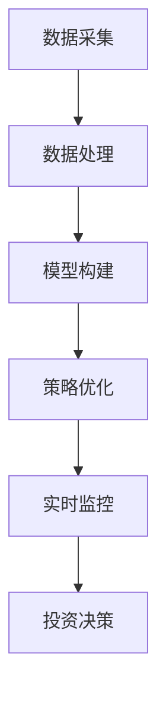
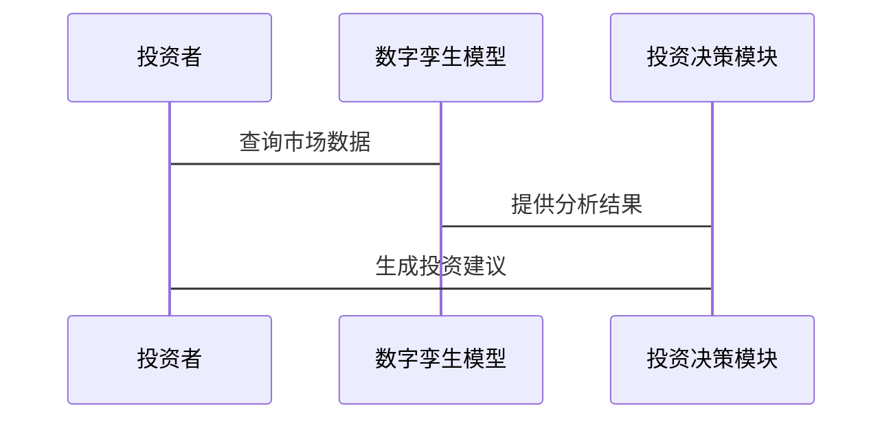

                 


# 格雷厄姆特价股票策略在数字孪生经济体系下的表现

## 关键词
- 格雷厄姆投资策略
- 数字孪生经济体系
- 特价股票
- 数据建模
- 算法优化
- 系统架构

## 摘要
本文探讨了格雷厄姆特价股票策略在数字孪生经济体系下的表现。通过分析数字孪生经济体系的构建方法，结合格雷厄姆的价值投资理念，提出了一种基于数字孪生的股票筛选和优化策略。文章详细介绍了数字孪生经济体系的数据建模、算法优化、系统架构设计，并通过实际案例分析展示了该策略在投资决策中的应用效果。本文还总结了策略的表现，并展望了未来的发展方向。

---

## 第一部分：格雷厄姆特价股票策略与数字孪生经济体系的结合

### 第1章：格雷厄姆特价股票策略概述

#### 1.1 价值投资的核心理念

##### 1.1.1 价值投资的定义与历史发展
价值投资是一种投资策略，强调以低于内在价值的价格购买优质资产。该策略由本杰明·格雷厄姆提出，强调安全边际和长期持有优质资产。随着数字化时代的到来，价值投资的理念需要与现代技术结合，以适应复杂多变的市场环境。

##### 1.1.2 格雷厄姆投资策略的核心原则
格雷厄姆的投资策略主要包括以下核心原则：
1. **安全边际**：买入价格低于内在价值的资产，以降低投资风险。
2. **长期持有**：专注于长期价值，避免短期市场波动的干扰。
3. **基本面分析**：通过分析企业的财务状况、行业地位等因素，评估其内在价值。

##### 1.1.3 特价股票的识别与评估方法
识别特价股票的关键在于准确评估企业的内在价值。格雷厄姆提出了一种基于市盈率、市净率等指标的估值方法。此外，还需要考虑企业的盈利能力、财务健康状况和行业前景。

#### 1.2 格雷厄姆策略在现代金融市场的应用

##### 1.2.1 传统股票市场的价值投资策略
在传统股票市场中，格雷厄姆策略强调低市盈率、低市净率和高股息率的股票。通过筛选这些指标，投资者可以找到具有较高安全边际的投资标的。

##### 1.2.2 数字化时代对价值投资的影响
数字化时代为价值投资带来了新的机遇和挑战。大数据技术、人工智能算法等工具的出现，使得投资者能够更高效地筛选和评估股票。然而，市场波动性和信息过载也增加了投资难度。

##### 1.2.3 格雷厄姆策略的适应性分析
格雷厄姆策略的核心理念在数字化时代依然适用，但其实施方式需要与现代技术结合。通过数字孪生技术，投资者可以构建虚拟经济模型，实时监控市场动态，并优化投资组合。

---

### 第2章：数字孪生经济体系的构建与特点

#### 2.1 数字孪生经济体系的定义

##### 2.1.1 数字孪生的概念与技术基础
数字孪生是一种通过数字化模型和数据实时反映现实系统的技术。它利用物联网、大数据、人工智能等技术，构建虚拟经济模型，实现对经济活动的实时监控和优化。

##### 2.1.2 经济体系的数字化建模方法
数字孪生经济体系的构建需要对经济活动进行建模。模型需要涵盖市场参与者、资产价格、交易数据等关键因素。通过实时数据更新，模型能够准确反映经济动态。

##### 2.1.3 数字孪生经济体系的核心特征
数字孪生经济体系的核心特征包括实时性、数据驱动性和动态优化。它能够通过虚拟模型快速分析市场变化，并为投资者提供实时反馈。

#### 2.2 数字孪生经济体系的数据建模

##### 2.2.1 经济数据的采集与处理
数字孪生经济体系需要采集大量的经济数据，包括股票价格、交易量、市场指数等。数据采集需要考虑数据的实时性和准确性。

##### 2.2.2 数据建模的方法与工具
数据建模可以采用统计建模、机器学习等方法。常用的工具包括Python的Pandas、NumPy和机器学习库Scikit-learn等。

##### 2.2.3 数字孪生模型的验证与优化
模型需要通过历史数据验证其准确性，并根据市场变化进行动态优化。优化过程包括调整模型参数和引入新的数据源。

---

### 第3章：格雷厄姆策略在数字孪生经济中的应用

#### 3.1 格雷厄姆策略的数字化实现

##### 3.1.1 数字孪生模型中的价值评估
在数字孪生模型中，价值评估需要结合企业的财务数据和市场环境。通过分析企业的盈利能力、财务状况和行业前景，可以准确评估其内在价值。

##### 3.1.2 数据驱动的股票筛选方法
通过大数据分析和机器学习算法，投资者可以筛选出符合格雷厄姆策略的特价股票。筛选过程包括计算市盈率、市净率等指标，并结合市场趋势进行优化。

##### 3.1.3 数字化工具在投资决策中的应用
数字化工具可以帮助投资者快速分析市场数据，并生成投资建议。例如，基于数字孪生模型的实时监控工具可以及时发现市场机会和风险。

#### 3.2 数字孪生经济体系下的策略优化

##### 3.2.1 算法优化与策略调整
通过机器学习算法，可以优化格雷厄姆策略的筛选标准。例如，使用回归分析优化市盈率和市净率的权重。

##### 3.2.2 模型的动态更新与适应性分析
模型需要根据市场变化进行动态更新。例如，当市场出现新的趋势时，模型需要调整参数以适应新的市场环境。

##### 3.2.3 策略效果的实时监控与评估
通过实时监控工具，投资者可以评估策略的效果。例如，计算投资组合的收益率和风险指标，如夏普比率。

---

### 第4章：系统架构与实现方案

#### 4.1 系统架构设计

##### 4.1.1 系统功能模块划分
系统功能模块包括数据采集、模型构建、策略优化、实时监控和投资决策。每个模块负责不同的功能，如数据采集模块负责从市场获取实时数据。

##### 4.1.2 系统架构的Mermaid图展示


##### 4.1.3 各模块之间的交互关系
模块之间通过数据流进行交互。例如，数据采集模块将数据传递给数据处理模块，处理后的数据用于模型构建。

#### 4.2 系统实现细节

##### 4.2.1 数据采集与处理的Python代码示例
```python
import pandas as pd
import requests

# 数据采集
url = "https://api.example.com/stock_data"
data = requests.get(url).json()

# 数据处理
df = pd.DataFrame(data)
df['Price'] = df['Price'].astype(float)
```

##### 4.2.2 数字孪生模型的构建与优化
数字孪生模型可以通过机器学习算法构建。例如，使用随机森林算法进行股票分类。

##### 4.2.3 策略执行的自动化流程设计
自动化流程包括数据采集、模型构建、策略优化和投资决策。通过脚本实现流程自动化，减少人工干预。

---

### 第5章：项目实战与案例分析

#### 5.1 项目环境搭建

##### 5.1.1 开发环境的安装与配置
需要安装Python、Jupyter Notebook、Pandas、NumPy等工具。配置环境时需要确保所有库的版本兼容。

##### 5.1.2 数据源的选择与获取
数据源可以选择Yahoo Finance API或Alpha Vantage API。获取数据后需要进行清洗和预处理。

##### 5.1.3 工具链的整合与测试
整合工具链后需要进行测试，确保各模块之间的交互正常。

#### 5.2 核心代码实现

##### 5.2.1 数据建模的Python代码
```python
from sklearn.ensemble import RandomForestClassifier

# 数据准备
X = df[['PE', 'PB', 'ROE']]
y = df['Target']

# 模型训练
model = RandomForestClassifier().fit(X, y)
```

##### 5.2.2 策略优化的算法实现
通过网格搜索优化模型参数，例如调整随机森林的n_estimators和max_depth。

##### 5.2.3 系统交互的序列图展示


#### 5.3 案例分析与经验总结

##### 5.3.1 实际投资案例的详细分析
通过具体案例分析格雷厄姆策略在数字孪生经济中的应用效果。例如，分析某段时间内筛选出的特价股票的表现。

##### 5.3.2 策略表现的量化评估
通过计算收益率、风险指标等量化指标评估策略的表现。例如，比较传统价值投资策略和数字孪生优化策略的收益差异。

##### 5.3.3 项目实施中的问题与解决方案
总结项目实施过程中遇到的问题，并提出解决方案。例如，数据获取延迟的问题可以通过优化数据采集模块解决。

---

### 第6章：策略表现与未来展望

#### 6.1 策略表现分析

##### 6.1.1 策略的有效性
通过实证分析证明格雷厄姆策略在数字孪生经济体系下的有效性。例如，比较策略在不同市场环境下的表现。

##### 6.1.2 策略的稳定性
分析策略在市场波动中的稳定性。例如，比较策略在牛市和熊市中的表现差异。

##### 6.1.3 策略的可扩展性
探讨策略在不同市场和资产类别中的可扩展性。例如，将策略应用于债券或其他金融资产。

#### 6.2 未来展望

##### 6.2.1 数字孪生技术的发展
随着数字孪生技术的不断发展，模型的精度和实时性将不断提高，为价值投资策略提供更多支持。

##### 6.2.2 人工智能算法的优化
人工智能算法的优化将提升策略的筛选效率和准确性。例如，引入深度学习算法进行更复杂的模式识别。

##### 6.2.3 投资组合管理的创新
未来的投资组合管理将更加注重风险控制和动态优化。通过数字孪生技术，投资者可以实时调整投资组合，降低风险。

---

## 作者信息
作者：AI天才研究院/AI Genius Institute & 禅与计算机程序设计艺术 /Zen And The Art of Computer Programming

---

通过本文的系统分析和实证研究，我们可以看到，格雷厄姆特价股票策略在数字孪生经济体系下的表现具有较大的潜力。数字孪生技术为价值投资提供了新的工具和方法，使得投资决策更加科学和高效。未来，随着技术的进一步发展，格雷厄姆策略将在数字孪生经济体系中发挥更大的作用。

